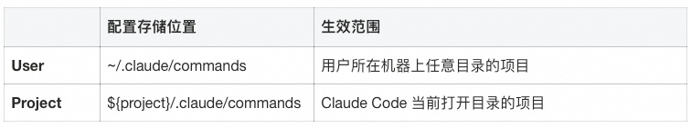
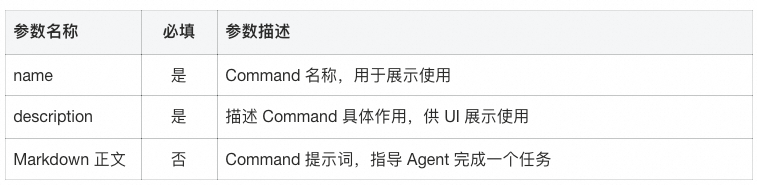
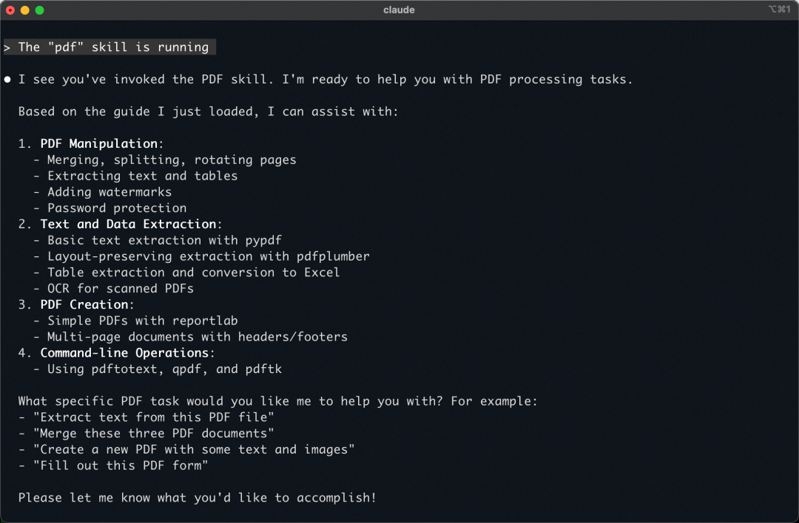
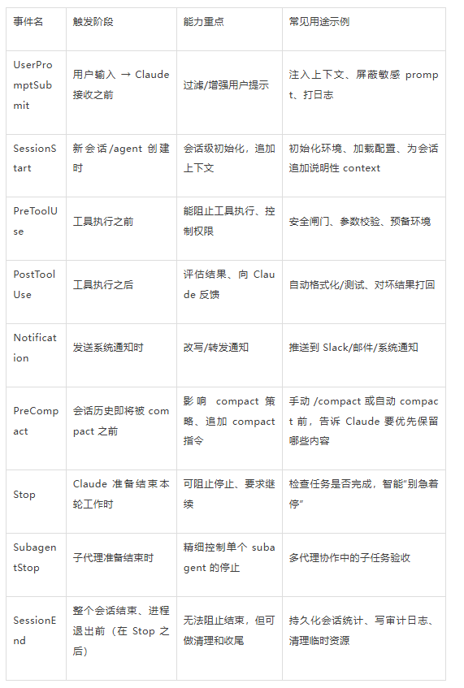
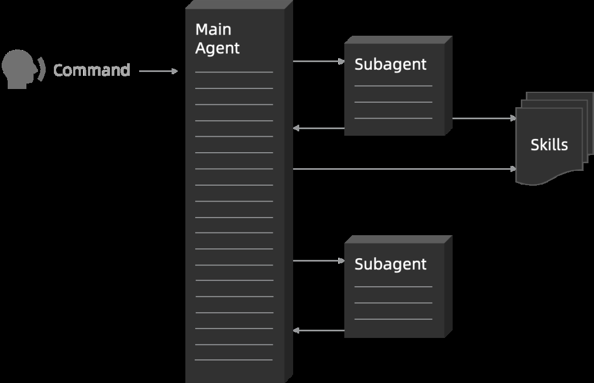
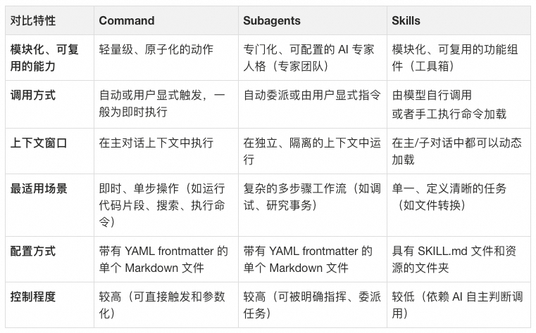

## AI Coding 工具优化开发流程
### 提升对话质量参考 1
**一、 合理划分AI任务边界**

根据任务复杂度和自身能力范围合理分配 AI 的工作.

**二、 小步快跑，每一步需要可验证**

不要等代码全生成了，然后一次性调试，好的代码应该像细菌一样（by Karpathy），精炼，模块化，闭包( copy paste-able)。

**三、 AI生成的方案和代码必须要Review**

除非需求极其清晰，否则不要期望一次命令就能完成一个完整需求，AI认为的完成，有可能并不是实际的完成。一方面可能会因为上下文长度的原因，遗忘，或者产生幻觉。 另外一方面对于项目的了解程度的片面性，生产出来的代码质量或技术方案不够好。

**四、 有效管理上下文**
1. 提供精确信息
   - 当已确定修改范围时，应提供准确的文件路径和相关细节。
   - 先通过与 AI 逐步沟通，获取并明确关键信息，形成清晰上下文后，再让AI执行。
2. 信息压缩策略：手动筛选重要信息，只保留有价值的部分。举个例子，我们在让AI修复一些执行错误的时候，如果把全部Exception信息丢给AI，比如Java抛出来的Exception，会非常长。想象一下我们自己去解决问题的时候，往往也是定位几行有用信息。
3. 控制任务粒度：
   - 执行复杂任务需要较高的 prompt 技巧和使用经验，且难以验证细节。
   - 过于复杂的任务可能超出上下文长度限制，导致 AI 遗忘早期任务内容。
4. 利用外部记忆：将失败的任务手动编辑出来，并存储在一个外部文档中，然后告诉AI去逐个修复。
   ```md
   test_result.md里面记录了运行单元测试失败的case以及异常的信息，请从上往下进行修复。
   对于每一个test case，代码修复完成后，通过运行pytest检查case是否执行成功。若test case运行成功，在test_result.md里面标记完成。
   任务结束前，请检查test_result.md文档，确保失败的测试用例全部修复。
   ```
5. 知识库很重要:对于已有项目，如果希望长期让AI持续进来改动，请务必先给他提供更多的信息，以及一个良好的信息获取方式。
   - 像Claude Code，提供了`/init`指令，目的是为了让AI快速了解项目的背景、技术架构等，知识库记录了业务需求、技术规约、常见的工程流程等信息
   - 对于一个已经存在的工程项目，建议先让AI针对代码写说明文档(README.md)，然后再让他参与到写代码。

### 提升对话质量参考 2
#### 进行清晰的问题描述
在描述问题时，我们最好能给出具体的功能、文件名、方法名、代码块，让模型能够通过语义检索等方式，用较短的路径找到代码，避免在检索这部分混杂太多弱相关内容，干扰上下文。

#### 把控上下文长度
在处理复杂问题时，采用上下文窗口大的模型/模式，尽量避免压缩导致信息缺失细节。

#### 尽可能地使用Revert和新开对话
节省上下文是一方面，维持上下文的简洁对模型回答质量提升也是有帮助的。

在多轮对话中，如果有一个步骤出错，最好的方式也是会退到之前出错的版本，基于现状重新调整 prompt 和更新上下文；而不是通过对话继续修改。否则可能导致上下文中存在过多无效内容。

这里回滚在IDE类型的工具里操作很方便，点一下“Revert”按钮即可。不过如果使用的是 Claude Code 等 CLI 类型的工具，回滚起来就没有这么方便，可以考虑在中间步骤多进行commit。

#### 给出多元化的信息
不只可以粘代码、图片进去，还可以让模型参考网页、Git历史、当前打开的文件等，这些 IDE 类的工具支持的比较好，因为是在IDE环境里面，而CLI在终端中，限制就要多一些（但更灵活）。

#### 上下文进阶用法
对于多工具的进阶用户，可以通过提示词构建，来使一个工具指挥另一个工具，中间用Markdown文本来进行信息交换。

#### Rule
Rule就是一种可复用的上下文，比如，在整个开发过程中，提炼出了很多共性规则（不要写太多注释、不要动不动就生成测试文件），就可以把它们沉淀为Rule，让模型在每次的对话中自动复用。包括Project Rule、User Rule等。

User Rule
1. 凡是在方案、编码过程遇到任何争议或不确定，必须在第一时间主动告知我由我做决策。
2. 对于需要补充的信息，即使向我询问，而不是直接应用修改。
3. 不要生成测试文件、任何形式的文档、运行测试、打印日志、使用示例，除非显式要求。
4. 每次改动基于最小范围修改原则。
5. 永远使用中文

>AI 工具中的Rule可参考文献4

#### 采用渐进式开发，而不是大需求一口气梭哈
不推荐输出完方案后让 AI 一口气基于方案完成需求（非常小的需求除外），需求越大代码质量越烂。
我的使用方式是，跟 AI 进行结对编程，讨论具体的方案是什么，这个场景下的最佳实践是什么，拆解需求后，
人工控制每一个块的代码生成。生成之后，可以咨询一下代码实现是否优雅，是否有重构空间，根据需要进行修改。


### Prompt 技巧
优秀Prompt模板
- https://cursor.directory/
- https://github.com/f/awesome-chatgpt-prompts

prompt的质量直接关乎到AI交付结果的质量。在开始使用 AI Coding 之前，是有必要系统学习一下Prompt 技巧，对后续使用效果影响是很大。
1. 清晰的需求描述：如果一个需求不能描述出来，那么谨慎将任务交给AI，因为你可能获取到的是惊喜，也可能是失望。
   >在中文表达的时候可能存在二义性，可以中英文混合描述来表达需求。
2. 使用结构化的方式表示Prompt: 
   - COSTAR框架，它是2023年新加坡prompt大赛冠军总结出来的一个提示词编写框架，他将Prompt分成了Context、Objective、Style、Tone、Audience、Response这几个部分，分别表示任务的背景、agent的目标、风格、回复预期、受众以及响应格式要求。
   - 使用claude模型的时候，可以使用伪xml的结构做结构化，claude模型对于伪xml的理解更好。比如：
      ```yaml
      <<这是你的角色>>{your_role}<</这是你的角色>>
      <<你的任务>>{your_task}<</你的任务>>
      <<要求>>{specification}<</要求>>
      <<输出格式>><</输出格式>>...
      ```
3. 让AI协助将需求明确清楚，然后再做prompt engineering:
   在高效写prompt，或者明确需求这块，可以借助一些AI的工具，提升写prompt的效率。比如openai的prompt工具，也可以自己写一个prompt优化的agent。Claude在写prompt template这方面的效果比较不错。

```yaml
讲解一下这个项目的每个module都是用来做什么的，并且给出包依赖关系图。
我希望实现一个「什么什么」功能，需要修改的部分包括「这里」和「那里」，我的代码放在哪个包/目录下比较合适？仔细分析项目结构，并给出你的理由。
我在找「某个某个」功能的实现，请帮我在仓库里搜寻，并给出它的核心具体代码位置和片段，并附上简洁的说明。
```
### Token 计算机制
不同 model 都有不同大小的上下文，上下文越大的模型自然能接受更大的提问信息。以cursor为例，任意一次聊天中，大致会产生如下的token计算：
- 初始token组成：初始输入=SystemPrompt+用户问题+Rules+对话历史
- 用户问题：我们输入的文字+主动添加的上下文（图片、项目目录、文件）
- Rules：project rule + user rule + memories
- 工具调用后的Token累积：cursor 接收用户信息后开始调用 tools 获取更为详细的信息，并为问题回答做准备：总 Token = 初始输入 + 所有工具调用结果

## Claude Code使用经验

Claude Code 是 Anthropic 推出的命令行工具，专为 **Agentic Coding（代理式编程）** 而生。与传统的代码补全插件（如 Copilot）不同，它不仅是辅助，更是一个能理解意图、自主规划、执行命令并闭环修复错误的"AI 结对程序员"。

其核心设计哲学是"刻意低级且不强加观点"——它不强制你遵循特定流程，而是提供最原始的模型访问权限，让你像搭积木一样构建自己的开发流。

Claude Code本质上是由一个主模型搭配15个专用工具组成的智能体系统。其工具集主要包括：
- 任务列表管理
- 文件编辑功能
- Bash命令执行
- 内容查找（Grep、Glob）
- Web搜索能力

### 夯实基础：自定义开发环境

#### 权限与工具管理
默认情况下，Claude 执行敏感操作（如写文件、Git 提交）需要逐一授权。

**白名单化**：使用 `/permissions` 命令或编辑 `.claude/settings.json`，将 `Edit`、`git commit` 等高频且你信任的操作加入白名单，大幅减少交互中断，实现"沉浸式编程"。

**GitHub集成**：强烈建议安装 `gh` CLI。Claude 能够直接调用它来创建 PR、读取 Issue 或处理 Code Review 评论。

### 常用指令
#### 常用启动参数(启动前）
- `--dangerously-skip-permissions`：允许 Claude Code 无需询问权限直接执行操作
- `--continue`：继续上一次的工作会话
- `-p "指令"`：无头模式，可在 CI/CD 或脚本中调用，如 `claude -p "prompt" --output-format stream-json`

#### 常用交互指令（启动后）
- `/memory`：直接编辑记忆，也可通过 # 命令追加记忆
- `/mcp`：查看当前 MCP 工作状态
- `/compact`：压缩上下文（当上下文达到 95% 时会自动启动，但建议主动管理）
- `/clean`：清除上下文
- `/resume`：查看历史记录
- `/permissions`：管理权限白名单

- 可以安装的扩展工具：`ccusage`：查看claude code的模型使用量
- 实时查看消耗:`ccusage blocks--live`
### 使用建议

#### 自定义斜杠命令
对于重复性的复杂任务，可以在 `.claude/commands` 目录中创建 Markdown 模板，将其固化为命令。

**示例**：创建一个 `/fix-issue $ARGUMENTS` 命令。

**效果**：输入 `/fix-issue 1024`，Claude 自动执行：`查看 Issue -> 搜索代码 -> 编写修复 -> 运行测试 -> 提交 PR` 的全套流程。

#### 构建项目的rules和workflow
通过/init指令，可以让Claude Code扫描整个工程，了解项目结构，并将结果写入CLAUDE.md文件。

CLAUDE.md是Claude Code的记忆存储文件，执行任务时它会优先参考这里的内容。官方文档对此有详细介绍。
我们可以通过`/memory`直接编辑这个文件，也可以用`#`命令追加内容。

我建议在CLAUDE.md中包含以下关键内容：
1. AI必须了解的核心信息：项目背景、技术栈、架构设计等
2. 项目编码标准、流程等指导AI正确执行任务的行为准则对于常用框架、开发语言规范甚至是工作流，可参考GitHub上的优质资源，如awesome-cursor-rules-mdc，描述了各种语言、各种框架沉淀的code conduct。https://github.com/sanjeed5/awesome-cursor-rules-mdc/blob/main/rules-mdc/python.mdc

如果单个CLAUDE.md信息量过大，可以将其分层分模块存储，按模块准备不同的CLAUDE.md文件。Claude会从修改最深一级的记忆开始查找。

#### 上下文管理策略
- 定期使用`/compact`命令：上下文容易超出限制，需要主动压缩，否则模型可能遗忘早期重要信息；
- 及时更新README.md和CLAUDE.md，将其作为上下文存储的补充；
- 任务结束后，使用`/clean`清除上下文，保持环境整洁；

考虑到AI上下文长度限制，建议尝试使用外部文件列表管理复杂任务。
#### 先plan再code(shift + tab)
当项目复杂度高、代码设计量大时，采用"计划先行"模式能显著提升效率：先让AI分析修改点，制定详细计划，然后再执行具体编码工作。
比较两种方案的差异：直接生成代码模式在运行时间长、代码量大的情况下，容易导致代码难以review、方案错误难以回滚。而plan模式则允许先review方案，对齐期望，流程更加清晰。
#### 使用git worktree多个Claude Code协同工作
为减少等待时间和提高工作效率，可以使用git worktree同时运行多个Claude Code实例处理不同任务。git worktree是多检出的轻量替代方案，允许将同一仓库的多个分支检出到不同目录，每个worktree有独立的工作目录和文件，但共享历史和reflog。

适用场景
1. 多个功能特性同时迭代；
2. 前后端协作：一个实例负责前端，另一个负责后端； 

>不要在同一工作目录同时启动多个Claude Code实例执行任务，这会导致文件冲突。建议限制worktree数量，避免人工切换上下文带来的认知负担。

#### 有效利用MCP
Claude Code可以扩展一些工具，增加他的能力，但是不建议过多。
- Context7 MCP：能够从源代码直接提取最新、特定版本的文档和代码示例，并将其直接放入prompt中。https://github.com/upstash/context7
- Figma Dev Mode MCP：实现交互稿像素级还原，MasterGO也有类似功能。注意点：Figma的源码文件往往很长，建议逐个模块选中，让AI实现。https://help.figma.com/hc/en-us/articles/32132100833559-Guide-to-the-Dev-Mode-MCP-Server
- Browse use MCP：配合工作流，完成前端研发后，让Claude Code查看浏览器中的实际表现

### 实战工作流模式

#### 1. 探索-规划-执行模式
适用于需求模糊或复杂的场景。

- **Explore**：让 Claude 阅读文件、日志或 URL，明确告诉它"先阅读，暂时不要写代码"。
- **Plan**：使用 "think" 关键词触发深度思考模式，让它输出详细的实施计划。
- **Code**：你确认计划无误后，再让它动手实现。
- **Verify**：让它自己运行测试或检查代码。

#### 2. 测试驱动开发 (TDD)
AI 编程中最稳健、幻觉最少的模式。

- **写测试**：让 Claude 基于需求编写测试用例（此时不写实现代码）。
- **红灯**：运行测试，确认失败（确保测试有效）。
- **绿灯**：让 Claude 编写代码，直到测试通过。
- **重构**：在测试的保护下，让 Claude 优化代码结构。

#### 3. 视觉迭代模式
适用于前端开发。

- **投喂**：截图、拖拽设计图给 Claude。
- **实现**：让 Claude 写代码。
- **反馈**：截图运行结果发回给 Claude，让它对比差异并修正。

#### 4. 代码库问答
新入职或接手"屎山"代码时的神器。

- "日志系统是怎么工作的？"
- "这个 `Async` 函数在第 134 行是做什么的？"

Claude 会自动 `grep`、读取文件并总结答案，大大降低认知负荷。

#### 5. Git/GitHub 自动化
让 Claude 成为你的 Release Manager。

- "分析刚才的修改，写一个 Commit Message。"
- "查看 Issue #123，分析原因并修复，然后提一个 PR。"
- "解决这个 Rebase 冲突。"

### 进阶技巧

#### 多实例协作 (Multi-Claude)
不要让一个 Claude 处理所有事情：

- **AB角色**：一个写代码，另一个在独立终端中负责审查或写测试。
- **Git Worktrees**：在不同的目录中检出不同分支，同时开启多个 Claude 实例处理不相关的 Feature，互不干扰。

#### 无头模式 (Headless Mode)
将 Claude 集成到脚本或 CI/CD 中。

使用 `claude -p "指令"` 可以在 CI/CD 或脚本中调用 Claude。

**场景**：自动 Issue 分类、代码风格检查 (Linting)、大规模数据迁移脚本生成。

#### 清单与草稿板
对于超长任务（如重构 100 个文件）：

- 让 Claude 先生成一个 Markdown Checklist。
- 每完成一项，让它勾选一项。这能有效防止上下文丢失导致的"甚至忘了自己在干嘛"。

#### 路线纠偏与上下文管理

- **及时中断**：按 `Esc` 键中断 Claude 的错误尝试，保留上下文并重定向。
- **历史回溯**：双击 `Esc` 编辑之前的提示词，探索不同路径。
- **保持专注**：任务切换时使用 `/clear` 重置上下文，防止无关信息干扰 AI 判断。

### Claude Skills
Claude Skills 是一种基于文件系统的、可复用的知识包，运行在 Claude 的沙盒虚拟机（VM）环境中，用于向 Agent 注入流程化、确定性的内部知识（SOP）的标准化方案。
>Anthropic官方文档给出了 Agent Skills 的定义：
> 智能体技能（Agent Skills）是一种模块化的能力，用于扩展 Claude 的功能。每个“技能”都封装了相应的指令、元数据和可选资源（例如脚本、模板）。当场景匹配时，Claude 会自动调用这些技能来完成任务。

Agent Skills 的三大组成要素，同时也构成了上下文的三个层级，从抽象到具体：
- 元数据：Skill 的名称、描述、标签等信息；
- 指令：Skill 具体的指令；
- 资源：Skill 附带的相关资源（比如文件、可执行代码等）；

Anthropic 在 GitHub 上开源了一系列的 Agent Skills：https://github.com/anthropics/skills/blob/main/theme-factory/SKILL.md

以画布设计的 Skill 为例，一个 Skill 就是一个文件夹，可以包含嵌套的子文件夹，形成 Skills 的嵌套层级。上面的三要素对应：
- 元数据：包含在 `SKILL.md` 的 YAML 头中；
- 指令：`SKILL.md` 的内容；
- 资源：Skill 文件夹中的其他文件，资源可以在指令中被引用；

#### Claude Skills 是如何被 Agent 感知的?
Claude Skills 设计遵循了一个非常重要的原则：:
>Progressive Disclosure - 渐进式批露：
> 
>分阶段、按需加载信息，而不是在任务开始时就将所有内容全部塞入本已宝贵的上下文窗口中。

整个加载过程分为三个层次，对应上面的三要素：

<span style="color:#ff6600">第一层：元数据（始终加载）</span>

每个 Skill 都有一个 `SKILL.md` 文件，其头部的 YAML 元数据包含了名称和描述。
```yaml
---name: pdf-processing
description: 提取 PDF 文件中的文本和表格，填写表单，合并文档。当处理 PDF 文件或用户提及 PDF、表单或文档提取时使用。---
```
**元数据在 Claude 启动时加载，并始终保持在上下文窗口中**，占用约 100 个 Token。

<span style="color:#ff6600">第二层：核心指令（触发时加载）</span>

**当 Claude 发现某个 Skill 与当前任务相关时，Claude 会使用 Bash 工具阅读 `SKILL.md` 文件的主体内容**，例如：
```md
# PDF 处理
## 快速入门
使用 `pdfplumber` 提取 PDF 文本：
import pdfplumber
with pdfplumber.open("document.pdf") as pdf:    text = pdf.pages[0].extract_text()
如需了解高级表单填写，请参阅 [FORMS.md](FORMS.md)。
```
`如需了解高级表单填写，请参阅 [FORMS.md](FORMS.md)`只有在这个时候，Skill 的核心指令和工作流程才会进入上下文窗口。Claude 开始学习如何完成这项具体任务。

<span style="color:#ff6600">第三层：代码与资源（按需加载）</span>

一个复杂的 Skill 可能包含多个文件，形成一个完整的知识库。

Claude 会根据`SKILL.md`中的指引，在需要时才去读取`FORMS.md`或执行`fill_form.py`脚本。执行脚本是最高效的方式。脚本代码本身永远不会进入上下文窗口，只有脚本的输出结果（例如 “验证通过” 或具体的错误信息）会作为反馈进入上下文。

下图说明了完整的渐进式披露的信息加载过程：


#### Claude Skills 和 MCP 的关系是什么?
- Claude Skills 是一种基于文件系统的、可复用的知识包，运行在 Claude 的沙盒虚拟机（VM）环境中，用于向 Agent 注入流程化、确定性的内部知识（SOP）的标准化方案。
- MCP 是一种开放 AI 工具的标准，允许任何外部服务（无论是 Jira、Stripe 还是内部 API）将自己的能力以一种标准化的方式暴露给 Agent，让 Agent 可以不关心工具注册、工具发现、工具调用等工程实现细节。

Claude Skills 和 MCP 是可以协同工作的，Claude Skills 为 Agent 提供领域知识、MCP 为 Agent 提供外部工具。

#### 如何实现 Agent Skills
https://github.com/numman-ali/openskills 
提供了一个与 Claude 官方近似的实现，思路非常直观，把 skills 写入 AGENTS.md 中，然后 Agent 可以通过`Bash("openskills read pdf")`进行调用，这种方案可以支持 Claude Code 之外的其他 Agent，例如 Qwen Code、Codex 等。

## AI Coding 技术概念

<span style="color:#ff6600">**Command**</span>

通俗理解：Command就是一个快捷方式，将与值得一段提示词发送至对话中。

Command本质上就是一个存放在指定位置的Markdown文件，文件定义了一些配置属性形式，具体包括这个Command的名称以及描述等。



配置文件存储可以存储在如下位置，并具有不同的生效范围



可以根据日常任务，从中提取一些共性的规则，并将其整理为规范的SOP流程，并使用自然语言进行描述。

<span style="color:#ff6600">**Subagent**</span>

Subagent 是 Claude Code 中专门用于处理特定任务的 AI Agent（有的 Subagent 也定义为处理通用任务），
每个 Subagent 有自己独立的上下文窗口、系统提示词和工具权限，通过合理使用可以显著改善复杂任务的处理能力。
简单理解，Claude Code 为自己的主 Agent 配置了多个“工具人”，从关注过程转变为关注结果。

1. 处理更长程任务：在大模型存在上下文长度限制的前提下，Claude Code 尝试将 “大任务拆小任务，把原本只能塞进一个模型上下文里的信息，拆分到多个子上下文中分别处理”，从而在整体上突破单一上下文的实际可用上限，提升能够处理任务的复杂度。
2. 提升处理效率：Claude Code 可能会同时唤起多个 Subagent 并行处理同一任务，并且将不同的 Subagent 处理结果进行汇聚和总结，从而并发提升任务处理效率。
3. 专业领域定制：Subagent 支持配置自己独立的提示词、工具清单，可以实现不同专业领域的定制
   - 自定义提示词，通过 Markdown 描述领域提示词；
   - 自定义工具清单，限制 Subagent 可以使用的工具清单。

Claude Code 中的 Subagent 由一个配置文件定义，配置文件格式为 Markdown，定义 Subagent 的 Metadata 以及系统提示词。

以下是一个功能定位为 RESTful API 审查的 Subagent 示例，frontmatter 部分包含三个字段作用如下：
- name：唯一的名称；
- description：定义 Subagent 的作用，模型根据该内容选择具体的 Subagent 执行任务；
- tools：定义 Subagent 可以使用的工具清单；

<span style="color:#ff6600">**Skills**</span>

Skill 是 Claude Code 中将专业知识打包成可复用功能的机制，每个 Skill 包含一个 SKILL.md 文件，其中包含 Claude Code 在对应场景时读取的指令。

#### 渐进式披露
每个 Skill 本质上是一个文件夹，核心是skill.md，里面用结构化方式描述：这个技能叫什么、解决什么任务、需要哪些步骤/脚本/资源，以及调用时应遵循的规则。
```yaml
{skill-name}/
├── SKILL.md          # 必需：主文件，包含 Skill 定义
├── reference.md      # 可选：详细参考文档
├── examples.md       # 可选：使用示例
├── scripts/          # 可选：辅助脚本
│   └── helper.py
└── templates/        # 可选：模板文件    
   └── template.txt
```
Claude Code 在对话前会先读取所有 Skill 的名字和简短描述，匹配当前任务是否适合用某个 Skill；
只有匹配成功时，才按需加载该 Skill 的详细说明和脚本，这就是所谓“渐进式披露”（Progressive Disclosure）。

#### Skill 是一种 Command
Claude Code 实际上是将每个 Skill 定义为 Command，因此实际上可以在 TUI 输入框中输入对应的 Slash Command 来实现 Skill 的手工加载。
从下面的截图中可以看出，Skill 的加载过程与 Command 的执行效果类似，本质上都是把 Skill 预设的提示词放到上下文中。



>Claude Code 并没有以 Command 形式展示 Skill，但是支持在输入框中直接唤起，这说明 Claude Code 期望 Skill 的加载不需要用户关注，而是自动加载方式。

#### Agent 可以自动加载 Skill
Claude Code 实现了一个 Skill 工具，工具的描述定义如下，其中 <available_skills/> 标签包含了可以被加载的 Skill 名称和描述信息，模型会根据这些信息判断何时以及如何调用该工具进行 Skill 加载。

<span style="color:#ff6600">**Hooks**</span>

Hooks 是 Claude Code 提供的接入 Agent 推理循环过程的一种能力，可以支持在 Claude Code 生命周期中的不同阶段执行用户配置的脚本。
Hooks 为 Claude Code 的行为提供了可预测的确定性，确保某些操作一定会发生，而不是依赖于让大模型自行决定是否运行这些操作。

Claude Code 为多个“生命周期事件”提供 Hook 入口，用户可以在这些事件上添加脚本调用设置。核心是围绕「用户输入 → 工具调用 → Claude 输出与结束」这条链路提供若干标准事件点，目前主要包括如下 8 个关键 Hook 事件点。



### 通俗理解


Command：
- 是 “人” 给 Agent 下达指令
- 指令通常是 “任务描述” 和 “任务要求”

Subagent：
- 主 Agent 通过 Task 工具唤起 Subagent “工具人” 工作
- Subagent 提示词配置的是 “人设描述”、“价值观”

Skills：
- 主子 Agent 进行工作的 “指导方针” 

CLAUDE.md（AGENTS.md）：
- 长期记忆文件
- “价值观”、“红线”、“员工手册”

>用户通过 Command 让 Subagent 加载 Skill 完成某个任务；
>Subagent 自动判断一个任务需要加载特定 Skill 来完成；多个 Subagent 都可以加载 Skill，如果 Skill 不够通用可以直接设置给 Subagent常用的 Agent；
> 执行准则可以放到 AGENTS.md 当中


## 参考文章
1. [如何用AI Coding和Claude Code提升开发效率？看我的全流程复盘](https://mp.weixin.qq.com/s/6j-MqSrJz5YlKAe2LZW6pg)
2. [Claude Skills｜将 Agent 变为领域专家](https://mp.weixin.qq.com/s/bwFGcomH6BfkBzhFMiiH1g)
3. [AI Coding后端开发实战：解锁AI辅助编程新范式](https://mp.weixin.qq.com/s/RU9TIveyjPvIXCsoVPp69w)
4. [AI Coding 长文分享：如何真正把工具用起来，从原理到实践](https://mp.weixin.qq.com/s/MjBVTfo6Kp2RDG6v46_BPA)
5. [AI coding 智能体设计](https://mp.weixin.qq.com/s/8Dtj7ZSJAWSCoDnlCUKX3Q)
6. [从传统编程转向大模型编程](https://mp.weixin.qq.com/s/S9XBcdof43MdwYd2tXGl1Q)