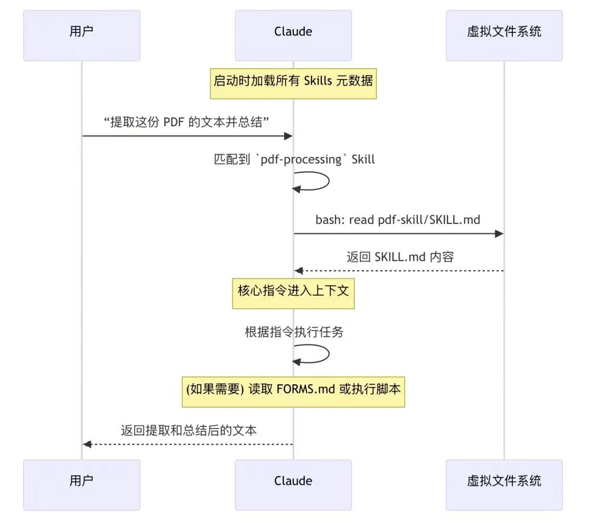

## AI Coding 工具优化开发流程
**一、 合理划分AI任务边界**

根据任务复杂度和自身能力范围合理分配 AI 的工作.

**二、 小步快跑，每一步需要可验证**

不要等代码全生成了，然后一次性调试，好的代码应该像细菌一样（by Karpathy），精炼，模块化，闭包( copy paste-able)。

**三、 AI生成的方案和代码必须要Review**

除非需求极其清晰，否则不要期望一次命令就能完成一个完整需求，AI认为的完成，有可能并不是实际的完成。一方面可能会因为上下文长度的原因，遗忘，或者产生幻觉。 另外一方面对于项目的了解程度的片面性，生产出来的代码质量或技术方案不够好。

**四、 有效管理上下文**
1. 提供精确信息
   - 当已确定修改范围时，应提供准确的文件路径和相关细节。
   - 先通过与 AI 逐步沟通，获取并明确关键信息，形成清晰上下文后，再让AI执行。
2. 信息压缩策略：手动筛选重要信息，只保留有价值的部分。举个例子，我们在让AI修复一些执行错误的时候，如果把全部Exception信息丢给AI，比如Java抛出来的Exception，会非常长。想象一下我们自己去解决问题的时候，往往也是定位几行有用信息。
3. 控制任务粒度：
   - 执行复杂任务需要较高的 prompt 技巧和使用经验，且难以验证细节。
   - 过于复杂的任务可能超出上下文长度限制，导致 AI 遗忘早期任务内容。
4. 利用外部记忆：将失败的任务手动编辑出来，并存储在一个外部文档中，然后告诉AI去逐个修复。
   ```md
   test_result.md里面记录了运行单元测试失败的case以及异常的信息，请从上往下进行修复。
   对于每一个test case，代码修复完成后，通过运行pytest检查case是否执行成功。若test case运行成功，在test_result.md里面标记完成。
   任务结束前，请检查test_result.md文档，确保失败的测试用例全部修复。
   ```
5. 知识库很重要:对于已有项目，如果希望长期让AI持续进来改动，请务必先给他提供更多的信息，以及一个良好的信息获取方式。
   - 像Claude Code，提供了`/init`指令，目的是为了让AI快速了解项目的背景、技术架构等，知识库记录了业务需求、技术规约、常见的工程流程等信息
   - 对于一个已经存在的工程项目，建议先让AI针对代码写说明文档(README.md)，然后再让他参与到写代码。
### Prompt 技巧
prompt的质量直接关乎到AI交付结果的质量。在开始使用 AI Coding 之前，是有必要系统学习一下Prompt 技巧，对后续使用效果影响是很大。
1. 清晰的需求描述：如果一个需求不能描述出来，那么谨慎将任务交给AI，因为你可能获取到的是惊喜，也可能是失望。
   >在中文表达的时候可能存在二义性，可以中英文混合描述来表达需求。
2. 使用结构化的方式表示Prompt: 
   - COSTAR框架，它是2023年新加坡prompt大赛冠军总结出来的一个提示词编写框架，他将Prompt分成了Context、Objective、Style、Tone、Audience、Response这几个部分，分别表示任务的背景、agent的目标、风格、回复预期、受众以及响应格式要求。
   - 使用claude模型的时候，可以使用伪xml的结构做结构化，claude模型对于伪xml的理解更好。比如：
      ```yaml
      <<这是你的角色>>{your_role}<</这是你的角色>>
      <<你的任务>>{your_task}<</你的任务>>
      <<要求>>{specification}<</要求>>
      <<输出格式>><</输出格式>>...
      ```
3. 让AI协助将需求明确清楚，然后再做prompt engineering:
   在高效写prompt，或者明确需求这块，可以借助一些AI的工具，提升写prompt的效率。比如openai的prompt工具，也可以自己写一个prompt优化的agent。Claude在写prompt template这方面的效果比较不错。


## Claude Code使用经验
Claude Code本质上是由一个主模型搭配15个专用工具组成的智能体系统。其工具集主要包括：
- 任务列表管理
- 文件编辑功能
- Bash命令执行
- 内容查找（Grep、Glob）
- Web搜索能力

### 常用指令
#### 常用启动参数(启动前）
- `--dangerously-skip-permissions`：允许 Claude Code 无需询问权限直接执行操作
- `--continue`：继续上一次的工作会话
#### 常用交互指令（启动后）
- `/memory`：直接编辑记忆，也可通过 # 命令追加记忆
- `/mcp`：查看当前 MCP 工作状态
- `/compact`：压缩上下文（当上下文达到 95% 时会自动启动，但建议主动管理）
- `/clean`：清除上下文
- `/resume`：查看历史记录

- 可以安装的扩展工具：`ccusage`：查看claude code的模型使用量
- 实时查看消耗:`ccusage blocks--live`
### 使用建议
#### 构建项目的rules和workflow
通过/init指令，可以让Claude Code扫描整个工程，了解项目结构，并将结果写入CLAUDE.md文件。

CLAUDE.md是Claude Code的记忆存储文件，执行任务时它会优先参考这里的内容。官方文档对此有详细介绍。
我们可以通过`/memory`直接编辑这个文件，也可以用`#`命令追加内容。

我建议在CLAUDE.md中包含以下关键内容：
1. AI必须了解的核心信息：项目背景、技术栈、架构设计等
2. 项目编码标准、流程等指导AI正确执行任务的行为准则对于常用框架、开发语言规范甚至是工作流，可参考GitHub上的优质资源，如awesome-cursor-rules-mdc，描述了各种语言、各种框架沉淀的code conduct。https://github.com/sanjeed5/awesome-cursor-rules-mdc/blob/main/rules-mdc/python.mdc

如果单个CLAUDE.md信息量过大，可以将其分层分模块存储，按模块准备不同的CLAUDE.md文件。Claude会从修改最深一级的记忆开始查找。

#### 上下文管理策略
- 定期使用`/compact`命令：上下文容易超出限制，需要主动压缩，否则模型可能遗忘早期重要信息；
- 及时更新README.md和CLAUDE.md，将其作为上下文存储的补充；
- 任务结束后，使用`/clean`清除上下文，保持环境整洁；

考虑到AI上下文长度限制，建议尝试使用外部文件列表管理复杂任务。
#### 先plan再code(shift + tab)
当项目复杂度高、代码设计量大时，采用"计划先行"模式能显著提升效率：先让AI分析修改点，制定详细计划，然后再执行具体编码工作。
比较两种方案的差异：直接生成代码模式在运行时间长、代码量大的情况下，容易导致代码难以review、方案错误难以回滚。而plan模式则允许先review方案，对齐期望，流程更加清晰。
#### 使用git worktree多个Claude Code协同工作
为减少等待时间和提高工作效率，可以使用git worktree同时运行多个Claude Code实例处理不同任务。git worktree是多检出的轻量替代方案，允许将同一仓库的多个分支检出到不同目录，每个worktree有独立的工作目录和文件，但共享历史和reflog。

适用场景
1. 多个功能特性同时迭代；
2. 前后端协作：一个实例负责前端，另一个负责后端； 

>不要在同一工作目录同时启动多个Claude Code实例执行任务，这会导致文件冲突。建议限制worktree数量，避免人工切换上下文带来的认知负担。

#### 有效利用MCP
Claude Code可以扩展一些工具，增加他的能力，但是不建议过多。
- Context7 MCP：能够从源代码直接提取最新、特定版本的文档和代码示例，并将其直接放入prompt中。https://github.com/upstash/context7
- Figma Dev Mode MCP：实现交互稿像素级还原，MasterGO也有类似功能。注意点：Figma的源码文件往往很长，建议逐个模块选中，让AI实现。https://help.figma.com/hc/en-us/articles/32132100833559-Guide-to-the-Dev-Mode-MCP-Server
- Browse use MCP：配合工作流，完成前端研发后，让Claude Code查看浏览器中的实际表现

### Claude Skills
Claude Skills 是一种基于文件系统的、可复用的知识包，运行在 Claude 的沙盒虚拟机（VM）环境中，用于向 Agent 注入流程化、确定性的内部知识（SOP）的标准化方案。
>Anthropic官方文档给出了 Agent Skills 的定义：
> 智能体技能（Agent Skills）是一种模块化的能力，用于扩展 Claude 的功能。每个“技能”都封装了相应的指令、元数据和可选资源（例如脚本、模板）。当场景匹配时，Claude 会自动调用这些技能来完成任务。

Agent Skills 的三大组成要素，同时也构成了上下文的三个层级，从抽象到具体：
- 元数据：Skill 的名称、描述、标签等信息；
- 指令：Skill 具体的指令；
- 资源：Skill 附带的相关资源（比如文件、可执行代码等）；

Anthropic 在 GitHub 上开源了一系列的 Agent Skills：https://github.com/anthropics/skills/blob/main/theme-factory/SKILL.md

以画布设计的 Skill 为例，一个 Skill 就是一个文件夹，可以包含嵌套的子文件夹，形成 Skills 的嵌套层级。上面的三要素对应：
- 元数据：包含在 `SKILL.md` 的 YAML 头中；
- 指令：`SKILL.md` 的内容；
- 资源：Skill 文件夹中的其他文件，资源可以在指令中被引用；

#### Claude Skills 是如何被 Agent 感知的?
Claude Skills 设计遵循了一个非常重要的原则：:
>Progressive Disclosure - 渐进式批露：
> 
>分阶段、按需加载信息，而不是在任务开始时就将所有内容全部塞入本已宝贵的上下文窗口中。

整个加载过程分为三个层次，对应上面的三要素：

<span style="color:#ff6600">第一层：元数据（始终加载）</span>

每个 Skill 都有一个 `SKILL.md` 文件，其头部的 YAML 元数据包含了名称和描述。
```yaml
---name: pdf-processing
description: 提取 PDF 文件中的文本和表格，填写表单，合并文档。当处理 PDF 文件或用户提及 PDF、表单或文档提取时使用。---
```
**元数据在 Claude 启动时加载，并始终保持在上下文窗口中**，占用约 100 个 Token。

<span style="color:#ff6600">第二层：核心指令（触发时加载）</span>

**当 Claude 发现某个 Skill 与当前任务相关时，Claude 会使用 Bash 工具阅读 `SKILL.md` 文件的主体内容**，例如：
```md
# PDF 处理
## 快速入门
使用 `pdfplumber` 提取 PDF 文本：
import pdfplumber
with pdfplumber.open("document.pdf") as pdf:    text = pdf.pages[0].extract_text()
如需了解高级表单填写，请参阅 [FORMS.md](FORMS.md)。
```
`如需了解高级表单填写，请参阅 [FORMS.md](FORMS.md)`只有在这个时候，Skill 的核心指令和工作流程才会进入上下文窗口。Claude 开始学习如何完成这项具体任务。

<span style="color:#ff6600">第三层：代码与资源（按需加载）</span>

一个复杂的 Skill 可能包含多个文件，形成一个完整的知识库。

Claude 会根据`SKILL.md`中的指引，在需要时才去读取`FORMS.md`或执行`fill_form.py`脚本。执行脚本是最高效的方式。脚本代码本身永远不会进入上下文窗口，只有脚本的输出结果（例如 “验证通过” 或具体的错误信息）会作为反馈进入上下文。

下图说明了完整的渐进式披露的信息加载过程：


#### Claude Skills 和 MCP 的关系是什么?
- Claude Skills 是一种基于文件系统的、可复用的知识包，运行在 Claude 的沙盒虚拟机（VM）环境中，用于向 Agent 注入流程化、确定性的内部知识（SOP）的标准化方案。
- MCP 是一种开放 AI 工具的标准，允许任何外部服务（无论是 Jira、Stripe 还是内部 API）将自己的能力以一种标准化的方式暴露给 Agent，让 Agent 可以不关心工具注册、工具发现、工具调用等工程实现细节。

Claude Skills 和 MCP 是可以协同工作的，Claude Skills 为 Agent 提供领域知识、MCP 为 Agent 提供外部工具。

#### 如何实现 Agent Skills
https://github.com/numman-ali/openskills 
提供了一个与 Claude 官方近似的实现，思路非常直观，把 skills 写入 AGENTS.md 中，然后 Agent 可以通过`Bash("openskills read pdf")`进行调用，这种方案可以支持 Claude Code 之外的其他 Agent，例如 Qwen Code、Codex 等。

## 参考文章
1. [如何用AI Coding和Claude Code提升开发效率？看我的全流程复盘](https://mp.weixin.qq.com/s/6j-MqSrJz5YlKAe2LZW6pg)
2. [Claude Skills｜将 Agent 变为领域专家](https://mp.weixin.qq.com/s/bwFGcomH6BfkBzhFMiiH1g)