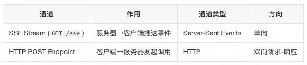
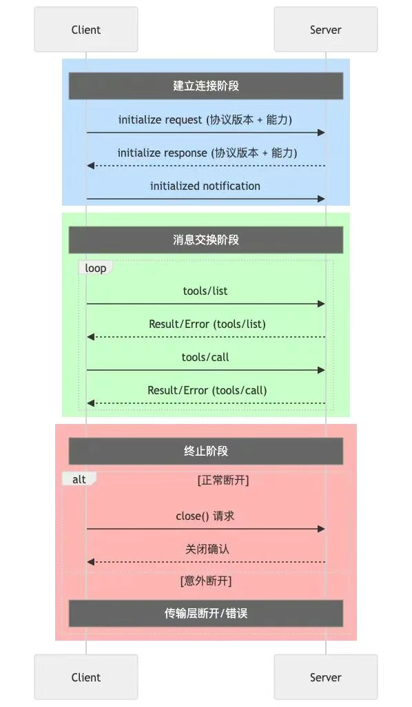

## MCP
MCP（模型上下文协议）是规范应用程序向大语言模型提供上下文的开放协议，旨在通过标准化的方式将LLM与外部工具与系统集成。MCP本质上是MCP Client和MCP Server之间的通信协议，实现了Agent开发与工具开发的解耦。

由三个核心组件组成：
1. `MCP Client`：负责发送请求/接收响应，一般直接集成在`MCP Host`中。
2. `MCP Server`：处理请求并返回上下文数据，例如高德、`GitHub MCP`工具等，可以在`MCP Host`直接调用。
3. `MCP Host`：`MCP`协议的执行者。负责：接受用户问题 → 选择工具 → 构建参数 → 通过`Client`调用`Server` → 解析结果 → 继续对话
> 集成`MCP Client`的智能体执行平台（如 `IDEA LAB`）或模型厂商的 `Agent/AI` 客户端（如 `Cherry Studio`）均可承担`MCP Host`职能。例如阿里云百炼平台上的智能体应用。

当所有的`Agent/AI`客户端集成了`MCP Client`，并且通过MCP协议去实现调用`MCP Server`提供的工具，从Agent开发的角度来说，MCP就变成了一个Agent进行`function call`的协议了，
如果大家都按MCP的方式去给Agent添加工具，不就是统一了`function call`吗？所以如果把Agent比作手机，接口比作充电线，那MCP Server牌充电线就相当于Type-C接口类型的充电线。

### MCP解决的核心问题
<span style="color:#ff6600">1. 让模型调用接口更简单，把接口上下文一键喂给LLM</span>

有了统一协议，通义千问、IDEA LAB等平台的AI客户端（MCP Host）内置`MCP Client`，按协议进行通信，我们只需要把自己的接口封装成`MCP Server`，接入平台即可；选工具、拼参数、调接口、解析结果等链路由平台自动完成。

<span style="color:#ff6600">2. 实现了Agent开发与工具开发的解耦</span>

所有平台支持MCP协议后，工具按`MCP Server`标准发布，Agent即可直接调用，无需再关心"选-拼-调-解"全流程，真正做到工具开发与Agent开发分离。

### MCP技术原理深度解析
<span style="color:#ff6600">1. SSE（Server-Sent Events）：MCP Client和MCP Server之间的数据传输方式</span>

SSE全称Server-Sent Events，是一种基于HTTP协议实现的Web技术，专门用于服务器向客户端实时推送数据。它通过建立持久的HTTP连接，让客户端监听事件流，从而实时接收服务器推送的数据。

**sse是如何做到实时推送的**

SSE采用了一种巧妙地变通方法：虽然底层仍然是请求-响应模式，但相应的不是一个简单的数据包，而是一个持续不断的流信息（stream）。就像是一次耗时很长的下载过程，让数据源源源不断的流向客户端。
并且因为SSE基于HTTP实现，所以浏览器天然支持这一技术，无需额外配置。

因此，在 MCP 体系里，SSE 就是"用一次超长时间的 HTTP 下载"来伪装成服务器主动推送；规范极简（4 个固定字段），浏览器原生支持，Spring 既可用同步阻塞的`SseEmitter`，也可用响应式的`Flux<ServerSentEvent>`实现。

#### 1. SSE在MCP中的定位
实现MCP Server → MCP Client 的单向实时数据流，解决「怎么传」.

本质：
- 依旧走 HTTP/1.1，复用现有基础设施；
- 长连接 + `text/event-stream`响应，把"请求-响应"拉成"长时间下载"。

#### 2. 协议格式
**Header**
```
Content-Type: text/event-stream
Cache-Control: no-cache
Connection: keep-alive
```
**Body**
```
field: value\n\n              /* 每条消息以两个换行结束 */
```
服务器发送给浏览器的body必须符合上述k-v格式，其中field的类型是固定的四种字段：
- `data`实际负载
- `id`事件序号，断线续传用
- `event`事件类型，前端`addEventListener('event名')`
- `retry`断线重连间隔（ms）

#### 3. 实现方式
**Spring MVC（阻塞式）**

通过返回一个SseEmitter对象作为事件发射器给前端，然后我们在后端调用emitter.send()方法发送的数据会被封装成SSE事件流的形式，前端可以通过监听该事件流来进行数据更新。
```java
@GetMapping(value="/stock-price", produces=TEXT_EVENT_STREAM_VALUE)
public SseEmitter stream(){    
    SseEmitter e = new SseEmitter();    
    new Thread(() -> {        
        while(true){            
            e.send(SseEmitter.event().data(price));            
            sleep(1000);        
        }    
    }).start();    
    return e;
}
```

前端在js中通过`new EventSource`建立一个`EventSource`对象，它会与`"/stock-price"`这个路径建立sse长连接，并监听事件。当后端发送event事件以后，会触发`eventSource.onmessage`这个回调函数，将数据写入到页面中。
```
const es = new EventSource("/stock-price");
es.onmessage = e => document.body.innerText = e.data;
```

**Spring WebFlux（响应式）**

返回publisher给到前端进行订阅，然后我们在后端通过`Sinks.Many<ServerSentEvent<?>>`这个类的`tryEmitNext`方法来手动发送事件给到前端，前端可以通过监听该事件流来进行数据更新。
```JAVA
@GetMapping("/stream-sse")
public Flux<ServerSentEvent<String>> stream() {
    return Flux.interval(Duration.ofSeconds(1))
        .map(i -> ServerSentEvent.builder()
            .id(i.toString())
            .event("tick")
            .data("now=" + LocalTime.now())
            .build());
}
```
前端同上。

<span style="color:#ff6600">2. JSON-RPC 2.0：MCP Client和MCP Server之间的传输的内容格式</span>
JSON-RPC 2.0 是一种无状态、轻量级的远程过程调用(RPC)协议，定义了MCP Client和MCP Server之间进行通信的格式。JSON-RPC 2.0协议定义了请求和响应的格式，以及错误处理机制。

在MCP里，Client与 Server永远只交换一条"四字段" JSON-RPC 2.0 消息：
- 版本`jsonrpc`：协议版本号
- 方法`method`：远端要执行的函数名
- 编号`id`：客户端生成的请求匹配符，无`id`视为通知，不期待回复
- 载荷`params`：入参
- `result|error`：成果返回`result`，失败返回`error`

定义MCP Server和MCP Client之间的统一的无状态消息格式，解决「说什么」。本质上是通过无状态、轻量级的四字段JSON契约，实现两端零差异解析。

#### 完整范式
1. 请求
```json
{ "jsonrpc": "2.0", "method": "...", "params": {...}, "id": <unique> }
```
2. 响应
```json
{ "jsonrpc": "2.0", "id": <same>, "result": {...} }   // 成功
{ "jsonrpc": "2.0", "id": <same>, "error": {code, message, data?} } // 失败
```

<span style="color:#ff6600">3. MCP协议：MCP Client和MCP Server之间的通信（调用）协议</span>

MCP本质上是MCP Client和MCP Server之间的通信协议
1. 定义了MCP Server和MCP Client之间的连接建立过程；
2. 定义了MCP Client和MCP Server之间如何进行信息（上下文）交换;
3. 定义了MCP Client和MCP Server之间如何连接关闭过程；

MCP协议就是“客户端先拉一条SSE长连接通知，再用普通HTTP POST 发请求到服务端；Client和Server之间必须先发 initialize 打招呼，才能调工具，最后Client关 SSE 就通信结束了"。

**定位**：在 SSE + JSON-RPC 2.0 之上，定义 两通道、四步骤、全生命周期 的MCP Server与 MCP Client 通信协议

**本质**：把"怎么连、怎么握手、怎么调工具、怎么结束"写死成固定流程，MCP Host只需照表填空，就可以实现LLM获取MCP Server提供的上下文。

**MCP Server 和 MCP Client 之间的通信"两通道"**

服务器启动时必须同时暴露这两个端点，缺一不可。

**MCP Server 和 MCP Client 之间的通信"四步骤"**
1. 连：客户端 发送`GET/sse`请求，建立sse长连接 ，用于后续服务端推送数据给客户端 ；
2. 取：服务器回`event: endpoint`的消息，给出后续客户端发送信息给服务端的POST端点URI；
3. 握：客户端向该 URI 发两包 JSON-RPC；
    - `initialize`请求 → 服务器返回`capabilities`；
    - `notifications/initialized`通知 → 握手完成；
4. 用：正常会话；
    - `tools/list`（可选）拉可用工具；
    - `tools/call`调用具体工具；
    - 服务器随时在 SSE 流里推送状态更新 ；
5. 断：任一端关闭 SSE，会话结束。


