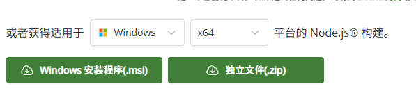
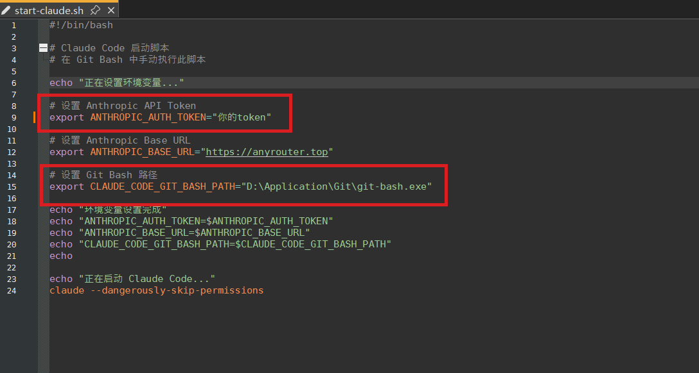

## 前置准备

### 安装Node
访问Node官网下载：[Node.js LTS](https://nodejs.org/en/download) 根据系统选择合适的版本


> MacOS 可以采用以下命令安装
> `brew install node`
>
cmd键入一下命令，出现版本号即为安装成功
```git
node -v
```
>对于Windows11系统，安装镜像后大部分无需配置环境变量；如果安装后上述命令无反应，请搜索“配置node环境变量"

### 安装Git
访问Git For Windows下载页面：[Git For Windows/x64 LTS](https://git-scm.com/install/windows) 选择X64下载安装

## Claude Code 安装配置
### 安装 Claude Code
装完成后去D盘或其余盘新建一个文件夹ClaudeCode，右键-更多选项-Open Git Bash Here，键入以下命令依次修改镜像源和下载Claude Code包
```git
# 如果连接超时，可选择下面的镜像
# 官方镜像：npm config set registry https://registry.npmjs.org/
# 腾讯云：npm config set registry https://mirrors.cloud.tencent.com/npm/
# 淘天：npm config set registry https://registry.npmmirror.com
npm install -g @anthropic-ai/claude-code
```
使用查询版本号命令验证是否安装成功
```git
claude --version
```

### API 令牌获取
#### AnyRouter 免费中转服务
Any Router官网：[Any Router](https://anyrouter.top/console)

**注意**
1. 目前Any Router屏蔽了Github的注册方式，现在只能使用LinuxDo注册该站点
2. LinuxDo的注册比较麻烦，只支持港澳台和大陆的网络注册，并且需要邀请码和申请信：
   - 邀请码可以访问以下链接翻到最后：[写给即将成为佬友的佬友们](https://linux.do/t/topic/545650)
   - 申请信注意：LinuxDo站点是一个讨论AI的站点。请保证字数合格，内容符合要求，不然会不通过。

AnyRouter新人可以免费领取 $125 额度,使用步骤：
1. 进入“API 令牌”页面，点击“添加令牌”
2. 获取以 sk- 开头的令牌，选择“永不过期”和“无限额度”（不然对话很容易超限）

有钱的可以直接购买Claude pro亦或者使用国内大模型的免费额度。不过一般不推荐使用Claude大模型之外的，毕竟Claude code的优势主要在与Claude模型本身，个人体验下来，在面对复杂要求时，还是Claude模型的效果最好
### Claude Code配置
#### 临时设置（仅当前终端有效）
临时环境变量和相关安全模式启动都需要每次启动反复设置，因此写了个简单的脚本方便启动

1. 将图片这两部分修改为你自己的token和bash地址，如何寻找bash地址可以键入where bash。
2. 右键单击ClaudeCode目录，选择更多选项，以Git Bash打开
3. 执行脚本（如果开代理的话，记得提前配置代理，不然会报API连接错误）
   ```
   ./start-claude.sh
   ```
   
>脚本获取
> 
>链接: https://pan.baidu.com/s/1NGsHX9nsbD3JyMsNwEkWgQ?pwd=btj5 提取码: btj5

```git
export ANTHROPIC_AUTH_TOKEN=你的Token
export ANTHROPIC_BASE_URL=https://anyrouter.top
export CLAUDE_CODE_GIT_BASH_PATH="D:\Application\Git\git-bash.exe"

```
修改为自己的token，url和Git-Bash安装地址

**启动 Claude Code
```git
cd your-project-folder
claude
```
首次启动需完成以下设置： - 选择主题 - 确认安全须知 - 使用默认 Terminal 配置 - 信任当前工作目录。直接一路回车，其中注意如果遇见是否使用Key需要选择Yes。

```git
claude --dangerously-skip-permissions
```
在启动Claude的时候，不直接使用claude命令，而是使用上述命令启动，可以跳过权限申请，跳出的请求框，选择“Yes，I accept"即可。


#### 永久设置
```git
# bash 用户
echo -e '\nexport ANTHROPIC_AUTH_TOKEN=sk-你的令牌' >> ~/.bashrc
echo -e '\nexport ANTHROPIC_BASE_URL=https://anyrouter.top' >> ~/.bashrc

# zsh 用户
echo -e '\nexport ANTHROPIC_AUTH_TOKEN=sk-你的令牌' >> ~/.zshrc
echo -e '\nexport ANTHROPIC_BASE_URL=https://anyrouter.top' >> ~/.zshrc

# 重载配置
source ~/.bashrc
```
### 常见命令及使用技巧
```git
claude                           #启动软件
claude "帮我修复这个 bug"          #一次性命令执行
claude -c              #继续上次对话
claude update                    #更新客户端，镜像站更新重新运行下载的命令即可
claude mcp                       #启动mcp向导

/help          #列出所有斜线命令
/add-dir       #添加更多工作目录
/bug           #向 Anthropic 报告错误
/clear         #清除聊天记录
/compact       #压缩上下文
/config        #配置菜单
/cost          #toekn花费统计
/doctor        #客户端完整性检查
/exit          #退出 Claude Code
/init          #初始化项目，生成 CLAUDE.md全局记忆
/mcp           #查看mcp列表和状态
/memory        #编辑记忆
/model         #更换模型
/permissions   #修改工具权限
/pr_comments   #查看PR评论
/review        #请求代码审查
/sessions      #列出sessions列表
/status        #系统/账户状态
/terminal-setup #安装 Shift+Enter 绑定
/vim           #切换 vim 模式
/resume        #查看历史聊天记录
```

#### 拖动文件
拖动文件 通常会在新标签页中打开它们，在拖动时按住 Shift 键，即可在当前窗口。

#### 接入外部工具（MCP）
```
# 添加 MySQL 支持
claude mcp add mysql npx @benborla29/mcp-server-mysql \
  -e MYSQL_HOST=localhost \
  -e MYSQL_USER=root \
  -e MYSQL_PASS=密码 \
  -e MYSQL_DB=test

# 添加 Playwright（网页自动化）
claude mcp add playwright npx '@playwright/mcp@latest'

作者：卓林
链接：https://zhuanlan.zhihu.com/p/1934011464114508492
来源：知乎
著作权归作者所有。商业转载请联系作者获得授权，非商业转载请注明出处。
```

#### 自定义命令（团队共享）
在项目根目录下创建 .claude/commands.json，定义快捷命令，如：
```
{
  "run-tests": "npm run test",
  "deploy": "npm run build && rsync -av dist/ server:/var/www/"
}
```

### 注意事项
| 问题         | 解决方法                       |
| ------------ | ------------------------------ |
| API 报错     | 退出重试或更换代理             |
| 显示 offline | 不影响正常使用，继续即可       |
| fetch failed | 确保全局代理已开启，或切换网络 |

