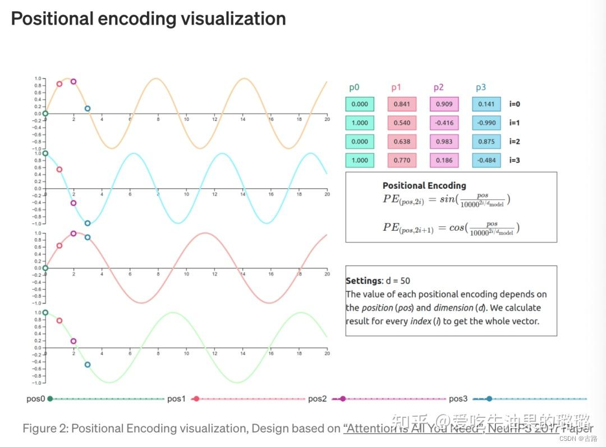
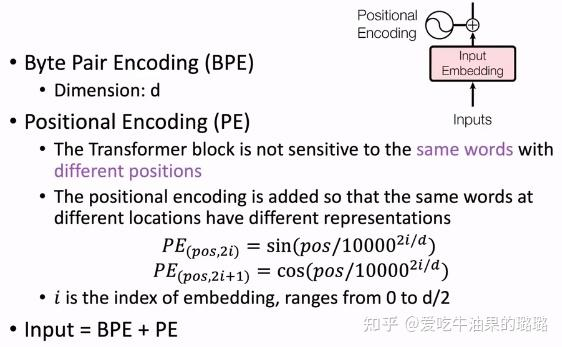
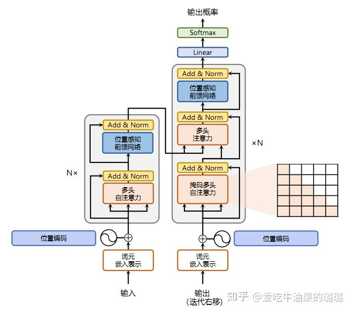
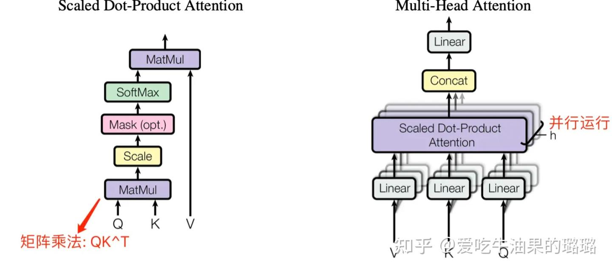
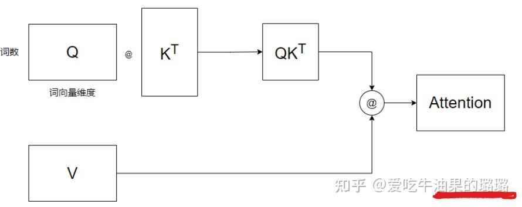
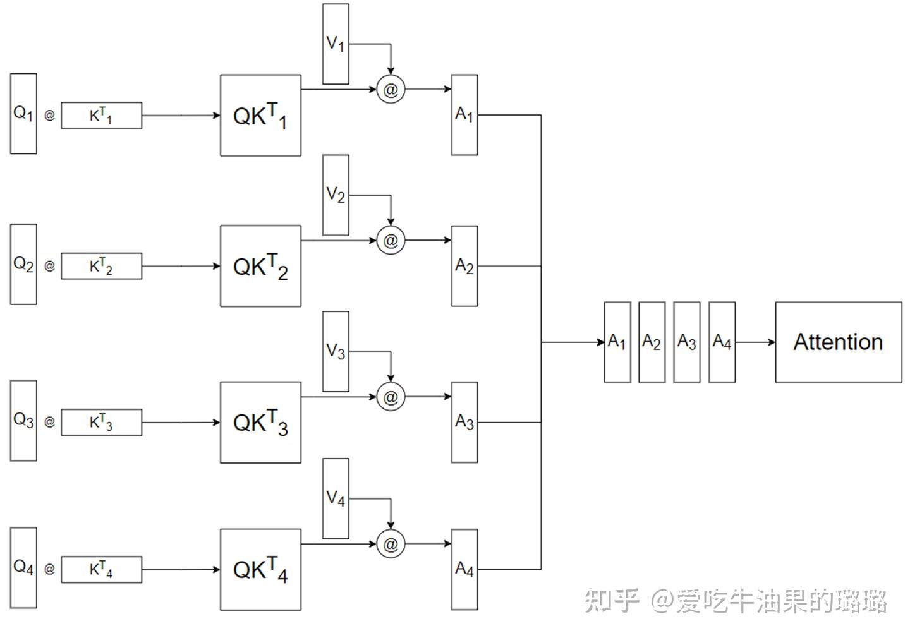

Transformer 是第一个完全依赖自注意力（self-attention）来计算输入和输出的表示，而不使用序列对齐的递归神经网络或卷积神经网络的转换模型。

>自注意力（Self-Attention）是Transformer 模型的核心机制，它让模型能在处理序列（如文本、语音）时，动态捕捉 “序列中每个元素与其他所有元素的依赖关系”——
> 简单说，就是让模型 “知道在当前语境下，哪些词更重要，需要重点关注”。
> 
> 核心是通过 “Q（查询）、K（键）、V（值）” 的计算，生成 “注意力权重”，再加权求和得到最终输出。

## 输入编码(BPE,PE)剖析
进入Pre-Train时代后模型处理文本的粒度从Word更细分到Token粒度，Token可以是一个字、词、标识符等等。

Tokenizer——分词器，可以将文本处理成Token的序列，例如当BertTokenizer的输入文本是 "I love NLP." 会被切分为：['i', 'love', 'n', '##lp', '.']；
当输入文本是: "我喜欢自然语言处理"时， 则会被切分为：['我', '喜', '欢', '自', '然', '语', '言', '处', '理', '。']

输出的token序列是根据Tokenizer中已经生成好的词表进行匹配（过程类似最大前向匹配），匹配过程中如果词表中存在该token就直接输出，没有就输出特殊符号[UNK]。

因此本质上是Tokenizer中的词表决定生成文本切词方式，而决定Tokenizer中词表生成则是由不同的分词算法所决定。

### BPE分词算法
BPE (Byte Pair Encoding)全称为字节对编码，本质是一种数据压缩方法，来自于一篇发表于1994年的论文：“A new algorithm for data compression”。
核心逻辑是 “从最小的字符单元（字节）开始，通过反复合并高频出现的字节对，生成粒度更大的子词”。比如有一段数据是“abbabyabya”，其中相邻字母对的组合中"ab"出现3次是出现最多，
即可以使用一个字母Z去代替"ab"，数据形式压缩成："ZbZyZya"。以此类推，下一个'Zy'继续被替换成Y，数据形式变成："ZbYYa"。

**BPE核心价值**：通过“子词（Subword）”平衡词汇量和语义颗粒度之间的矛盾——子词是 “字符与单词之间的中间粒度”（如 “low”“er”“est”），既能控制词汇量（子词数量远少于单词），又能处理 OOV（未见过的词可拆为已学子词，如 “lowest” 拆为 “low”+“est”），同时保留一定语义颗粒度。

#### 算法步骤
1. 准备足够大的训练语料，确定期望的subword词表大小；
2. 准备基础词表：比如英文中26个字母加上各种符号；
3. 基于基础词表将语料中的单词拆分为字符序列并在末尾添加后缀“ </ w>”；本阶段的subword的粒度是字符。例如单词“ low”的频率为5，那么我们将其改写为“ l o w </ w>”：5；
4. 统计每一个连续字节对的出现频率，选择最高频的字符对合并成新的subword；
5. 重复第4步直到达到第1步设定的subword词表大小或下一个最高频的字节对出现频率为1
6. 当合并次数达到预设值（或词汇量达标），停止合并，此时所有 “独立单元”（字符 + 合并后的子词）构成 BPE 的子词词汇表
7. 当遇到未见过的词（如lowest），BPE 会按 “最长匹配原则” 拆分为已有的子词

BPE 的核心是 “从字节开始，合并高频对，生成子词”，它用数据驱动的方式解决了传统分词的 “词汇量爆炸” 和 “OOV” 痛点，成为 LLM 处理文本的 “标配前置步骤”。

### PE位置编码
PE（Positional Encoding，位置编码）是为 Transformer 模型设计的 “序列顺序信息注入机制”—— 由于 Transformer 的核心组件（多头注意力）是 “并行处理所有 token” 的（无 RNN 的循环顺序、无 CNN 的局部窗口），
天然无法捕捉 “谁在前、谁在后” 的序列位置关系，而 PE 的作用就是通过数学方式，给每个 token 的嵌入向量（Embedding）附加 “位置信息”，让模型能区分 “我吃苹果” 和 “苹果吃我” 这类语义完全相反的序列。

| 模型类型 | 序列顺序捕捉方式 | 问题/优势 |
|----------|------------------|-----------|
| RNN/LSTM | 循环处理：按“第1个token→第2个token→…→第n个token”的顺序计算，每个token的状态依赖前一个token | **优势**：天然包含位置信息；<br>**问题**：并行效率低，长序列易遗忘 |
| Transformer | 并行处理：所有token同时输入，通过注意力权重计算相互依赖关系，无固定处理顺序 | **优势**：并行效率高，长序列依赖捕捉能力强；<br>**问题**：丢失位置信息——模型不知道“token A在token B前面”还是后面 |

>举个例子
> 
> 对于序列 “我 吃 苹果” 和 “苹果 吃 我”，Transformer 的注意力层会计算 “我” 与 “吃”“苹果” 的依赖关系，但如果没有 PE，这两个序列的 token 嵌入向量完全相同，
> 模型无法区分 “谁是主语、谁是宾语”，最终输出语义混乱。
> 
>而 PE 的作用就是给这两个序列的每个 token “打位置标签”：比如 “我” 在第 1 位和第 3 位的 PE 不同，“苹果” 在第 3 位和第 1 位的 PE 不同，从而让模型能识别序列顺序差异。


**Transformer原论文（2017）提出了PE的4个核心设计原则，这也是所有PE变体（如RoPE、Learned PE）的设计依据*：
1. **与嵌入向量兼容**：PE的维度必须和token嵌入向量的维度（`d_model`）完全一致，才能直接与嵌入向量“相加”（而非拼接，避免增加模型复杂度）；
2. **支持任意序列长度**：PE必须能生成“任意长度”的位置信息（比如训练时处理512长度的序列，推理时处理1024长度的序列，PE仍能有效工作）；
3. **捕捉相对位置**：模型需要知道“token A和token B之间的距离”（比如A在B前面3个位置），而非仅知道“A在第5位、B在第8位”的绝对位置——即PE需满足“相对位置不变性”（如位置`pos`和`pos+k`的相对关系，与`pos`无关）；
4. **计算高效**：PE的生成过程不能太复杂（如避免迭代计算），否则会抵消Transformer的并行效率优势。


Transformer原论文采用**正弦（sin）和余弦（cos）函数**设计PE，是最经典、应用最广的方案。


PE的使用非常简单，只需将“token的嵌入向量（Embedding）”与“该token的PE向量”直接相加，再输入到Transformer的多头注意力层：  
$$
\text{Input} = \text{Embedding}(token) + \text{PE}(pos)
$$

- 为什么是“相加”而非“拼接”？  
  拼接会导致输入维度变为`d_model + d_model = 2d_model`，增加模型参数和计算量；而相加能在不增加维度的前提下，将位置信息融入token表示，且符合“内容信息与位置信息融合”的直觉（token的含义与其位置相关）。


#### PE的常见变体
随着大模型的发展，研究者提出了多种PE变体，以解决不同场景的需求（如长序列、多语言、效率优化），核心仍是“注入位置信息”，但实现方式不同：

| PE类型          | 核心思路                                                                 | 优势                                  | 缺点                                  | 典型应用场景          |
|-----------------|--------------------------------------------------------------------------|---------------------------------------|---------------------------------------|-----------------------|
| 可学习位置编码（Learned PE） | 不使用固定公式，而是随机初始化一个`(max_seq_len, d_model)`的PE矩阵，通过训练学习最优的位置信息 | 灵活，能适配特定任务（如多语言、代码） | 泛化性差（训练时`max_seq_len=512`，推理时处理1024长度序列需插值） | BERT（早期版本）、T5  |
| 旋转位置编码（RoPE）        | 将位置信息编码为“旋转矩阵”，通过复数乘法将位置信息注入token的嵌入向量（而非直接相加） | 长序列处理能力强，相对位置表达更精准 | 计算需复数运算，实现稍复杂            | LLaMA、ChatGLM、Qwen  |
| 相对位置编码（Relative PE） | 不给每个token分配绝对PE，而是在注意力计算时直接建模“两个token的相对距离”（如用距离嵌入表） | 完全聚焦相对位置，避免绝对位置偏见    | 注意力计算复杂度增加（需额外处理距离） | Transformer-XL、DeBERTa |
| ALiBi           | 不给token注入PE，而是在注意力权重计算时，给“距离越远的token对”附加一个线性衰减的偏置 | 无需PE矩阵，节省内存，支持任意长序列  | 偏置设计依赖经验，部分任务效果略差    | PaLM、LLaMA-2（部分） |


PE的本质是**给Transformer模型“补充序列顺序信息的数学工具”**——它解决了Transformer并行计算导致的“位置遗忘”问题，让模型能理解“token的先后关系”。经典的正弦余弦PE通过三角函数的特性，实现了“任意长度适配、相对位置捕捉、计算高效”的目标，而RoPE等变体则在长序列、精准性等场景下做了优化。理解PE的关键是记住：它不是“额外的负担”，而是Transformer能处理序列任务的“核心前提”。

### Input

- 文本通过BPE 分词得到子词序列，每个子词被映射为d维的嵌入向量（Input Embedding）；
- 给每个嵌入向量叠加对应的位置编码（Positional Encoding）；
- 最终的 “BPE + PE” 向量作为模型的输入，进入 Transformer 的多头注意力层。

## Transformer网络结构


### 嵌入表示层以及Python实现
对于输入文本序列，首先通过输入嵌入层（Input Embedding）将每个单词转换为其相对应的向量表示。通常直接对每个单词创建一个向量表示。
由于Transfomer模型不再使用基于循环的方式建模文本输入，序列中不再有任何信息能够提示模型单词之间的相对位置关系。
在送入编码器端建模其上下文语义之前，一个非常重要的操作是在词嵌入中加入位置编码（Positional Encoding）这一特征。
具体来说，序列中每一个单词所在的位置都对应一个向量。这一向量会与单词表示对应相加并送入到后续模块中做进一步处理。在训练的过程当中，模型会自动地学习到如何利用这部分位置信息。

Transformer模型通过偶数位置用正弦函数，奇数位置用余弦函数计算位置编码。这样就有两个好处：
- 正余弦函数的范围是在[-1,+1]，导出的位置编码与原词嵌入相加不会使得结果偏离过远而破坏原有单词的语义信息。
- 依据三角函数的基本性质，可以得知第pos+k个位置的编码是第pos个位置的编码的线性组合，这就意味着位置编码中蕴含着单词之间的距离信息。

```python
class PositionalEncoder(nn.Module):

    def __init__(self, d_model, max_seq_len=80):
        super().__init__()
        self.d_model = d_model
        # 根据 pos 和 i 创建一个常量 PE 矩阵
        pe = torch.zeros(max_seq_len, d_model)
        for pos in range(max_seq_len):
            for i in range(0, d_model, 2):
                pe[pos, i] = math.sin(pos / (10000**((2 * i) / d_model)))
                pe[pos,
                   i + 1] = math.cos(pos / (10000**((2 * (i + 1)) / d_model)))
        pe = pe.unsqueeze(0)
        self.register_buffer('pe', pe)

    def forward(self, x):
        # 使得单词嵌入表示相对大一些
        x = x * math.sqrt(self.d_model)
        # 增加位置常量到单词嵌入表示中
        seq_len = x.size(1)
        x = x + Variable(self.pe[:, :seq_len], requires_grad=False).cuda()
        return x
```

### 注意力层及实现
自注意力（Self-Attention）是Transformer模型的核心组件，其核心价值在于动态建立序列内部的全局依赖关系。在机器翻译任务中：
- 编码阶段：通过自注意力捕捉源语言句子中单词间的语法/语义关联（如主谓宾结构）
- 解码阶段：建立目标语言生成与源语言上下文的关联（如代词指代消解）

给定由单词语义嵌入及其位置编码叠加得到的输入表示，为了实现对上下文语义依赖的建模，进一步引入在自注意力机制中涉及到的三个元素：查询（Query），键（Key），值（Value）。
在编码输入序列中每一个单词的表示的过程中，这三个元素用于计算上下文单词所对应的权重得分(通过点积衡量查询与键的相似度)。
直观地说，这些权重反映了在编码当前单词的表示时，对于上下文不同部分所需要的关注程度。

```python
class MultiHeadAttention(nn.Module):

    def __init__(self, heads, d_model, dropout=0.1):
        super().__init__()
        self.d_model = d_model
        self.d_k = d_model // heads
        self.h = heads
        self.q_linear = nn.Linear(d_model, d_model)
        self.v_linear = nn.Linear(d_model, d_model)
        self.k_linear = nn.Linear(d_model, d_model)
        self.dropout = nn.Dropout(dropout)
        self.out = nn.Linear(d_model, d_model)

    def attention(q, k, v, d_k, mask=None, dropout=None):
        scores = torch.matmul(q, k.transpose(-2, -1)) / math.sqrt(d_k)
        # 掩盖掉那些为了填补长度增加的单元，使其通过 softmax 计算后为 0
        if mask is not None:
            mask = mask.unsqueeze(1)
            scores = scores.masked_fill(mask == 0, -1e9)
        scores = F.softmax(scores, dim=-1)
        if dropout is not None:
            scores = dropout(scores)
        output = torch.matmul(scores, v)
        return output

    def forward(self, q, k, v, mask=None):
        bs = q.size(0)
        # 进行线性操作划分为成 h 个头
        k = self.k_linear(k).view(bs, -1, self.h, self.d_k)
        q = self.q_linear(q).view(bs, -1, self.h, self.d_k)
        v = self.v_linear(v).view(bs, -1, self.h, self.d_k)
        # 矩阵转置
        k = k.transpose(1, 2)
        q = q.transpose(1, 2)
        v = v.transpose(1, 2)
        # 计算 attention
        scores = attention(q, k, v, self.d_k, mask, self.dropout)
        # 连接多个头并输入到最后的线性层
        concat = scores.transpose(1, 2).contiguous().view(bs, -1, self.d_model)
        output = self.out(concat)
        return output
```

### 前馈层及实现
前馈层接收自注意力子层的输出作为输入，并且通过一个带有Relu激活函数的两层全连接网络对输入进行更复杂的非线性变换。

试验结果表明，增大前馈子层隐状态的维度有利于提升最终翻译结果的质量，因此，前馈子层隐状态的维度一般要比自注意力子层要大。

```python
class FeedForward(nn.Module):

    def __init__(self, d_model, d_ff=2048, dropout=0.1):
        super().__init__()
        # d_ff 默认设置为 2048
        self.linear_1 = nn.Linear(d_model, d_ff)
        self.dropout = nn.Dropout(dropout)
        self.linear_2 = nn.Linear(d_ff, d_model)

    def forward(self, x):
        x = self.dropout(F.relu(self.linear_1(x)))
        x = self.linear_2(x)
```

### 残差连接与层归一化实现
由 Transformer 结构组成的网络结构通常都是非常庞大。编码器和解码器均由很多层基本的Transformer块组成，每一层当中都包含复杂的非线性映射，这就导致模型的训练比较困难。
因此，研究者们在 Transformer 块中进一步引入了残差连接与层归一化技术以进一步提升训练的稳定性。
具体来说，残差连接主要是指使用一条直连通道直接将对应子层的输入连接到输出上去，从而避免由于网络过深在优化过程中潜在的梯度消失问题。
```python
class NormLayer(nn.Module):

    def __init__(self, d_model, eps=1e-6):
        super().__init__()
        self.size = d_model
        # 层归一化包含两个可以学习的参数
        self.alpha = nn.Parameter(torch.ones(self.size))
        self.bias = nn.Parameter(torch.zeros(self.size))
        self.eps = eps

    def forward(self, x):
        norm = self.alpha * (x - x.mean(dim=-1, keepdim=True)) \
        / (x.std(dim=-1, keepdim=True) + self.eps) + self.bias
        return norm
```

###  编码器和解码器结构及实现
基于上述模块，根据transformer的网络架构，编码器端可以较为容易实现，只需要牢牢掌握自注意力机制和多头自注意力机制就可以了.

相比于编码器端，解码器端要更复杂一些。具体来说，解码器的每个Transformer块的第一个自注意力子层额外增加了注意力掩码，对应图中的掩码多头注意力（Masked Multi-Head Attention）部分.

因为在翻译的过程中，编码器端主要用于编码源语言序列的信息，而这个序列是完全已知的，因而编码器仅需要考虑如何融合上下文语义信息即可。

而解码端则负责生成目标语言序列，这一生成过程是自回归的，即对于每一个单词的生成过程，仅有当前单词之前的目标语言序列是可以被观测的，
因此这一额外增加的掩码是用来掩盖后续的文本信息，以防模型在训练阶段直接看到后续的文本序列进而无法得到有效地训练。
>换句话说，在Transformer推理时，是一个词一个词的输出，但在训练时这样做效率太低了，所以我们会将target一次性给到Transformer，通过对target进行掩码，防止其看到后面的信息，效果等同于一个一个词给解码器。

解码器端还额外增加了一个多头注意力（Multi-Head Attention）模块，使用交叉注意力（Cross-attention）方法，同时接收来自编码器端的输出以及当前Transformer块的前一个掩码注意力层的输出。
查询是通过解码器前一层的输出进行投影的，而键和值是使用编码器的输出进行投影的。它的作用是在翻译的过程当中，为了生成合理的目标语言序列需要观测待翻译的源语言序列是什么。
基于上述的编码器和解码器结构，待翻译的源语言文本，首先经过编码器端的每个Transformer块对其上下文语义的层层抽象，最终输出每一个源语言单词上下文相关的表示。
解码器端以自回归的方式生成目标语言文本，即在每个时间步 t，根据编码器端输出的源语言文本表示，以及前t − 1个时刻生成的目标语言文本，生成当前时刻的目标语言单词。

```python
class EncoderLayer(nn.Module):

    def __init__(self, d_model, heads, dropout=0.1):
        super().__init__()
        self.norm_1 = Norm(d_model)
        self.norm_2 = Norm(d_model)
        self.attn = MultiHeadAttention(heads, d_model, dropout=dropout)
        self.ff = FeedForward(d_model, dropout=dropout)
        self.dropout_1 = nn.Dropout(dropout)
        self.dropout_2 = nn.Dropout(dropout)

    def forward(self, x, mask):
        x2 = self.norm_1(x)
        x = x + self.dropout_1(self.attn(x2, x2, x2, mask))
        x2 = self.norm_2(x)
        x = x + self.dropout_2(self.ff(x2))
        return x


class Encoder(nn.Module):

    def __init__(self, vocab_size, d_model, N, heads, dropout):
        super().__init__()
        self.N = N
        self.embed = Embedder(vocab_size, d_model)
        self.pe = PositionalEncoder(d_model, dropout=dropout)
        self.layers = get_clones(EncoderLayer(d_model, heads, dropout), N)
        self.norm = Norm(d_model)

    def forward(self, src, mask):
        x = self.embed(src)
        x = self.pe(x)
        for i in range(self.N):
            x = self.layers[i](x, mask)
        return self.norm(x)


class DecoderLayer(nn.Module):

    def __init__(self, d_model, heads, dropout=0.1):
        super().__init__()
        self.norm_1 = Norm(d_model)
        self.norm_2 = Norm(d_model)
        self.norm_3 = Norm(d_model)
        self.dropout_1 = nn.Dropout(dropout)
        self.dropout_2 = nn.Dropout(dropout)
        self.dropout_3 = nn.Dropout(dropout)
        self.attn_1 = MultiHeadAttention(heads, d_model, dropout=dropout)
        self.attn_2 = MultiHeadAttention(heads, d_model, dropout=dropout)
        self.ff = FeedForward(d_model, dropout=dropout)

    def forward(self, x, e_outputs, src_mask, trg_mask):
        x2 = self.norm_1(x)
        x = x + self.dropout_1(self.attn_1(x2, x2, x2, trg_mask))
        x2 = self.norm_2(x)
        x = x + self.dropout_2(self.attn_2(x2, e_outputs, e_outputs, \
         src_mask))
        x2 = self.norm_3(x)
        x = x + self.dropout_3(self.ff(x2))
        return x


class Decoder(nn.Module):

    def __init__(self, vocab_size, d_model, N, heads, dropout):
        super().__init__()
        self.N = N
        self.embed = Embedder(vocab_size, d_model)
        self.pe = PositionalEncoder(d_model, dropout=dropout)
        self.layers = get_clones(DecoderLayer(d_model, heads, dropout), N)
        self.norm = Norm(d_model)

    def forward(self, trg, e_outputs, src_mask, trg_mask):
        x = self.embed(trg)
        x = self.pe(x)
        for i in range(self.N):
            x = self.layers[i](x, e_outputs, src_mask, trg_mask)
        return self.norm(x)
```

## Multi-Head Attention 结构
Encoder 和 Decoder 结构中公共的 layer 之一是 Multi-Head Attention，其是由多个 Self-Attention 并行组成的。
Encoder block 只包含一个 Multi-Head Attention，而 Decoder block 包含两个 Multi-Head Attention (其中有一个用到 Masked)。


Multi-Head Attention (MHA) 是基于 Self-Attention (SA) 的一种变体。MHA 在 SA 的基础上引入了“多头”机制，
将输入拆分为多个子空间，每个子空间分别执行 SA，最后将多个子空间的输出拼接在一起并进行线性变换，从而得到最终的输出。

对于 MHA，之所以需要对 Q、K、V 进行多头（head）划分，其目的是为了增强模型对不同信息的关注。具体来说，多组 Q、K、V 分别计算 Self-Attention，
每个头自然就会有独立的 Q、K、V 参数，从而让模型同时关注多个不同的信息，这有些类似 CNN 架构模型的多通道机制。


>**注意**：MultiHead的head不管有几个，参数量都是一样的。并不是head多，参数就多。
> **将输入拆分为多个子空间**，如果输入的维度已经固定了，拆成多少个头，参数都是一样的。MultiHead按照“词向量维度”这个方向，将Q,K,V拆成了多个头。但是head数并不是越多越好。
>
 
## Self-Attention的细节
在 Self-Attention 中，Q、K、V 是在同一个输入（比如序列中的一个单词）上计算得到的三个向量。
具体来说，我们可以通过对原始输入词的 embedding 进行线性变换（比如使用一个全连接层），来得到 Q、K、V。这三个向量的维度通常都是一样的，取决于模型设计时的决策。

attention可以有很多种计算方式：加性attention、点积attention，还有带参数的计算方式。
$$\text{Attention}(Q, K, V) = \text{softmax}\left( \frac{QK^T}{\sqrt{d_k}} \right) V$$

在计算 Self-Attention 时，Q、K、V 被用来计算注意力分数，即用于表示当前位置和其他位置之间的关系。
注意力分数可以通过 Q 和 K 的点积来计算，然后将分数除以 8，再经过一个 softmax 归一化处理，得到每个位置的权重。
然后用这些权重来加权计算 V 的加权和，即得到当前位置的输出。在论文中，输入给 Self-Attention 层的 Q、K、V 的向量维度是 64
，Embedding Vector 和 Encoder-Decoder 模块输入输出的维度都是 512。

> 将分数除以 8 的操作，对应图中的 Scale 层，这个参数 8 是 K 向量维度 64 的平方根结果。

> **为什么有缩放因子$\frac{1}{\sqrt{d_k}}$**
> 
> 缩放因子的作用是「归一化」。
> 
> 假设 Q，K 里的元素的均值为 0，方差为 1，那么$A^T = Q^T K$中元素的均值为 0，方差为 d。
> 当 d 变得很大时，A 中的元素的方差也会变得很大，如果 A 中的元素方差很大，那么 softmax (A) 的分布会趋于陡峭(分布的方差大，分布集中在绝对值大的区域)。
> 
> 总结一下就是 softmax (A) 的分布会和 d 有关。因此 A 中每一个元素乘上$\frac{1}{\sqrt{d_k}}$后，方差又变为 1。这使得 softmax (A) 的分布“陡峭”程度与 d 解耦，从而使得训练过程中梯度值保持稳定。

## 参考文献
1. [万字长文说明白transformer](https://zhuanlan.zhihu.com/p/657456977) 
2. [如何训练你的BERT](https://zhuanlan.zhihu.com/p/163511181)
3. [一文带你学会 Attention](https://zhuanlan.zhihu.com/p/344352677) 
4. [transformer结构-输入编码(BPE,PE)剖析](https://zhuanlan.zhihu.com/p/667635031)
5. [transformer 的结构 ](https://zhuanlan.zhihu.com/p/115474279)