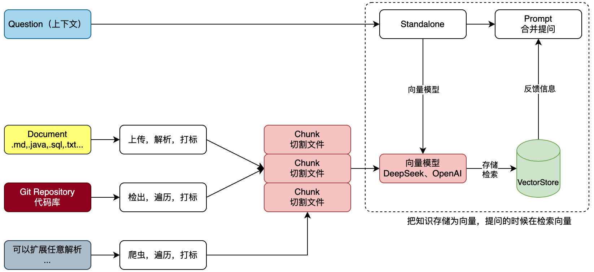

**RAG:检索增强生成**

它通用语言模型通过微调就可以完成几类常见任务，比如分析情绪和识别命名实体。这些任务不需要额外的背景知识就可以完成。

要完成更复杂和知识密集型的任务，可以基于语言模型构建一个系统，访问外部知识源来做到。这样的实现与事实更加一性，生成的答案更可靠，还有助于缓解“幻觉”问题。

Meta AI 的研究人员引入了一种叫做检索增强生成（Retrieval Augmented Generation，RAG）的方法来完成这类知识密集型的任务。RAG 把一个信息检索组件和文本生成模型结合在一起。RAG 可以微调，其内部知识的修改方式很高效，不需要对整个模型进行重新训练。

RAG 会接受输入并检索出一组相关/支撑的文档，并给出文档的来源（例如维基百科）。这些文档作为上下文和输入的原始提示词组合，送给文本生成器得到最终的输出。这样 RAG 更加适应事实会随时间变化的情况。这非常有用，因为 LLM 的参数化知识是静态的。RAG 让语言模型不用重新训练就能够获取最新的信息，基于检索生成产生可靠的输出。

对于一个Git项目或者一个工程的全部SQL，我们需要对工程信息发起提问，但不想每次都从工程或者SQL中做整理，那么就可以把这些信息提交给知识库。那么每次提问的时候选择对应的知识库，就可以帮我们携带文本向量匹配知识，之后进行一起提交给 AI 大模型来提问，如图：

首先，文本知识库可以是非常多种的类型，不非得限定到文字，也可以是sql或者java代码。那么这里我们就可以解析一类是上传的文件，一类是Git代码库的项目。也可以是来自于网页的内容之后爬虫。这些内容都可以被解析处理。

之后，把文件进行切割，存储到向量模型。存储的时候要对文件进行打标，标记出属于哪个知识库。甚至你可以做的更细致，比如，项目工程时，这是什么包下的什么类。都可以打标。完事后存储到向量库。这个也就是说所说的文本向量化。

最后，在进行提问的时候，以提交的问题和问题到向量库检索，一起合并信息进行提问，这样提问的信息描述会更加定向准确，也就可以获得更好的回答。如，我们问的是，请对拼团项目SQL语句，生产对应的所有JavaPO对象。那么这个时候就会反馈类信息了。也可以为运营伙伴提供必要的SQL语句请提供我要查询xxx、yyy、zzz数据，在什么时间产生的数据。，他们也就不用非得找研发要SQL语句了。这样就可以帮助企业提效了。

### Ollama DeepSeek 流式应答接口实现
引入 Spring AI 框架组件，对接 Ollama DeepSeek 提供服务接口。包括；普通应答接口和流式接口。

**注意** ：也许是因为配置版本问题，Application扫描不到其他的模块，因此引入了
```
@ComponentScan({
        "cn.bugstack.orbisz.ai.rag.api",      // 接口包
        "cn.bugstack.orbisz.ai.rag.app",      // 主模块包
        "cn.bugstack.orbisz.ai.rag.trigger"   // 依赖模块包
})
```
### Ollama DeepSeek 流式应答接口实现
引入 Spring AI 框架组件，对接 Ollama DeepSeek 提供服务接口。包括；普通应答接口和流式接口。

**注意** ：也许是因为配置版本问题，Application扫描不到其他的模块，因此引入了
```
@ComponentScan({
        "cn.bugstack.orbisz.ai.rag.api",      // 接口包
        "cn.bugstack.orbisz.ai.rag.app",      // 主模块包
        "cn.bugstack.orbisz.ai.rag.trigger"   // 依赖模块包
})
```

通过AI工具实现一款简单的UI界面与服务端 Ollama DeepSeek AI 进行对接。


### Ollama RAG 知识库上传、解析和验证
以 Spring AI 提供的向量模型处理框架，将上传文件以 TikaDocumentReader 方式进行解析，再通过 TokenTextSplitter 拆分文件。完成这些操作后，在遍历文档添加标记。标记的作用是为了可以区分不同的知识库内容。完成这些动作后，把这些拆解并打标的文件存储到 postgresql 向量库中。

本技术方案旨在利用 Spring AI 提供的向量模型处理框架，对上传的文件进行解析、拆分、标记，并将处理后的数据存储到 PostgreSQL 向量库中。通过这一流程，可以实现对文件内容的高效管理和检索，特别是在需要区分不同知识库内容的场景下。

### Ollama RAG 知识库接口服务实现
以上一节知识库的测试案例，将这部分功能以接口方式提供。包括；知识库的上传、选择和使用。

知识库的上传和使用是明确的，但选择哪个知识库是需要把对应的知识库记录起来。这里我们选择 Redis 列表进行记录。如果是公司里大型的知识库，还需要使用 MySQL 数据库进行存储。

基于我们要实现对话和知识的上传使用，使用AI工具完成UI页面的实现。

### Git仓库代码库解析到知识库
对知识库的解析进行扩展，增加Git仓库解析。用户填写Git仓库地址和账密，即可拉取代码并上传到知识库，之后就可以基于这套代码进行使用啦。

引入 JGit 操作库到工程中，用于执行 Git 命令拉取代码仓库。之后对代码库文件进行遍历，依次解析分割上传到向量库中。

### 
基于 Spring AI 扩展 OpenAI 模型对接，这样我们就可以使用一些代理的 ChatGPT 接口完成对话了。最终在完成全部接口与页面的对接。

Spring AI 框架的好处，就是可以以统一的方式直接配置使用各类大模型。像是一些 Spring AI 没有直接对接的大模型，可以基于 one-api 配置转发，用统一 OpenAI 方式进行对接。