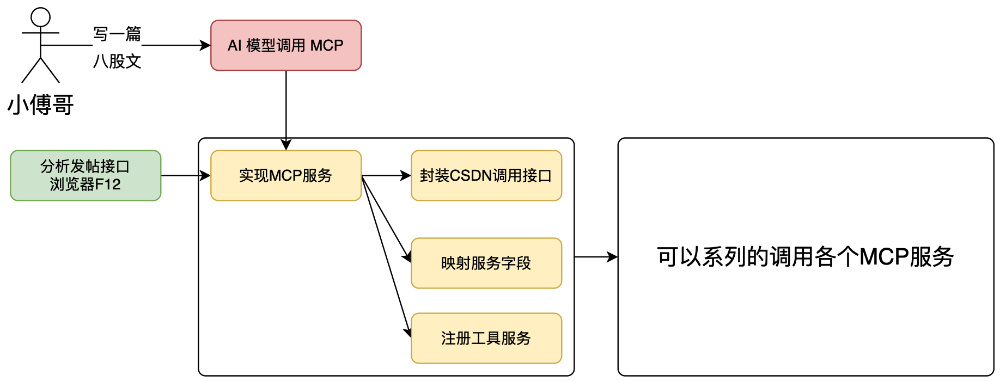
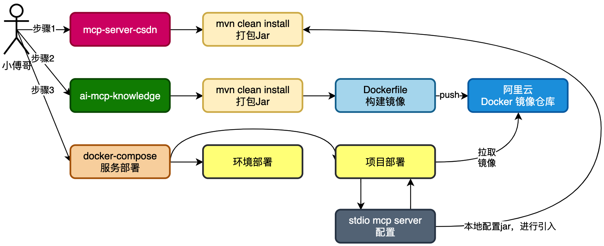
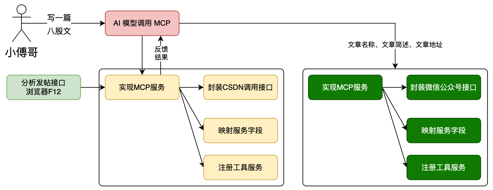
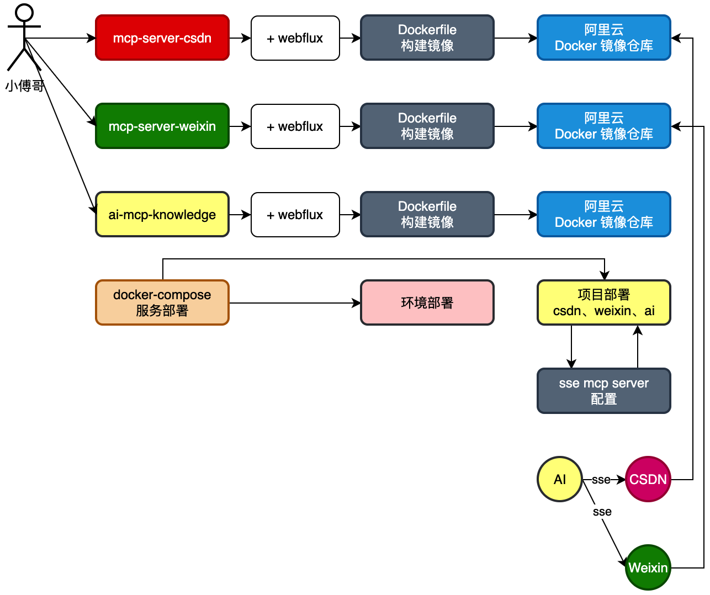

**RAG:检索增强生成**

RAG是一种结合了信息检索技术与语言生成模型的人工智能技术，从外部知识库中检索相关信息，并将其作为提示（Prompt）输入给大型语言模型，以增强模型处理知识密集型任务的能力。
RAG是一种 AI 框架，它将传统信息检索系统（例如数据库）的优势与生成式大语言模型 (LLM) 的功能结合在一起。是从知识库中检索到的问答对，增强了LLM的提示词（prompt），LLM拿着增强后的Prompt生成了问题答案。

LLM面临两个问题
- 知识截止：当 LLM 返回的信息与模型的训练数据相比过时时。每个基础模型都有知识截止（指LLM的“知识库”是有冻结时间的。模型的训练数据只更新到某个特定日期，此后的世界变化、新事件、新发现，模型都无从知晓）， 这意味着其知识仅限于训练时可用的数据。
- 当模型自信地做出错误反应时，就会发生幻觉。

基于通用语言模型通过微调就可以完成几类常见任务，比如分析情绪和识别命名实体。这些任务不需要额外的背景知识就可以完成。

要完成更复杂和知识密集型的任务，可以基于语言模型构建一个系统，访问外部知识源来做到。这样的实现与事实更加一致，生成的答案更可靠，还有助于缓解“幻觉”问题。

Meta AI 的研究人员引入了一种叫做检索增强生成（Retrieval Augmented Generation，RAG）的方法来完成这类知识密集型的任务。
RAG 把一个信息检索组件和文本生成模型结合在一起。RAG 可以微调，其内部知识的修改方式很高效，不需要对整个模型进行重新训练。

RAG 会接受输入并检索出一组相关/支撑的文档，并给出文档的来源（例如维基百科）。这些文档作为上下文和输入的原始提示词组合，送给文本生成器得到最终的输出。
这样 RAG 更加适应事实会随时间变化的情况。这非常有用，因为 LLM 的参数化知识是静态的。RAG 让语言模型不用重新训练就能够获取最新的信息，基于检索生成产生可靠的输出。

对于一个Git项目或者一个工程的全部SQL，我们需要对工程信息发起提问，但不想每次都从工程或者SQL中做整理，那么就可以把这些信息提交给知识库。
那么每次提问的时候选择对应的知识库，就可以帮我们携带文本向量匹配知识，之后进行一起提交给 AI 大模型来提问，如图：

文本知识库可以是非常多种的类型，不非得限定到文字，也可以是sql或者java代码。那么这里我们就可以解析一类是上传的文件，一类是Git代码库的项目。
也可以是来自网页的内容之后爬虫。这些内容都可以被解析处理。

把文件进行切割，存储到向量模型。存储的时候要对文件进行打标，标记出属于哪个知识库。甚至你可以做的更细致，比如，项目工程时，这是什么包下的什么类。都可以打标。
完事后存储到向量库。这个也就是说所说的文本向量化。

最后，在进行提问的时候，以提交的问题和问题到向量库检索，一起合并信息进行提问，这样提问的信息描述会更加定向准确，也就可以获得更好的回答。
如，我们问的是，请对大营销项目SQL语句，生产对应的所有JavaPO对象。那么这个时候就会反馈类信息了。也可以为运营伙伴提供必要的SQL语句请提供我要查询xxx、yyy、zzz数据，在什么时间产生的数据，他们也就不用非得找研发要SQL语句了。这样就可以帮助企业提效了。

## 第一阶段
### Ollama DeepSeek 流式应答接口实现
引入 Spring AI 框架组件，对接 Ollama DeepSeek 提供服务接口。包括；普通应答接口和流式接口。

```
# 拉取模型，推荐小一点，够做开发就可以
ollama pull deepseek-r1:1.5b

# （可选）运行模型，运行后关闭，继续安装模型。Ctrl/Command + D
ollama run deepseek-r1:1.5b

# 向量文本
ollama pull nomic-embed-text
```
nomic-embed-text：是一款由 Nomic AI 开发的开源文本嵌入模型，专门用于将文本转化为向量（数值数组）。
它擅长捕捉文本的语义信息，生成的向量可用于语义搜索、文本聚类、相似性比对等场景,可以在RAG应用中作为向量数据库的嵌入工具。

**注意** ：也许是因为配置版本问题，Application扫描不到其他的模块，因此引入了
```
@ComponentScan({
        "cn.bugstack.orbisz.ai.rag.api",      // 接口包
        "cn.bugstack.orbisz.ai.rag.app",      // 主模块包
        "cn.bugstack.orbisz.ai.rag.trigger"   // 依赖模块包
})
```
**已解决**，是因为Application的位置不对，没有放在cn.bugstack.orbisz.ai，所以扫描不到其他的包

### Ollama DeepSeek 流式应答接口实现
引入 Spring AI 框架组件，对接 Ollama DeepSeek 提供服务接口。包括；普通应答接口和流式接口。

- 在 IAiAgentChatService 接口中定义了 aiAgentChatStream 方法.
- AiAgentChatService 类作为实现类，具体实现了流式对话逻辑
```
@Override
public Flux<ChatResponse> aiAgentChatStream(Long aiAgentId, Long ragId, String message) {
    // 查询模型ID
    Long modelId = repository.queryAiClientModelIdByAgentId(aiAgentId);
    // 获取对话模型
    ChatModel chatModel = defaultArmoryStrategyFactory.chatModel(modelId);
    // 构建消息列表
    List<Message> messages = new ArrayList<>();
    
    // 处理RAG增强逻辑
    if (null != ragId && 0 != ragId) {
        // 省略RAG相关代码...
    } else {
        messages.add(new UserMessage(message));
    }
    
    // 关键：调用模型的stream方法获取Flux流
    return chatModel.stream(Prompt.builder()
            .messages(messages)
            .build());
}
```
**Controller接口暴露**
```
@RequestMapping(value = "chat_stream", method = RequestMethod.GET)
@Override
public Flux<ChatResponse> chatStream(@RequestParam("aiAgentId") Long aiAgentId, 
                                    @RequestParam("ragId") Long ragId, 
                                    @RequestParam("message") String message) {
    try {
        log.info("AiAgent 智能体对话(stream)，请求 {} {} {}", aiAgentId, ragId, message);
        return aiAgentChatService.aiAgentChatStream(aiAgentId, ragId, message);
    } catch (Exception e) {
        log.error("AiAgent 智能体对话(stream)，失败 {} {} {}", aiAgentId, ragId, message, e);
        throw e;
    }
}
```

通过AI工具实现一款简单的UI界面与服务端 Ollama DeepSeek AI 进行对接。
- 前端通过 EventSource 建立 SSE (Server-Sent Events) 连接接收流式响应，实现在 js/index.js 中的 startEventStream 函数。

**Flux的优势**
1. 实时响应体验 ：用户可以立即看到生成的内容，而不需要等待整个响应完成
2. 更好的用户体验 ：减少用户感知的等待时间，提高交互流畅度
3. 渐进式内容展示 ：内容可以逐字逐句显示，模拟人类思考和打字的过程
4. 资源优化 ：服务端和客户端可以边生成边传输，避免一次性处理大量数据
5. 更快的首字时间(TTFB) ：用户能更快看到第一个响应内容，减少感知延迟

**流式响应出错的恢复方式**
1. Controller层异常处理 ：在 AiAgentController 的 chatStream 方法中，捕获异常并记录日志后重新抛出
2. 客户端错误处理 ：在测试代码 AiAgentTest.java 中，通过 stream.subscribe() 的错误处理器 Throwable::printStackTrace 处理流错误
3. 缺少专门恢复机制 ：项目中没有实现针对流式响应的专门恢复机制，如断点续传、自动重试等高级策略

**流式数据的延迟处理**
1. 线程调度优化 ：在 RagAnswerAdvisor.java 中，使用 publishOn(Schedulers.boundedElastic()) 来处理可能的阻塞操作，避免阻塞响应线程
2. 超时配置 ：在测试代码中配置了 requestTimeout(Duration.ofMinutes(180)) 长时间超时，以适应大模型可能的长处理时间
3. 缺少高级延迟处理 ：项目中没有实现基于背压(backpressure)的流量控制、自适应延迟处理等高级机制

### Ollama RAG 知识库上传、解析和验证
以 Spring AI 提供的向量模型处理框架，将上传文件以 TikaDocumentReader 方式进行解析，再通过 TokenTextSplitter 拆分文件。完成这些操作后，在遍历文档添加标记。标记的作用是为了可以区分不同的知识库内容。完成这些动作后，把这些拆解并打标的文件存储到 postgresql 向量库中。

本技术方案旨在利用 Spring AI 提供的向量模型处理框架，对上传的文件进行解析、拆分、标记，并将处理后的数据存储到 PostgreSQL 向量库中。通过这一流程，可以实现对文件内容的高效管理和检索，特别是在需要区分不同知识库内容的场景下。

- SpringAI : 提供向量模型处理框架，支持文件的解析、拆分和向量化操作。
- TikaDocumentReader : 用于解析上传的文件，支持多种文件格式（如 MD、TXT、SQL 等）。
- TokenTextSplitter : 用于将解析后的文本内容拆分为更小的片段，便于后续处理和存储。
- PostgreSQL向量库 : 用于存储处理后的文本向量数据，支持高效的相似性搜索和检索。

**RAG 知识库索引构建流程**
1. 文档读取 ：使用 TikaDocumentReader 读取各种格式的文件（如文本、PDF、Word等）
```
TikaDocumentReader documentReader = new TikaDocumentReader(file.getResource());
List<Document> documentList = documentReader.get();
```
2. 文档分割 ：通过 TokenTextSplitter 将长文档分割成适当大小的文本块，确保每个块能够被嵌入模型有效处理
```
List<Document> documentSplitterList = tokenTextSplitter.apply(documentList);
```
3. 添加元数据 ：为每个文档块添加知识库标签等元数据信息
```
documentSplitterList.forEach(doc -> doc.getMetadata().put("knowledge", tag));
```
4. 向量化与存储 ：调用 PgVectorStore 的 accept 方法，将文本块转换为向量并存储到 PostgreSQL 数据库
```
vectorStore.accept(documentSplitterList);
```
5. 配置记录 ：将知识库配置信息（名称、标签等）存储到 MySQL 数据库中，用于管理和查询
```
AiRagOrderVO aiRagOrderVO = new AiRagOrderVO();
aiRagOrderVO.setRagName(name);
aiRagOrderVO.setKnowledgeTag(tag);
repository.createTagOrder(aiRagOrderVO);
```

**技术实现细节**
- 向量存储配置 ：在 `AiAgentConfig.java` 中，项目为 PgVector 配置了专用的数据源和 JdbcTemplate
- 向量模型 ：使用 OpenAI 的嵌入模型将文本转换为向量，进行文本向量化处理。
```
OpenAiEmbeddingModel embeddingModel = new OpenAiEmbeddingModel(openAiApi);
return PgVectorStore.builder(jdbcTemplate, embeddingModel)
        .vectorTableName("vector_store_openai")
        .build();
```
- 数据表结构 ：通过初始化脚本创建了专用的向量存储表，包含内容、元数据和向量字段
```
CREATE TABLE public.vector_store_openai (
    id UUID PRIMARY KEY DEFAULT gen_random_uuid(),
    content TEXT NOT NULL,
    metadata JSONB,
    embedding VECTOR(1536)
);
```

TokenTextSplitter 是基于 token 数量进行文本切分，并不能按照段落换行对文本进行切分。自定义了文本切分器CustomTextSplitter
```
public class CustomTextSplitter extends TextSplitter {

    private final String paragraphSeparator;

    public CustomTextSplitter(String paragraphSeparator) {
        this.paragraphSeparator = paragraphSeparator;
    }

    @Override
    protected List<String> splitText(String text) {
        if (text == null || text.isEmpty()) {
            return new ArrayList<>();
        }
        //将输入的文本（text）按行分割（默认换行符 \n），并过滤掉空行，返回非空行的列表。
        return Arrays.stream(text.split("\\n"))
                .filter(line -> !line.trim().isEmpty())
                .toList();
    }

    @Override
    public List<Document> apply(List<Document> documents) {
        List<Document> result = new ArrayList<>();
        for (Document doc : documents) {
            //按自定义分隔符（paragraphSeparator）分割为段落
            String[] paragraphs = doc.getContent().split(paragraphSeparator);
            for (String paragraph : paragraphs) {
                Document newDoc = new Document(paragraph.trim());
                result.add(newDoc);
            }
        }
        return result;
    }
}
```


### Ollama RAG 知识库接口服务实现
以上一节知识库的测试案例，将这部分功能以接口方式提供。包括；知识库的上传、选择和使用。

知识库的上传和使用是明确的，但选择哪个知识库是需要把对应的知识库记录起来。这里我们选择 Redis 列表进行记录。如果是公司里大型的知识库，还需要使用 MySQL 数据库进行存储。

基于我们要实现对话和知识的上传使用，使用AI工具完成UI页面的实现。

所有已创建的知识库标签存储在Redis中。

```
documents.forEach(doc -> doc.getMetadata().put("knowledge", ragTag));  // 原始文档添加标签
documentSplitterList.forEach(doc -> doc.getMetadata().put("knowledge", ragTag));  // 分割后的文档添加标签
```
确保原始文档和分割后的文本块都能被正确关联到同一知识库标签

### Git仓库代码库解析到知识库
对知识库的解析进行扩展，增加Git仓库解析。用户填写Git仓库地址和账密，即可拉取代码并上传到知识库，之后就可以基于这套代码进行使用啦。

引入 JGit 操作库到工程中，用于执行 Git 命令拉取代码仓库。之后对代码库文件进行遍历，依次解析分割上传到向量库中。

### 扩展OpenAI模型对接，以及完整AI对接
基于 Spring AI 扩展 OpenAI 模型对接，这样我们就可以使用一些代理的 ChatGPT 接口完成对话了。最终在完成全部接口与页面的对接。

Spring AI 框架的好处，就是可以以统一的方式直接配置使用各类大模型。像是一些 Spring AI 没有直接对接的大模型，可以基于 one-api 配置转发，用统一 OpenAI 方式进行对接。

- 统一的对话记忆组件 ：使用 PromptChatMemoryAdvisor 配合 MessageWindowChatMemory 实现对话历史存储和管理
- 全局对话ID标识 ：通过 CHAT_MEMORY_CONVERSATION_ID_KEY 参数（如 chatId-101 ）统一标识对话会话
- 记忆容量配置 ：在数据库 ai_client_advisor 表中配置了 ChatMemory 类型的顾问， maxMessages 设置为200，控制记忆窗口大小
```
// 记忆组件创建
return new PromptChatMemoryAdvisor(MessageWindowChatMemory.builder()
        .maxMessages(chatMemory.getMaxMessages())
        .build());

// 对话调用时指定统一对话ID
content = chatClient.prompt(message)
        .advisors(a -> a
                .param(CHAT_MEMORY_CONVERSATION_ID_KEY, "chatId-101")
                .param(CHAT_MEMORY_RETRIEVE_SIZE_KEY, 100))
        .call().content();
```

**问题1：如何保证多轮对话的上下文连贯性（如用户追问时如何传递历史对话）？**
1. 前端采用localStorage实现对话历史的本地存储和管理：
   - 对话唯一标识 ：每个对话都有唯一的 chatId （基于时间戳生成）
   - 对话数据结构 ：每个对话包含 name 和 messages 数组， messages 数组存储用户和AI的交互消息
   - 当前对话追踪 ：通过 currentChatId 变量和localStorage中的同名key追踪当前活动对话
   - 消息存储 ：发送新消息时，先将用户消息保存到localStorage，收到AI回复后再保存回复内容
2. 后端通过Spring AI框架提供的对话记忆组件实现上下文管理：
   - 对话记忆组件 ：使用 PromptChatMemoryAdvisor 配合 MessageWindowChatMemory 组件管理对话历史
   - 对话ID统一标识 ：通过 CHAT_MEMORY_CONVERSATION_ID_KEY 参数（当前硬编码为 chatId-101 ）标识对话会话
   - 记忆窗口大小 ：通过 maxMessages 参数（默认配置为200）控制对话记忆的最大消息数量
   - 历史消息检索量 ：通过 CHAT_MEMORY_RETRIEVE_SIZE_KEY 参数控制每次请求时检索的历史消息数量

## 第二阶段
升级 Spring AI 框架到 1.0.0-M6 版本，以适应于二阶段 MCP（Model Context Protocol 模型上下文协议）服务开发。

DeepSeek 的模型对应的向量维度为 768；OpenAI 的模型对应的向量维度为 1536；
### 康庄大道，上手 AI MCP 工作流
对接 Spring AI MCP，实现服务端 MCP 和 客户端 MCP，完成功能对接，体验 AI 工作流完成的指令动作。
目前对接的这套 mcp 服务是文件处理的服务，它可以读取、设置、操作你的文件。也就是 AI 对话的过程中，可以操作你的文件信息。

基础AI（如ChatGPT）仅能生成文本回复（“说”），而 MCP 赋予AI调用工具的能力（“做”），例如操作文件、查询系统信息等。（严格来说，MCP 是 工具的管理和通信框架，而具体的工具（如 `filesystem`、`mcp-server-computer`）才是能力的提供者）

mcp的配置需要在application.yml等配置文件中配好，指定好引入哪些mcp服务，如下：
```
{    "mcpServers": {  
    "filesystem": {  
        "command": "cmd",  
        "args": [  
            "/c",  
            "npx",  
            "-y",  
            "@modelcontextprotocol/server-filesystem",  
            "D:\\OneDrive\\桌面",  
            "D:\\OneDrive\\桌面"  
        ]  
    },  
    "mcp-server-computer": {  
        "command": "C:\Users\zhangxiuyu\.jdks\corretto-17.0.12\bin\java.exe",  
        "args": [  
            "-Dspring.ai.mcp.server.stdio=true",  
            "-jar",  
            "D:\\code\\idea\\xfg\\mcp-server-computer\\target\\mcp-server-computer-1.0.0.jar"  
        ]  
    }  
}  }
```
这里引入了两个mcp服务，上面的是别人实现好的包，提供系统文件操作功能；下面是我们自己用java实现的工具包，提供获取电脑配置功能
不管用什么语言编写，只要服务遵循了MCP的通信协议（如 Stdio），就能被其他项目作为mcp服务引入

具体到我们实现的项目中，因为注册了
```java
@Bean  
public ToolCallbackProvider computerTools(ComputerService computerService) {  
    return MethodToolCallbackProvider.builder().toolObjects(computerService).build();  
}

```
这个bean，就遵循了Spring AI 的 IPC 通信协议。在项目应用中配置好以后，就能通过
```java
@Autowired  
private ToolCallbackProvider tools;
```
注入。

这里是一个门面模式，项目所有配置的mcp服务都能被引入这一个tools中来
然后在调api的过程中通过spring ai提供的mcp框架（如下）就能实现mcp加持的ai功能
```java
var chatClient = chatClientBuilder  
        .defaultTools(tools)  
        .defaultOptions(OllamaOptions.builder()  
                .model("gpt-4.1-mini")  
                .build())  
        .build();
System.out.println("\n>>> ASSISTANT: " + chatClient.prompt(userInput).call().content());
```
总之，如果我们想开发mcp服务，只需实现好想实现的功能后，配置好mcp通信即可（例如java是ToolCallbackProvider的bean）
如果我们想应用mcp服务到自己的项目，只需在配置里引入，然后注入到ToolCallbackProvider，利用spring ai提供的框架，调用api即可

### 道山学海，实现MCP自动发帖服务（stdio）
分析 CSDN 文章发表接口，以 MCP 服务搭建的方式，实现一款 stdio 模式的 CSDN 发帖 MCP 服务。（后续开发 sse 模式）

如图，实现 CSDN 发帖 MCP 服务流程:

- 首先，无论你是对接任何的平台，都是需要先获得他的接口服务。这种接口一种是平台提供了专门的对接接口，另外就是没有这样的接口，我们是通过浏览器访问网站，获得的接口。哪这些接口通过代码方式完成请求。
- 之后，基于得到的接口，封装成可以调用的服务 service，这样 MCP 的入口工具，设定好入参信息，就可以调用底层的接口服务了。
- 最后，当用户提问时，如果你实现了不止一个 CSDN 发帖的 MCP，也包括如星球发帖。那么你的 AI 工作流，是可以顺序的向这些平台自动发帖。

### 海纳百川，上线MCP自动发帖服务
以 Jar 包的形式，打包 MCP 自动发帖服务，并以 stdio 方式引入到项目工程。再通过定时任务触达定时自动发帖。

- 首先，将 mcp-server-csdn 以 maven 命令方式打一个 jar。IntelliJ IDEA 也可以直接通过界面操作打包 Jar（视频里会演示）
- 之后，将 ai-mcp-knowledge 以 maven 命令方式打一个 jar，并执行 Dockerfile 构建出可部署的镜像。注意，这里额外增加一个阿里云 Docker 镜像仓库，为的是让他提供搭理，方便我们云服务器部署的时候，可以快速拉取下来镜像。此外，如果说你以云服务器当做本机一样使用，在云服务器配置好 maven、git、java jdk 17，那么就可以在云服务器直接构建镜像，也就不需要额外拉取了。（这部分内容在课程入口-编程环境-云服务器操作中有讲解）
- 最后，通过 docker-compose 脚本配置上线部署。

先增加一个 trigger 模块，在这个模块下添加 job 任务。定时的调用 ai mcp 服务，完成文章的编写和推送。

### 川流不息，实现MCP微信公众号消息通知
AI MCP 是可以让 AI 以工作流方式进行调用的，为了更好的体现这一点，同时也为了增强整体的自动发帖服务链路。本节我们实现一个微信公众号推送消息的 MCP 服务。

这一节暂时会先以 stdio 方式开发，之后下一节部署的时候，会把 CSDN、WeiXin 两个 MCP 服务都以 SSE 方式进行部署。

- 实现一个微信公众号推送模板消息的实现。
- 之后，AI 调用两套 MCP，可以一次会话，也可以使用 ChatMemory 进行记忆完成2次对话处理 MCP 流程。
- 最终，实现自动发帖后，完成消息通知给我们自己。点击通知信息可进入具体文章。

在发帖服务 port.writeArticle(request); 返回对接 ArticleFunctionResponse 增加文章信息，包括；url、description。这样我们在通知给微信公众号模板消息的时候，就能知道文章的地址了。

之后，CSDNPort#writeArticle 返回的 articleFunctionResponse 封装下文章信息即可。

MCP本质就是对接接口，并以AI识别的方式进行调用

### 息息相通，MCP 服务部署上线（sse 模式）
调整 mcp-server-csdn、mcp-server-weixin，两个 MCP 部署方式为 SSE 以及增加 Dockerfile 部署脚本。让服务支持以 sse 方式，被 ai-mcp-knowledge 调用。

- SSE (Server-Sent Events) ，是一种基于 HTTP 的服务器向客户端单向实时推送数据 的通信技术，常用于实现实时更新功能。浏览器通过 EventSource 对象向服务器发起一个 长连接，服务器可以不断地向客户端推送文本数据（通常是 UTF-8 编码的 JSON 或纯文本），而不需要客户端轮询。，属于应用层技术。
    - 简单易用： 直接基于 HTTP 协议，不需要像 WebSocket 那样进行复杂的协议升级； 前端直接 new EventSource(url) 就能接收数据。
    - 轻量低成本： 复用现有 HTTP 基础设施（Nginx/负载均衡/防火墙）即可； 消息格式简单，使用纯文本传输。    
    - 自动重连： 浏览器原生支持断线自动重连（不需要额外逻辑）。 
    - 单向推送场景足够： 适合 服务端 → 客户端 的实时通知、日志流、任务进度推送等场景。 
    - 比轮询更高效： 避免频繁轮询，降低服务器负载和带宽消耗。
- 在 Spring AI 框架中，SSE 的实现方式包括 spring-ai-starter-mcp-server-webmvc、spring-ai-starter-mcp-server-webflux 两种框架实现。课程以 webflux 进行使用。
- SSE 的部署方式，要把每个 mcp 服务，通过 docker 进行部署，提供出可用的接口。之后 ai-mcp-knowledge 工程则配置 sse 方式进行使用。

ai-mcp-knowledge项目既是MCP客户端（Client），又是MCP服务端（Server）
- 被其他 MCP Client 调用（作为 Server）； 
- 同时去调用其他 MCP Server（作为 Client）； 
- 用于串联多个 Agent，执行链式任务。

mcp-server-csdn项目是一个纯MCPServer项目
- 提供基于 WebFlux 的 HTTP + SSE 服务端口； 
- 通常作为被调用方存在（被 ai-mcp-knowledge 项目远程调用）； 
- 通过配置 spring.ai.mcp.server.stdio=true 也可以兼容本地 STDIO 模式（非必须）。

**问题1：为什么MCPServer有三种传输模式？**

MCP Server 是「工具能力的提供方 」，它的核心作用是： 等待 MCP Client 发来请求，并根据注册的工具逻辑，执行任务并返回结果。
所以Server必须提供不同的传输协议支持，来应对部署环境的差异。

**问题2：为什么 MCP Client 只有“标准客户端”和“WebFlux客户端”两种**
MCP Client 的核心职责是发起工具调用请求并接收服务器响应，其通信模式更聚焦于 “如何高效对接 Server 的传输模式”，而非支持多样化接入。因此设计更精简。
强调“标准客户端支持STDIO和SSE”是为了强调
- 如果你希望调用“本地 MCP Server 工具”，可使用 STDIO 通信；
- 如果你希望远程调用 MCP Server（通常是 WebMVC/WebFlux 实现），使用 SSE；
- 同一个Client可以组合连接多个Server（STDIO本地工具+远程HTTP工具） 。

**问题3：为什么建议“生产使用WebFluxSSE”客户端？**
- WebFlux 是响应式、非阻塞的，适合处理多个并发的流式回复（如 LLM token 输出）；
- 对于 AI 场景来说，SSE 的 token streaming 是典型需求；
- WebFlux Client 更适合部署到 API Gateway、任务编排系统、Bot 平台等。

决定同步 vs 异步方式的根本：你注入哪个 MCP Client 接口，即通过你注入的是 McpClient 还是 ReactiveMcpClient 决定的；

鉴权机制（Authentication & Authorization Mechanism）是信息安全领域的核心组件，主要用于验证用户/系统的身份合法性（鉴权，Authentication），并控制其访问资源的权限范围（授权，Authorization）。
简单来说，它回答两个关键问题：
- “你是谁？”（鉴权：确认身份真实性）
- “你能做什么？”（授权：确认可访问的资源与操作）
基于CSDN用户的cookies验证身份