**扩展**
日志分析智能体利用NLP能力从海量日志中提取关键错误信息。
监控智能体可以实现对告警问题进行聚类、降噪和关联，将上千条告警收敛成几个核心的“故障事件”，并直接指出根源。
整个智能体可以主动推送结构化的分析报告，推送给所有人。并将告警记录、执行预案、处理经验沉淀到知识库中。

将工作流全程透明化防止流程黑盒难以调试，每个智能体的输入、输出及决策依据均被显式记录和输出，确保分析过程可追溯、可解释。然后通过统一输出模板和语义规范，实现诊断结论的标准化

https://mp.weixin.qq.com/s/AYenvVpB-oHWabJFbkUpmg?scene=1&click_id=3


## AI Agent
AI 智能体是使用 AI 来实现目标并代表用户完成任务的软件系统。其表现出了推理、规划和记忆能力，并且具有一定的自主性，能够自主学习、适应和做出决定。

这些功能在很大程度上得益于生成式 AI 和 AI 基础模型的多模态功能。AI 智能体可以同时处理文本、语音、视频、音频、代码等多模态信息；可以进行对话、推理、学习和决策。
它们可以随着时间的推移不断学习，并简化事务和业务流程。智能体可以与其他智能体协作，来协调和执行更复杂的工作流。

| Agent类型       | 描述                                                   | 示例                                                                        |
|---------------|------------------------------------------------------|---------------------------------------------------------------------------|
| 简单反射Agents    | 根据预定义的规则执行即时操作。                                      | 旅行 Agent 解释电子邮件的上下文并将旅行投诉转发给客户服务。                                         |
| 基于模型的反射Agents | 根据世界模型和该模型的更改执行操作。                                   | 旅行 Agent 根据对历史定价数据的访问，优先考虑价格发生重大变化的路线。                                    |
| 基于目标的Agents   | 通过解释目标并确定实现目标的行动来制定实现特定目标的计划。                        | 旅行 Agent 通过确定从当前位置到目的地的必要旅行安排（汽车、公共交通、航班）来预订旅程。                           |
| 基于效用的Agents   | 考虑偏好并以数字方式权衡取舍，以确定如何实现目标。                            | 旅行 Agent 在预订旅行时权衡便利性与成本，从而最大化效用。                                          |
| 学习Agents      | 通过响应反馈并相应地调整行动来不断改进。                                 | 旅行 Agent 通过使用旅行后调查中的客户反馈来改进未来的预订。                                         |
| 分层Agents      | 在分层系统中具有多个 Agents，高级 Agents 将任务分解为子任务，供低级 Agents 完成。 | 旅行 Agent 通过将任务划分为子任务（例如，取消特定预订）并让低级 Agents 完成这些子任务，然后向高级 Agent 报告，从而取消行程。 |
| 多Agent系统(MAS) | Agents 独立完成任务，可以是合作的，也可以是竞争的。                        | 合作：多个 Agents 预订特定的旅行服务，如酒店、航班和娱乐。竞争：多个 Agents 管理并竞争共享的酒店预订日历，以便为客户预订酒店。   |


|    | AI智能体                  | AI助理                              | 聊天机器人               |
|----|------------------------|-----------------------------------|---------------------|
| 用途 | 自主、主动地执行任务             | 协助用户执行任务                          | 自动执行简单任务或对话         |
| 功能 | 可执行复杂多步骤操作；学习和适应；独立做决策 | 响应请求/提示，提供信息并完成简单任务；可推荐操作，但决策由用户做 | 遵循预定义规则；有限学习能力；基本互动 |
| 交互 | 主动；以目标为导向              | 被动；响应用户请求                         | 被动；响应触发器或命令         |

### 系统设计
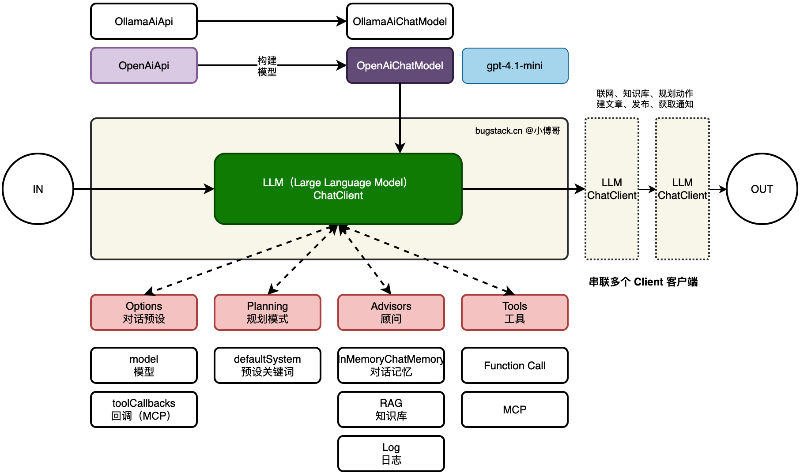
以通过数据库表动态配置的手段，完成相关物料的加载，包括；模型（gpt-4.1/deepseek）、客户端、对话预设、执行规划（Planning）、顾问（记忆、RAG、日志）、工具（MCP）等，在把单个 Client 串联，完成整个 Agent 调用链。这样一个 Agent 调用链可以以对话形式使用或通过 Agent 动态任务自动执行。
- 以 ChatClient 为中心，设置；Ai模型、对话预热、规划模式、顾问、工具，完成 LLM ChatClient 构建。这些注入的元素属性，驱动着 Agent 功能的实现。
- 会话时，从输入端到输出端，可以顺序执行多个 ChatClient。通过这样的方式，让不同配置的 ChatClient 发挥自身作用，驱动最终目标的完成。
- 对话预设；这个节点在 ChatModel 中添加，可以设置对话的 AI 模型，也可以设置 MCP。ChatModel 可以支持流式对话。还可以把 ChatModel 注入到 ChatClient 中使用。
- 规划模式；为预设的关键词，让一个步骤流程知道以哪些关键信息进行运行。
- 顾问角色；在 Spring AI 中提供了一种更加优雅的访问外部元素信息的方式，顾问访问。通过顾问功能，增强对话。包括；上下文记忆、知识库、日志等。
- 工具加载；这里我们主要使用 MCP，也是目前市面最为流行的方式。本项目中用到的 MCP 就包括 AI 课程中第2阶段实现的 MCP 服务。

**功能流程**
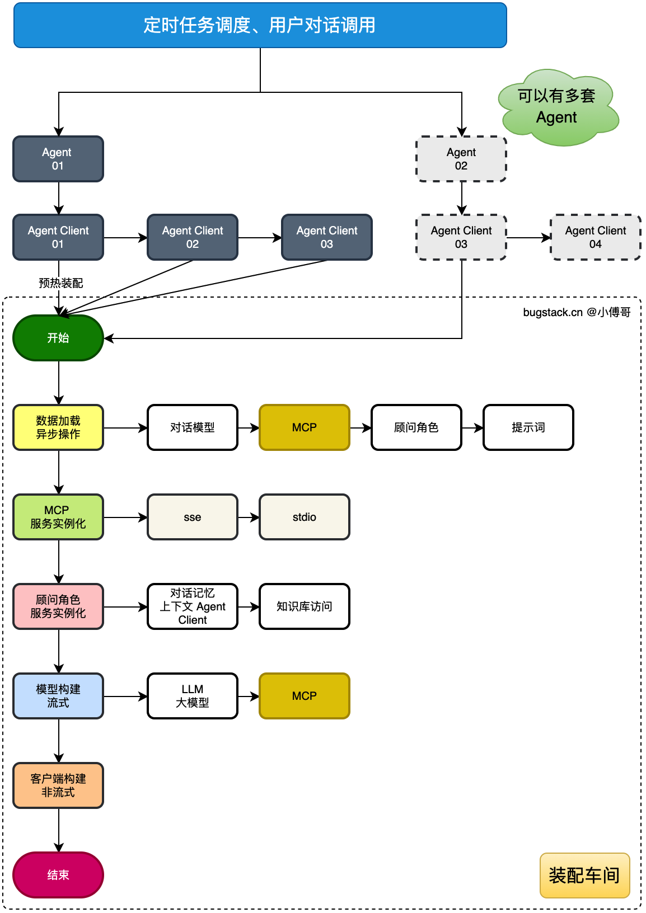
**库表设计**
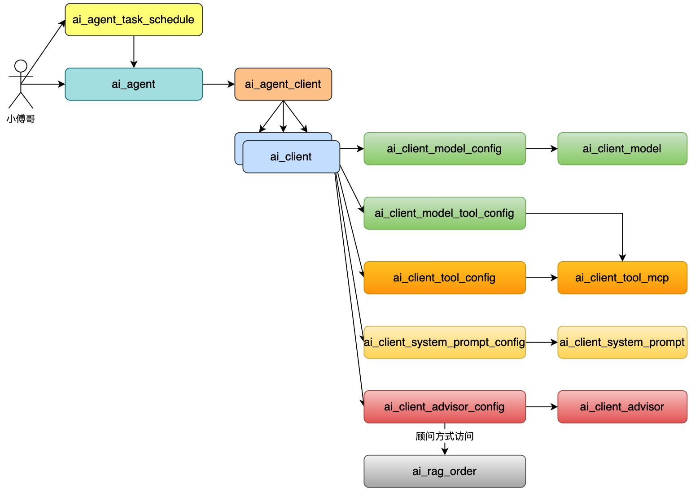
- ai_agent_task_schedule，智能体任务调度配置表
- ai_agent，AI智能体配置表
- ai_agent_client，智能体-客户端关联表
- ai_client，AI客户端配置表
- 模型配置组；ai_client_model、ai_client_model_config、ai_client_model_tool_config
- 工具配置组；ai_client_tool_config、ai_client_tool_mcp
- 顾问配置组；ai_client_advisor、ai_client_advisor_config
- 提示词配置；ai_client_system_prompt、ai_client_system_prompt_config
- 知识库配置；ai_rag_order

多数据源设计优势
1. 数据隔离性： 业务数据和向量数据完全分离，互不影响，提升系统稳定性
2. 性能优化： 针对不同数据类型和访问模式优化连接池参数
3. 技术栈适配： MySQL使用MyBatis ORM，PgVector使用JdbcTemplate，各取所长
4. 扩展性强： 可以轻松添加更多类型的数据源，如Redis、MongoDB等
5. 配置灵活： 支持外部配置文件，便于不同环境的参数调整
6. 故障隔离： 一个数据源的问题不会影响另一个数据源的正常使用

### 根据 Ai Agent 案例，设计库表
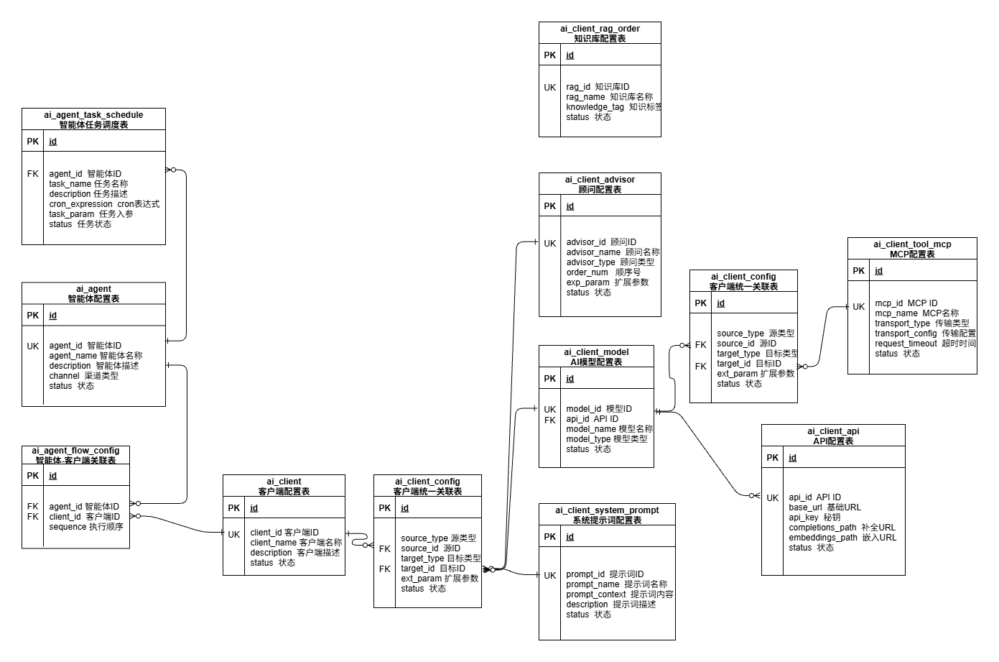
如图，为对应的Ai Agent 案例代码，映射出要拆分的库表设计；
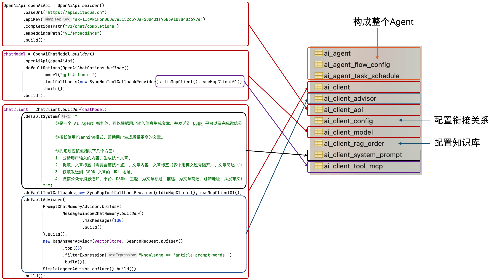
首先，整个代码构建的整个 Ai Agent 最小化单元服务，我们可以根据这样的服务信息设计出库表结构。
- 第一步，从上到下，OpenAiApi 是最基础单元结构，可以被多个 OpenAiChatModel 使用，它可以被拆分出第一张表。
- 第二步，构建 OpenAiChatModel，这个阶段，需要 openAiApi、model对话模型、tool mcp 工具。其中model对话模型时一种固定固定资源，可以直接放到 ai_client_model 模型中，而 openAiApi、mcp 工具，都属于复杂配置，则需要额外的外部关联来衔接。也就是后面的 ai_client_config 配置，用于配置衔接关系。
- 第三步，ChatClient 对话客户端，这部分的实例化过程都是和外部其他的资源关联，本身表设计只要有一个客户端的唯一id和客户端的描述介绍即可。
- 第四步，给 mcp 增加一个表，mcp 服务是非常重要的，有 mcp 才有 agent 服务。mcp 的启动有 stido、sse 两种方式，每种方式都有对应的配置文件 json 数据。
- 第五步，defaultSystem 系统提示词，需要单独拆分出来。提示词等于智能体的大脑，也有人说，其实 Ai Agent 就是 prompt 的堆叠，所以写提示词是很重要的。
- 第六步，advisor 顾问角色，在 Spring Ai 框架中，以顾问的方式，访问记忆上下文，知识库资源，所以这部分也要单独设计库表。
- 第七步，设计一个 ai_client_config，用于配置；api、model、client、prompt、mcp、advisor的衔接关系。
- 第八步，设计 ai_agent、ai_agent_flow_config，也就是一个 ai agent，是可以连续调用多个 ai client 客户端的。
- 第九步，设计 ai_agent_stask_schedule 任务，这是一种触达手段，可以把配置好的任务，让 task 定时执行，如自动发帖、系统异常巡检、舆情风险检测、系统配置变更、运营活动报表等。
- 第十步，ai_client_rag_order，是知识库表，用于上传知识库做一个记录，这样顾问角色就可以访问知识库内容了。

注意；chat_client 客户端的初始化过程中，也可以增加 mcp 服务，这部分在 chat_model 模型构建中，也可以增加 mcp，选择在 chat_model 增加即可。

### 多数据源和Mapper配置
为应用程序配置pgvector（向量库）、mysql（业务库）两套数据源，同时基于库表，编写基础设施层 Mapper 操作。
对于数据库表的 Mapper 编写，是一种固定的结构化代码，可以通过 MyBatis 工具生成，也可以使用 AI 编码工具处理。不过对于新人学习来说，更建议在这个阶段，通过手动的方式进行配置编写，这样可以更熟悉库表的设计和字段的理解。尤其是报错后，还可以基于报错排查错误增加编程经验。
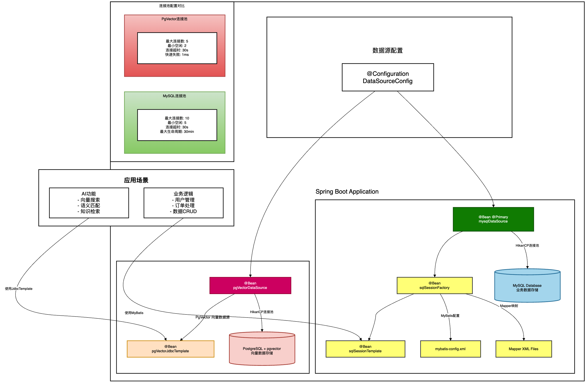
- 首先，为了让应用程序具备多数据源链接，则需要增加一个扩展的 DataSourceConfig 配置类，来自己实现数据源的加载。这部分会替代原本配置到 yml 文件中，由 Spring 加载数据源的过程。
- 之后，根据不同类型的数据源，注入到 AI 向量库使用场景和 MyBatis 业务使用场景中。

引入hikari连接池的池化技术，可以一次性初始化多个连接，谁使用就拿去，用完放回来，可以提高数据库的吞吐量。不需要每次都建立新连接。

### 数据加载模型设计
在关于 Ai Agent 的功能实现中，有一个非常重要处理步骤，就是要想办法动态的实例化来自于用户配置的API、对话模型、MCP、顾问角色以及提示词等。
还要思考怎么让程序来加载和实例化 Ai Agent 所需的各项组件。如，客户端的实例化、对话模型的实例化等。
通过责任链和规则树实现（集成到了通用组件项目中）。
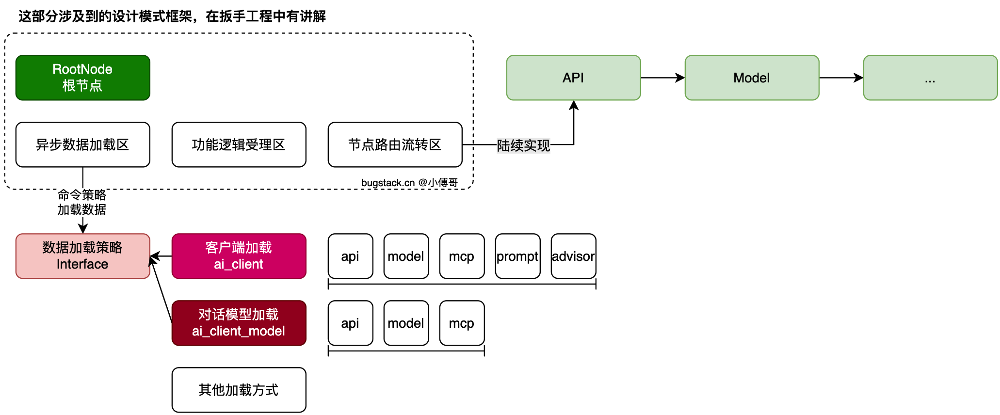
- 首先，整个 Ai Agent 的实例化过程，就是各项组件的创建和组装的过程。那么，为了让整体的实现代码更易于维护，我们可以把这样的创建过程，通过规则树的方式进行串联实现。
- 之后，本节我们先把目标缩小到关于数据加载部分，因为后续所有的 Ai Agent 组件实例化的过程，都是需要基础数据的提供。所以组装数据就显得尤为重要了

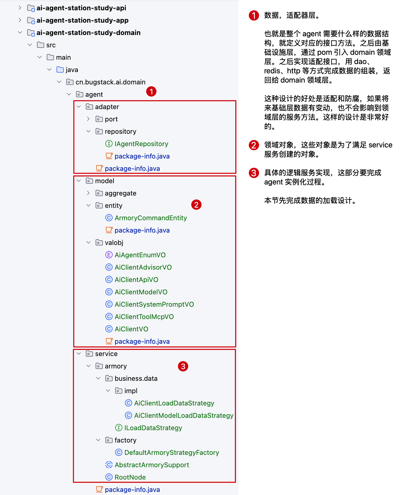
- 整个agent领域就是为了动态化的加载各个模块
- adapter：适配层用于完成数据的获取，整个agent需要什么样的数据结构，就定义对应的接口方法，之后由基础设施层实现，通过pom引入domain领域层。之后实现适配接口，用dao、redis、http等方式完成数据的组装，返回给domain领域层。
好处是适配和防腐，如果将来基础领域层有变动，也不会影响到领域层的服务方法。
- model：领域对象层，为了满足service服务创建的对象。一整个服务的实现，数据需要通过领域对象来传递。基本你需要什么对象，就在这部分创建。
- service：服务实现层，完成具体的逻辑服务实现，本节重点是数据的加载策略。

**类关系**
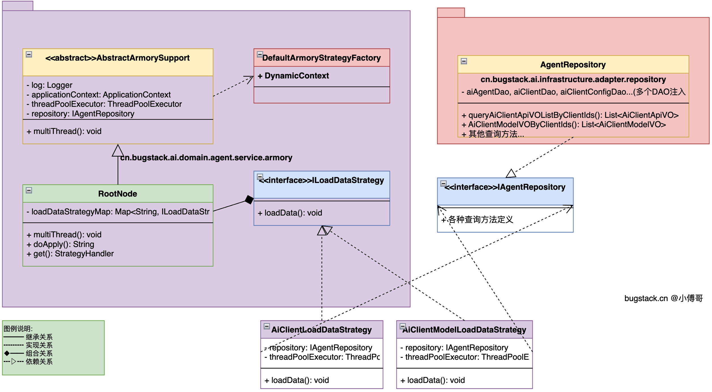
- 首先，抽取后的类的关系结构。以 AbstractArmorySupport 为扩展支撑类，实现第一个 RootNode 节点。
- 之后，本身 Node 的用途是为了加载数据，但加载数据本身又有很多种类，所以这里要做一个数据加载策略。以 ILoadDataStrategy 接口实现多个数据加载实现类。目前只体现了2个，后续随着功能的开发，再继续增加。
- 最后，整个数据的加载都是从基础设施层实现类，AgentRepository 通过 dao 操作，完成各项数据的加载。
- ArmoryCommandEntity:对象用于请求加载数据策略。因为我们本身加载数据，无非就是告诉策略，你要加载哪类的数据策略，之后给一个ID集合。
- AiClientLoadDataStrategy：Client 数据策略,一个 client 加载，要顺序的加载所有的资源。
- AiClientModelLoadDataStrategy:Mode 数据策略，
- doApply 处理逻辑，get 获取下个节点。
- 注册对象AbstractArmorySupport.registerBean提供注册Bean到Spring容器的方法。getBean这个获取已经注册好的bean的方法(这里能自动转换类型)。
- 在项⽬中路由抽象⽅法是
```
  public abstract class AbstractArmorySupport extends AbstractMultiThreadStrategyRouter<AiAgentEngineStarterEntity, DefaultArmoryStrategyFactory.DynamicContext, String>
```
  
**上述为代码分支的结果**

### 动态实例化客户端API
完善数据加载操作，动态实例化客户端API（ai_client_api）并注册到 Spring 容器。

这是整个 armory 动态装配 Ai Agent 节点的第一步，涉及到了数据的获取，对象的创建和 Spring 容器的 Bean 对象注册。能看懂本节的操作，基本后续一直到整个 Ai Agent 构建也就都可以看懂了。
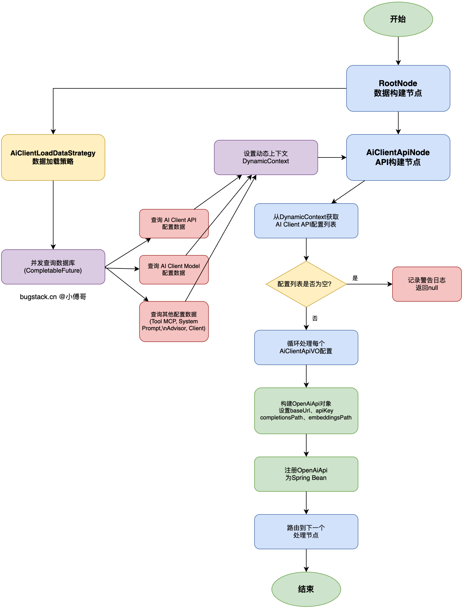
- 整个 AI Agent 的实例化过程，就是各项组件的创建和组装的过程。为了让整体的实现代码更易于维护，我们把这样的创建过程，通过 规则树的方式 进行串联实现。这种设计模式的优势在于：模块化设计、易于扩展、代码复用度高。
- 从开始节点看，依次执行，数据构建节点、API构建节点。在 API 构建的过程中，会检查上下文中是否存在已经从数据库获取的数据，之后依次循环构建并注册到 Spring 容器。

OpenApi对象构建需要配置以下参数：
- baseUrl ：OpenAI API的基础URL地址
- apiKey ：API密钥（自动添加"Bearer "前缀以适配Spring AI 1.0.0-M8版本）
- completionsPath ：对话补全接口路径
- embeddingsPath ：嵌入模型接口路径

AbstractArmorySupport：Spring Bean 容器，提供registerBean和getBean方法，具体流程
- 第一步：获取Bean工厂，DefaultListableBeanFactory 是Spring容器的核心实现类。通过它可以动态管理Bean的生命周期。 强转是因为applicationContext返回的是接口, 转换成DefaultListableBeanFactory来使用高级功能。
- 第二步：构建Bean定义，使用 BeanDefinitionBuilder 创建Bean定义。genericBeanDefinition(beanClass, () -> beanInstance) 指定Bean类型和实例供应商。设置作用域为单例模式（ SCOPE_SINGLETON ） 
- 第三步：处理Bean冲突，检查是否已存在同名Bean，如果存在，先移除旧的Bean定义，确保新Bean能够正确注册。 
- 第四步：注册新Bean，将新的Bean定义注册到Spring容器。

AiClientApiNode：节点构建
- doApply 是处理业务流程的方法区，在这里首先通过上下文获取加载的 AIClientApi 数据。如果数据为空则返回为null。后续这块也可以处理为路由到下一个节点继续处理其他节点实例化。 
- 接下来，for循环的过程，就是不断的创建 OpenAiApi 对象，之后注册到 Spring 容器中。完成后，执行 router 路由到下一个节点。 
- router 执行后，会走到 get 方法，目前设置的是 defaultStrategyHandler，也就是不执行下一个节点。后续会随着功能开发来修改。

RootNode：节点路由
- RootNode 节点的要修改 get 方法，路由到 aiClientApiNode。也就是数据加载完成后，要走到下一个节点进行 api 构建操作。 
- router 的操作是在设计模式模板类里，可以到上一层的方法中查看具体的路由操作。

#### multiThread方法
从大的框架上来说就是创建了一批要查询的任务，然后异步多线程同时执行查询，并在执行完查询后，将值存入dynamicContext中。
其中每个repository中的查询方法, 其实可以简单看作就是填充好VO对象的一个过程, 调用多个dao层接口, 组装数据库中的数据成实际的业务中会使用的VO对象。

> 为什么需要转化成VO对象? 某些地方能直接使用po对象但是还是多此一举的创建了一个几乎一模一样的VO对象?
>
> VO和Entity对象是业务中实际上使用的对象, 也是实际上在各个方法之间传递, 是"业务实体", 而持久化对象是面向库表的, 是我们从库表中读取出来的结构, 往往不会是和我们要的业务实体是一样的形式, 因为库表之间往往会进行解耦比如通过范式约束设计, 最后呈现出来的形式并不是和业务直接对应的
>
> 创建一个一样的VO对象是因为我们这里的业务实体刚好和PO对象相差无几, 一方面是为了保持编码风格的统一, 另一方面是为了保证以后的拓展性, 如果这里的业务发生了什么变化, 我们修改VO对象就行, 总不能修改PO对象吧
>
> VO（及其所在的聚合根Entity）是承载核心业务规则和逻辑的地方。直接使用PO会导致业务规则无法内聚在合适的对象中，散落在服务层或更糟的地方，违反高内聚原则。
>
> 同时使用VO对象还能封装简单的领域行为

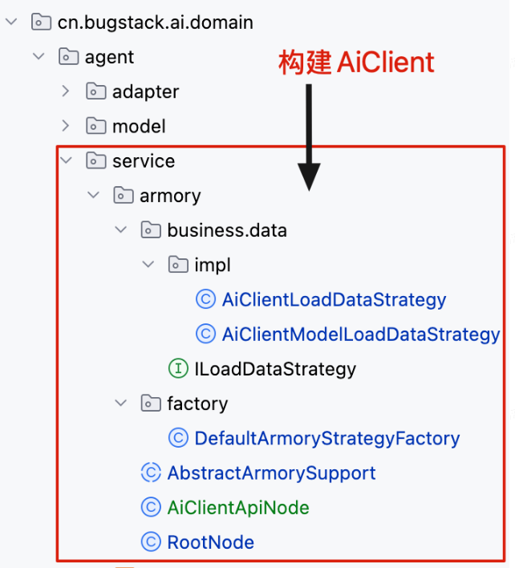
 
### 动态实例化对话模型
整个 ChatModel 对话模型，所需的元素包括；ai api、tool mcp 两块内容。那么本节我们就分别通过不同的 Node 节点实现这些元素的实例化和 ChatModel 构建。
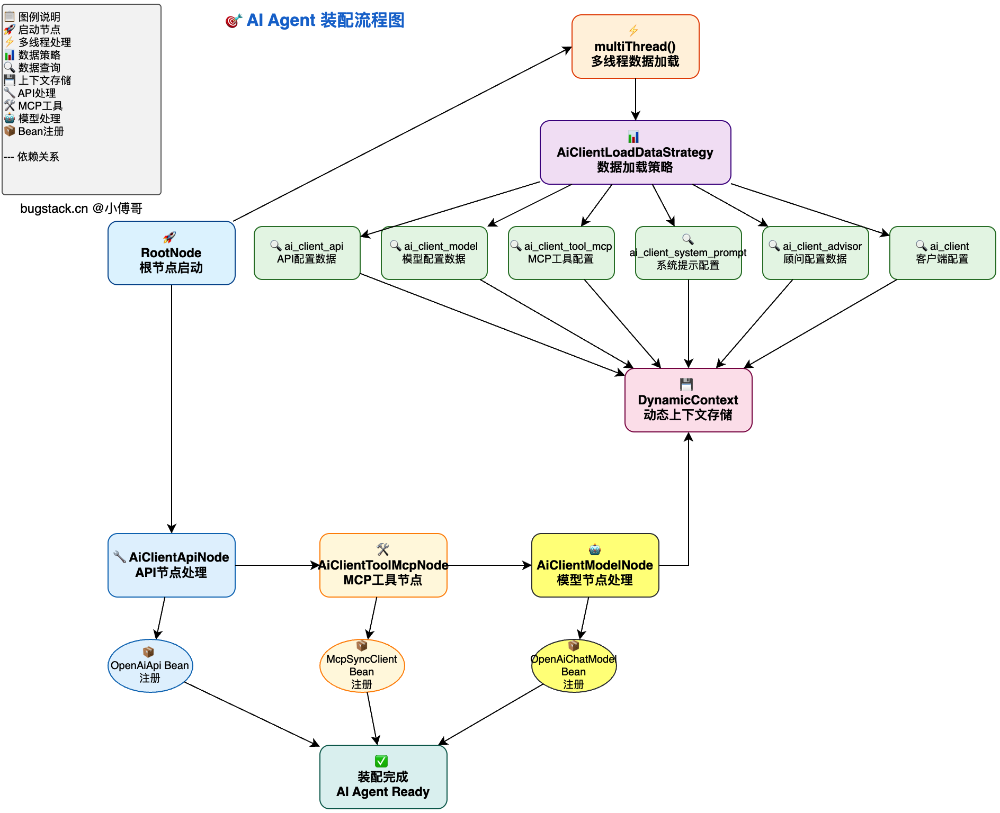
- 首先，如图 RootNode 负责数据加载，将构建节点元素的数据依次加载到内存中（写入到上下文里）
- 之后，除了上一节完成的 API 节点处理后，开始创建 MCP 服务的创建，之后是 ChatModel 对话模块的创建。因为 ChatModel 创建的时候会需要用到的 api、mcp 两个元素。

重写了 beanName 方法，为每个顾问对象生成唯一的 Bean 名称。

### 实例化对话客户端
本节我们要进行 advisor 顾问角色的实例化，之后进行 ChatClient 对话客户端的实例化。
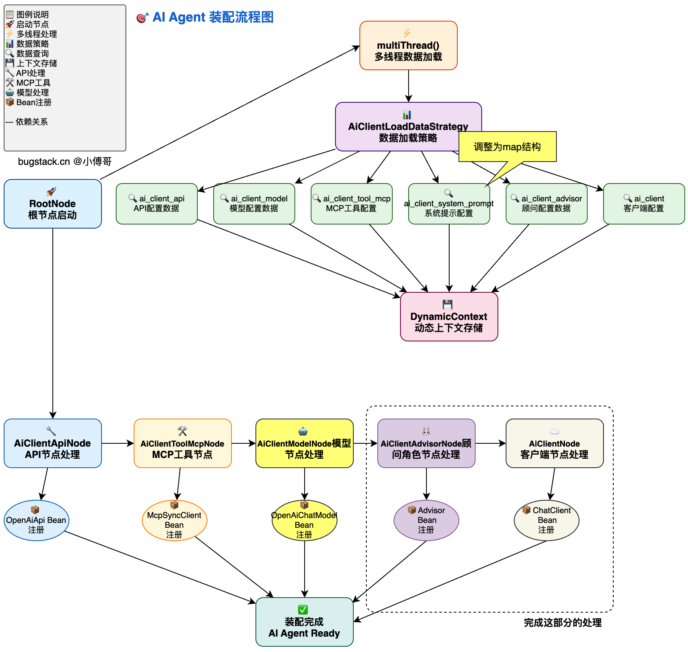
- 首先，以构建 AiClientNode 的对话客户端为目的，已经完成了相关的元素实例化步骤。本节这里要处理的是，顾问角色的构建，以及构建 AiClientNode 节点。
- 之后，AiClientNode 的构建，是关联了其他各项元素的，所以在构建时，需要在 AiClientNode 节点，从 Spring 容器通过 getBean 的方式，检索到对应的各项元素。
- 注意，ai_client_system_prompt 系统提示词，需要修改为 Map 结构数据。这样更方便我们从数据里获取，哪些是属于当前 AiClientNode 构建时所需的元素。

- 增加 AiClientAdvisorNode 节点，获取多线程加载数据 AiClientAdvisorVO 并根据顾问角色类型，ChatMemory、RagAnswer 分别构建不同的顾问类型。
  - AiClientAdvisorNode继承自 AbstractArmorySupport ，而 AbstractArmorySupport 又继承自 AbstractMultiThreadStrategyRouter ，这一继承体系为其提供了多线程路由和 Spring Bean 管理能力。
- AiClientVO 客户端节点的构建，则需要把所有关联到的元素，依次按照Bean的名称，从 Spring 容器获取。 
- 链接处理 ：AiClientModelNode -> AiClientAdvisorNode -> AiClientNode。每个节点构建完成后，就开始关联到下一个节点。

### Agent执行链路分析
通过现有实现的动态化构建 Ai API、Model、Client、Tool（MCP）、Advisor（记忆、RAG）、Prompt，完成 Ai Agent 服务处理。
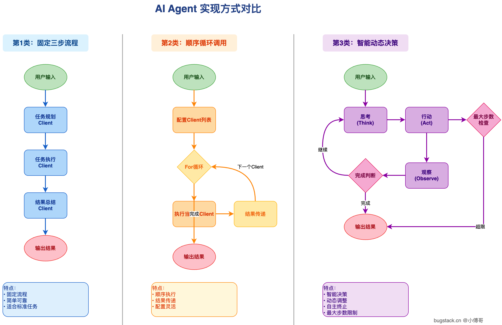
Ai Agent 的处理过程也是分为几类的，用于适应不同的场景使用；
1. 固定N个步骤，这类的一般是配置工作流的，提高任务执行的准确性。如，一些检索资料、发送帖子、处理通知等。
2. 顺序循环调用，配置 Agent 要执行的多个 Client 端，以此顺序执行。适合一些简单的任务关系，并已经分配好的动作，类似于1的方式。
3. 智能动态决策，这类是目前市面提供给大家使用的 Agent 比较常见的实现方式，它会动态的规划执行动作，完成行动步骤，观察执行结果，判断完成状态和步骤。并最终给出结果。

### Agent执行链路设计
针对Ai Agent 执行链路的分析，使用规则树设计可执行链路节点。

**AI Agent动态多轮执行策略流程图**
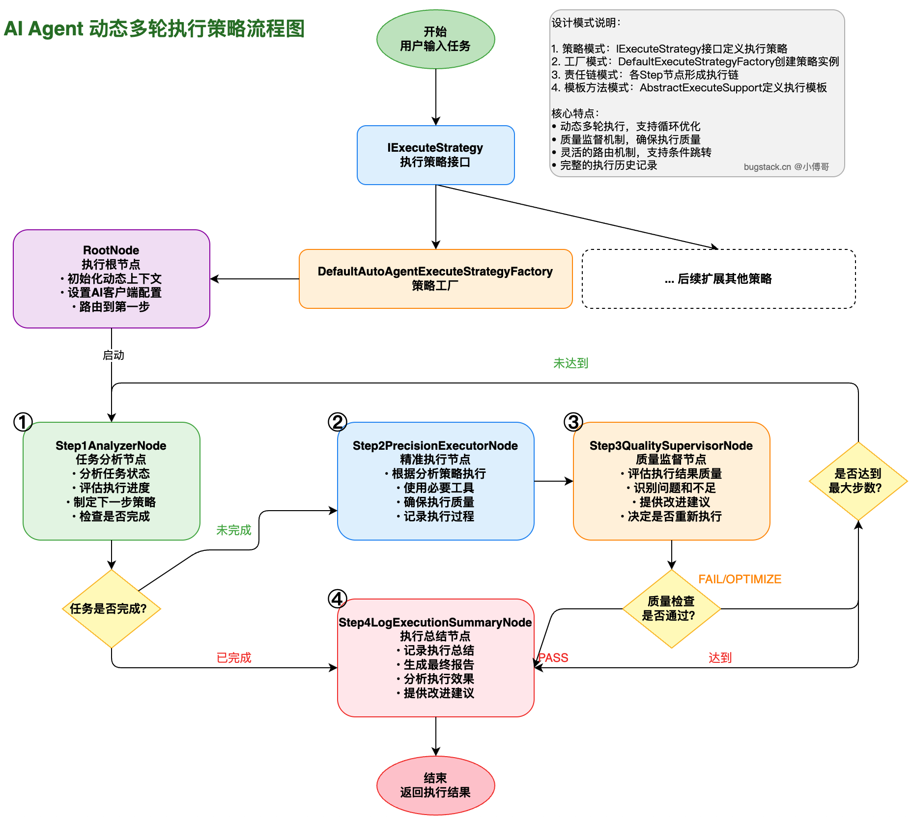
- 给入口保留一个多策略选择，以适应不同场景的多类型Agent选择使用，后续会在 agent 配置表增加策略选择属性来区分调用。本节我们先处理一个 AutoAgent 的实现。
- 之后，进入到关键地方，在上一节 AutoAgentTest 章节，设计了一套自动化 Agent 执行方法，通过 for 循环处理。这里我们通过规则树，分多个多个节点步骤执行，节点间可循环调用，增强整体的灵活性。
- 最后，以用户提问到所有的步骤执行完成后，进入到结束环节，产生结果。

RootNode：数据加载节点，加载数据。并把数据填充到上下文中。

Step1AnalyzerNode：任务分析节点，

Step2PrecisionExecutorNode：精准执行节点，执行具体的任务步骤操作

Step3QualitySupervisorNode：质量监督节点，检测整个过程生成的内容质量是否可靠的。
注意：router 做完路由后，要判断是走到最终节点，还是继续回到 step1AnalyzerNode 继续执行，这个过程是根据生成内容是否完成目标来决定的（也包括是否超过最大步骤）。

Step4LogExecutionSummaryNode：执行总结节点，

### Agent服务接口和UI对接（第一版AutoAgent效果）
从Agent服务的装配到接口调用和响应的关系图
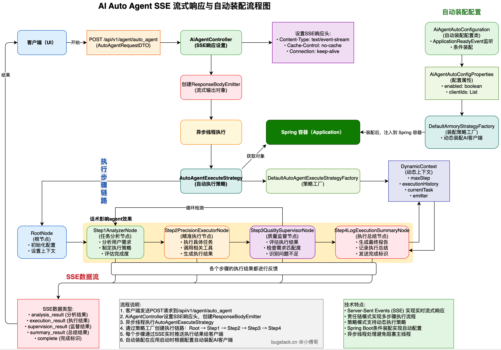
- 以程序启动为开始，进行自动化装配。这个过程我们先把一些想预先启动的数据库中的 agent 配置所需的 client 客户端进行服务初始化。之后写入到 Spring 容器，方便在执行 Agent 时进行使用。
- 客户端（UI），进行 POST 接口请求，这个过程需要封装一个 SSE 流式响应的接口，让 Step 1~4 各个执行步骤，把过程信息写入到流式接口。这里要注意，需要给接口返回的对象   添加上对应的类型（什么步骤、什么节点、什么过程），以便于反馈给用户 Agent 在做什么。

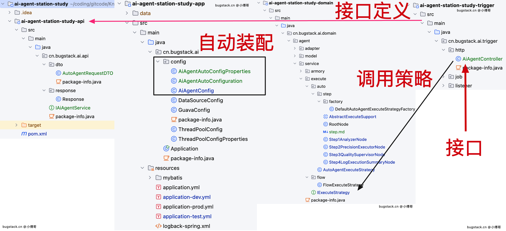
1. 首先，在 api 层下定义 Agent 服务接口，之后由 trigger 层实现接口。api 层是一个统一对外的服务接口标准，单独定义更好管理，也适用于 rpc 对外提供 jar 的使用方式。
2. 之后，app 层，程序启动时，进行自动装配。装配的数据（客户端），配置到 application-dev.yml 中。
3. 最后，就是 trigger 层的接口，调用 domain 领域层的自动 agent 策略了。trigger 接口是 SSE 的异步流式响应接口，所以要渗透到 domain 领域层增加 ResponseBodyEmitter 发送各个阶段的数据。

### Agent-ELK日志分析场景
增加 Agent-ELK 日志分析的实际应用场景，通过 Agent 根据用户诉求，自主分析、规划、执行和输出结果，来帮助我们对日志检索的提效。
ELK（或自研） 是各个互联网公司中都有的一套分布式日志设备，以便于研发在遇到线上系统报警和运营反馈事故问题时，快速检索日志。但往往这种检索的日志的方式都是非常耗时的，所以增加 Agent 方式来辅助提效是非常有必要的。
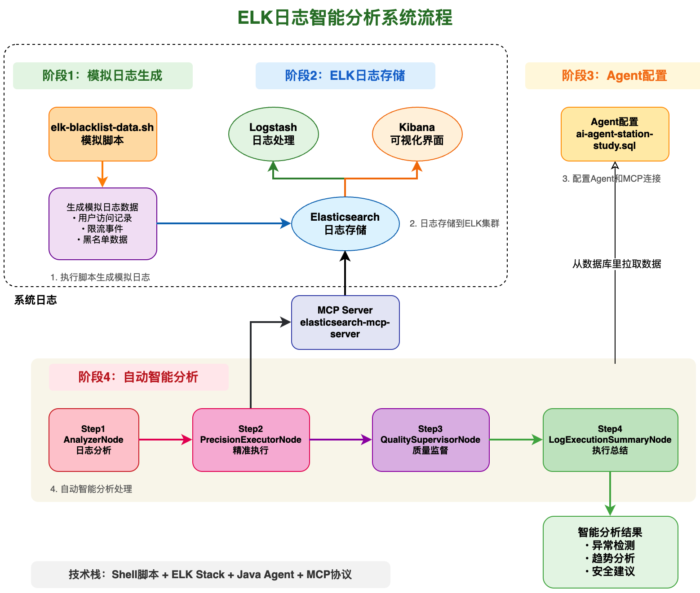
- 虚线框内为模拟的系统的应用日志，部署一套 ELK 之后通过脚本把日志数据写入到 ELK。
- 为这套场景增加一套新的 Ai Agent 描述话术，在执行 ELK 日志分析的时候，我们先手动选择出要使用的 Ai Agent 服务。这样它就可以以 ELK 对应的 Prompt 话术分析方式使用了。

[ELK 使用教程采集系统日志 Elasticsearch、Logstash、Kibana](https://bugstack.cn/md/road-map/elk.html#%E4%B8%80%E3%80%81%E7%AE%80%E8%A6%81%E8%AF%B4%E6%98%8E)

检索到大营销的运行日志，进行分析。

### Agent-Prometheus监控分析场景
扩展增加 Prometheus（普罗米修斯监控） 监控系统，让 Ai Agent 具备智能监控问题分析场景。基于的是 Ai MCP Prometheus + Agent Prompt（分阶段提示词），来完成自动化分析、规划、执行、检测、输出的智能监控系统。
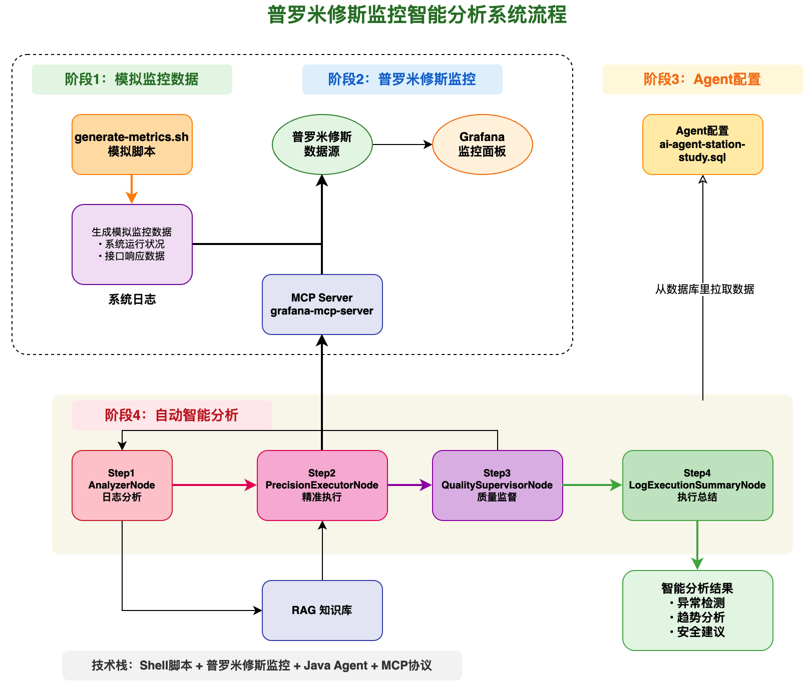

Docker部署grafana，[Prometheus + Grafana 监控，验证 Hystrix 超时熔断](https://bugstack.cn/md/road-map/grafana.html)

如果业务系统也配置了该监控，就可以监控业务系统的数据进行分析。
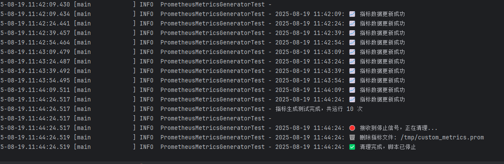

### AgentFlow执行链路分析-测试代码
多种Ai Agent执行设计流程图
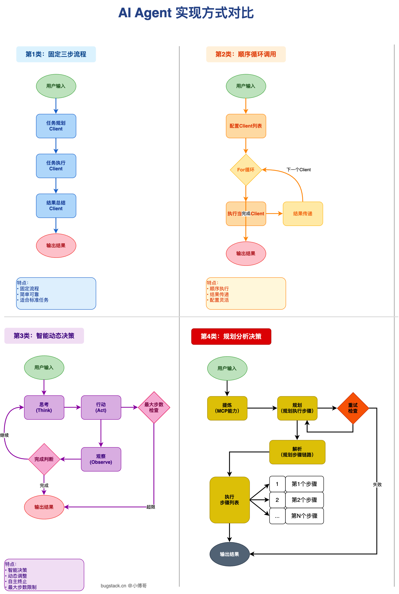

#### 1. 第 1 类：固定三步流程
##### 核心逻辑
以**“用户输入 → 任务规划 → 任务执行 → 结果总结 → 输出结果”**为固定流程，每个环节由专门的 `Client`（可理解为模块或组件）负责，流程严格且线性。

##### 特点
- **固定流程**：步骤不可变，从“规划”到“执行”再到“总结”是硬编码的顺序。
- **简单可靠**：因为流程固定，几乎不会出现逻辑分支或不确定性，适合对稳定性要求高的场景。
- **适合标准任务**：针对“需求明确、步骤固定”的标准化任务（如“生成指定格式的报告”“执行固定脚本”），能高效完成。

##### 类比理解
类似工厂的**“流水线作业”**：原材料（用户输入）进入流水线后，依次经过“规划车间”“执行车间”“总结车间”，最终产出成品（输出结果），每个车间只做自己环节的事，流程不灵活但稳定。
适用检索资料、发送帖子、处理通知等。

#### 2. 第 2 类：顺序循环调用
##### 核心逻辑
先配置好需要调用的 `Client` 列表，然后通过**循环（For 循环）**依次执行每个 `Client`，并在执行过程中传递“前一个 Client 的结果”给“下一个 Client”，最终汇总所有结果输出。

##### 特点
- **顺序执行**：`Client` 按配置的顺序依次运行，保证步骤的先后依赖（如“先查数据，再统计数据，最后可视化数据”）。
- **结果传递**：前一个 `Client` 的输出是后一个 `Client` 的输入，支持“步骤间的数据流转”。
- **配置灵活**：只需修改 `Client` 列表的顺序或成员，就能调整任务流程，无需修改核心逻辑。

##### 类比理解
类似**“多人接力完成任务”**：团队成员（`Client`）按顺序排好队，第一个人处理完任务后，把结果交给第二个人，第二个人基于结果继续处理，直到所有人完成，最终汇总成果。


#### 3. 第 3 类：智能动态决策
##### 核心逻辑
采用**“思考（Think）→ 行动（Act）→ 观察（Observe）→ 判断（完成/继续）”**的循环逻辑，Agent 会根据“观察到的结果”**动态调整后续行动**，直到任务完成或达到“最大步数限制”。

##### 特点
- **智能决策**：Agent 不是按固定步骤执行，而是像人一样“思考下一步该做什么”（比如发现数据不足，会主动去“获取更多数据”）。
- **动态调整**：流程是“活的”，会根据中间结果灵活改变策略（比如原本要“生成图表”，但发现数据格式不对，会先执行“数据清洗”步骤）。
- **自主终止**：Agent 会自主判断“任务是否完成”，无需外部干预；若长期无法完成，会因“最大步数限制”强制终止。

##### 类比理解
类似**“人类解决问题的过程”**：遇到问题时，先思考方案（Think）→ 尝试行动（Act）→ 观察结果是否符合预期（Observe）→ 若不符合，再思考新方案（循环），直到问题解决或放弃。


#### 4. 第 4 类：规划分析决策
##### 核心逻辑
先**提炼用户需求**并匹配“MCP 能力”（可调用的工具/技能集合），然后**规划“执行步骤”**并“解析步骤链路”，最后按步骤列表执行，若执行失败还支持“重试检查”。

##### 关键环节拆解
- **提炼（MCP 能力）**：明确“用户需要什么”，并匹配“Agent 有哪些工具/技能能满足需求”（比如用户要“分析销售数据”，MCP 中有“SQL 查询工具”“Python 分析库”）。
- **规划（规划执行步骤）**：将需求拆解为**有序的步骤列表**（比如“步骤1：用 SQL 查询工具取数据 → 步骤2：用 Python 分析库统计数据 → 步骤3：用可视化工具生成图表”）。
- **解析（规划步骤链路）**：明确步骤间的依赖关系（比如步骤2必须等步骤1完成才能执行），生成“可执行的步骤序列”。
- **执行步骤列表**：按序执行每个步骤，若某一步失败，触发“重试检查”（比如网络波动导致查询失败，会重试该步骤）。

##### 特点
- **结构化规划**：把“模糊的需求”转化为“清晰的步骤”，让 Agent 知道“先做什么、后做什么”。
- **容错与重试**：支持“步骤级重试”，提升任务成功率（比如临时故障导致工具调用失败，重试后可能恢复）。
- **工具驱动**：核心依赖“MCP 工具集合”，步骤规划完全围绕“工具能做什么”展开。

##### 类比理解
类似**“项目经理做项目”**：先明确项目目标和可用资源（MCP 能力）→ 制定项目计划（步骤列表）→ 按计划执行每个环节 → 遇到问题（如资源不足）就调整或重试，直到项目交付。


| 实现方式         | 核心优势               | 核心不足               | 典型适用场景                     |
|------------------|------------------------|------------------------|----------------------------------|
| 固定三步流程     | 简单可靠、易维护       | 灵活性差、无法应对复杂需求 | 标准化、重复性高的简单任务       |
| 顺序循环调用     | 配置灵活、支持结果传递 | 流程仍偏固定、无智能决策 | 多步骤但“步骤顺序固定”的任务     |
| 智能动态决策     | 灵活智能、自主适应     | 逻辑复杂、调试难度高    | 需求模糊、需要创造性解决的任务   |
| 规划分析决策     | 结构化强、容错性好     | 依赖工具集合、规划成本高 | 需要多工具协作、步骤清晰的复杂任务 |

以 FlowAgent 单测的方式学习 Agent 执行过程；
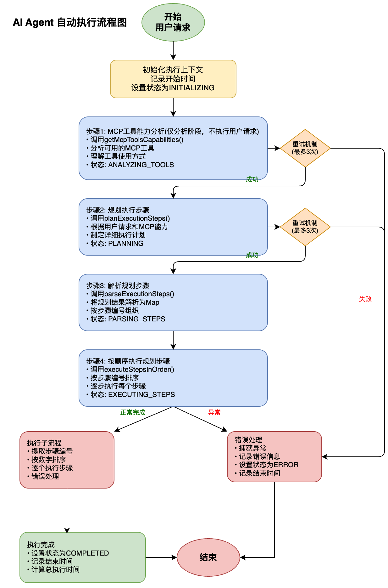
- 步骤1：获取可用的MCP工具和使用方式（仅分析，不执行用户请求）
- 步骤2：根据用户请求和MCP能力规划执行步骤
- 步骤3：解析规划结果，将每个步骤存储到map中
- 步骤4：按照顺序依次执行规划步骤，直至全部完成。

客户端，planningChatClient - 拆解任务、mcpToolsChatClient - 准确获取 MCP 工具、executorChatClient - 执行规划过程的话术是可以先自己编写目标要做什么，
之后在使用 AI 来优化话术，多尝试几次得到的结果。为了内容的准确性，可以在多执行几次。

### FlowAgent执行链路设计-模块实现
将上一节分析的执行流程以模块化的方式实现，并在数据库中添加一套新的ai agent配置
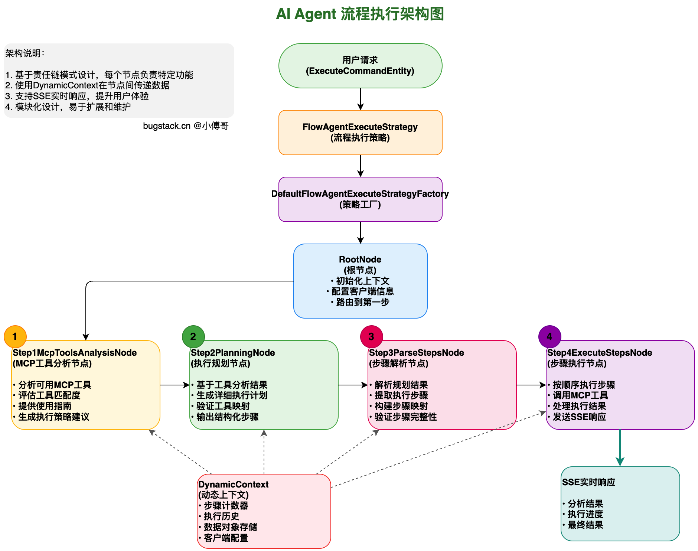

1. **责任链模式**：每个节点（如“工具分析节点”“规划节点”）只负责特定功能，像链条一样依次处理请求，解耦复杂流程。
2. **DynamicContext 数据传递**：节点间通过“动态上下文”共享数据（如工具分析结果、步骤规划内容），避免参数冗余传递。
3. **SSE 实时响应**：支持 Server-Sent Events（服务端主动推送到客户端），让用户实时看到执行进度（如“步骤1完成→步骤2开始”）。
4. **模块化设计**：每个节点可独立扩展/维护，新增功能只需新增节点，无需修改整体流程。


- **用户请求（ExecuteCommandEntity）**：用户输入的原始需求（如“生成面试文章并发布到 CSDN”），是流程的起点。
- **FlowAgentExecuteStrategy（流程执行策略）**：负责“选择执行策略”，即判断用户请求需要走哪种处理逻辑（比如“普通任务流程”或“加急任务流程”）。
- **DefaultFlowAgentExecuteStrategyFactory（策略工厂）**：根据请求类型，创建并返回具体的“执行策略”实例，是“策略模式”的体现（解耦策略创建与使用）。
- **RootNode（根节点）**：流程的“总入口”，负责三件事：
  - 初始化 `DynamicContext`（动态上下文，存储全流程数据）；
  - 配置客户端信息（如请求来源、用户身份）；
  - 将请求“路由到第一步”（即 `Step1McpToolsAnalysisNode`），启动责任链。
- 责任链的 4 个节点是流程的“核心执行层”，每个节点专注一个环节，按顺序执行：

| 节点名称                  | 核心职责                                                                 | 类比理解（帮助具象化）|
|---------------------------|--------------------------------------------------------------------------|------------------------|
| **Step1McpToolsAnalysisNode（MCP工具分析节点）** | 分析“用户请求需要哪些 MCP 工具”（MCP 可理解为“智能体可用的能力/工具集合”），包括：<br>- 识别可用工具；<br>- 评估工具与需求的匹配度；<br>- 生成工具使用指南；<br>- 提出执行策略建议。 | 类似“厨师接到订单后，先检查厨房有哪些食材/厨具”，确保“做得了这道菜”。 |
| **Step2PlanningNode（执行规划节点）** | 基于“工具分析结果”，生成**详细的执行步骤**，包括：<br>- 拆解任务为可执行的子步骤；<br>- 验证工具与步骤的映射关系（如“生成文章”需要“文本生成工具”）；<br>- 输出结构化的步骤列表（如“步骤1：生成文章→步骤2：发布到 CSDN”）。 | 类似“厨师根据食材，制定‘洗菜→切菜→炒菜’的步骤清单”。 |
| **Step3ParseStepsNode（步骤解析节点）** | 对“规划好的步骤”做**二次处理**，包括：<br>- 解析步骤文本，提取关键信息；<br>- 构建“步骤序号→步骤内容”的映射（方便程序遍历执行）；<br>- 验证步骤的完整性（如是否有缺失环节）。 | 类似“厨师把‘步骤清单’转化为‘可执行的操作指南’，并检查是否有遗漏”。 |
| **Step4ExecuteStepsNode（步骤执行节点）** | 按顺序执行每个步骤，包括：<br>- 调用对应的 MCP 工具（如“调用文章生成工具”“调用 CSDN 发布接口”）；<br>- 处理工具执行结果（成功/失败）；<br>- 通过 SSE 向客户端推送实时执行状态。 | 类似“厨师按照操作指南，依次洗菜、切菜、炒菜，每完成一步就告诉食客‘进度到哪了’”。 |

构建每个执行步骤时，结合设置好的结构化的规划提示词交给AI来完成每一步的任务（提示词由开发者分析需求结合AI优化得到）。

重试机制是一种"标记并继续"的设计模式。
1. 错误识别与分类 ：特别识别网络相关错误，这些错误更适合通过重试解决
2. 错误状态追踪 ：通过动态上下文记录每个步骤的错误状态和次数
3. 流程连续性保障 ：单个步骤失败不影响整体流程继续执行
4. 实时错误反馈 ：通过 SSE 机制将错误信息实时反馈给客户端
5. 基于上下文的状态管理 ：利用动态上下文对象维护执行状态

可以尝试和auto流程做链接，基于要做的事情，做详细的规划和监督。

### 增加调度器策略执行Agent链路
对于不同类型的ai agent，对调用过程增加一个策略调度器，按照不同类型的 ai agent 选择不同的执行策略。
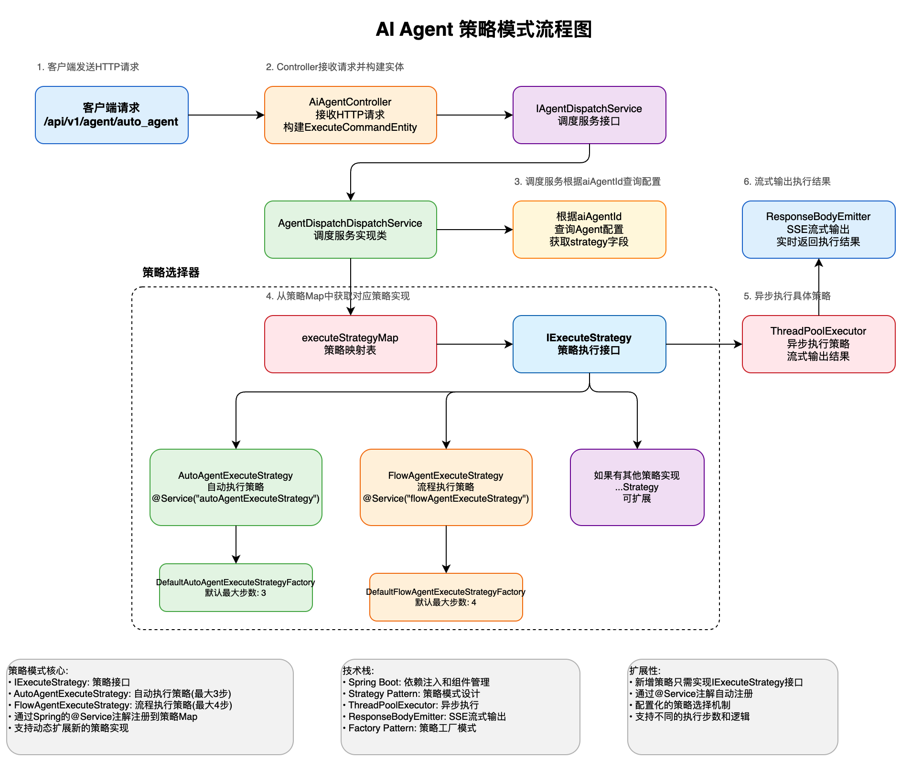
1. 客户端发送 HTTP 请求：
   调用接口 `/api/v1/agent/auto_agent`，触发 AI Agent 执行任务。
2. Controller 接收请求并构建实体：`AiAgentController` 接收请求，将参数封装为 `ExecuteCommandEntity`（任务执行实体）。
3. 调度服务查询 Agent 配置：`AgentDispatchService` 根据 `aiAgentId`（Agent 标识）查询配置，获取 `strategy` 字段（指定要使用的策略）。
4. 从策略 Map 中选择具体策略：借助 `executeStrategyMap`（策略映射表），根据 `strategy` 字段选择对应的 `IExecuteStrategy` 实现类（如 `AutoAgentExecuteStrategy` 或 `FlowAgentExecuteStrategy`）。
5. 异步执行具体策略：通过 `ThreadPoolExecutor`（线程池）异步执行选中的策略，避免阻塞主线程；执行过程中通过 `ResponseBodyEmitter` 流式输出结果。
6. 流式输出执行结果：使用 `ResponseBodyEmitter` + SSE（Server-Sent Events）技术，实时向客户端推送执行进度、结果（如“步骤1完成→步骤2开始”）。

**注意**
- AiAgentController执行用户请求时，之前的方式是注入了对应的 auoAgent 执行策略。这里增加了·一个调度器服务接口，通过调度器，选择 execute 下的 autoAgent 和 flowAgent
- 根据不同场景通过aiAgentId执行不同的ai agent执行策略，要在数据库中增加strategy 执行策略配置，这样用户提问时候根据传入的 agent id 就可以获取到对应的策略了。

1. **策略接口（IExecuteStrategy）**：
  - 定义所有策略的通用行为（如“执行任务”的方法），是策略模式的“抽象层”。

2. **策略实现类**：
  - `AutoAgentExecuteStrategy`：“自动执行策略”，适合简单任务，默认最大执行步数为 3（由 `DefaultAutoAgentExecuteStrategyFactory` 控制）。
  - `FlowAgentExecuteStrategy`：“流程执行策略”，适合复杂、多步骤任务，默认最大执行步数为 4（由 `DefaultFlowAgentExecuteStrategyFactory` 控制）。
  - 可扩展其他策略（如 `OtherStrategy`），只需实现 `IExecuteStrategy` 接口。

3. **策略注册与选择**：
  - 所有策略实现类通过 `@Service` 注解（如 `@Service("autoAgentExecuteStrategy")`）注册到 Spring 容器，并自动加入 `executeStrategyMap`（策略映射表）。
  - 调度服务通过 `strategy` 字段从 `executeStrategyMap` 中选择对应的策略实现，实现“动态切换”。

@CrossOrigin 是 Spring Framework 提供的注解，用于处理 跨域资源共享（CORS，Cross-Origin Resource Sharing） 问题。
```java
@CrossOrigin(
    origins = "*",          // 允许所有来源域的请求
    allowedHeaders = "*",   // 允许请求携带所有类型的请求头
    methods = {RequestMethod.GET, RequestMethod.POST, RequestMethod.OPTIONS}  // 允许的 HTTP 方法
)
```

### 动态执行智能体任务
实现基于数据库固定配置步骤的简单循环执行智能体策略。
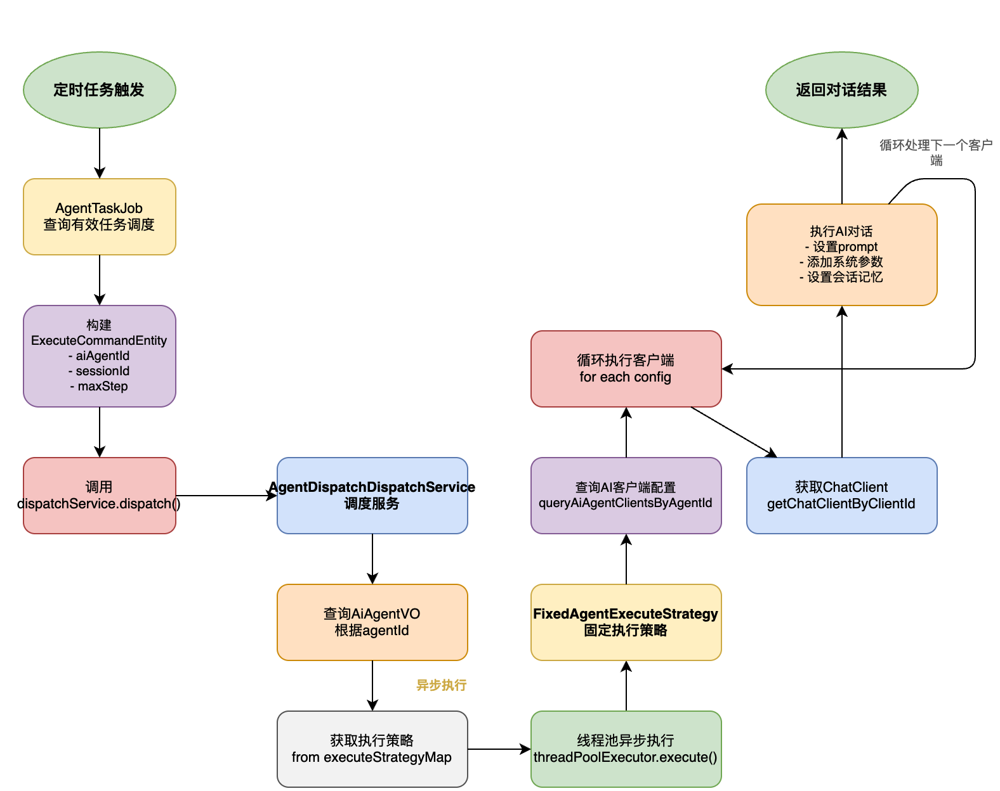
1. **定时任务触发**：
    - 流程由“定时任务”启动（比如每天凌晨 2 点执行），是整个流程的“起点”。
2. **`AgentTaskJob` 查询有效任务调度**：
    - `AgentTaskJob`（定时任务类）负责查询“当前需要执行的有效任务”（比如“每天给客户推送 AI 对话服务”），过滤无效或过期任务。
3. **构建 `ExecuteCommandEntity`**：
    - 将任务参数封装为 `ExecuteCommandEntity`（执行命令实体），包含核心字段：
        - `aiAgentId`：AI Agent 的唯一标识（区分不同的 AI 能力/角色）；
        - `sessionId`：会话 ID（用于关联同一次对话的上下文）；
        - `maxStep`：最大执行步数（防止任务无限循环）。
4. **调用 `dispatchService.dispatch()`**：
    - 调用调度服务的 `dispatch` 方法，正式启动任务调度流程。
5. **`AgentDispatchDispatchService` 调度服务**：
    - 作为调度核心，负责“查询 Agent 配置”和“选择执行策略”：
        - **查询 `AiAgentVO`**：根据 `aiAgentId` 查询对应的 AI Agent 配置（如 Agent 类型、关联的客户端等）；
        - **获取执行策略**：从 `executeStrategyMap`（策略映射表）中选择对应的执行策略（比如 `FixedAgentExecuteStrategy`，即“固定执行策略”）。
6. **异步执行**：
    - 通过线程池 `threadPoolExecutor.execute()` 异步执行选中的策略，避免阻塞定时任务线程，提升系统吞吐量。
7. **`FixedAgentExecuteStrategy` 固定执行策略**：
    - 策略的具体实现类，负责“按固定逻辑执行任务”（可扩展其他策略，如“动态策略”“条件分支策略”）。
8. **查询 AI 客户端配置**：
    - 通过 `queryAiAgentClientsByAgentId` 查询当前 `aiAgentId` 关联的**所有客户端配置**（比如“客户 A 的配置”“客户 B 的配置”）。
9. **循环执行客户端（`for each config`）**：
    - 对每个客户端配置，循环执行以下逻辑：
        - **获取 `ChatClient`**：通过 `getChatClientByClientId` 获取与客户端对应的 `ChatClient`（AI 对话客户端，封装了与大模型的交互逻辑）；
        - **执行 AI 对话**：
            - 设置 `prompt`（提示词，引导 AI 生成特定内容）；
            - 添加系统参数（如温度、最大 Token 数等，控制 AI 生成的风格和长度）；
            - 设置会话记忆（让 AI 记住历史对话，实现上下文连续）。
10. **返回对话结果 & 循环处理下一个客户端**：
    - 每个客户端的对话结果生成后，返回给调用方；
    - 继续循环处理下一个客户端，直到所有关联的客户端都处理完毕。


核心设计思想与优势
1. **定时驱动 + 异步执行**：
    - 定时任务触发适合“周期性任务”（如每日推送），异步执行避免系统阻塞，提升并发能力。
2. **策略模式 + 多客户端支持**：
    - 策略模式（`executeStrategyMap`）让不同场景可复用不同执行逻辑；
    - 多客户端循环支持“一个 AI Agent 服务多个客户”，提升资源利用率。
3. **会话记忆与上下文管理**：
    - 通过 `sessionId` 和“会话记忆”，让 AI 能记住历史对话，实现连续、自然的多轮交互。

在 job 模块添加了一个 AgentTaskJob 实现类。这个任务会实现扳手工程任务调度组件的接口，之后这个类就会被任务调度管理了。

增加一个 FixedAgentExecuteStrategy 策略实现类，循环方式执行数据库配置的客户端。

### 拖拉拽编排数据存储
通过 `flowgram.ai` 框架，实现项目中 Ai Agent 拖拉拽编排能力，增强使用的易用性。
主要实现的就是一个 ai agent 所需的，client、prompt、advisor、model（api）的串联使用。通过拖拉拽方式替代 ai_client_config 中需要手动维护的数据关系链。

每个节点所拉取的数据，则是从服务端接口进行获取的。如，Client 客户端获取可用数据，Model 获取模型，之后链接的 MCP 工具可以自由组合。

后端主要实现：拖拉拽数据的存储接口，各个 Node 节点从服务端拉取数据的接口，便于前端渲染展示和选择配置。采用 trigger 引入 infrastructure 基础设施层，直接完成对数据库的操作。
前端代码主要通过AI实现功能，例如数据存储能力接口，各个节点接口（从服务端获取数据），API定义接口，保存数据时1调用服务端接口进行保存。

#### 1. 配置管理接口设计
提供了完整的配置管理服务接口 `IAiAgentDrawAdminService`，包含三个核心方法：
- **保存配置**：`saveDrawConfig(AiAgentDrawConfigRequestDTO request)`
- **获取配置**：`getDrawConfig(String configId)`
- **删除配置**：`deleteDrawConfig(String configId)`

这些接口允许前端对拖拽配置进行完整的生命周期管理。

#### 2. 节点数据获取流程
服务端通过以下方式获取和处理节点数据：
1. **配置数据接收**：接收前端传来的包含 nodes 和 edges 的 JSON 配置数据
2. **数据解析**：使用 `DrawConfigParser` 工具类解析配置数据，提取节点和边的信息，
3. **关系映射生成**：将节点关系转换为 `AiClientConfig` 对象列表，建立实际的执行关系
4. **数据持久化**：将配置信息保存到 `ai_agent_draw_config`、`ai_agent_draw_nodes` 和 `ai_agent_draw_relations` 表中

#### 3. 核心解析逻辑
`DrawConfigParser` 类实现了配置数据的解析核心逻辑：
- 通过 `parseConfigData` 方法解析完整的 JSON 配置
- 使用 `buildNodeMap` 构建节点映射表
- 通过 `parseEdges` 解析边关系并生成配置关系
- 针对不同节点类型（client、agent、tool_mcp等）有专门的引用ID提取方法

#### 前端实现
前端实现了一个基于流程图的可视化拖拽界面，支持：
- 拖拽添加不同类型的节点（client、agent、task、advisor、prompt、model、tool-mcp等）
- 连接节点创建执行流程
- 配置节点属性（如引用ID、位置坐标等）

前端按照特定格式构建和提交配置数据：
- 包含 `nodes` 和 `edges` 两大核心部分
- 节点代表AI Agent拖拽编排界面中的各类组件，其数据结构包含：
  - **id**: 节点唯一标识符
  - **type**: 节点类型（支持client、agent、tool_mcp、model、prompt、advisor、start等）
  - **data**: 节点详细数据对象
      - **title**: 节点标题
      - **inputsValues**: 节点输入值，用于提取具体配置和引用ID
- 边代表节点之间的连接关系，其数据结构包含：
  - **sourceNodeID**: 源节点ID
  - **targetNodeID**: 目标节点ID
  - **sourcePortID**: 源节点连接端口ID（可选，包含重要的连接端口信息）

前端交互流程应包括：
- 初始化画布并加载已有配置
- 提供节点拖拽和连接功能
- 保存配置时，将画布状态转换为标准JSON格式并提交到后端
- 加载配置时，解析后端返回的JSON数据并渲染到画布

#### 后端实现
后端采用多表结构存储拖拽配置信息：
- `AiAgentDrawConfig`：主配置表，存储完整配置JSON和基本信息
- `AiAgentDrawNodes`：节点表，存储每个节点的详细信息
- `AiAgentDrawRelations`：关系表，存储节点间的连接关系
- `AiAgentDrawHistory`：历史表，记录配置变更历史

通过 `IAiAgentDrawConfigDao` 接口提供数据访问能力，支持：
- 根据配置ID、智能体ID查询配置
- 更新、删除配置信息
- 查询启用状态的配置列表

业务层主要功能包括：
- 接收前端配置请求
- 调用 `DrawConfigParser` 解析配置数据
- 执行数据验证和转换
- 管理配置的版本和历史记录
- 将配置同步到执行环境（如 `ai_client_config` 表）

拖拽配置完成后，系统会将配置同步到执行环境，并通过 `FlowAgentExecuteStrategy` 等执行策略执行编排好的流程。

### Agent管理后台实现
在数据库中增加admin表，配置有登陆账号和密码，可以做简单的校验。
