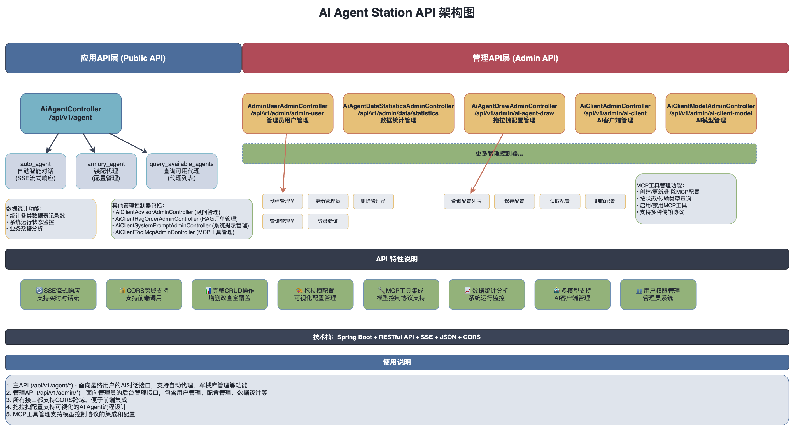
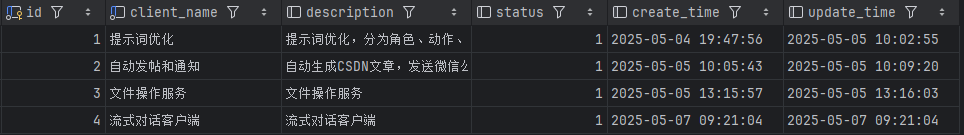
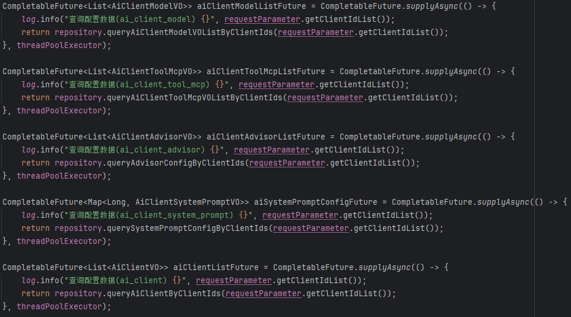
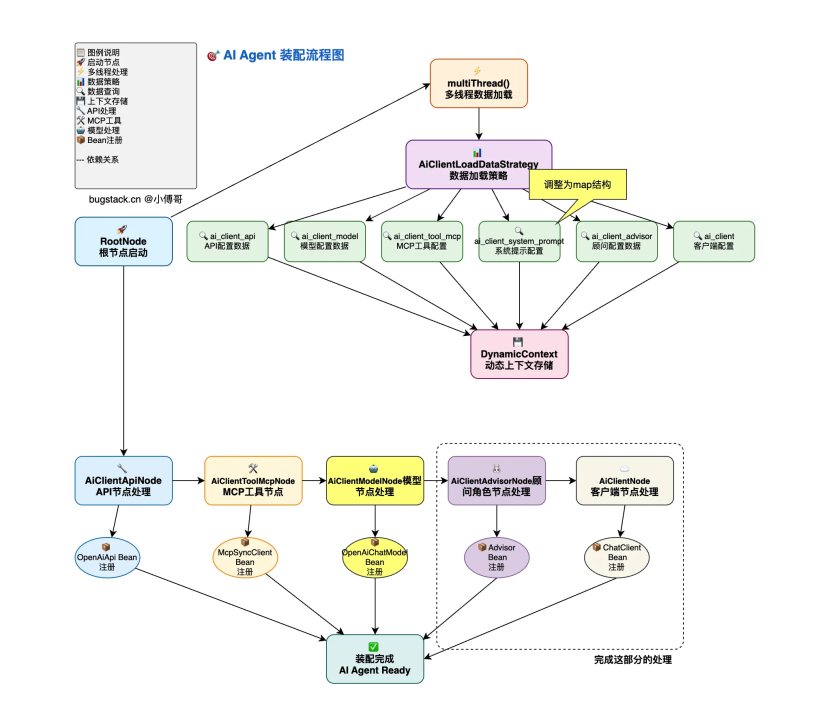

### 难点及解决
#### 系统设计与架构挑战
1. Agent 执行链路复杂性  
   - 需支持固定流程、循环调用、动态决策等多种执行模式，逻辑分支复杂。
   - 多 Agent 协作时，任务依赖和错误传播难以管理。
2. 动态实例化与依赖注入  
   - 根据用户配置动态加载 AI 客户端、模型、工具链等组件，组件间的依赖关系管理复杂，需解决 Spring 容器生命周期管理问题。
3. 多模型框架兼容性
   - 需要同时支持 OpenAI、DeepSeek 等不同大模型，但各模型 API 协议差异大。
   - Spring AI 框架早期版本对部分模型（如 DeepSeek）支持不完善。
4. 流式处理与上下文管理
   - 实现流式响应时，需处理长连接下的上下文同步问题（如用户追问时传递历史对话）。
   - 服务端流式接口（SSE）与客户端（如 JavaScript EventSource）的兼容性调试。
5. 多数据源管理
   - 需同时操作 PostgreSQL（向量库）、MySQL（业务库）等异构数据库。
   - 数据库事务一致性难以保证（如向量库写入与业务数据更新的原子性）。
   
**解决方案**

通过以下核心策略攻克难点：
1. 模块化设计：将复杂流程拆解为独立节点（如 MCP 工具、RAG 顾问），通过责任链模式组合。
2. 设计模式优化：采用多种设计模式，对执行流程进行解耦和实现。
2. Spring 生态深度整合：利用 Spring AI、Spring Boot Actuator、Spring Cloud 等组件简化开发。
3. 动态bean配置：通过AbstractArmorySupport提供Bean动态注册能力 ，使用DynamicContext在节点间传递数据，避免重复查询
4. 异步与流式处理：通过 Reactor 框架（Flux/Mono）和 SSE 实现高并发下的实时交互。
5. 动态化配置：支持数据库动态加载 Agent 配置，实现“零代码”扩展。


1. 规则树与责任链模式  
   - 将执行流程抽象为节点（如 MCPToolsAnalysisNode、PlanningNode），通过责任链模式串联：
   ```
   public class Step1McpToolsAnalysisNode extends AbstractArmorySupport {
   @Override
   public DynamicContext apply(DynamicContext context) {
   // 工具分析逻辑
   return nextChain.apply(context); // 传递到下一节点
   }
   }
   ```
   - 支持动态插入新节点，扩展执行策略。
2. 动态 Bean 注册  
   - 利用 Spring 的 BeanDefinitionRegistry 动态注册客户端、模型等组件：
   ```
   DefaultListableBeanFactory beanFactory = (DefaultListableBeanFactory) applicationContext.getAutowireCapableBeanFactory();
   BeanDefinitionBuilder builder = BeanDefinitionBuilder.genericBeanDefinition(OpenAiApi.class);
   builder.addPropertyValue("baseUrl", "https://api.deepseek.com");
   beanFactory.registerBeanDefinition("deepSeekApi", builder.getBeanDefinition());
   ```
3. 统一抽象层设计
   - 通过 Spring AI 的 ToolCallbackProvider 和 MCP 框架，将不同模型的调用统一为标准化接口。例如：
   ```
   @Autowired
   private ToolCallbackProvider tools; // 统一注入所有工具（含不同模型）
   ```
   - 使用 one-api 网关屏蔽模型差异，实现跨模型调用。
4. 上下文传递机制
   - 前端：利用 localStorage 存储对话历史（如 localStorage.setItem('chatHistory', JSON.stringify(history))）。
   - 后端：通过 CHAT_MEMORY_CONVERSATION_ID_KEY 参数绑定对话 ID，结合 Spring AI 的 MessageWindowChatMemory 实现会话记忆：
   ```
   chatClient.prompt(message)
   .advisors(a -> a.param(CHAT_MEMORY_CONVERSATION_ID_KEY, "chatId-101"))
   .call().content();
   ```
   - 与MessageChatMemoryAdvisor配合，自动将历史消息注入Prompt，确保模型生成时能基于完整上下文响应
5. 多数据源架构
   - 使用 Spring 的 @Primary 和 @Qualifier 注解区分数据源，配置多数据源连接池（如 Hikari）：
   - 通过 AbstractRoutingDataSource 动态切换数据源，确保事务隔离。

#### 分布式与高可用挑战
1. 服务熔断与降级  
   - 大模型调用不稳定时，需快速降级为本地缓存或备用模型。
   - 高并发下 Redis 缓存穿透和雪崩问题。
2. 跨服务通信  
   - Agent 调用链涉及多个微服务（如日志分析、监控告警），需保证通信可靠性。
3. API 安全防护
   - 防止恶意用户通过 Agent 接口发起攻击（如 Prompt 注入）。
   - 跨域请求（CORS）导致的安全漏洞。
4. 日志与监控
   - Agent 执行链路长，日志分散，故障排查困难。
   - 需要实时监控 Agent 任务执行状态（如成功率、耗时）。

**解决方案**
5. 熔断机制  
   - 使用 Spring Cloud Circuit Breaker 对模型调用进行熔断：
   ```
   @Bean
   public CircuitBreakerRegistry circuitBreakerRegistry() {
   return CircuitBreakerRegistry.ofDefaults();
   }
   // 调用时添加熔断保护
   circuitBreaker.run(() -> chatClient.prompt(message).call().content(), throwable -> "Fallback Answer");
   ```
2. 缓存策略优化  
   - 对高频查询的知识库采用 Redis 集群，并设置 TTL 和随机过期时间防雪崩：
   ```
   @Cacheable(value = "knowledgeCache", key = "#tag", unless = "#result == null")
   public List<Document> getKnowledgeByTag(String tag) { ... }
   ```
1. 安全加固  
   - 对用户输入进行 XSS 过滤和长度限制：
   ```
   @InitBinder
   public void initBinder(WebDataBinder binder) {
   binder.setValidator(new InputValidator()); // 自定义输入校验
   }
   ```
   - 配置 CORS 白名单：
   ```
   spring:
   cors:
   allowed-origins: "https://example.com"
   allowed-methods: GET,POST
   ```
2. 日志与监控体系  
   - 集成 ELK（Elasticsearch + Logstash + Kibana）实现日志集中分析：
   ```
   input {
   file {
   path => "/var/log/agent/*.log"
   codec => json
   }
   }
   output {
   elasticsearch {
   hosts => ["elasticsearch:9200"]
   }
   }
   ```
   - 使用 Prometheus + Grafana 监控 Agent 任务指标：
   ```
   # Prometheus 配置
   - job_name: 'agent_tasks'
     static_configs:
      - targets: ['agent-service:8080']
   ```
3. 用户体验增强
   - 流式优化：通过 publishOn(Schedulers.boundedElastic()) 避免阻塞主线程，减少首字延迟。
   - 意图纠偏：在 RAG 检索阶段引入意图分类模型，过滤无关文档：
   ```
   // 检索时附加意图标签
   SearchRequest searchRequest = SearchRequest.builder()
   .query(message)
   .filterExpression("intent == 'technical_support'")
   .build();
   ```  
3. 性能优化策略
   - RAG 向量化：采用 CustomTextSplitter 自定义分片策略，结合异步向量写入：
   ```
   CompletableFuture.runAsync(() -> vectorStore.accept(documentSplitterList));
   ```
   - 流式接口限流：使用 Resilience4j 的 RateLimiter 限制并发流式请求：
   ```
   @RateLimiter(name = "chatStreamLimiter", fallbackMethod = "fallback")
   public Flux<ChatResponse> chatStream(...) { ... }
   ```

#### one-api详解
ne-api 作为 “中间代理网关”，通过 “统一入口接收请求 → 内部适配模型差异 → 统一格式返回结果” 的逻辑，彻底屏蔽了不同 AI 模型的接口、参数、认证差异，让开发者 / 应用能 “用一套代码，调用所有模型”。

实现流程：
1. 第一步：one-api 提供 “统一的调用入口”：
   不管底层对接了多少个模型（OpenAI、通义千问、Claude 等），one-api 对外只暴露 一套标准化接口（默认兼容 OpenAI 的接口格式，因为 OpenAI 接口是行业事实标准）。比如：用户调用任何模型，都只用发请求到 one-api 地址/v1/chat/completions，参数格式也完全遵循 OpenAI 的规范（如 model 指定模型名、messages 传对话历史）。
2. 第二步：one-api 内部做 “差异适配与协议转换”：
   这是 one-api 屏蔽差异的核心环节 —— 当 one-api 收到用户请求后，会自动完成 3 件事，把 “统一请求” 转换成 “底层模型能识别的请求”：
   - 模型路由：根据用户请求中 model 参数的值（比如用户传 model: "qwen-plus"），one-api 会匹配到已配置的 “通义千问” 模型（管理员提前在 one-api 后台配置了 qwen-plus 对应通义千问的真实模型标识）。
   - 参数映射：把用户传的 “OpenAI 格式参数” 转换成底层模型的参数格式。
   例：用户传 model: "qwen-plus"，one-api 自动转换成通义千问需要的 model_id: "qwen-plus"；用户传 messages: [{role: "user", content: "你好"}]，one-api 自动转换成通义千问要求的 messages: [{role: "user", content: "你好"}]（若格式有差异则自动调整）。
   - 认证注入：管理员提前在 one-api 后台为每个模型配置了对应的 API 密钥（如 OpenAI 的 Key、通义千问的 Key），one-api 会自动在请求头中注入该模型的认证信息（比如给通义千问加 X-API-Key，给 OpenAI 加 Authorization: Bearer），用户无需关心密钥管理。
3. 第三步：one-api 统一 “返回结果格式”
   底层模型返回结果后，one-api 会把 “模型原生格式的结果” 转换成 统一的 OpenAI 格式 回传给用户。

### 问题
#### 系统架构图
##### 系统 API 设计架构

#### 项目中规则树的体现
```
public class AiAgentEngineStarterEntity {

    /**
     * 客户端ID列表
     * 
     * 需要预热的AI客户端ID集合，这些客户端在引擎启动时
     * 被初始化并装配相应的AI模型、工具链和顾问组件
     */
    private List<Long> clientIdList;
}

```
**为什么是client_id**

因为client代表一个完整的AI智能体客户端配置单元，通过它可以关联查询到客户端的所有配置组件。


通过id获取所有配置


**DefaultArmoryStrategyFactory.DynamicContext - 动态上下⽂**

动态上下⽂在 RootNode 节点中加载，所有数据都被⼀次性加载并存储到 DynamicContext 中，并且这里是并发加载，提升了性能。后续节点都可以从参数直接获取，不⽤从数据库中找了!
通过泛型方法setValue和getValue，实现了类型安全的数据存取，避免了频繁的类型转换。

**AI-Agent装配流程图**


#### PromptChatMemoryAdvisor

Spring AI实现的提示词记忆顾问

- 自动维护历史对话记录
- 在每次请求的时候将相关的历史消息自动注入到提示词中

```java
// 项目中的实际使用
ChatClient chatClient = ChatClient.builder(chatModel)
    .defaultAdvisors(
        // 添加记忆顾问
        new PromptChatMemoryAdvisor(MessageWindowChatMemory.builder()
            .maxMessages(10)  // 最多记住10条消息
            .build())
    )
    .build();
// 调用时指定会话ID
String response = chatClient
    .prompt("你好，我是张三")
    .advisors(a -> a.param(CHAT_MEMORY_CONVERSATION_ID_KEY, "user_123"))
    .call()
    .content();
```

MessageWindowChatMemory是消息窗口记忆的实现, 通过滑动窗口的形式保存maxMessages条消息。

#### RagAnswerAdvisor
自定义的RAG顾问实现。这个方法是核心的从向量数据库中获取到和提问相关的documents, 然后由此注入上下文参数, 构建一个新的增强请求
```java
    HashMap<String, Object> context = new HashMap(request.adviseContext());
    // 1. 构建增强提示词
    String advisedUserText = request.userText() + System.lineSeparator() + this.userTextAdvise;
    
    // 2. 渲染查询模板
    String query = new PromptTemplate(request.userText(), request.userParams()).render();
    
    // 3. 执行向量检索
    SearchRequest searchRequestToUse = SearchRequest.from(this.searchRequest)
    .query(query)
    .filterExpression(this.doGetFilterExpression(context))
    .build();
    List<Document> documents = this.vectorStore.similaritySearch(searchRequestToUse);
    
    // 4. 构建文档上下文
    context.put("qa_retrieved_documents", documents);
    String documentContext = (String)documents.stream()
    .map(Document::getText)
    .collect(Collectors.joining(System.lineSeparator()));
    Map<String, Object> advisedUserParams = new HashMap(request.userParams());
    
    // 5. 注入上下文参数
    advisedUserParams.put("question_answer_context", documentContext);
    
    AdvisedRequest advisedRequest = AdvisedRequest
    .from(request)
    .userText(advisedUserText)
    .userParams(advisedUserParams)
    .adviseContext(context).build();
    return advisedRequest;
    }
```
AdvisedRequest 和 AdvisedResponse 是 Spring AI 的增强请求和响应对象。这两个类的作用是在于提供一个增强的上下文，使得在处理请求和响应时可以携带额外的信息，比如用户的查询、上下文信息等。
通过增强请求和响应，可以在处理过程中注入更多的上下文信息，在before中处理请求时，可以根据用户的查询和上下文信息来构建一个更丰富的请求对象。
这里的上下文是通过知识库向量存储（VectorStore）进行检索得到的，增强请求可以包含检索到的相关文档信息。 这里的nextAroundCall和nextAroundStream方法是调用链的一部分，用于在增强请求处理完成后继续执行下一个环节的逻辑。
在aroundCall和aroundStream方法中，增强请求会被传递到下一个环节进行处理。 在处理响应时，增强响应对象可以携带更多的信息，比如检索到的文档信息、处理结果等。
也就是我能从增强相应对象中获取到rag知识库检索到的相关文档信息。

#### ai-agent 预热（preheat）流程
- 我们先根据aiClientIds从RootNode节点出发, 异步从库表中查询组装出来业务中流转的VO对象,  并将它们添加到Map中
- 然后进入到AiClientToolMcpNode, 根据Map中的MCPVOList组转起来所有McpSyncClient然后将其注册为Bean 
- 进入到AiClientAdvisorNode, 根据Advisor的类型, 组装rag或者chatmemory类型的bean 
- 再到AiClientModelNode, 组装OpenAiChatModel并这个model绑定的MCP Tool添加进去 
- 最后就是AiClientNode将chatModel, MCP, Advisor这三类Bean组装成一个对话客户端ChatClient, 然后将其注册为bean
  
#### ai-agent 对话和定时任务
对话分成流式对话和普通对话两种

**普通对话-aiAgentChat方法**

获取到完整的AI回答再给出返回
1. 获取所有的client的ID
    ```
    List<Long> aiClientIds = repository.queryAiClientIdsByAiAgentId(aiAgentId);
    String content = "";
    ```
2. 根据clientId取出来对应的client Bean对象, 链式调用这个agent对应的client们, 渐进式提问
    ```
   for (Long aiClientId : aiClientIds) {
    ChatClient chatClient = defaultArmoryStrategyFactory.chatClient(aiClientId);
    content = chatClient.prompt(message + "，" + content)
                        .system(s -> s.param("current_date", LocalDate.now().toString()))
                        .advisors(a -> a
                        .param(CHAT_MEMORY_CONVERSATION_ID_KEY, "chatId 101")
                        .param(CHAT_MEMORY_RETRIEVE_SIZE_KEY, 100))
                        .call().content();
    }
   ```
    - 这里传入的advisor的参数CHAT_MEMORY_CONVERSATION_ID_KEY是用于标识这次对话的ID, 这个ID是用来区分上下文的, 不同的对话有着不同的ID、不同的上下文.
    - param(CHAT_MEMORY_RETRIEVE_SIZE_KEY, 100)) 这个参数的作用是将对话历史记录的数量限制在100条。

   > 这里为什么会是链式调用, 一个问题调用一个Client进行回答不就行了吗?
   > 
   > 注意我们的方法名不是clientChat而是agentChat, 一个agent能够串联多个client, 在这个方法中多client协作的工作共同构建最后的回答, 实现功能互补或者质量提升, 亦或是问题分解, 举例:
   场景一：专业分工协作
   >
   > 假设有3个智能体：
   > 
   >// aiClientId = 1: 文本分析专家
   > 
   >// aiClientId = 2: 逻辑推理专家  
   > 
   >// aiClientId = 3: 总结归纳专家
   > 
   >// 第一轮：分析专家处理原始问题
   > 
   >content = ""; // 初始为空
   > 
   >content = 分析专家.process("用户问题" + "，" + ""); // 得到分析结果
   > 
   >// 第二轮：推理专家基于分析结果进行推理
   > 
   >content = 推理专家.process("用户问题" + "，" + "分析结果"); // 得到推理结论
   > 
   >// 第三轮：总结专家整合前面的结果
   > 
   >content = 总结专家.process("用户问题" + "，" + "分析结果+推理结论"); // 最终答案
   > 
   >场景二：渐进式优化
   > 
   >// 智能体链逐步完善答案质量
   > 
   >// 第一个智能体：给出初步答案
   > 
   >// 第二个智能体：基于初步答案进行补充和优化
   > 
   >// 第三个智能体：进行最终校验和润色

**流式对话-aiAgentChatStream方法**

获取到一部分返回以后立马呈现给用户
1. 获取配置
   ```
   // 查询模型ID
   Long modelId = repository.queryAiClientModelIdByAgentId(aiAgentId);
   // 获取对话模型
   ChatModel chatModel = defaultArmoryStrategyFactory.chatModel(modelId);
   ```
2. 构建messages
   - 如果对话不携带rag, 则messages就只有传入的message
   ```
    messages.add(new UserMessage(message));
   ```
   - 如果携带rag
     1. 根据ragId获取到tag
     2. 从pg中查询到相近的documents
     ```
     SearchRequest searchRequest = SearchRequest.builder()
                                                .query(message)
                                                .topK(5)
                                                .filterExpression("knowledge == '" + tag + "'")
                                                .build();
     List<Document> documents = vectorStore.similaritySearch(searchRequest);
     ```
     3. 构建结构化的rag prompt
     ```
     String documentCollectors = documents.stream()
                                          .map(Document::getFormattedContent)
                                          .collect(Collectors.joining());
     Message ragMessage = new SystemPromptTemplate(""" .... DOCUMENTS: {documents} """)
                                                  .createMessage(Map.of("documents", documentCollectors));
     messages.add(new UserMessage(message));
     ```
3. 使用messages与第一步获取到的model对话
```
return chatModel.stream(Prompt.builder()
                .messages(messages)
                .build());
```

>为什么这里又不使用链式调用多个client了?
> 
>链式调用多个client的本质是将当前client的输出 + 原问题作为下一个client的输入, 如果这样我们必须阻塞式等待client完整回答完毕, 
> 而当前方法实现的是流式回答, 是输出了一部分就给用户呈现一部分, 所以不能链式调用.

#### AgentTaskJob
**init方法-在Bean初始化以后执行**

这个方法上有个@PostConstruct注解, 这个注解的功能是在Spring容器初始化完成后执行该方法.这个方法的主要功能就是初始化了一个任务调度器.
```
public void init() {
   // 初始化任务调度器
   ThreadPoolTaskScheduler scheduler = new ThreadPoolTaskScheduler(); // 这个类是 Spring 提供的一个线程池任务调度器
   scheduler.setPoolSize(10);
   scheduler.setThreadNamePrefix("agent-task-scheduler-");
   scheduler.setWaitForTasksToCompleteOnShutdown(true); // 设置在关闭时等待任务完成
   scheduler.setAwaitTerminationSeconds(60); // 设置等待任务完成的时间
   scheduler.initialize();
   this.taskScheduler = scheduler;
}
```

**executeTask方法-执行任务**
1. 获取任务的参数(json格式) String taskParam = task.getTaskParam();
2.  执行任务 aiAgentChatService.aiAgentChat(task.getAgentId(), taskParam);
> 这里的执行任务为什么就是aiAgentChat?
> 
>在前面的xfg的mcp章节, 其实就能看到我们让AI执行一个任务就是与AI对话, 让它调用对应的MCP执行特定的任务。
这里也是一样的, 同时agent的链式调用client还能使得我们这个任务由多个client协同执行。

**scheduleTask方法-调度器执行任务**
1. 创建任务调度器：调度器要执行的方法就是executeTask(task)；时间设置通过task的cron表达式
```
ScheduledFuture<?> future = taskScheduler.schedule(() -> executeTask(task), new CronTrigger(task.getCronExpression()));
```
2. 将这个任务放到类全局map中, 记录这个任务已经被我们调度执行成功了 scheduledTasks.put(task.getId(), future);

**refreshTasks方法-移除invalid任务, 执行valid任务**
1. 从taskService中查询到所有有效的任务配置
```
List<AiAgentTaskScheduleVO> taskSchedules =  aiAgentTaskService.queryAllValidTaskSchedule();
```
2. 处理每个任务:将这个任务的id放入到Map中, 用于后面删除调度器中已经invalid任务;如果任务不存在调用scheduleTask(task)创建并调度新任务
```
for (AiAgentTaskScheduleVO task : taskSchedules) {
   Long taskId = task.getId();
   currentTaskIds.put(taskId, true);
   // 如果任务已经存在，则跳过
   if (scheduledTasks.containsKey(taskId)) {
      continue;
   }
   // 创建并调度新任务
   scheduleTask(task);
}
```
3. 移除不存在的任务:获取现在所有在调度器中的任务的keySet, 也就是所有在调度器中的任务的taskId集合A; 上面处理每个任务的时候记录的现在仍然有效的taskId集合B, 如果A不在B中, 说明这个任务已经不存在了;从调度器task集合中获取任务并将任务移除.
```
scheduledTasks.keySet().removeIf(taskId -> {
    if (!currentTaskIds.containsKey(taskId)) {
        ScheduledFuture<?> future = scheduledTasks.remove(taskId);
        if (future != null) {
            future.cancel(true);
            log.info("已移除任务，ID: {}", taskId);
        }
        return true;
    }
    return false;
 });
```

**cleanInvalidTasks方法-清理已经被标记为无效的任务**
1. 获取所有已经失效的任务的ID:
```List<Long> invalidTaskIds = aiAgentTaskService.queryAllInvalidTaskScheduleIds()```;
2. 从调度器中移除这些任务
```
for (Long taskId : invalidTaskIds) {
    ScheduledFuture<?> future = scheduledTasks.remove(taskId);
    if (future != null) {
        future.cancel(true);
        log.info("已移除无效任务，ID: {}", taskId);
    }
}
```

chat和task模块可以说是看似简单的实现, 但是具有很强的拓展性, 比如我想设置一个监控数据监控面板然后发现异常微信推送消息的组件
1. 实现能从数据监控面板获取数据的MCP工具
2. 实现发送微信消息的MCP工具
3. 注册一个分析数据监控面板client, 注册一个发送总结分析发送微信消息的client
4. 将两个client串联成一个agent, 设置这个agent的定时任务
5. 这样就实现了监控数据面板在AI分析即将出现问题的时候通知开发者的功能

### 扩展和优化思路
可以尝试与市面上的Dify/扣子等等智能体对比，阐明自己的优势。
- 冷热数据分层存储；索引优化， 对于向量库采用 MSTG 索引算法，
- 采用父子分段模式作为数据分块策略，并在向量检索时增加重新排序步骤。
- 对于多模型，引入 one-api 组件，实现多模型适配，可以针对不同模型配置独立连接池，避免资源争抢。
- 图文混合检索：集成 CLIP 模型，支持用户上传图片或 PDF 后，结合文本进行联合检索。
- 语音交互：通过 Whisper 模型实现语音转文本输入，结合 TTS 生成语音回答。
- 动态规划引擎：引入强化学习（如 PPO 算法），让 Agent 根据历史反馈自主优化执行策略。
- 因果推理：支持多步因果推断（如“用户询问销量下降原因→分析市场趋势→建议促销方案”）。
- 对话增强：当用户提问模糊时， Agent 主动追问细节，在对话历史中嵌入图片、表格等富媒体内容，结合用户历史行为，动态调整回答风格。


