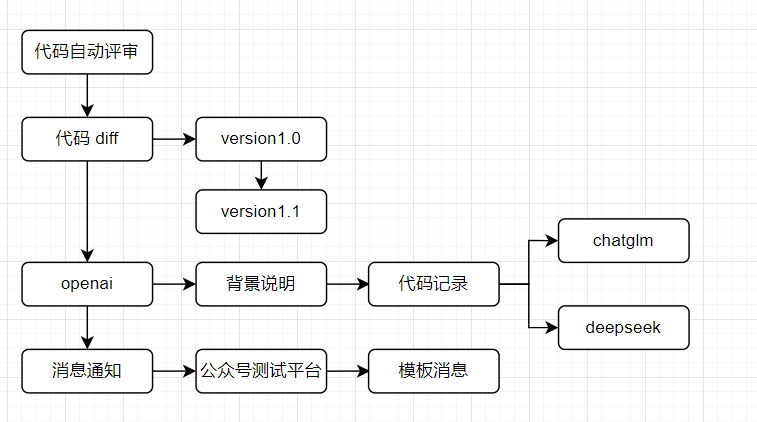
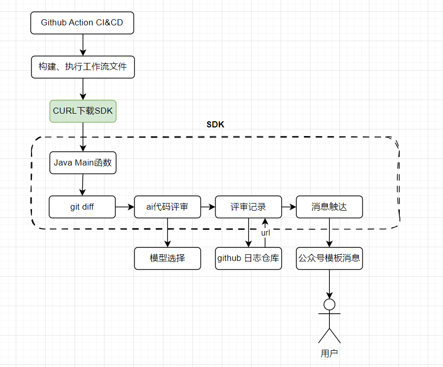
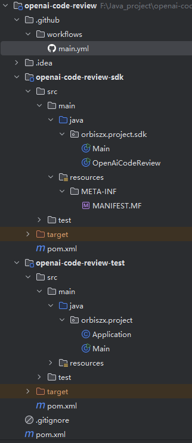
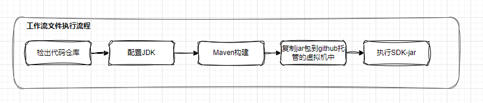
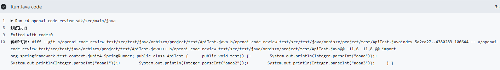
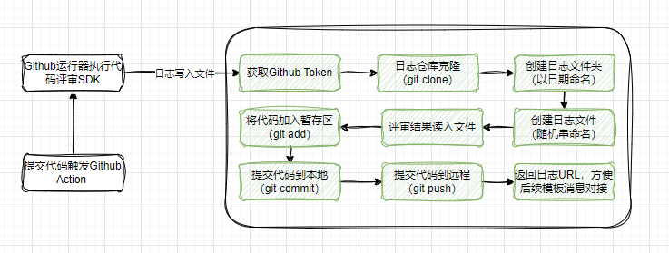
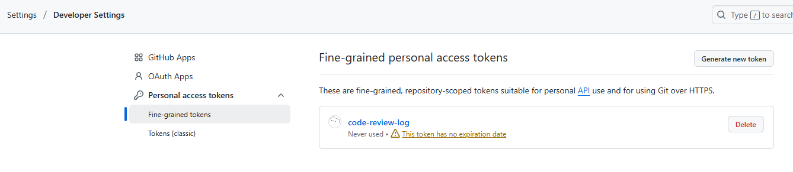
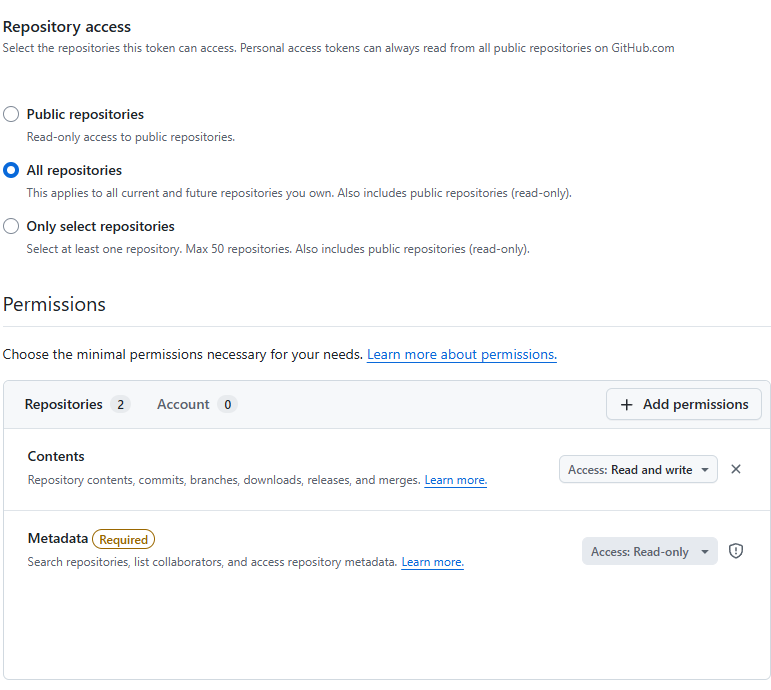
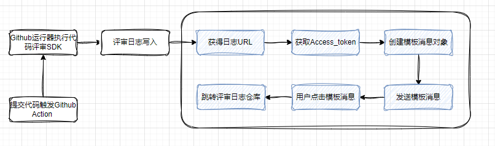

## 业务功能设计
本项目的目的是实现一个动态代码评审SDK，动态代码评审需要什么？
- git diff：评审两次提交的差异记录
- openai：通过LLM去分析评审代码变化记录，根据设置好的提示词（prompt），告诉LLM需要注意哪些点，如何评审以及从哪种视角出发去评审，检测是否有风险等等，再把结果返回
- 通知：评审结果需要通知，简单的可以通过公众号测试平台，对于企业订阅号可以根据具体的消息模板设置

大致流程如下：


那么问题就来了，`SDK`创建好了，由谁来调用这个组件实现这一套流程呢
1. 直接在业务工程中引入这个SDK包，哪个工程需要自动评审的功能引入该`SDK`即可，但是每个工程都需要引入，代码侵入性高；
2. `GitHub Actions` `CI&CD`, 将`Github Action`看成一台云服务器，它可通过拉取镜像系统文件来执行我们的脚本文件，这里的文件就是上面的workflow文件；
3. webhook 钩子，提供一个配置接口，去调用服务实现流程，需要云服务器部署服务。

前两种都存在一定不足，所以作者使用了第三种，那么SDK是如何与`Github Action`关联的呢，流程如下：

需要使用代码自动评审的用户通过`CURL`下载`SDK`到本地，以`jar`包的方式执行调用`SDK`的`Main`函数。
>关于什么是CURL?，C表示的是客户端client，其是一款开源的命令行工具与库，几乎覆盖所有常见的网络协议（HTTP、HTTPS、FTP等等），起作用如下：
> - 1）API接口测试，可以通过命令行发送GET/POST/DELETE/PUT请求；
> - 2）下载或上传文件，这里我们使用的就是该功能；
> - 3）提交表单数据；
> - 4）自动化脚本；
> - 5）检测网络问题；

检出提交记录：连接git，检出当前所有的分支或所有代码的变更记录.

评审记录:把评审记录写道自建的log日志仓库中，并把url地址返回给通知.

整个功能流程实现中最关键的在于prompt的设计和llm的调用


<span style="color:#ff6600">**功能扩展：**</span>
自己写一个issue需求说明，让llm来完成功能实现，并创建分支，进行编码写好mock测试，与需求说明对比提交，再合并代码。

## 项目背景知识
### 1、CI&CD
`CI&CD`是持续集成(`Continuous Integration`)、持续交付(`Continuous Delivery`)的简称，旨在通过自动化的流程与工具，提高软件开发的效率、质量和交付速度。
#### 1.1 CI
`CI`意为持续集成，其操作就是频繁的将代码提交到主干；持续集成的目的是为了快速迭代，同时保证代码的质量；使用git多方协作，提交代码分支以及分支合并的过程就是持续集成的思想所在。

持续集成的过程为：在协同开发中，每个人都有自己负责的模块，也有可能一个人负责多个模块。所有的代码由版本控制工具集成在共享存储库中，开发人员由自己的需求创建分支，开发完成后需要提交分支代码并且将代码合并到主分支，这时就需要解决代码冲突的问题，可以通过`code review`即代码评审的方式，一旦提交请求合并到主分支。自动化构建共聚就会根据流程自动编译构建安装应用，并执行单元测试框架的自动化测试来校验提交的修改。

`CI`中使用的关键组件有：
1. 版本控制系统，如·`Git`；
2. 自动化构建工具，如`jenkins`，每次提交代码之后自动构建的过程；
3. 单元测试框架，如`junit`框架，目的是为了确保基础功能在集成之后仍然有效；

#### 1.2 CD
`CD`意为持续交付，可以看作持续集成的下一阶段，其操作是不断将软件的新版本，交给软件项目质量检查团，以供评审；持续交付的目的是无论软件迭代多少个版本，都可以随时交付；

此时持续交付的代码已经在主分支上了，随时可以通过自动部署工具部署在服务器上。并且监控不同环境（开发、测试、生产）的项目状态。

`CD`中使用的关键组件有：
1. 自动部署工具，如常用的`Docker`、`Docker-Compose`、`K8s`等等；
2. 环境配置工具，如`Terraform`，确保不同环境（开发、测试、生产）的一致性；
3. 持续监控及反馈，目的是在项目部署之后监控项目的状态，如普罗米修斯（`Prometheus`）、`Grafana`；

与之相关的还有持续部署（`Continuous Deployment`）的概念，就是在通过评审之后，项目完成自动化的部署，持续部署可以看作持续交付的下一个阶段；持续部署的目的是，项目在任何时刻都是可以部署的，可以立刻投入生产阶段；

### 2、Github Action
采用`CI/CD`可以通过自动化流程和工具帮你构建应用、测试应用、部署应用，将你的应用交给流程工具来管理，实现自动触发、验证、部署等等，从而减少人力成本，提高交付质量与效率；这在敏捷开发与`DevOps`中扮演者重要的角色；

`Github Action`就是`Github`开发的一款实现持续集成交付的自动化流程工具组件，用户可以通过`yaml`配置文件来构建执行`CI/CD`流水线，并可以在触发不同事件（如代码的提交、推送、合并）时执行这些自动流程；而这种事件触发机制就是代码仓库的`Hook`;可以将`github action`看成一台免费的服务器，可以在上面执行自动化流程命令；

官方文档：https://docs.github.com/zh/actions/get-started/quickstart

Github Action中的几个核心概念为：
1. WorkFlow(工作流)：workflow是Github Action任务执行的基本单位， 
2. job(任务)：一个workflow由一个或多个jobs构成，含义是一次持续集成的运行； 
3. step(步骤)：一个job由多个step组成，一步步完成； 
4. action(动作)：每个step可以依次执行一个或多个命令；

#### 2.1 工作流文件编写
工作流文件是yaml格式，文件的大致内容可能为： 
1. 指定工作流名称，在Action的任务中以该名展示； 
2. on来指定工作流触发条件（Hook钩子触发机制），例如在代码push到master分支时执行； 
3. job编写工作流程，是工作流文件的核心，一个工作流文件可以执行多个job，一个job下有至少一个step;
```yaml
# 1、工作流名称
name:
# 2、工作流触发条件
on:
# 3、具体工作任务
job1:
    step1:
    step2:
job2:
    step1:
    step2:    
```

>注意：工作流文件需要放在指定目录下，才能被github识别然后自动执行，目录结构为：/.github/workflows/
> 

## SDK工程搭建
项目的基本结构如下：

项目包含创建两个模块
- `SDK`：功能实现模块，github action调用该模块实现code review
- `test`：项目中的功能测试模块，引入 SDK 与常用依赖，提供最小化的入口与测试骨架，方便在不影响主模块的情况下验证 SDK 或框架配置。

**注意**：`SDK`模块最终会被打包成jar包，该模块所需要的`Maven`以来也需要同时打包，为了保证环境的一致性，避免使用时还需要去重新加载依赖项目，这里需要配置需要打包的依赖如下
```xml
<!-- 如果你用了三方jar，不想一个个确定的引入，可以去掉 configuration 以及以内的配置，这样会全部打包 -->
<configuration>
    <artifactSet>
        <includes>
            <include>com.google.guava:guava:jar:</include>
            <include>com.alibaba.fastjson2:fastjson2:jar:</include>
            <include>org.slf4j:slf4j-api:jar:</include>
            <include>org.slf4j:slf4j-simple:jar:</include>
            <include>com.auth0:java-jwt:jar:</include>
            <include>com.fasterxml.jackson.core:jackson-core:</include>
            <include>com.fasterxml.jackson.core:jackson-databind:</include>
            <include>com.fasterxml.jackson.core:jackson-annotations:</include>
            <include>org.eclipse.jgit:org.eclipse.jgit:</include>
        </includes>
    </artifactSet>
</configuration>
```

## Maven构建与脚本执行
为了测试模拟其他工程使用该SDK的场景，需要创建一个新的工作流文件（workflow），执行流程如下


对应的`workflow`文件为：
```YAML
# 1、工作流文件名称
name: Build and Run Openai-Code-Review By Main Maven Jar

# 2、触发规则
on:
  push:
    branches:
      - '*'
  pull_request:
    branches:
      - '*'

# 3、构建任务, 其中检出代码与配置JDK环境是通用的
jobs:
  build:
    runs-on: ubuntu-latest # 使用ubuntu最新版本虚拟机

    steps:
      - name: Checkout repository  # 检出代码
        uses: actions/checkout@v3
        with:
          fetch-depth: 2

      - name: Setup JDK 17   # 配置JDK环境
        uses: actions/setup-java@v3
        with:
          distribution: 'adopt'
          java-version: '17'

      - name: Build with Maven  # 编译构建Maven
        run: mvn clean install

      - name: Copy Openai-Code-Review-SDK JAR  # 复制JAR包
        run: mvn dependency:copy -Dartifact=com.lz:openai-code-review-sdk:1.0 -DoutputDirectory=./libs

      - name: Run Code Review  # 运行SDK的jar包
        run: java -jar ./libs/openai-code-review-sdk-1.0.jar
```
`steps`中的五个步骤就对应上图中的五个流程。
>一个 .yml 文件对应一个 workflow，也就是一次持续集成。一个 GitHub 仓库可以包含多个 workflow，只要是在 .github/workflow 目录下的 .yml 文件都会被 GitHub 执行。

<span style="color:#ff6600">**扩展：**</span>可以参考市场中共享的actions去包装完善、创新自己的action，并且可以将我们的共享actions给其他人使用。

具体检出`diff`的代码为：
```java
public class OpenAiCodeReview {
    public static void main(String[] args) throws Exception{
        System.out.println("开始CI/CD");
        // 1.检出代码diff,
        ProcessBuilder processBuilder = new ProcessBuilder("git", "diff", "HEAD~1", "HEAD");
        processBuilder.directory(new File("."));
        Process process = processBuilder.start();
        
        BufferedReader reader = new BufferedReader(new InputStreamReader((process.getInputStream())));
        String line;
        StringBuilder diffCode = new StringBuilder();
        while((line = reader.readLine()) != null) {
            diffCode.append(line).append('\n');
        }
        
        int exitCode = process.waitFor();
        System.out.println("Exited with code:" + exitCode);
        System.out.println("评审代码: " + diffCode);
    }

}
```
>`PricessBuilder`是Java中用来创建与管理操作系统的类，它允许你在Java程序中启动外部程序（如命令行、脚本或者其他可执行文件），并与其进行交互（例如传递输入、捕获输出或错误流）。相比传统的`Runtime.exec()`，`ProcessBuilder`提供了更灵活且安全的进程控制方式；

提交代码到github上，就可以观察到`github Action`的执行流程,获取到最近两次提交变更代码的字符串。AI代码评审的本质就是将这种字符串传递给AI大模型，让大模型替我们进行整理、归纳、总结。



## 大模型对接-ChatGlm
### 流程分析
本节主要任务是对接`ChatGlm`大模型，代码评审的本质就是将用户提供的`code diff`交给大模型做理解分析，最后返回评审结果;

智谱官方文档：https://www.bigmodel.cn/dev/api/normal-model/glm-4

对接时，作者并没有直接引入`SDK`包，而是通过Java原生API与原生网络请求来搭建了一个简单的组件项目，不使用如Lombok、OkHttp等外部组件，如果引入过多的依赖与SDK，会使得本来轻量的组件显得臃肿，不符合我们开发的初衷；

等开发完成`OpenAiSDK`组件后，再引入`SDK`对接，直接一步到位对接其他的大模型。

关于接口对接鉴权，智谱提供了两种鉴权方式：
- ApiKey鉴权
- Token鉴权

出于安全考虑，这里采用了Token鉴权方式，使用JWT签名.
>1. ApiKey鉴权，通过一个静态的字符串来表示请求方的身份，无状态且长期有效，但是安全性低；
>2. Token鉴权，Token 是一个 动态的凭证（如 JWT、OAuth2 Token），通常在用户登录后由服务端动态生成，包含身份信息、有效期和签名，用于临时授权。安全性高，可进行加密、刷新等操作；

### 代码实现
首先创建一个工具类`BearerTokenUtils`, 通过对`ApiKey`密钥结构拆分，然后通过`JWT`签名的方式生成`token`,
```JAVA
public class BearerTokenUtils {

    // 过期时间：默认30分钟
    private static final long expireMillis = 30*60*1000L;

    // 缓存服务
    public static Cache<String,String> cache = CacheBuilder.newBuilder()
            .expireAfterWrite(expireMillis - (60*1000L), TimeUnit.MILLISECONDS)
            .build();

    public static String getToken(String apiKeySecret){
        String[] split = apiKeySecret.split("\\.");
        return getToken(split[0],split[1]);
    }

    public static String getToken(String apiKey,String apiSecret){
        //缓存Token
        String token = cache.getIfPresent(apiKey);
        if(null!=token) return token;
        //创建Token
        Algorithm algorithm = Algorithm.HMAC256(apiSecret.getBytes(StandardCharsets.UTF_8));
        Map<String, Object> payload = new HashMap<>();
        payload.put("api_key",apiKey);
        payload.put("exp",System.currentTimeMillis()+expireMillis);
        payload.put("timestamp", Calendar.getInstance().getTimeInMillis());
        Map<String,Object> headerClaims = new HashMap<>();
        headerClaims.put("alg","HS256");
        headerClaims.put("sign_type","SIGN");
        token = JWT.create().withPayload(payload).withHeader(headerClaims).sign(algorithm);
        cache.put(apiKey, token);
        return token;
    }
}
```
接着根据模型对接文档创建模型请求与响应对象，只保留我们需要的关键属性，十分简洁；
- **请求对象**
```JAVA
public class ChatCompletionRequest {
    private String model = Model.GLM_4_5_Air.getCode();
    private List<Prompt> messages;


    public static class Prompt{
        private String role;
        private String content;

        public Prompt(){

        }
        public Prompt(String role,String content){
            this.role = role;
            this.content = content;
        }

        ... getter and setter

    }
    ... getter and setter

} 
```
- 响应对象
```java
public class ChatCompletionSyncResponse {
    private List<Choice> choices;
    public static class Choice{
        private Message message;
        public Message getMessage() {
            return message;
        }
        public void setMessage(Message message) {
            this.message = message;
        }

    }

    public static class Message{
        private String role;
        private String content;

        public String getRole() {
            return role;
        }
        public String getContent() {
            return content;
        }
        public void setRole(String role) {
            this.role = role;
        }
        public void setContent(String content) {
            this.content = content;
        }

    }
    public List<Choice> getChoices() {
        return choices;
    }
    public void setChoices(List<Choice> choices) {
        this.choices = choices;
    }

}
```

然后就是通过Java原生网络Api发送Http请求到`ChatGlm`，然后通过流读取评审结果；
```java
private static String codeReview(String diffCode)throws Exception{
        String apiKey = System.getenv("GLM_KEY");
        //String apiKey = "a96e4f3b1ac040859ab86fdfc7bcdede.QpOgtBdp83eRWQMd";
        String token = BearerTokenUtils.getToken(apiKey);

        URL url = new URL("https://open.bigmodel.cn/api/paas/v4/chat/completions");
        HttpURLConnection connection = (HttpURLConnection) url.openConnection();
        connection.setRequestMethod("POST");
        connection.setRequestProperty("Authorization", "Bearer " + token);
        connection.setRequestProperty("Content-Type","application/json");
        connection.setRequestProperty("User-Agent","Mozilla/4.0 (compatible; MSIE 5.0; Windows NT; DigExt)");
        connection.setDoOutput(true);

        ChatCompletionRequest chatCompletionRequest = new ChatCompletionRequest();
        chatCompletionRequest.setModel(Model.GLM_4_5_Air.getCode());
        chatCompletionRequest.setMessages(new ArrayList<ChatCompletionRequest.Prompt>(){
            private static final long serialVersionUID = -7988151926241837899L;
            {
                add(new ChatCompletionRequest.Prompt("user","你是一个高级编程架构师，精通各类场景方案、架构设计和编程语言请，请您根据git diff记录，对代码做出评审。代码如下: " ));
                add(new ChatCompletionRequest.Prompt("user",diffCode));
            }
        });


        try(OutputStream os = connection.getOutputStream()){
            byte[] input = JSON.toJSONString(chatCompletionRequest).getBytes(StandardCharsets.UTF_8);
            os.write(input);
        }

        int responseCode = connection.getResponseCode();
        System.out.println("Response Code: " + responseCode);

        BufferedReader in = new BufferedReader(new InputStreamReader(connection.getInputStream()));
        String inputLine;

        StringBuilder context = new StringBuilder();
        while ((inputLine=in.readLine())!=null){
            context.append(inputLine);
        }
        in.close();;
        connection.disconnect();
        System.out.println("评审结果："+context.toString());

        ChatCompletionSyncResponse response = JSON.parseObject(context.toString(), ChatCompletionSyncResponse.class);
        return response.getChoices().get(0).getMessage().getContent();
    }
```
代码中使用`System.getenv()`从环境变量中获取密钥信息，相较之硬编码到程序里更安全一些。
当通过Github的`workflow`执行时，密钥的信息可以在Github的`Environment secret`中维护（工程仓库 Settings → Secrets and variables → Actions），需要更改下`workflow`脚本
```yawl
jobs:
  build:
    runs-on: ubuntu-latest
    environment: GLM_KEY       # 这里是环境名
    ...
    
    ...
      - name: Run Code Review
        env:
          GLM_KEY: ${{ secrets.GLM_KEY }}

        run: java -jar ./libs/openai-code-review-sdk-1.0.jar
```

整个流程即为：修改测试模块中的代码，并提交到github，通过`ProcessBuilder`拿到`code diff`之后，调用大模型评审，返回并输出评审结果；

## 评审日志处理
### 流程分析
虽然接入大模型得到了评审结果，但其评审记录只能在`Github Action`中看到，每一次工作流文件执行都会创建一个新的`Runner`环境，之前的评审记录就丢失了；

本节的任务就是保存评审记录，将评审记录保存在`Github`日志仓库，这就涉及到`git`的操作，并且需要在Java代码中操作`git`;需要使用到`jgit`组件，用于在Java中操作`git`;
```yaml
<dependency>
    <groupId>org.eclipse.jgit</groupId>
    <artifactId>org.eclipse.jgit</artifactId>
    <version>6.6.1.202309021850-r</version>
</dependency>
```

日志处理流程图如下：


### 代码实现
在操作git时需要做身份校验，会使用到`github`的token，在S`ettings`里创建



然后将其配置在`Repository secret`中，方便SDK通过工作流读取，并将其加入`workflow`的环境变量中。
```yaml
- name: Run Code Review
  env:
    GLM_KEY: ${{ secrets.GLM_KEY }}
    GITHUB_TOKEN: ${{ secrets.CODE_TOKEN }}
```

那么日志存储的代码为：
```java
/**
* 日志文件存储
* @param token
* @param log
* @return
* @throws Exception
*/
private static String writeLog(String token, String log) throws Exception{
    Git git = Git.cloneRepository()
            .setURI("https://github.com/orbisz/openai-code-review-log.git")
            .setDirectory(new File("repo"))
            .setCredentialsProvider(new UsernamePasswordCredentialsProvider(token, ""))
            .call();

    String dateFolderName = new SimpleDateFormat("yyyy-MM-dd").format(new Date());
    File dateFolder = new File("repo/" + dateFolderName);
    if (!dateFolder.exists()){
        dateFolder.mkdirs();
    }
    String fileName = generateRandomString(12) + ".md";
    File newFile = new File(dateFolder, fileName);
    try(FileWriter writer = new FileWriter(newFile)){
        writer.write(log);
    }
    git.add().addFilepattern(dateFolderName+"/"+fileName).call();
    git.commit().setMessage("Add new file via GitHub Actions").call();
    git.push().setCredentialsProvider(new UsernamePasswordCredentialsProvider(token, "")).call();

    System.out.println("Changes have been pushed to the repository.");
    return "https://github.com/orbisz/openai-code-review-log/blob/master/"+dateFolderName+"/"+fileName;
}

/**
 * 生成指定长度的随机字符串
 * @param length
 * @return
 */
private static String generateRandomString(int length) {
    String characters = "ABCDEFGHIJKLMNOPQRSTUVWXYZabcdefghijklmnopqrstuvwxyz0123456789";
    StringBuilder sb = new StringBuilder(length);
    for (int i = 0; i < length; i++) {
        int index = (int) (Math.random() * characters.length());
        sb.append(characters.charAt(index));
    }
    return sb.toString();
}
```

上述日志文件的命名是一个12位随机字符串，没有区分度，考虑拼接提交者信息、提交仓库、提交分支、提交日期等信息；

**通过执行git相关命令**

`git log`命令的作用是查看提交历史版本，而`git branch`则是可以操作分支，查询文档后，于是产生以下两条命令：
```bash
git log -1 --pretty=%cn  # 查看分支的提交者
git branch --show-current  # 查看当前的分支
```
那么修改后的工作流文件为：
```yaml
- name: Get Commit Author  # 获取提交人的信息
  run: echo "COMMIT_AUTHOR=$(git log -1 --pretty=%cn)" >> $GITHUB_ENV

- name: Get Commit Branch  # 获取提交的分支名
  run: echo "COMMIT_BRANCH=$(git branch --show-current)" >> $GITHUB_ENV


- name: Copy openai-code-review-sdk JAR
  run: mvn dependency:copy -Dartifact=orbiszx.project:openai-code-review-sdk:1.0 -DoutputDirectory=./libs

- name: Run Code Review
  env:
    GLM_KEY: ${{ secrets.GLM_KEY }}
    GITHUB_TOKEN: ${{ secrets.CODE_TOKEN }}
    COMMIT_AUTHOR: ${{env.COMMIT_AUTHOR}}
    COMMIT_BRANCH: ${{env.COMMIT_BRANCH}}
    REPOSITORY:    ${{ github.repository }}  #  提交仓库名
```
修改后的业务代码为：这里使用提交者 + 提交仓库名 + 提交分支 + 4位随机字符串的方式命名文件。
```java
String commitAuthor = System.getenv("COMMIT_AUTHOR");
        String commitBranch = System.getenv("COMMIT_BRANCH");
        String repo = System.getenv("REPOSITORY");
        int idx = repo.indexOf('/');
        String repository = (idx >= 0 && idx < repo.length() - 1)
                ? repo.substring(idx + 1)
                : repo;
        String fileName = commitAuthor + "-" + repository + "-" + commitBranch + "-" + generateRandomString(4) + ".md";
```

## 微信模板消息对接
### 流程分析
本节的任务就是对接微信Api发送模板消息，该节的流程如下：


### 代码实现
代码中所需要的微信公众号appid、模板消息id都可以在微信公众平台获取。微信公众平台：https://mp.weixin.qq.com/debug/cgi-bin/sandbox?t=sandbox/login

首先对接微信公众号测试平台，需要得到`access_token`，是后面调用接口的唯一凭证；这里作者提供了一个工具类用来获得`access_token`
>Access Token是公众号调用微信平台API时必须的全局唯一凭证，有效期为2小时，需定期刷新。
```java
public class WXAccessTokenUtils {
    private static final String APPID = "";
    private static final String SECRET = "";
    private static final String GRANT_TYPE = "client_credential";
    private static final String URL_TEMPLATE = "https://api.weixin.qq.com/cgi-bin/token?grant_type=%s&appid=%s&secret=%s";

    public static String getAccessToken(){
        try{
            String urlString = String.format(URL_TEMPLATE, GRANT_TYPE, APPID, SECRET);
            URL url = new URL(urlString);
            HttpURLConnection connection = (HttpURLConnection) url.openConnection();
            connection.setRequestMethod("GET");

            int responseCode = connection.getResponseCode();
            System.out.println("Response Code:"+responseCode);

            if(responseCode == HttpURLConnection.HTTP_OK){
                BufferedReader in = new BufferedReader((new InputStreamReader(connection.getInputStream())));
                String inputLine;
                StringBuilder response = new StringBuilder();

                while ((inputLine = in.readLine())!=null){
                    response.append(inputLine);
                }
                in.close();

                System.out.println("Response:"+response.toString());

                Token token = JSON.parseObject(response.toString(),Token.class);

                return token.getAccess_token();
            }else{
                System.out.println("GET request failed");
                return null;
            }
        }catch (Exception e){
            e.printStackTrace();
            return null;
        }
    }
    public static class Token{
        private String access_token;
        private Integer expires_in;

        public String getAccess_token() {
            return access_token;
        }
        public void setAccess_token(String access_token) {
            this.access_token = access_token;
        }
        public Integer getExpires_in() {
            return expires_in;
        }
        public void setExpires_in(Integer expires_in) {
            this.expires_in = expires_in;
        }
    }
}
```
然后创建了实体Message，用于承接模板消息，其中每一个param都需要对应模板消息中的DATA数据
```java


public class Message {

    private String touser = "";
    private String template_id = "";
    private String url = "";
    private Map<String, Map<String, String>> data = new HashMap<>();

    public void put(String key, String value) {
        data.put(key, new HashMap<>() {
            private static final long serialVersionUID = 7092338402387318563L;
            {
                put("value", value);
            }
        });
    }
    ... setter and getter
}
```
发送模板消息的代码为：
```java
/**
 * 微信公众号消息通知
 * @param logUrl
 */
private static void pushMessage(String logUrl){
    String accessToken = WXAccessTokenUtils.getAccessToken();
    System.out.println(accessToken);

    String repo = System.getenv("REPOSITORY");
    int idx = repo.indexOf('/');
    String repository = (idx >= 0 && idx < repo.length() - 1)
            ? repo.substring(idx + 1)
            : repo;
    Message message = new Message();
    message.put("project",repository);
    message.put("author",System.getenv("COMMIT_AUTHOR"));
    message.put("branch",System.getenv("COMMIT_BRANCH"));
    message.put("review",logUrl);
    message.setUrl(logUrl);

    String url = String.format("https://api.weixin.qq.com/cgi-bin/message/template/send?access_token=%s",accessToken);

    sendPostRequest(url,JSON.toJSONString(message));
}

/**
 * 发送POST请求
 * @param urlString
 * @param jsonBody
 */
private static void sendPostRequest(String urlString, String jsonBody) {
    try {
        URL url = new URL(urlString);
        HttpURLConnection conn = (HttpURLConnection) url.openConnection();
        conn.setRequestMethod("POST");
        conn.setRequestProperty("Content-Type", "application/json; utf-8");
        conn.setRequestProperty("Accept", "application/json");
        conn.setDoOutput(true);

        try (OutputStream os = conn.getOutputStream()) {
            byte[] input = jsonBody.getBytes(StandardCharsets.UTF_8);
            os.write(input, 0, input.length);
        }

        try (Scanner scanner = new Scanner(conn.getInputStream(), StandardCharsets.UTF_8.name())) {
            String response = scanner.useDelimiter("\\A").next();
            System.out.println(response);
        }
    } catch (Exception e) {
        e.printStackTrace();
    }
}
```

**优化**：最终SDK是要给其它工程使用的，微信公众号appid、模板消息id、github仓库地址等参数，最终是需要从外界传入的，初步设想可以从环境变量中读取，将各个参数放置在`Github`的`Repository secret`中，在`workflow`文件中设置为环境变量，从而实现透传。

## 代码工程结构重构
结合开发过程中遇到的问题，我们需要重构工程，一是让功能结构更加合理，后续增加优化功能方便。二是让数据能由调用
SDK者传入；数据传入的方式就是在仓库中配置Action Secret，之后在工作流文件中读取即可；

### 代码实现
#### 1. 环境配置
需要传入的数据可以定义在`Github`的`Repository secret`中，在`workflow`文件中设置为环境变量，还有一些根据每次提交获取的信息，如仓库名、提交分支名、提交者、提交信息等，则通过github action上下文以及git log命令获取，那么修改后的工作流文件为：
```yaml
- name: Copy openai-code-review-sdk JAR
  run: mvn dependency:copy -Dartifact=orbiszx.project:openai-code-review-sdk:1.0 -DoutputDirectory=./libs

- name: Get repository name
  id: repo-name
  run: echo "REPO_NAME=${GITHUB_REPOSITORY##*/}" >> $GITHUB_ENV

- name: Get branch name
  id: branch-name
  run: echo "BRANCH_NAME=${GITHUB_REF#refs/heads/}" >> $GITHUB_ENV

- name: Get commit author
  id: commit-author
  run: echo "COMMIT_AUTHOR=$(git log -1 --pretty=format:'%an <%ae>')" >> $GITHUB_ENV

- name: Get commit message
  id: commit-message
  run: echo "COMMIT_MESSAGE=$(git log -1 --pretty=format:'%s')" >> $GITHUB_ENV

- name: Print repository, branch name, commit author, and commit message
  run: |
    echo "Repository name is ${{ env.REPO_NAME }}"
    echo "Branch name is ${{ env.BRANCH_NAME }}"
    echo "Commit author is ${{ env.COMMIT_AUTHOR }}"
    echo "Commit message is ${{ env.COMMIT_MESSAGE }}" 

- name: Run Code Review
  env:
    # Github 配置；GITHUB_REVIEW_LOG_URI「https://github.com/orbisz/openai-code-review-log」、GITHUB_TOKEN「https://github.com/settings/tokens」
    GITHUB_REVIEW_LOG_URI: ${{ secrets.CODE_REVIEW_LOG_URI }}
    GITHUB_TOKEN: ${{ secrets.CODE_TOKEN }}
    COMMIT_PROJECT: ${{ env.REPO_NAME }}
    COMMIT_BRANCH: ${{ env.BRANCH_NAME }}
    COMMIT_AUTHOR: ${{ env.COMMIT_AUTHOR }}
    COMMIT_MESSAGE: ${{ env.COMMIT_MESSAGE }}
    # 微信配置 「https://mp.weixin.qq.com/debug/cgi-bin/sandboxinfo?action=showinfo&t=sandbox/index」
    WEIXIN_APPID: ${{ secrets.WEIXIN_APPID }}
    WEIXIN_SECRET: ${{ secrets.WEIXIN_SECRET }}
    WEIXIN_TOUSER: ${{ secrets.WEIXIN_TOUSER }}
    WEIXIN_TEMPLATE_ID: ${{ secrets.WEIXIN_TEMPLATE_ID }}
    # OpenAi - ChatGLM 配置「https://open.bigmodel.cn/api/paas/v4/chat/completions」、「https://open.bigmodel.cn/usercenter/apikeys」
    CHATGLM_APIHOST: ${{ secrets.CHATGLM_APIHOST }}
    CHATGLM_APIKEYSECRET: ${{ secrets.CHATGLM_APIKEYSECRET }}
          
  run: java -jar ./libs/openai-code-review-sdk-1.0.jar
```
#### 2. 基础设施层
该层主要承接了以下内容：
- 1、git相关操作

获取代码差异：这里放弃了之前使用git diff HEAD HEAD~1来获取代码差异的方式，而是通过先获取当前提交的commit-id即哈希值，然后该哈希值来获取代码差异；
```java
/**
* 获取diffCode
*
* @return diffCode 代码差异
* @throws Exception
*/
public String diff() throws IOException, InterruptedException {
// 1.git log: 得到git上一次提交的hash, 使用git diff HEAD HEAD~1 HEAD的方式有时不可靠, %H指的是提交完整Hash值
ProcessBuilder logProcessBuilder = new ProcessBuilder("git", "log", "-1", "--pretty=format:%H");
logProcessBuilder.directory(new File("."));
Process logProcess = logProcessBuilder.start();

BufferedReader logReader = new BufferedReader(new InputStreamReader(logProcess.getInputStream()));
String latestCommitLogHash = logReader.readLine();  // 每次提交都会生成一个hash值, 用来标识这次提交
logReader.close();
logProcess.waitFor();

// 2.git diff: 获取代码diff
ProcessBuilder diffProcessBuilder = new ProcessBuilder("git", "diff", latestCommitLogHash + "^", latestCommitLogHash);
diffProcessBuilder.directory(new File("."));
Process diffProcess = diffProcessBuilder.start();

BufferedReader diffReader = new BufferedReader(new InputStreamReader(diffProcess.getInputStream()));
StringBuilder diffCode = new StringBuilder();
String line;
while((line = diffReader.readLine()) != null) {
diffCode.append(line).append("\n");
}
diffReader.close();

// 3.等待git diff执行完成
int waitCode = diffProcess.waitFor();
if (waitCode != 0) {
logger.info("failed to execute git diff and get code diff, waitCode:{}", waitCode);
}

// 4.返回diffCode
return diffCode.toString();
}
```
这里有一个git命令
```git
git log -1 --pretty=format:%H
```
这个命令是Git版本控制系统中用来获取最近一次提交的哈希值的命令。
- git log: 这是Git命令行工具中的一个基本命令，用于显示提交历史记录。 
- -1: 这是一个参数，用于指定要显示的提交历史记录的条目数量。在这里，-1 意味着只显示最近的一次提交。 
- --pretty=format:: 这是一个选项，用于控制提交信息的格式。format: 后面跟着的是一个格式化字符串。 
- %H: 这是一个格式化占位符，表示提交的哈希值。

执行这个命令后，将得到一个唯一的字符串，这个字符串表示Git仓库中最近一次提交的表示。

第二个命令
```giut
git diff e4759c3dfb2f3fd299d9b31a9e0a605f0b1b6d95^ e4759c3dfb2f3fd299d9b31a9e0a605f0b1b6d95 
```
这个命令是用来比较两个提交之间的差异的Git命令。
- git diff: 这是Git的一个命令，用于显示两个或多个提交、分支或文件之间的差异。
- e4759c3dfb2f3fd299d9b31a9e0a605f0b1b6d95: 这是第一个提交的哈希值，表示你想要查看其差异的提交。
- ^: 在Git中，^ 符号用于引用当前分支的最近一次提交。如果前面有数字，它会引用该分支的第N个最近提交。在这个命令中，^ 指的是最新提交。
- e4759c3dfb2f3fd299d9b31a9e0a605f0b1b6d95: 这是第二个提交的哈希值，也是你想要查看其差异的提交。


提交评审日志到日志仓库：这里需要返回日志URI给后续发送模板消息；
```java
/**
 * 提交日志并推送到远程仓库
 *
 * @param reviewLog 评审日志
 * @return logURL 评审结果路径
 * @Expection GitAPIException
 */
public String commitAndPush(String reviewLog) throws Exception {
    // 1.克隆日志仓库
    Git git = Git.cloneRepository()
            .setURI(githubCommitLogUri)
            .setDirectory(new File("repo"))
            .setCredentialsProvider(new UsernamePasswordCredentialsProvider(githubToken, ""))
            .call();

    // 2.创建日志文件夹
    String dateFolderName = new SimpleDateFormat("yyyy-mm-dd").format(new Date());
    File dateFolder = new File("repo/" + dateFolderName);
    if (!dateFolder.exists()) { // 如果不存在则创建
        dateFolder.mkdirs();
    }

    // 3.创建日志文件&写入日志
    String fileName = project + "-" + branch + "-" + author + System.currentTimeMillis() + "-" + RandomUtil.randomString(4) + ".md";
    File file = new File(dateFolder, fileName);
    try (FileWriter writer = new FileWriter(file)) {
        writer.write(reviewLog);
    }

    // 4.将文件添加到暂存区并提交
    git.add().addFilepattern(dateFolderName + "/" + fileName).call();
    git.commit().setMessage("Add new file via Github Actions").call();
    git.push().setCredentialsProvider(new UsernamePasswordCredentialsProvider(githubToken, "")).call();

    logger.info("openai-code-review push and commit done!, fileName:{}", fileName);

    // 5.返回日志路径方便后续模板消息使用
    return githubCommitLogUri + "/blob/main/" + dateFolderName + "/" + fileName;
}
```
- 2、AI代码评审 

接口定义，后面需要对接其它大模型，只需要新建一个类实现该接口即可（扩展开放），而不需要修改代码（修改关闭），满足开闭原则；
```java
/**
 * @Author: Lz
 * Date: 2025/3/9 22:50
 * Module function: openai接口, 定义规范方法, 可以接入不同的大模型
 */
public interface IOpenAi {

    ChatCompletionSyncResponseDTO completion(ChatCompletionRequestDTO requestDTO) throws Exception;
}
```
接口实现
```java
/**
 * openai实例-ChatGlm
 *
 * @param requestDTO
 * @return
 * @throws Exception
 */
@Override
public ChatCompletionSyncResponseDTO completion(ChatCompletionRequestDTO requestDTO) throws Exception {
    String token = BearerTokenUtils.getToken(apiSecretKey);
    // 1.创建HTTP连接对象
    URL url = new URL(apiHost);
    HttpURLConnection connection = (HttpURLConnection) url.openConnection();
    connection.setRequestMethod("POST");
    connection.setRequestProperty("Authorization", token);
    connection.setRequestProperty("Content-type", "application/json; utf-8");
    connection.setRequestProperty("Accept", "application/json");
    connection.setRequestProperty("User-Agent", "Mozilla/4.0 (compatible; MSIE 5.0; Windows NT; DigExt)");
    connection.setDoOutput(true);

    // 2.读取响应数据
    try (OutputStream os = connection.getOutputStream()) {
        byte[] input = JSON.toJSONString(requestDTO).getBytes(StandardCharsets.UTF_8);
        os.write(input, 0, input.length);
    }

    // 3.处理响应结果
    BufferedReader reader = new BufferedReader(new InputStreamReader(connection.getInputStream()));
    StringBuilder content = new StringBuilder();
    String line;
    while ((line = reader.readLine()) != null) {
        content.append(line).append("\n");
    }
    reader.close();

    // 4.返回响应结果
    return JSON.parseObject(content.toString(), ChatCompletionSyncResponseDTO.class);
}
```
- 3、微信公众号对接

发送模板消息：
```java
/**
 * 发送微信模板消息
 *
 * @param logUrl 日志评审日子, 不是发送微信模板消息的URL！！！
 * @param data 模板消息数据
 * @throws Exception
 */
public void sendTemplateMessage(String logUrl, Map<String, Map<String, String>> data) throws Exception {
    // 1.获取access_token
    String accessToken = WXAccessTokenUtils.getAccessToken(appId, appSecret);
    URL url = new URL("https://api.weixin.qq.com/cgi-bin/message/template/send?access_token=" + accessToken);
    HttpURLConnection connection = (HttpURLConnection) url.openConnection();
    connection.setRequestMethod("POST");;
    connection.setRequestProperty("Content-Type", "application/json; utf-8");
    connection.setRequestProperty("Accept", "application/json");
    connection.setDoOutput(true);

    // 2.创建模板消息对象
    TemplateMessageDTO templateMessageDTO = new TemplateMessageDTO();
    templateMessageDTO.setUrl(logUrl);
    templateMessageDTO.setData(data);

    // 3.发送模板消息, 即将消息以字节形式写入输入流, 然后发送到服务器(微信)
    // 这里使用try-with-resources语法, 确保流关闭
    try (OutputStream os = connection.getOutputStream()) {
        byte[] input = JSON.toJSONString(templateMessageDTO).getBytes(StandardCharsets.UTF_8);
        os.write(input, 0, input.length);
    }

    // 4.响应结果解析, 即通过Scanner从输入流中读取数据
    try (Scanner scanner = new Scanner(connection.getInputStream(), StandardCharsets.UTF_8.name())) {
        String response = scanner.useDelimiter("\\A").next(); // 确保读出所有响应数据
        logger.info("openai-code-review weixin TemplateMessage response:{}", response);
    }
}
```
#### 3. 领域层
本层使用了模板设计模式，将代码评审的过程拆分成多个步骤，在抽象类中定义了代码评审流程的骨架，而具体的功能由其子类实现；相比较MVC中Service层一直都是万年不变的接口 + 实现类，抽象类的优势是什么：
1. 固化流程：使用了模板设计模式，在抽象类中定义了代码评审的固定流程，而子类就只需要关注具体步骤的实现，而不需要关注整体流程； 
2. 复用公共逻辑：如依赖注入、异常处理、日志处理等等； 
3. 扩展性高：后续如果需要实现其它git平台的代码评审，直接创建子类实现抽象类中的方法即可，而不需要关注具体流程，同时这也符合开闭原则； 
4. 但是并不是所有场景都适合，简单、规模较小或对扩展性要求不高的场景，就可以考虑直接使用接口+实现类的模式，避免不必要的分层；
  
那么具体的代码实现为：
- 接口
```java
/**
 * @Author: Lz
 * Date: 2025/3/9 16:36
 * Module function: 评审服务接口
 */
public interface IOpenAiCodeReviewService {

    void exec();
} 
```
- 抽象类

其中的exec就是一个模板方法，定义了代码评审流程的骨架，并且在这里统一做了异常处理；
```java
/**
 * @Author: Lz
 * Date: 2025/3/9 16:36
 * Module function: 代码评审服务抽象类-用于定义模板, 就是流程, 具体实现由子类去做
 */
public abstract class AbstractOpenAiCodeReviewService implements IOpenAiCodeReviewService{
    private final Logger logger = (Logger)LoggerFactory.getLogger(AbstractOpenAiCodeReviewService.class);

    protected final GitCommand gitCommand;

    protected final IOpenAi openAi;

    protected final WeiXin weiXin;

    public AbstractOpenAiCodeReviewService(GitCommand gitCommand, IOpenAi openAi, WeiXin weiXin) {
        this.gitCommand = gitCommand;
        this.openAi = openAi;
        this.weiXin = weiXin;
    }

    /**
     * 定义执行流程
     */
    @Override
    public void exec() {
        try {
            // 1.获得提交代码: 返回diff_code
            String diffCode = getDiffCode();
            // 2.代码评审记录: 返回评审日志
            String log = codeReview(diffCode);
            // 3.评审记录保存: 返回评审日志URL
            String logUrl = recordCodeReview(log);
            // 4.发送消息通知: 模板消息, 评审日志
            pushMessage(logUrl);
        } catch(Exception e) {
            logger.info("openai-code-review error: " + e);
        }
    }

    protected abstract String getDiffCode() throws Exception;

    protected abstract String codeReview(String diffCode) throws Exception;

    protected abstract String recordCodeReview(String log) throws Exception;

    protected abstract void pushMessage(String logUrl) throws Exception;
```
- 实现类
```java
public class OpenAiCodeReviewService extends AbstractOpenAiCodeReviewService {

    public OpenAiCodeReviewService(GitCommand gitCommand, IOpenAi openAi, WeiXin weiXin) {
        super(gitCommand, openAi, weiXin);
    }

    /**
     * 获取diffCode
     *
     * @return diffCode
     * @throws Exception
     */
    @Override
    protected String getDiffCode() throws Exception {
        return gitCommand.diff();
    }

    /**
     * 代码评审
     *
     * @param diffCode
     * @return 代码评审结果 log
     * @throws Exception
     */
    @Override
    protected String codeReview(String diffCode) throws Exception {
        // 构造Request请求对象
        ChatCompletionRequestDTO requestDTO = new ChatCompletionRequestDTO();
        requestDTO.setModel(Model.GLM_4_FLASH.getCode());
        requestDTO.setMessages(new ArrayList<>() {
            private static final long serialVersionUID = -7988151926241837899L;
            {
                add(new ChatCompletionRequestDTO.Prompt("user", "你是一个高级编程架构师，精通各类场景方案、架构设计和编程语言请，请您根据git diff记录，对代码做出评审。代码如下:"));
                add(new ChatCompletionRequestDTO.Prompt("user", diffCode));
            }
        });
        ChatCompletionSyncResponseDTO completion = openAi.completion(requestDTO);
        ChatCompletionSyncResponseDTO.Message message = completion.getChoices().get(0).getMessage();
        return message.getContent();
    }

    /**
     * 代码评审日志写入
     *
     * @param log
     * @return logUrl
     * @throws Exception
     */
    @Override
    protected String recordCodeReview(String log) throws Exception {
        return gitCommand.commitAndPush(log);
    }

    /**
     * 发送微信模板消息
     *
     * @param logUrl
     */
    @Override
    protected void pushMessage(String logUrl) throws Exception {
        // 1.构造请求数据Data
        HashMap<String, Map<String, String>> data = new HashMap<>();
        TemplateMessageDTO.put(data, TemplateMessageDTO.TemplateKey.PROJECT_NAME, gitCommand.getProject());
        TemplateMessageDTO.put(data, TemplateMessageDTO.TemplateKey.BRANCH_NAME, gitCommand.getBranch());
        TemplateMessageDTO.put(data, TemplateMessageDTO.TemplateKey.COMMIT_AUTHOR, gitCommand.getAuthor());
        TemplateMessageDTO.put(data, TemplateMessageDTO.TemplateKey.COMMIT_MESSAGE, gitCommand.getMessage());

        // 2.调用服务
        weiXin.sendTemplateMessage(logUrl, data);
    }


}
```
#### 4. 程序入口
流程方法由此调用，所有的环境变量也都由此传入，代码如下：
```java
public class OpenAiCodeReview {

    private static Logger logger = LoggerFactory.getLogger(OpenAiCodeReview.class);

    /**
     * 程序入口
     * 
     * @param args
     */
    public static void main(String[] args) {
        // 1.GitCommand
        GitCommand gitCommand = new GitCommand(
                getEnv("GITHUB_REVIEW_LOG_URI"),
                getEnv("GITHUB_TOKEN"),
                getEnv("COMMIT_AUTHOR"),
                getEnv("COMMIT_PROJECT"),
                getEnv("COMMIT_BRANCH"),
                getEnv("COMMIT_MESSAGE")
        );

        // 2.ChatGlm
        ChatGlm chatGlm = new ChatGlm(
                getEnv("CHATGLM_API_HOST"),
                getEnv("CHATGLM_API_SECRET_KEY")
        );

        // 3.WeiXin
        WeiXin weiXin = new WeiXin(
                getEnv("WEIXIN_APPID"),
                getEnv("WEIXIN_APP_SECRET"),
                getEnv("WEIXIN_TOUSER"),
                getEnv("WEIXIN_TEMPLATE_ID")
        );

        OpenAiCodeReviewService service = new OpenAiCodeReviewService(gitCommand, chatGlm, weiXin);
        service.exec();

        logger.info("openai-code-review done!");
    }

    /**
     * 读取环境变量
     *
     * @param key
     * @return
     */
    private static String getEnv(String key) {
        String env = System.getenv(key);
        if (env == null || env.isEmpty()) {
            throw new RuntimeException("key is null");
        }
        return env;
    }

}
```

微信模板消息发送成功，点击模板消息跳转评审记录;

## 发布部署使用
本节的任务就是让别人可以使用我们开发的SDK，思路是将`jar`放在别人能下载的地方，然后在工作流文件中下载该jar包并执行，这里和作者一样选择放在日志仓库的release中；

## 扩展与优化
扩展对接的大模型接口，甚至可以使用开源模型进行私有化部署1.

通知对接多个平台，例如飞书、钉钉等

优化提示词，增加提示词模板等等

统一环境配置参数的封装