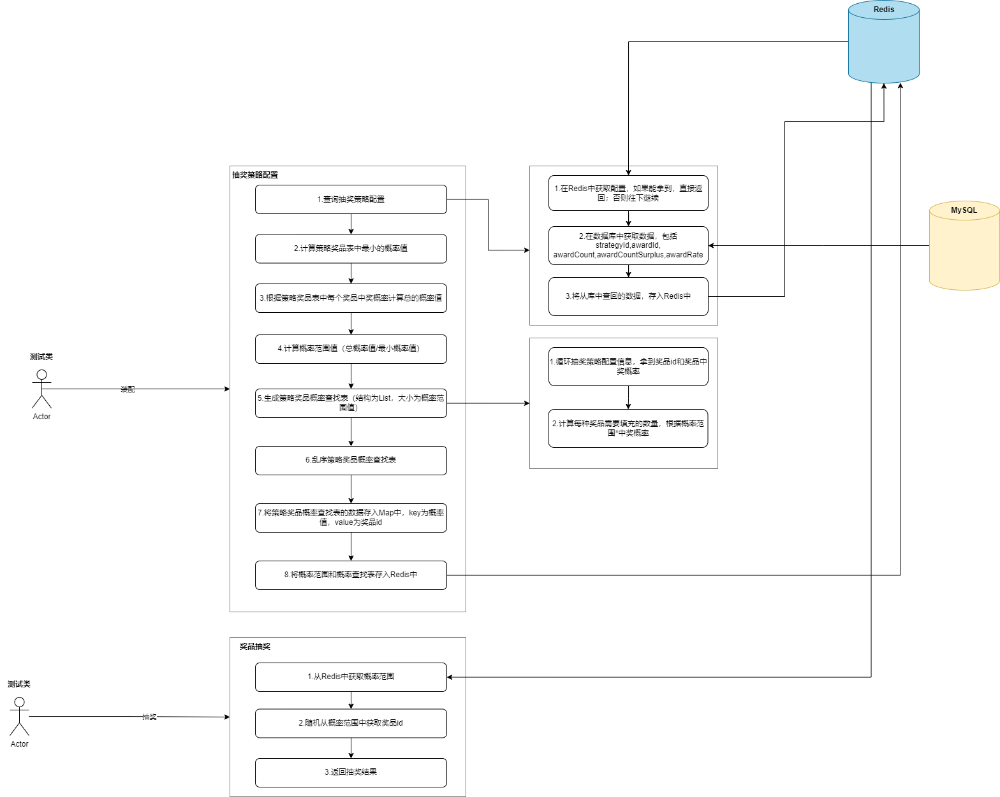

## 库表设计
分析大营销平台中抽奖的产品功能，设计抽奖策略模型和库表结构。
利用Docker维护MySql数据库，建立起以下数据表
### 策略总表
- 抽象与归一化管理抽奖逻辑：一套抽奖策略可以管理多个奖品，并且定义奖品分布、概率等核心规则。
- 作为策略主键表：为其它抽奖子模块（如奖品明细、规则配置）提供外键关联支撑，成为整个抽奖逻辑的锚点。
- 支持扩展性与维护性：通过对策略描述等字段的设计，可以便于后续开发维护和功能扩展。
用户进入抽奖系统，前端请求接口时，会携带 strategy_id。
- 
后端根据 strategy_id 读取策略定义、查找对应的奖品配置和抽奖规则（通常联表查 strategy_award, strategy_rule）。
若未来需要对策略进行版本管理或灰度测试，也可以基于 strategy_id 做策略路由与控制。
### 策略奖品
- 实现抽奖策略与奖品的映射关系：每条记录代表一个奖品在某一抽奖策略下的配置情况。
- 支撑概率抽奖逻辑：通过 award_rate 定义奖品概率，支持后端概率算法实现。
- 具备奖品库存控制能力：通过库存总量与剩余字段，控制奖品是否还能继续发放。
- 支持策略规则模型挂载：通过 rule_models 字段灵活绑定规则，支持扩展与组合

strategy_award 表是 连接抽奖策略与奖品的配置核心，通过抽象奖品信息、概率、库存和规则模型，为策略提供 灵活可控、可扩展的奖池构建能力。
### 策略规则
为抽奖系统提供：
- 高度灵活的规则配置机制
- 支持奖品粒度的个性化抽奖逻辑
- 抽象策略层与奖品层规则的统一管理
- 可扩展的“规则模型”体系

strategy_rule 表通过高度抽象的“规则模型 + 参数”设计，实现了抽奖系统策略逻辑的模块化、可配置、可扩展、可复用，是整个系统灵活性的核心支撑点
### 奖品表
- 抽象定义所有奖品及其配置
- 支持 不同类型奖品（积分、次数、模型等）
- 为系统发奖逻辑提供 统一的数据支撑
- 与规则系统（如 strategy_rule 表）配合，实现灵活的抽奖逻辑

award 表通过“奖品标识 + 发放配置”组合方式，统一管理各种奖品类型并支持灵活发放逻辑，是抽奖系统中实现奖品抽象与发奖解耦的关键数据结构。

### 230626-策略概率装配处理
实现了抽奖策略的装配，过程中用到数据库查询、策略值计算、Redis Map 数据存储。

#### 抽奖算法
抽奖的算法一种是空间换时间，另外一种是时间换空间。映射到方案上，空间换时间，是提前计算好抽奖概率分布，用本地内存 guava 或者 redis 存储，最后抽奖的时候通过生成的随机值，在空间内定位即可，复杂度为O(1)。

但要注意，本地内存更快，Redis 相对慢一些。但 Redis 可以直接解决分布式存储问题，本地内存需要让多台分布式机器都保持数据的同步更新，需要引入配置中心以及定时检测的手段，来处理应用启动前/运行中，对活动新增/变更做本地内存做数据加载处理（大厂中一些非常高并发的场景，会申请内存更大的机器来做这样的事情）。

另外一种是时间换空间，就是抽奖的计算，可以抽奖的时候生成一个随机值，之后和概率范围for循环比对。这样的场景适合那种需要，非常大的空间存放抽奖概率，不划算的时候，可以考虑这种。也可以在程序中设定，当总概率值超过100万，则不存储，而是改为循环比对。但，一切的手段，都要与实际诉求来依赖。

### 策略权重概率装配
实现抽奖系统可以控制多少积分能抽取到哪些奖品的概率范围。

集合着梳理的系统设计流程，将后续需要用到的权重抽奖规则，进行提前装配处理。拆分成装配接口和调度接口。这样可以保持接口单一职责，避免使用方调用装配操作。装配是活动在创建或者审核的时候初始化的装配动作。

所有装配的数据都会存放到 Redis Map 数据结构下。对于权重的策略装配为策略ID+权重值组合。

最终用户在从装配的工厂中执行抽奖的时候，则可以通过策略ID抽奖和策略ID+权重值组合的方式抽奖