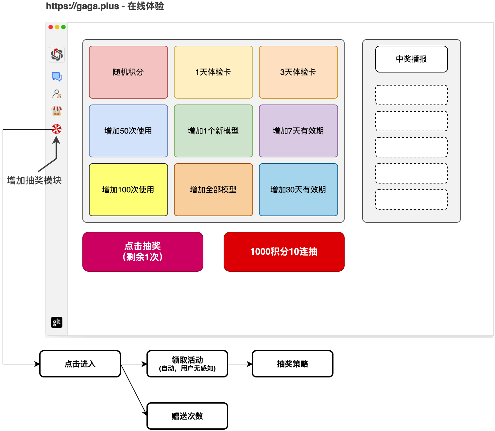
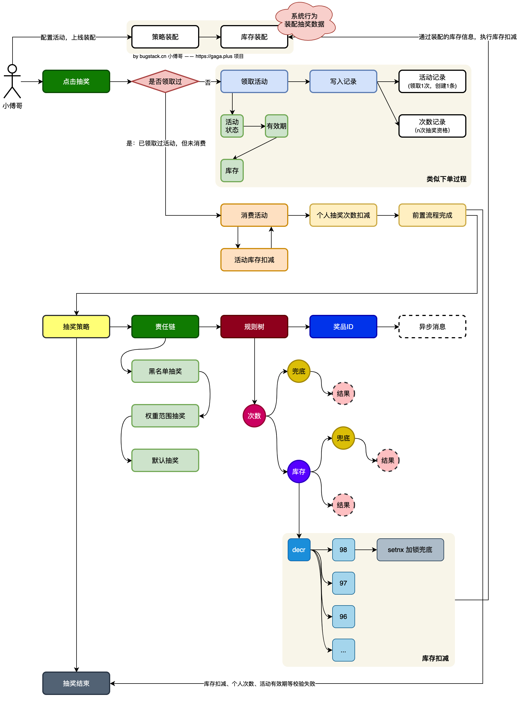
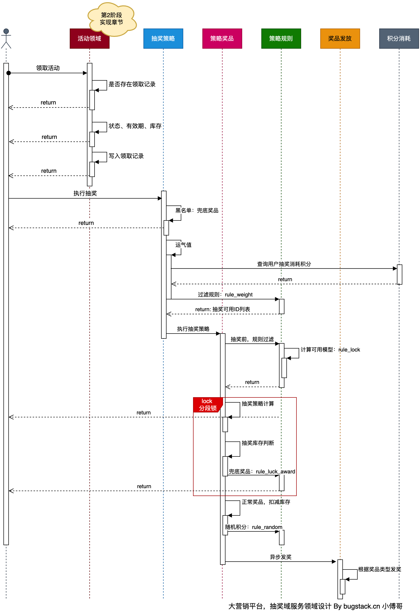
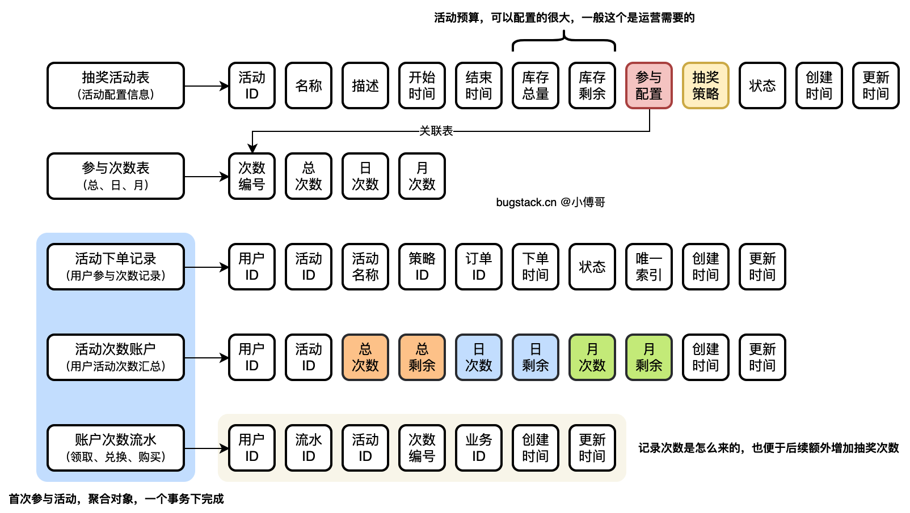
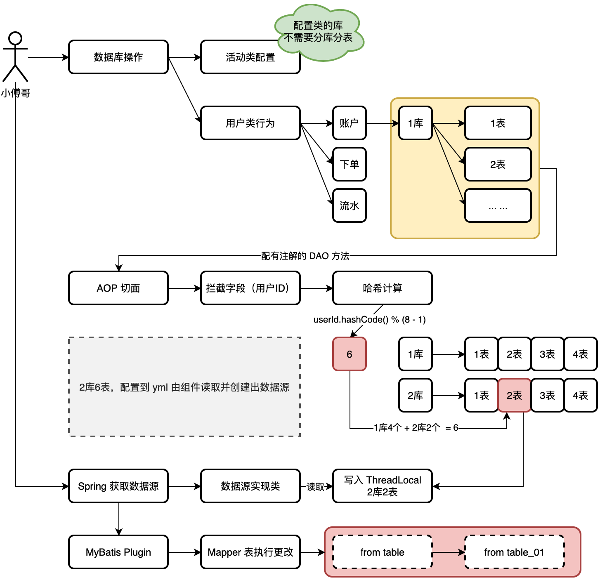
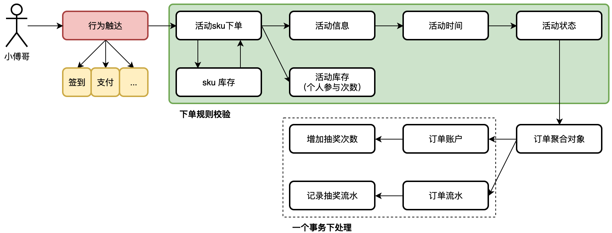
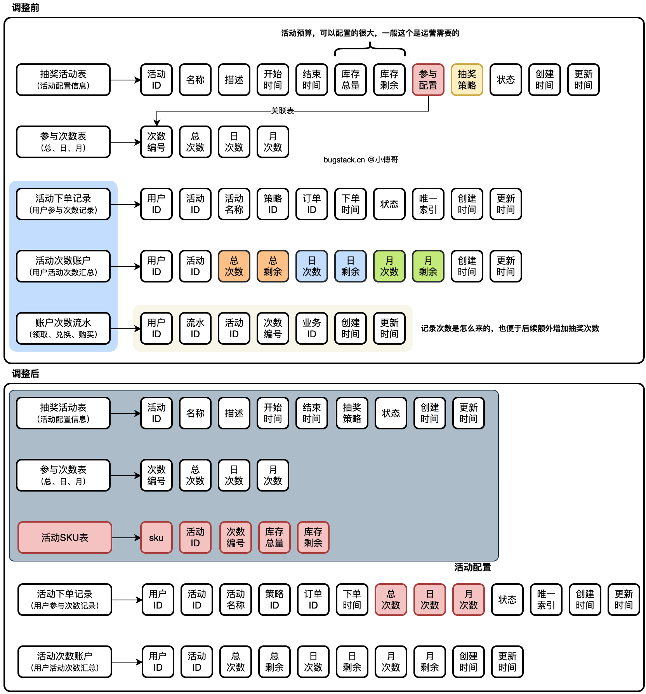
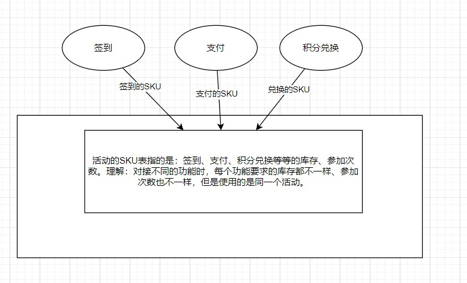
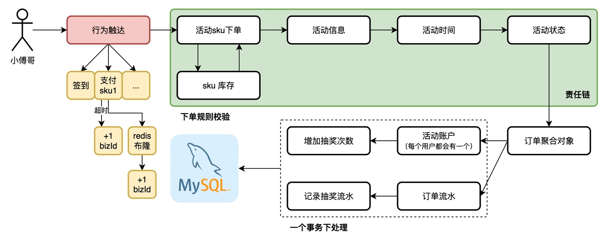

## 注意
如果在application-dev中修改配置，那么application中必须是dev或者prod进行同步修改。

### 需求分析

在本阶段，主要实现在抽奖中增加每天进入，免费赠送N次抽奖。N次免费后，则引导用户使用积分兑换抽奖。 这个体现方式也可以是点击登录的方式获取抽奖次数

功能流程

我们可以把用户参与抽奖理解为商城的一次下单，下单后才具备参与抽奖的资格。而下单的过程中，则需要过滤活动的相关信息以及库存数据。

所有的判断流程做完后开始写入库中，库中则是用户一个互动的次数账户记录。记录着用户可以参与的抽奖次数。同时需要把参与活动的记录写一条订单。

此外为了扩展用户在一些场景中，首次【签到/登录】可以赠送一个抽奖次数外，还可以通过购买、做任务、兑换等方式获得新的抽奖次数。这样用户就可以不断地消耗自己的积分兑换抽奖次数来抽奖了。

### 库表设计

### 分库分表设计
为用户的行为数据，使用路由组件将数据散列到分库分表中。在本项目的系统设计中，有一个配置库（big_market）和两个分库（big_market_01、big_market_02），我们需要对两个分库进行配置路由操作。达到分库分表的目的，而配置库则是一个单库单表存储活动等配置类信息。分库分表调用流程。

### 抽奖活动订单流程设计
完成用户参与抽奖活动的流程设计，并可以支持后续满足用户通过不同行为来增加自己的抽奖次数。
我们可以把抽奖的行为理解为一个下单过程，用户参与抽奖，也等价于商品下单。只不过这个商品的 sku 是活动信息。

库表解耦 

首先，去掉活动表中的关联操作，并新增加活动 sku 表来做关联。这样就可以把活动和参与次数当成一种物料，之后 sku 来定义库存或者将来想扩展价格或者积分兑换也是可以的。
之后，去掉原来的次数流水表，把流水的用途合并到订单表中。想获得更多的抽奖次数，就直接对 sku 下单即可。无论是通过赠送、签到、打卡、积分兑换等任何方式，都是可以的。这样也就增强了营销活动的扩展性。

**为什么spring推荐构造注入呢**

构造器注入的方式啊，能够保证注入的组件不可变，并且确保需要的依赖不为空。此外，构造器注入的依赖总是能够在返回客户端（组件）代码的时候保证完全初始化的状态。避免了循环依赖，提升了代码的可复用性
field注入对于IOC容器以外的环境，除了使用反射来提供它需要的依赖之外，无法复用该实现类。还可能会导致循环依赖，即A里面注入B，B里面又注入A。setter的方式能用让类在之后重新配置或者重新注入。
当有一个依赖有多个实现的使用，推荐使用field注入或者setter注入的方式来指定注入的类型。

### 抽奖活动流水入库
在基于活动、次数所组合的活动 sku，用户参与活动就相当于，下单sku给自己的活动账户充值可参与的额度次数。所以本节把活动的下单的过程落入到数据库中。写库会涉及到分库分表组件切分和开启事务的操作。
用户参与抽奖活动就会有一个活动额度账户，而本节则让来实现参与活动对自己的活动额度账户充值的过程。

本节会先实现出领取活动的框架结构代码，并对数据进行落库操作。（落库的过程会有分库分表下事务的操作）
活动日期、活动状态、sku库存校验和扣减，这些都是固定的流程。无论创建多少个活动都会走这样的统一流程，所以这里适合添加一个责任链模式的结构。
因为是分库分表设计，所以库表数据的写入需要确定切分键，并在同一个连接下执行 commit 这样才能把用户的活动账户和订单流程，一起写库。（也就是一个事务的特性）

**业务放重ID保证幂等 **：给用户增加的账户充值下单动作，需要外部透传对应的业务唯一ID 这样才能保证幂等。允许外部用同一个单号请求多次，但结果相同。

### 