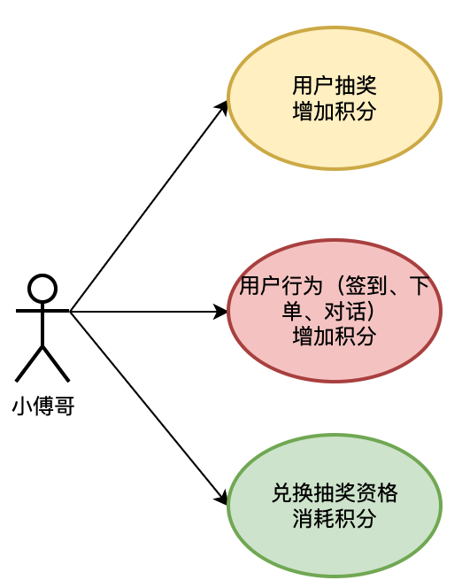
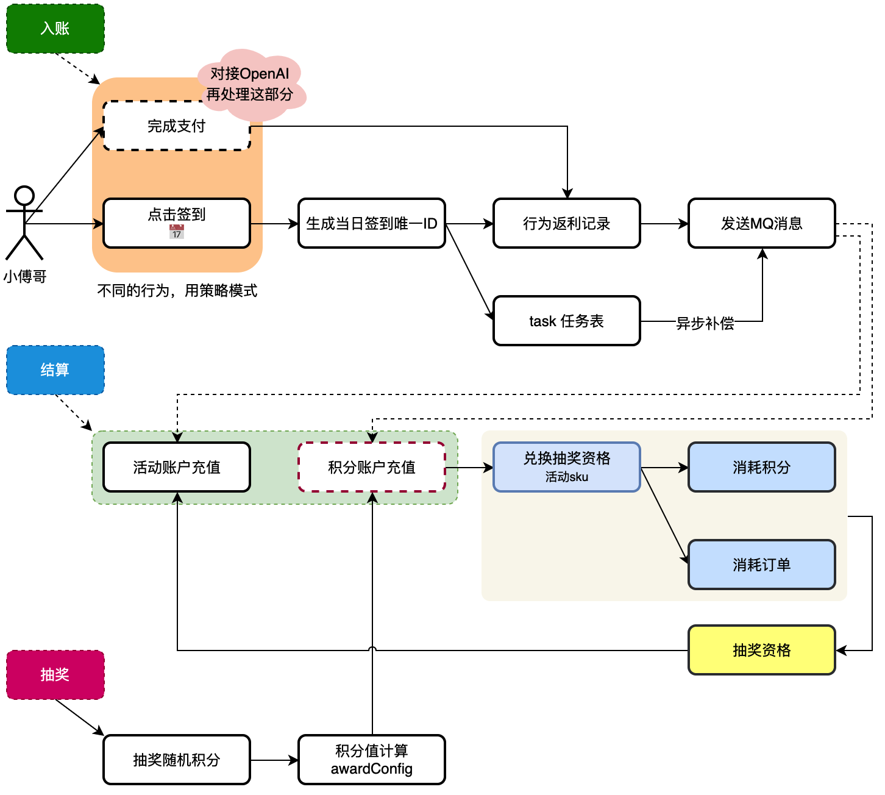
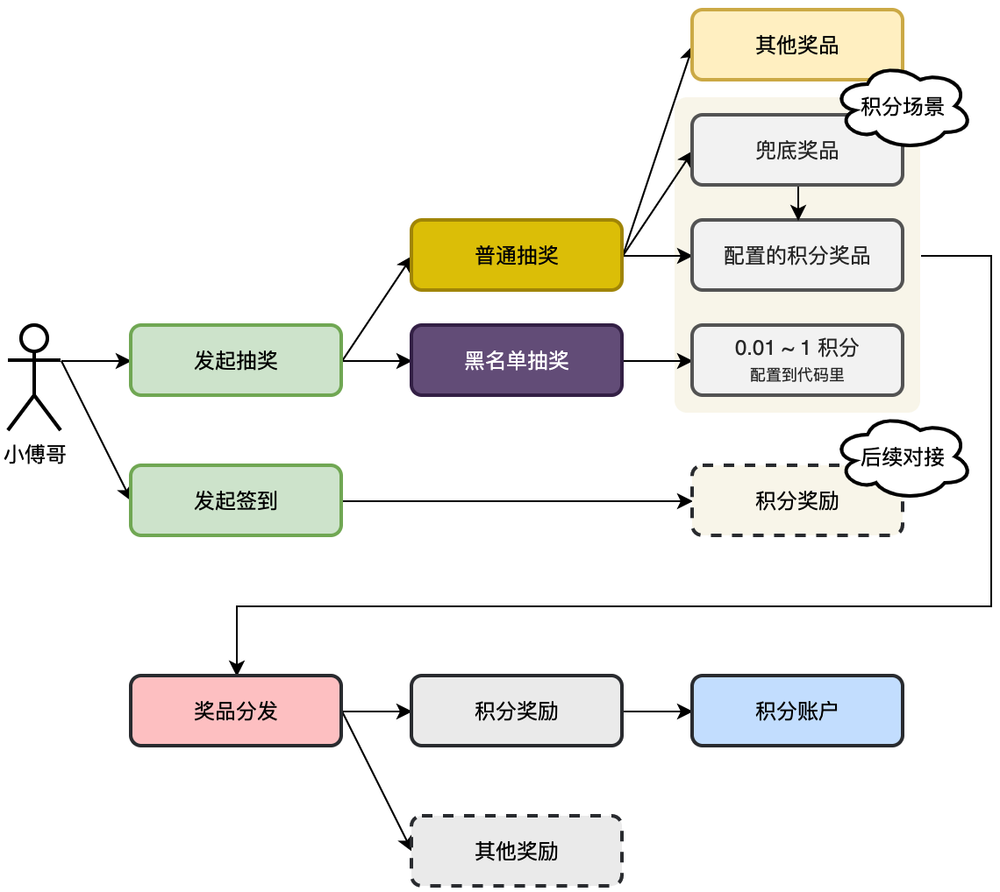
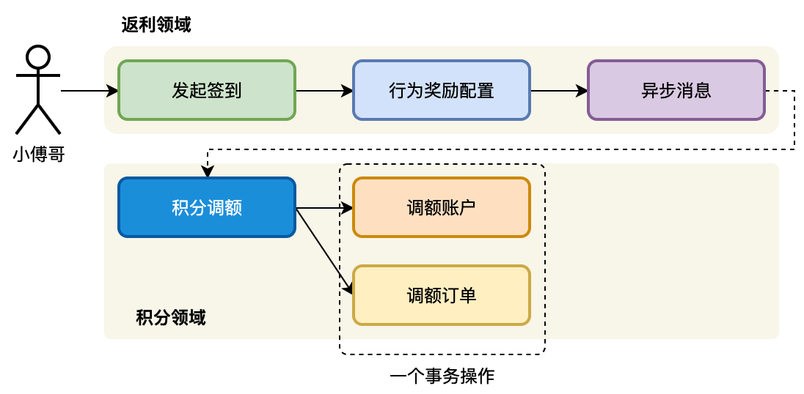
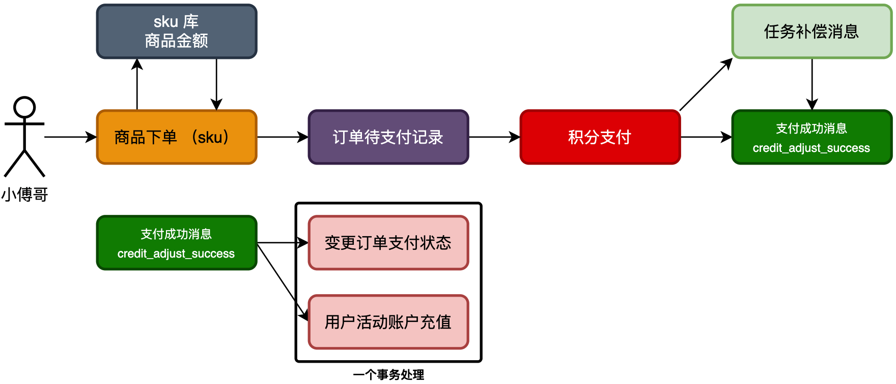
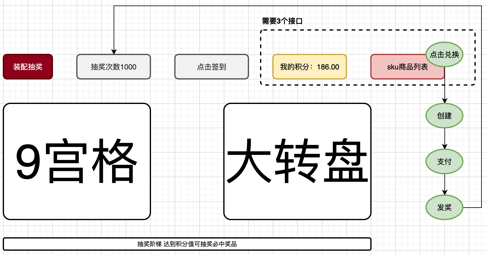

### 用户积分需求设计
分析系统中积分的链路，哪里是添加积分，哪里可以消耗积分。以积分作为媒介增加用户的营销活动体验。用户可以知道自己有多少积分，以及在每次完成指定的行为动作后，可以获得积分。

- 抽奖中有随机积分，抽中后可以给用户增加积分。注意黑名单一般会发放一个指定范围的很小的积分值。
- 用户行为动作返利，当用户在抽奖系统中日历📅签到，以及提供出让外部对接的接口，也可以给用户增加积分。
- 最后就是积分消耗，目前这里的积分消耗主要是兑换抽奖资格，也就是和活动 sku 进行兑换。这部分会产生订单。

- 首先，入账和结算，是小傅哥带着大家做行为返利时候的设计，以及说明会有一个积分账户来增加积分值。这里的活动账户是用户可抽奖的活动次数。积分账户是用户整个营销中的积分值。积分值作为媒介可以兑换其他内容，如抽奖的次数。
- 之后，整个过程中会有行为返利增加积分和抽奖增加积分，这部分是后续优先开发的内容。
- 另外，就是对积分的消耗，消耗积分也会产生积分消耗订单，这样可以确保幂等性。最终消耗积分也就兑换成了抽奖次数.

### 积分发奖服务实现
设计用户活动积分流程，创建用户积分表，并开发用户抽奖积分奖品后，完成奖品发放流程，给用户增加积分。用户的积分是一种中间媒介，抽奖可以获取积分奖品，签到可以获取积分奖品，还可以用积分兑换活动抽奖次数。通过这样的方式把整个抽奖流程闭环。

- 本节工程的实现流程为扩展 award 奖品分发服务，由 trigger 触发器的 MQ 消息调用奖品发放。
- 注意，我们在设计抽奖的时候，奖品的积分值发放为传递的透传参数和奖品本身的配置两种。也就是说，如果黑名单这类抽奖，透传了 0.01 ~ 1 积分，那么就固定用这个配置，否则就用奖品表自己的配置。

### 积分领域调额服务
增加用户积分领域模块，开发积分调额接口。串联行为发奖动作，发放用户积分奖励。这是一整条流程，在设计积分领域模块的时候，要考虑这块模型的功能添加都有哪些，将来可能会存在的接口。如；把对积分账户的增加，抽象为调额。将来使用积分还可以定义出积分消费的接口。我们通过不同的接口做职责的划分。

- 首先，设计、定义和开发出积分领域模块，增加积分调额接口。
- 之后，对接返利异步消息，完成积分额度的增加。

### 积分支付兑换商品
开发扣减积分，兑换sku商品，所需的服务模块。让积分的获取、消费，形成逻辑闭环。

积分是衔接营销场景中各个功能模块的一个非常重要的手段，如；各项用户的行为 + 抽奖返利积分，积分兑换商品、积分兑换抽奖次数、积分支付抵扣、积分会员等级折扣等。【这些内容在你的日常使用各类互联网产品中，都会遇到的，可以留意下】

- 首先，对 sku 商品库增加积分金额，用于积分支付，而签到兑换类则无需关注金额。
- 之后，商品下单需要提供出交易策略；无支付交易和有支付交易。
- 最后，下单完成则进行积分抵扣，以及接收到支付成功消息，进行充值入账。

### 积分应用场景接口实现
以支持积分使用「商品、账户、兑换」对接前端诉求，在本节开发所需的接口。包括；串联前面章节中实现积分模块功能完成积分兑换case（串联的每一个服务都可以当做一个case看待，只不过我们的场景没有那么多，所以在工程搭建中去掉了单独的case模块，减少对象频繁转换）、sku商品查询、用户积分账户额度查询。

虚线框内为本节要为前端UI开发的接口，两个查询积分和商品，一个是操作兑换的处理。
注意，兑换的操作会对接口进一步完善，创建下单商品时候会返回未支付订单。这是因为从下单到支付是分开的步骤，可能下单完成，但支付的时候金额不足了「多笔下单场景消费积分」，也可能其他异常导致下单失败。这样的场景都需要把未支付的订单查询出来进行支付

### 前端页面-对接联调积分流程接口
**注意**

前端的抽奖数据显示字段必须要和后端传输的字段保持一致，即后端传输的为awardUnlock、waitUnlockCount。那么前端的也应该是如此，而不能是waitUnLockCount和isAwardUnlock。

### 