### 难点及解决
#### 一、高并发场景下的库存管理
难点：
1. 超卖风险：秒杀场景下，高并发请求可能导致库存超卖。
2. 性能瓶颈：传统数据库行锁在高并发下会成为瓶颈，导致连接池耗尽、请求堆积，影响吞吐量。
3. 数据一致性：Redis缓存与MySQL数据库的一致性维护。
4. Redis 集群环境下，decr 操作可能因网络抖动、主从切换等出现数据不一致，引发超卖。

解决方案：
1. 分段锁+乐观锁：
   - 使用Redis的DECR命令实现无锁化扣减。
   - 使用 setNX 对每个扣减后的库存值加锁（如 stock_lock:A:96），防止重复扣减。这种方案的本质是 “用细粒度的锁控制库存值的原子变化”，通过 SETNX 确保 “每个扣减后的库存值” 只能被一个请求处理，从而防止高并发下的重复扣减和超卖。其优势是并发性能更高，适合秒杀等高频场景，但需注意锁的管理复杂度和资源占用问题。实际应用中，需根据业务并发量和库存扣减规则，选择 “商品级锁” 或 “库存值锁” 方案。
   - 锁的过期时间设置为活动结束时间 + 1天，避免手动释放的复杂度。
   - 若 DECR 后库存 <0，立即恢复为 0。若 setNX 失败，说明该库存编号已被占用，拒绝本次扣减。
2. 异步更新与最终一致性：
   - 扣减成功后通过MQ异步更新MySQL，使用延迟队列（如RabbitMQ）控制数据库更新频率，降低数据库瞬时压力。
   - 活动结束后，通过任务扫描订单记录校准库存。
   - 消息携带唯一业务ID（如订单ID），消费端做幂等处理。
   - 使用 task 表记录待发送消息，定时任务补偿发送失败的消息。
   - 抽奖流程中，抽奖订单创建与抽奖结果落库分属不同事务，通过状态机与补偿任务保证一致性。
3. 库存预热与动态调整：
   - 活动开始前将库存加载到Redis，避免实时计算。
   - 运营补货时重新预热Redis库存区间，避免并发冲突。

#### 二、规则引擎的动态配置与扩展性

难点：
1. 规则复杂性：抽奖规则涉及黑名单、权重、次数锁等多维度条件。
2. 灵活性需求：需支持运营动态调整规则，无需重启服务。
3. 性能损耗：规则引擎的动态解析可能引入计算开销。

解决方案：
1. 责任链模式+组合模式：
   - 将规则拆分为独立节点（如黑名单、权重），通过责任链串联执行。
   - 使用组合模式构建规则树。支持多分支判断（如次数锁 → 库存检查 → 兜底奖品）。
2. 动态配置与热更新：
   - 规则配置信息存储在数据库，支持页面拖拽配置。。
   - 使用Redis缓存规则树与责任链，结合ZooKeeper动态更新配置。规则配置变更后，清除 Redis 缓存，下次访问自动加载最新配置。
3. 策略模式解耦：
   - 每种规则类型对应独立策略类（如RuleWeightLogicTreeNode），通过Spring原型模式管理。
   - 抽象工厂（DefaultTreeFactory）动态组装规则树。

#### 三、分库分表与数据一致性
难点：
1. 水平扩展：单表数据量过大时，需分库分表提升性能。
2. 查询效率：分片后无法直接执行跨表聚合查询。用户行为数据分散在多个库表中，运营端如何做聚合查询？ 分库分表后，如何支持非分片键查询？
3. 事务一致性：分库分表后本地事务无法保证跨库操作。

解决方案：
1. 一致性Hash分片：
   - 按用户ID分片，使用DBRouter组件动态路由SQL。
   - 为 username 等非分片键建立 username → userId 的映射表或缓存。
   - 示例路由逻辑：
   `int dbIndex = Math.abs(userId.hashCode()) % dbCount;`
2. Canal+ES同步：
   - 通过Canal监听MySQL Binlog，实时同步数据到Elasticsearch。
   - 运营查询走 ES，实现近实时聚合分析。
3. 补偿机制：
   - 对分片键查询失败的场景（如按用户名查询），通过基因法生成分片ID。

   - 示例：
   `String gene = username.substring(0, 2); // 取前两位作为分片基因`


四、分布式锁与高可用设计

难点：
1. 锁竞争：高并发下分布式锁的获取与释放效率。
2. 容灾能力：Redis集群故障时如何避免系统崩溃。
3. 死锁风险：锁过期或异常导致资源无法释放。

解决方案：
1. Redisson分布式锁：
   - 使用RedLock算法，支持多节点选举。
   - 设置锁过期时间（如活动结束时间+1天），避免永久阻塞。
   - 示例：
   ```
   RLock lock = redisson.getLock("activity_lock:" + activityId);
   lock.lock(leaseTime, TimeUnit.MILLISECONDS);
   ```
2. 降级与熔断：
   - 基于 @RateLimiter 注解实现用户维度限流，黑名单用户存入 Guava 缓存。
   - 使用Hystrix或Sentinel实现熔断机制。
3. 本地缓存兜底：
   - 对高频查询数据（如奖品配置）使用本地缓存（Guava），减少Redis压力。
   - 设置缓存过期时间与Redis同步，避免数据不一致。

#### 五、系统监控与性能优化
难点：
1. 实时监控：高并发下快速定位性能瓶颈。
2. 日志分析：海量日志的存储与检索。
3. 调优策略：JVM参数与数据库配置优化。
4. 分布式任务在多实例下如何避免重复执行？

解决方案：
1. Prometheus+Grafana监控：
   - 监控JVM、线程池、数据库连接、Redis 等关键指标。
   - 设置阈值告警（如RT>500ms触发告警）。
2. 链路追踪：
   - 使用SkyWalking或Zipkin追踪请求链路。
   - 定位慢SQL和异常调用。
3. JVM调优：
   - 调整堆内存参数（如-Xmx6g），减少Full GC频率。
   - 使用G1垃圾回收器优化吞吐量。
4. XXL-Job + Redis 分布式锁
   - 任务执行前抢占 Redis 锁，确保同一任务在同一时刻只有一个实例执行。


### 整体流程图
截止在第二部分，抽奖系统以“装配—参与—抽奖—结算”四段式流程为主线：首先，活动装配阶段会把目标活动的基础信息、SKU 库存与SKU发放策略、奖品清单及其概率散列表（若规则中包含积分决定奖品，则将积分-奖品散列表一并）统一加载进 Redis。
装配完成后，用户可通过购买、签到等多种 SKU 活动累积抽奖次数；系统会验证 SKU 活动是否处于有效期、库存是否充足，校验通过后在一个事务内同时为用户增加账户总额度，并在 raffle_activity_order 表写入流水，确保额度与订单原子一致。

当用户发起抽奖请求时，系统先校验活动可用性，再查询是否存在状态为 noused 的待抽奖订单；若存在直接返回，否则按“总额度-月额度-日额度”三级维度顺序扣减，并生成 user_raffle_order 记录。
扣减过程中，SKU 库存以 Redis 原子扣减为准，扣到 0 时异步发布消息回刷数据库；奖品库存则是在 Redis 扣减后通过 MQ 触发单件落库，避免超卖。（这里也会采用商品库存槽位锁来确保）

抽奖逻辑分三段：抽奖前、抽奖中、抽奖后。抽奖前根据活动 ID 动态装配责任链：若未定制链，则走默认链；若链中配置了黑名单、积分权重等节点，则优先判定——命中黑名单或已由积分直接命中奖品时，流程短路直接返回，不再进入后续规则树。
若责任链放行，进入抽奖后阶段的规则树处理。抽奖后通过活动-规则树 ID 建立树根、节点、边的有序结构，装配规则引擎并逐节点校验次数门槛、库存阈值等条件；若某一步校验失败则走幸运奖兜底，具体奖项依数据库树配置而定。

当最终中奖结果产生，系统会把 user_raffle_order 状态更新为 used，并把中奖内容写入 user_award_account ；随后异步发送 MQ 消息通知下游做奖品发放，并在任务表写入一条补偿任务，以便消息丢失时可定时重推，保证全链路一致性与可恢复性。

整体方案以领域分层（domain、infrastructure、trigger）、责任链 + 规则树双层过滤、Redis 原子扣减 + MQ-Task 最终一致、事务保障一致四大技术手段，确保高并发下的抽奖正确性与库存安全。
#### 装配活动和抽奖策略
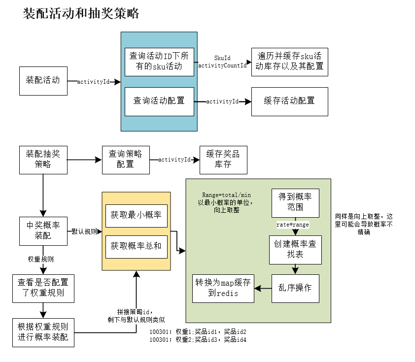
#### 抽奖
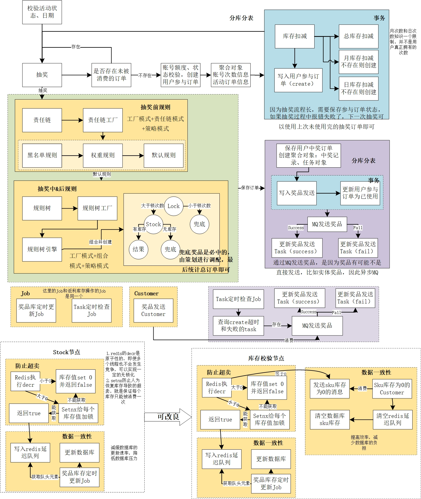
#### 返利&sku库存操作
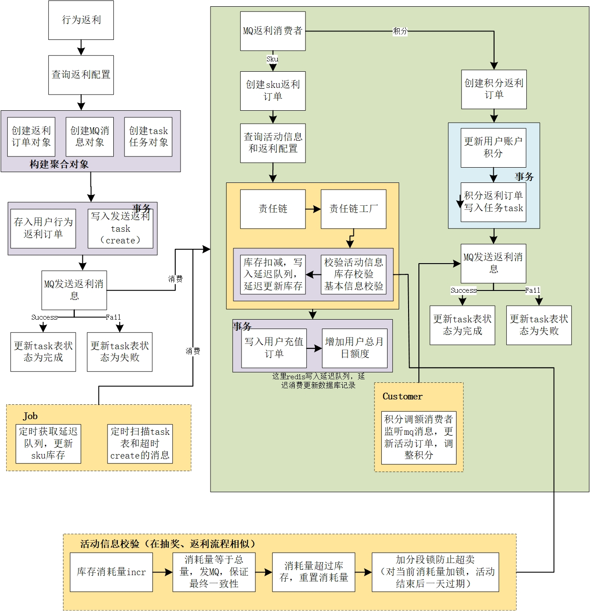
#### 积分兑换商品
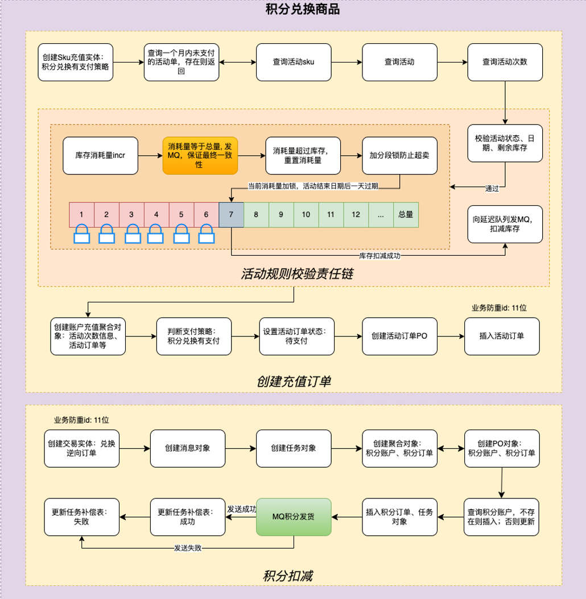
#### MQ发奖监听和积分发货
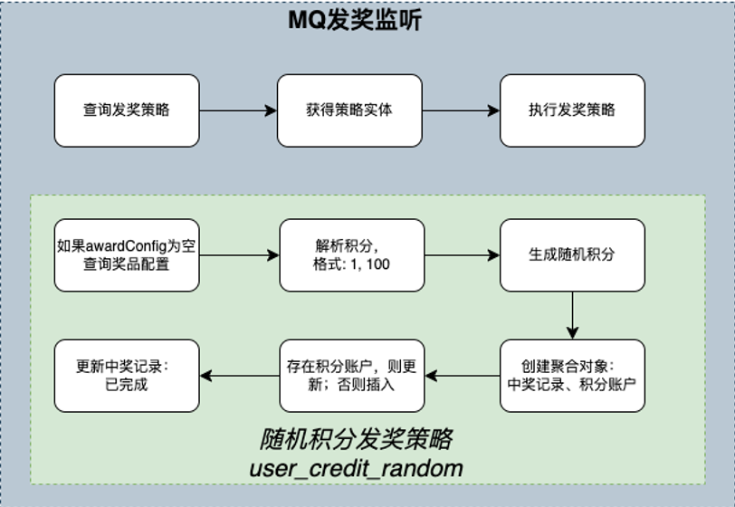
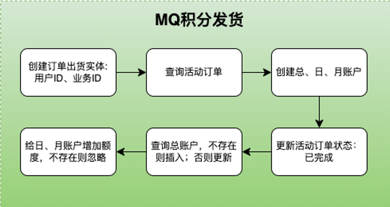

### 行为驱动的数据库表er图

#### 1. award（奖品表）
用于存储抽奖活动中的奖品信息。
- id ：自增ID
- award_id ：抽奖奖品ID（内部流转使用）
- award_key ：奖品对接标识（每个都是一个对应的发奖策略）
- award_config ：奖品配置信息
- award_desc ：奖品内容描述
- create_time / update_time ：创建/更新时间
#### 2. daily_behavior_rebate（日常行为返利活动配置）
用于配置用户日常行为可获得的返利。
- id ：自增ID
- behavior_type ：行为类型（如sign签到、openai_pay支付）
- rebate_desc ：返利描述
- rebate_type ：返利类型（如sku活动库存充值商品、integral用户活动积分）
- rebate_config ：返利配置
- state ：状态（open开启、close关闭）
- create_time / update_time ：创建/更新时间
#### 3. raffle_activity（抽奖活动表）
存储抽奖活动的基本信息。
- id ：自增ID
- activity_id ：活动ID
- activity_name ：活动名称
- activity_desc ：活动描述
- begin_date_time ：开始时间
- end_date_time ：结束时间
- strategy_id ：抽奖策略ID
- state ：活动状态（如create创建、open开启）
- create_time / update_time ：创建/更新时间
#### 4. raffle_activity_count（抽奖活动次数配置表）
配置用户参与抽奖活动的次数限制。
- id ：自增ID
- activity_count_id ：活动次数编号
- total_count ：总次数
- day_count ：日次数
- month_count ：月次数
- create_time / update_time ：创建/更新时间
#### 5. raffle_activity_sku（活动商品SKU表）
存储活动商品的库存和价格信息。
- id ：自增ID
- sku ：商品SKU（将每个组合作为一个商品）
- activity_id ：活动ID
- activity_count_id ：活动个人参与次数ID
- stock_count ：商品库存总量
- stock_count_surplus ：剩余库存
- product_amount ：商品金额（积分）
- create_time / update_time ：创建/更新时间
#### 6. rule_tree（规则表-树）
定义规则树的基本信息。
- id ：自增ID
- tree_id ：规则树ID
- tree_name ：规则树名称
- tree_desc ：规则树描述
- tree_node_rule_key ：规则树根入口规则
- create_time / update_time ：创建/更新时间
#### 7. rule_tree_node（规则表-树节点）
存储规则树中的节点信息。
- id ：自增ID
- tree_id ：规则树ID
- rule_key ：规则Key
- rule_desc ：规则描述
- rule_value ：规则比值
- create_time / update_time ：创建/更新时间
#### 8. rule_tree_node_line（规则表-树节点连线）
存储规则树中节点之间的连线关系和条件。
- id ：自增ID
- tree_id ：规则树ID
- rule_node_from ：规则Key节点From
- rule_node_to ：规则Key节点To
- rule_limit_type ：限定类型（1:=;2:>;3:<;4:>=;5<=;6:enum[枚举范围]）
- rule_limit_value ：限定值（到下个节点的条件）
- create_time / update_time ：创建/更新时间
#### 9. strategy（抽奖策略表）
定义抽奖活动的策略配置。
- id ：自增ID
- strategy_id ：抽奖策略ID
- strategy_desc ：抽奖策略描述
- rule_models ：规则模型（rule配置的模型同步到此表，便于使用）
- create_time / update_time ：创建/更新时间
#### 10. strategy_award（抽奖策略奖品概率表）
存储抽奖策略中各奖品的概率和库存信息。
- id ：自增ID
- strategy_id ：抽奖策略ID
- award_id ：抽奖奖品ID
- award_title ：抽奖奖品标题
- award_subtitle ：抽奖奖品副标题
- award_count ：奖品库存总量
- award_count_surplus ：奖品库存剩余
- award_rate ：奖品中奖概率
- rule_models ：规则模型
- sort ：排序
- create_time / update_time ：创建/更新时间
#### 11. strategy_rule（抽奖策略规则表）
存储抽奖策略的具体规则配置。
- id ：自增ID
- strategy_id ：抽奖策略ID
- award_id ：抽奖奖品ID（规则类型为策略时不需要）
- rule_type ：抽象规则类型（1-策略规则、2-奖品规则）
- rule_model ：抽奖规则类型（如rule_random随机值计算、rule_lock抽奖几次后解锁、rule_luck_award幸运奖）
- rule_value ：抽奖规则比值
- rule_desc ：抽奖规则描述
- create_time / update_time ：创建/更新时间
#### 1. raffle_activity_account（抽奖活动账户表）
记录用户在特定活动中的参与次数配额和剩余次数。 
- id ：自增ID
- user_id ：用户ID
- activity_id ：活动ID
- total_count ：总次数配额
- day_count ：日次数配额
- month_count ：月次数配额
- total_count_surplus ：剩余总次数
- day_count_surplus ：剩余日次数
- month_count_surplus ：剩余月次数
- create_time ：创建时间
- update_time ：更新时间
#### 2. raffle_activity_account_day（抽奖活动账户日次数表）
专门记录用户在特定活动中的每日参与次数和剩余次数，用于每日次数限制。
- id ：自增ID
- user_id ：用户ID
- activity_id ：活动ID
- day_count ：日次数配额
- day_count_surplus ：剩余日次数
- create_time ：创建时间
- update_time ：更新时间
#### 3. raffle_activity_account_month（抽奖活动账户月次数表）
专门记录用户在特定活动中的每月参与次数和剩余次数，用于每月次数限制。 
- id ：自增ID
- user_id ：用户ID
- activity_id ：活动ID
- month_count ：月次数配额
- month_count_surplus ：剩余月次数
- create_time ：创建时间
- update_time ：更新时间
#### 4. raffle_activity_order_000/001/002/003（抽奖活动订单表，分表）
记录用户购买抽奖次数的订单信息，采用分表策略存储大量订单数据。
- id ：自增ID
- user_id ：用户ID
- sku ：商品SKU（对应不同的抽奖次数包）
- activity_id ：活动ID
- activity_name ：活动名称
- strategy_id ：抽奖策略ID
- order_id ：订单ID
- order_time ：下单时间
- total_count ：购买的总次数
- day_count ：购买的日次数
- month_count ：购买的月次数
- pay_amount ：支付金额（积分）
- state ：订单状态（completed-已完成）
- out_business_no ：业务防重ID（确保幂等）
- create_time ：创建时间
- update_time ：更新时间
#### 5. task（任务表）
记录需要发送到消息队列（MQ）的异步任务，如发放奖品、积分返利等。
- id ：自增ID
- user_id ：用户ID
- topic ：消息主题（如send_award-发送奖品、send_rebate-发送返利、credit_adjust_success-积分调整成功）
- message_id ：消息编号
- message ：消息主体（JSON格式，包含任务详情）
- state ：任务状态（create-创建、completed-完成、fail-失败）
- create_time ：创建时间
- update_time ：更新时间
#### 6. user_award_record_000/001/002/003（用户中奖记录表，分表）
记录用户在抽奖活动中的中奖信息和奖品发放状态，采用分表策略存储大量中奖记录。
- id ：自增ID
- user_id ：用户ID
- activity_id ：活动ID
- strategy_id ：抽奖策略ID
- order_id ：抽奖订单ID（作为幂等使用）
- award_id ：奖品ID
- award_title ：奖品标题（名称）
- award_time ：中奖时间
- award_state ：奖品状态（create-创建、completed-发奖完成）
- create_time ：创建时间
- update_time ：更新时间
#### 为什么要这样设计，设计的好处是什么
- 模块化设计:
  每个表都具有独立的功能，并通过外键关联，形成一个清晰、可扩展的结构。 award 表专注于奖品的管理， strategy 表负责抽奖策略的定义， strategy_award 表负责策略与奖
  品的关联， strategy_rule 表则定义了具体的抽奖规则等等。这种模块化设计便于维护和扩展。
- 易于扩展:
  通过将奖品、策略、和规则分开，系统可以轻松地添加新的奖品、调整策略或修改规则，
  而不需要对整个系统进行大幅度更改。例如，可以通过向 award 表中添加新记录来增加新的奖品，或者通过更新 strategy_rule 表来修改现有的抽奖规则。
- 数据管理与性能优化:
  各表中的数据被精细地管理，如 strategy_award 表中的奖品库存量、中奖概率和排序字段，可以帮助优化抽奖过程中的性能，确保数据查询和逻辑判断的高效执行。创建raffle_activity_sku存储活动商品。此外，使用
  诸如 create_time 和 update_time 字段，可以很方便地追踪数据的历史变化，这对于调试和分析都是非常有利的。
- 解耦与灵活性:
  通过将策略和规则解耦，允许开发人员在不影响奖品设置的情况下，独立地调整策略或规则。这种灵活性使得系统在面对不同需求时，能够快速地做出相应的调整。例如，在 strategy_rule 表中，可以定义新的规则模型来实现不同的抽奖逻辑。

#### 设计思路
- 可扩展性:
设计思路的核心在于确保系统的可扩展性。在实际开发中，业务需求常常会发生变化，可
能需要添加新的奖品、修改策略或调整规则。通过将不同的功能模块分开设计，可以在不
破坏现有系统的情况下进行扩展和调整。
- 高内聚、低耦合:
这种设计确保了表与表之间的低耦合性，使得每个模块能够独立发展和维护。同时，高内
聚性则确保了每个模块的职责清晰明确，这样在维护时可以更容易定位问题和优化性能。
- 灵活的规则配置:
策略和规则的分离设计使得系统能够根据业务需求随时调整抽奖的逻辑。例如，可以轻松
地引入新规则、调整现有规则的参数，或者修改策略的组合方式。这种灵活性使得系统能
够更好地应对多变的市场需求。

### 业务架构图
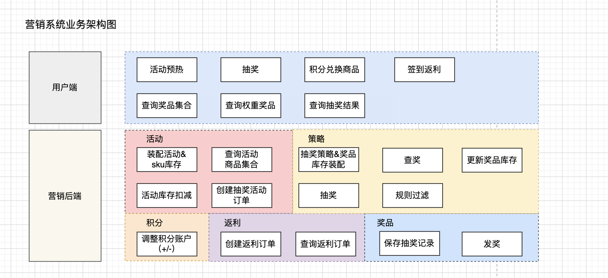

### 应用架构图
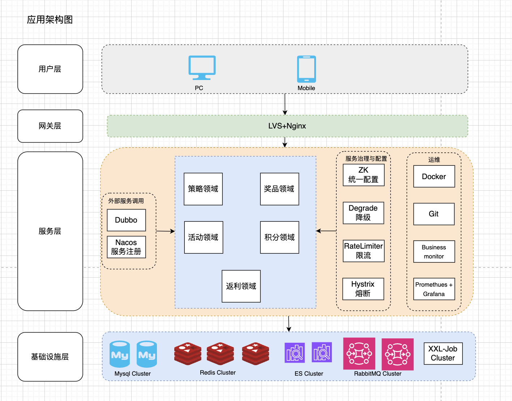

### 部署架构图
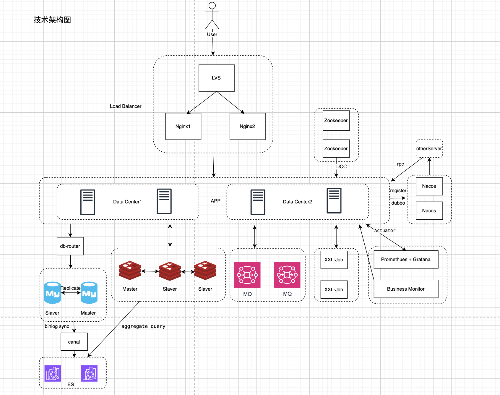


### bug及解决
#### 责任链模式处理抽奖规则
DefaultChainFactory.openLogicChain(Long strategyId) 获取到的ILogicChain会存在并发问题，下面是我的思路:
1. DefaultChainFactory是个单例bean，spring在构建的时候会把所有的ILogicChain接口的bean（也是单例，一个名字比如"rule_blacklist"对应一个）填到logicChainGroup里。
2. 在调用openLogicChain(Long strategyId)的时候会按String[] ruleModels（假设是1,2,3）的顺序从logicChainGroup中取得ILogicChain接口的bean，把他们穿起来（像链表一样，bean 1指向bean2，bean2指向bean3，最后指向bean default），最后返回bean1
3. 我的问题是既然bean都持有了其他ILogicChain接口的bean（相当于有了指针），那这个bean就不再是无状态的了，线程1调用openLogicChain(10001),ruleModels(1,2,3)，返回的是链表1->2->3->default,这时候线程2调用openLogicChain(10002),ruleModels(2,4,6),那线程1持有的链表就变成了1->2->4->6->default
还有就是logicChainGroup.get(ruleModels[0])获取的是单例的吗，每次调用获取的似乎并不是同一个bean实例

**解决**

最初使用的Bean的默认作用域是单例模式，因此会出现上述问题。
后面添加了@Scope(ConfigurableBeanFactory.SCOPE_PROTOTYPE)这个注解， 每次请求该Bean时，Spring容器都会创建一个新的实例，算是spring内置的原型模式应用。
@Scope(ConfigurableBeanFactory.SCOPE_PROTOTYPE)是Spring框架中的一个注解，用于指定Bean的作用域为原型模式（prototype）。在Spring IoC容器中，Bean的默认作用域是单例模式（singleton），即在整个应用中只有一个实例。而原型模式则意味着每次请求该Bean时，Spring容器都会创建一个新的实例。

#### HTTP401未授权错误
```
org.springframework.web.reactive.function.client.WebClientResponseException$Unauthorized: 
401 Unauthorized from POST https://apis.itedus.cn/v1/chat/completions
```
调用外部接口返回了 HTTP 401 未授权错误。这不是 Reactor 自身的 bug，而是因为你请求第三方 API 时，鉴权不通过。

查找检查发现项目使用的是Spring AI 1.0.0-M8版本，在早期版本中，OpenAiApi可能不会自动在API密钥前添加'Bearer '前缀。我需要修改AiClientModelNode.java文件，确保Authorization头格式正确。

修改了 AiClientModelNode.java 文件中的 createOpenAiChatModel 方法，添加了代码来检查和确保API密钥以'Bearer '前缀开头：
```
    // 构建OpenAiApi
    String apiKey = modelVO.getApiKey();
    // 确保API密钥以Bearer开头（Spring AI 1.0.0-M8版本需要手动添加）
    if (apiKey != null && !apiKey.startsWith("Bearer ")) {
        apiKey = "Bearer " + apiKey;
    }
```

#### 找不到bean
实现类没加Service 如果实现类继承另一个抽象类,要加最终实现类上面。


### 压测
单机TPS：600，RT:300ms。

三台4c8g100M服务器，一台部署项目、一台部署中间件（redis、mysql）、一台部署监控和jmeter
插入20w用户，删除非错误日志打印

**yml配置**
```
server:
  port:8081
  tomcat:mbeanregistry:
    enanbled:true
  max-connections:20000
  threads:
    max:800 # 设定处理客户请求的线程的最大数目，决定了服务器可以同时响应客户请求的数,默认200
    min-spare:200 #初始化线程数，默认为10
  accept-count:1000 #等待队列长度
  
  ...
  
        db00:
        driver-class-name: com.mysql.cj.jdbc.Driver
        url: jdbc:mysql://127.0.0.1:13306/big_market?useUnicode=true&characterEncoding=utf8&autoReconnect=true&zeroDateTimeBehavior=convertToNull&serverTimezone=UTC&useSSL=true
        username: root
        password: 123456
        type-class-name: com.zaxxer.hikari.HikariDataSource
        pool:
          pool-name: Retail_HikariCP
          minimum-idle: 20 #最小空闲连接数量
          idle-timeout: 180000 #空闲连接存活最大时间，默认600000（10分钟）
          maximum-pool-size: 30 #连接池最大连接数，默认是10
          auto-commit: true  #此属性控制从池返回的连接的默认自动提交行为,默认值：true
          max-lifetime: 1800000 #此属性控制池中连接的最长生命周期，值0表示无限生命周期，默认1800000即30分钟
          connection-timeout: 30000 #数据库连接超时时间,默认30秒，即30000
          connection-test-query: SELECT 1
      db01:
        driver-class-name: com.mysql.cj.jdbc.Driver
        url: jdbc:mysql://127.0.0.1:13306/big_market_01?useUnicode=true&characterEncoding=utf8&autoReconnect=true&zeroDateTimeBehavior=convertToNull&serverTimezone=UTC&useSSL=true
        username: root
        password: 123456
        type-class-name: com.zaxxer.hikari.HikariDataSource
        pool:
          pool-name: Retail_HikariCP
          minimum-idle: 20 #最小空闲连接数量
          idle-timeout: 180000 #空闲连接存活最大时间，默认600000（10分钟）
          maximum-pool-size: 150 #连接池最大连接数，默认是10
          auto-commit: true  #此属性控制从池返回的连接的默认自动提交行为,默认值：true
          max-lifetime: 1800000 #此属性控制池中连接的最长生命周期，值0表示无限生命周期，默认1800000即30分钟
          connection-timeout: 30000 #数据库连接超时时间,默认30秒，即30000
          connection-test-query: SELECT 1
      db02:
        driver-class-name: com.mysql.cj.jdbc.Driver
        url: jdbc:mysql://127.0.0.1:13306/big_market_02?useUnicode=true&characterEncoding=utf8&autoReconnect=true&zeroDateTimeBehavior=convertToNull&serverTimezone=UTC&useSSL=true
        username: root
        password: 123456
        type-class-name: com.zaxxer.hikari.HikariDataSource
        pool:
          pool-name: Retail_HikariCP
          minimum-idle: 20 #最小空闲连接数量
          idle-timeout: 180000 #空闲连接存活最大时间，默认600000（10分钟）
          maximum-pool-size: 150 #连接池最大连接数，默认是10
          auto-commit: true  #此属性控制从池返回的连接的默认自动提交行为,默认值：true
          max-lifetime: 1800000 #此属性控制池中连接的最长生命周期，值0表示无限生命周期，默认1800000即30分钟
          connection-timeout: 30000 #数据库连接超时时间,默认30秒，即30000
          connection-test-query: SELECT 1
   ...
   
  redis:
  sdk:
    config:
      host: 127.0.0.1
      port: 16379
      pool-size: 10
      min-idle-size: 20
      idle-timeout: 30000
      connect-timeout: 10000
      retry-attempts: 5
      retry-interval: 1000
      ping-interval: 60000
      keep-alive: true       
   
```
线程池参数

| 应用名称      | 线程池名称          | 核心线程池数 | 最大线程数 | 当前活跃线程数 | 当前池中线程数 |
| ------------- | ------------------- | ------------ | ---------- | -------------- | -------------- |
| big-market-app | database_sharding   | 20           | 50         | 0              | 20             |
| big-market-app | asynchronous_send_mq | 20           | 50         | 0              | 0              |
| big-market-app | multiple_draw       | 20           | 50         | 0              | 0              |

>**注意**：在使用 Docker 容器部署应用时，无法正常监控到带有 @Timed 注解标记的方法（通常是用于统计方法执行时间等指标），因此将部署方式改为直接通过 java -jar 命令运行 jar 包的方式（非容器化部署），以解决 @Timed 注解相关的监控问题。

```
JAVA_OPTS="-Xms6144m -Xmx6144m -Xmn4096m -XX:MaxMetaspaceSize=256m -XX:MetaspaceSize=256m"
```
- -Xms6144m：设置 JVM 的初始堆内存大小为 6144MB（即 6GB）。初始堆内存是程序启动时 JVM 向操作系统申请的内存量，避免程序运行中频繁申请内存影响性能。
- -Xmx6144m：设置 JVM 的最大堆内存大小为 6144MB（即 6GB）。堆内存是 JVM 用于存储对象实例的主要区域，最大堆内存限制了 JVM 能使用的堆内存上限，防止内存占用无限增长。
- -Xmn4096m：设置新生代（Young Generation）的内存大小为 4096MB（即 4GB）。堆内存分为新生代和老年代，新生代用于存放新创建的对象，此参数直接指定新生代大小，剩余的堆内存（6144m - 4096m = 2048m）会分配给老年代。
- -XX:MaxMetaspaceSize=256m：设置元空间（Metaspace）的最大大小为 256MB。元空间用于存储类的元数据（如类结构、方法信息等），属于本地内存（非堆内存），此参数限制元空间的最大占用量。
- -XX:MetaspaceSize=256m：设置元空间的初始大小为 256MB。元空间的初始大小决定了 JVM 首次为元数据分配的内存量，后续会根据需要动态调整（但不超过MaxMetaspaceSize的限制）。


#### 第一次压测
设置Ramp-Up 为线程数的 1 / 10； 循环次数 200
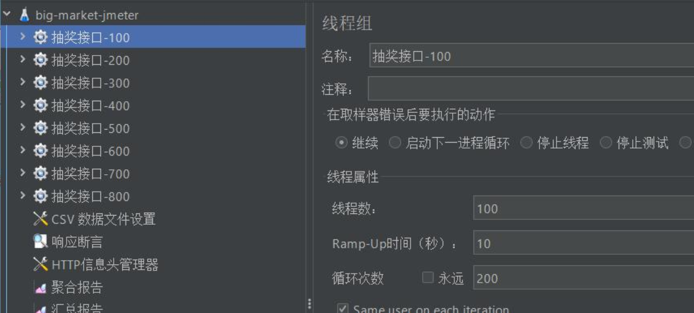

**压测结果**
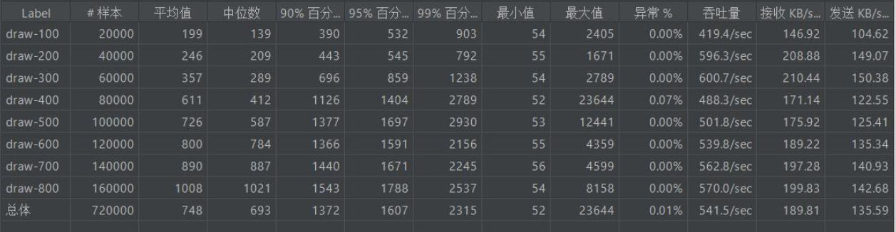
1. TPS（吞吐量）
   - TPS 在 419.4/sec（100线程） → 600.7/sec（300线程） → 570/sec（800线程） 之间波动。 
   - 峰值出现在 300线程，TPS ≈ 600/sec。 
   - 之后随着线程数增加，TPS 没有继续提升，甚至略有下降，说明系统已达到 性能瓶颈（CPU/Redis/MySQL/网络带宽等可能成为瓶颈）。
2. RT（响应时间）
   - 平均 RT 从 199ms（100线程）逐步上升到 1008ms（800线程）。 
   - 中位 RT 在高并发下接近平均值，说明响应时间分布相对稳定。 
   - 90%~99%分位数 RT 提示了长尾请求延迟： 300线程时 99分位 1238ms，800线程时 99分位 2537ms，最大值甚至达到 23644ms（23s+），说明在极端情况下有请求严重超时。

系统在 300线程左右 时 TPS 达到峰值（约 600/sec），RT 平均 357ms，性能最佳。 超过 300线程后，TPS 并未增加，RT 却显著上升，说明瓶颈已出现。例如数据库的插入/查询操作，
缓存的热点key/慢查询。网络带宽和CPU核心数

优化建议：
- 增加服务节点（应用和数据库的水平扩展）。
- 优化数据库读写，启用读写分离或连接池优化。
- 检查 GC 日志，避免频繁 Full GC。 
- 使用链路追踪（如 SkyWalking）定位耗时最长的环节。

#### 第二次压测
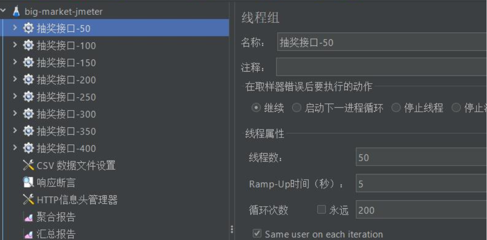

**压测结果**
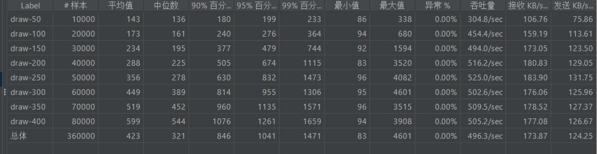
系统的最大 TPS 大约 500~520/sec，并发增加到 250线程以后，TPS 不再提升，进入瓶颈状态。
平均 RT 从 143ms 增长到 600ms，符合预期。 长尾延迟（99%分位）超过 1.5s，需要关注极端用户体验。

#### 第三次压测
设置db01 db02 最大 400， redis 最大 100；
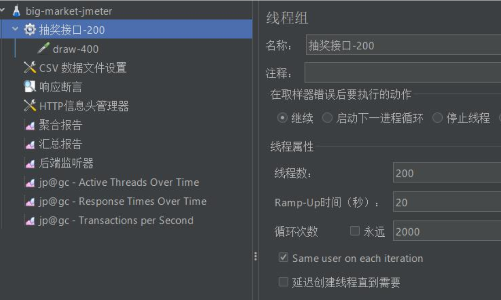
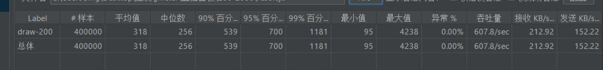
**压测结果**
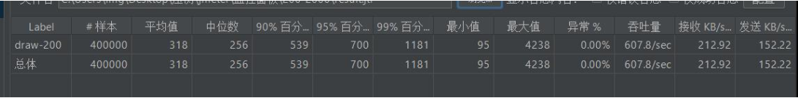
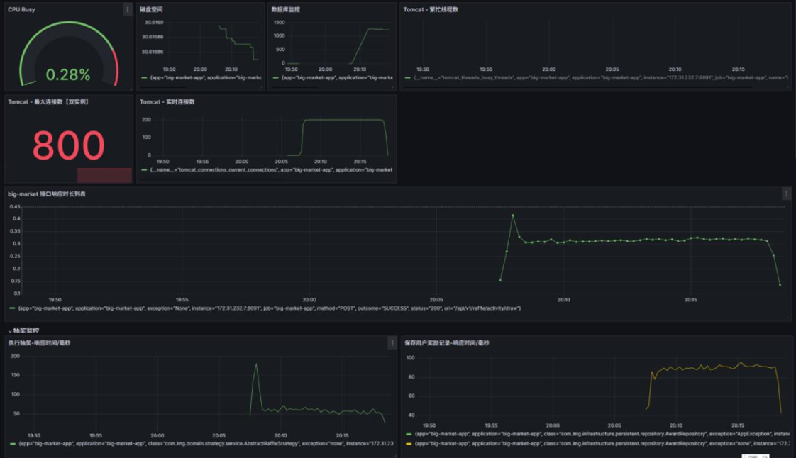
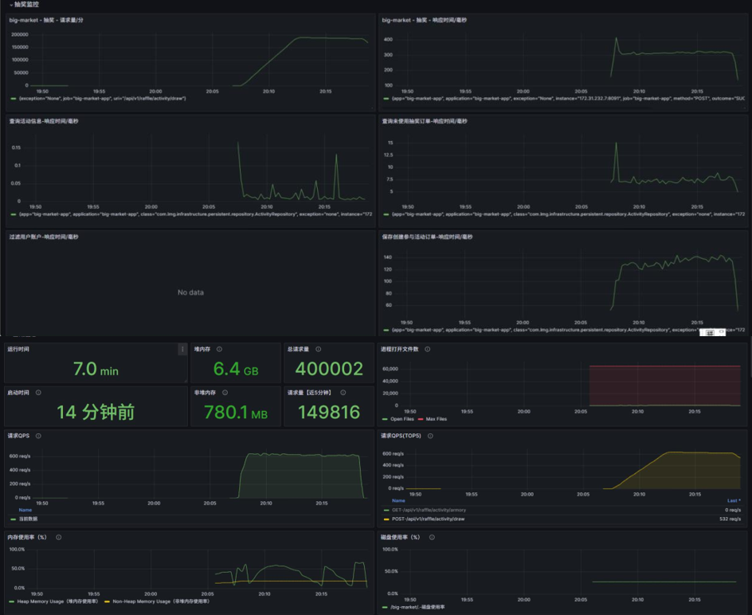
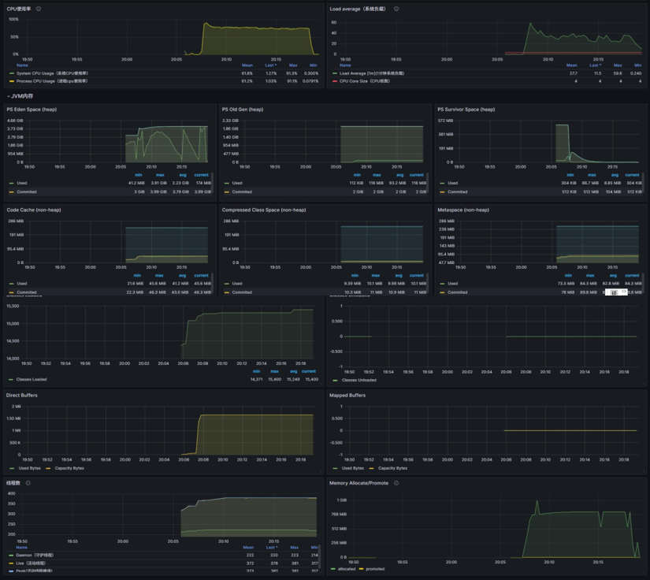
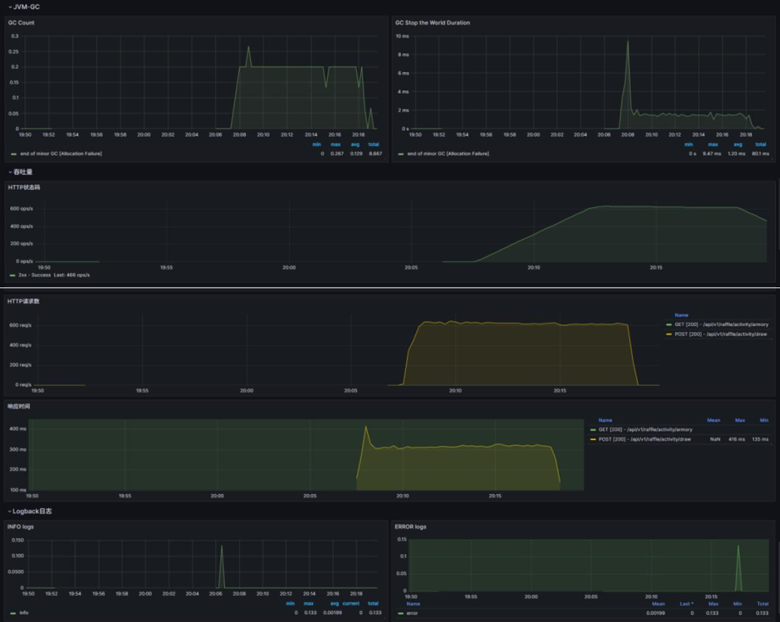
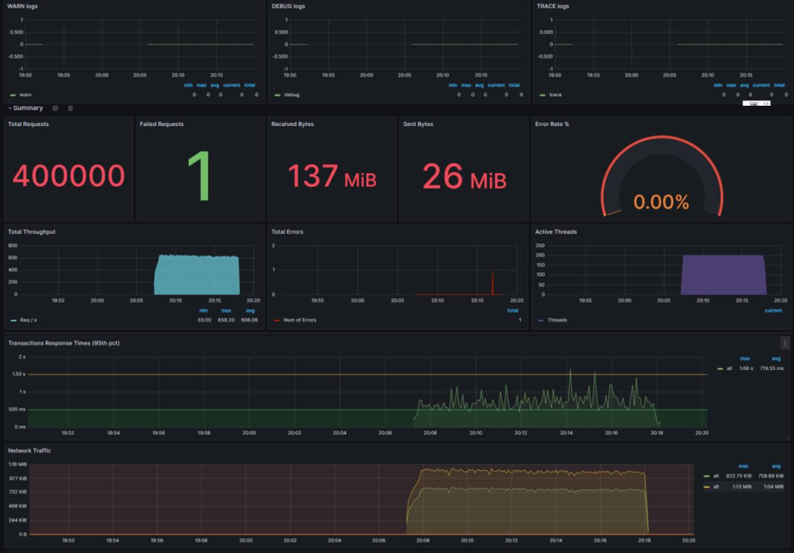

1. **TPS**:TPS ≈ 608/sec，比你之前 200线程压测（≈516/sec）有明显提升，说明 连接池配置调整（DB400/Redis100）起到了优化作用。不过RT也增加了。
   - Mysql（db01/db02 最大连接设 400 ）：压测中未达连接数上限（从 “数据库监控” 面板看，连接数峰值远低于 400 ），数据库连接池未成为 TPS 瓶颈。
   - 服务器带宽 100M，压测中 接收/发送 KB/s 峰值约 205.47/146.89 KB/s（首面板 draw-300 ），换算成网络带宽占比极低（(205+147)*8/100/1024 ≈ 3% ），网络不是 TPS 瓶颈。
   - JVM 线程、Tomcat 连接数未超限（Tomcat 最大连接设 800，实时连接数峰值在 200 内 ），应用容器可支撑当前 TPS。
   - Mysql 虽未打满连接，但需结合 “SQL 执行耗时”（如下文 RT 分析 ）判断是否有慢查询；Redis 若为纯缓存场景，当前 TPS 下响应很快（无明显阻塞 ）。
2. **RT**:平均值为318ms，90% 响应时间 539 ms、95% 700 ms、99% 1181 ms（长尾部分 ）。 最小值 95 ms、最大值 4238 ms（存在偶发毛刺 ）。
    - 初始化阶段（20:05 前）：Jmeter 线程启动、业务缓存预热（如首单查询 DB 加载字典 ），RT 从 95 ms 逐步爬升，属正常 “冷启动” 波动。
    - 稳态阶段（20:05–20:15 ）：RT 稳定在 300–400 ms（90% 分位数 539 ms 接近均值 ），说明 业务逻辑 + 中间件 + 网络在稳态下协同较好。
    - 毛刺阶段（20:15 附近）：
      - 从 “执行抽奖 - 响应时间” 面板看，draw 接口有 200 ms 级毛刺；“保存用户奖励记录” 也有突刺。结合 JVM-GC 监控（GC Stop the World Duration 有 3-10 ms 级波动 ），推测是 新生代 GC 触发（PS Eden Space 有频繁分配 / 回收 ），短暂暂停业务线程导致 RT 突刺。
      - 若毛刺频率低（如 1 次 / 分钟 ），对整体 RT 影响可控；若高频出现，需优化 JVM 堆配置（如增大 Eden 区、调整 MaxTenuringThreshold ）。

- CPU 使用率：系统 CPU 均值 61.8%（System CPU Usage ），进程 CPU 接近系统 CPU（Process CPU Usage ≈ 61.1% ），说明 应用进程是 CPU 主要消耗者，但未达 100% 饱和（4C 服务器，单进程 CPU 占比 60%+ 仍有裕量 ）。
- Load Average：1 分钟负载 27.7（Load Average [1m]=27.7 ），4C 服务器下 Load > 4 需关注，但结合 CPU 未打满，说明 存在线程等待（如 IO 阻塞 ），需看 Mysql/Redis 的慢操作。
- 堆内存：PS Eden Space（新生代 ）波动大，PS Old Gen（老年代 ）稳定在 2.33 GB（远低于 Xmx=6144m ），说明 对象多在新生代回收，老年代未积累压力。
- GC 频率：Minor GC 频繁（GC Count 有波动 ），但 STW 时间 短（多数在 10 ms 内 ），对 RT 影响集中在 “毛刺” 点，可通过 增大新生代内存（-Xmn ） 或 优化对象创建逻辑（减少临时对象 ） 优化。

user_award_record 插入有唯一键冲突（日志里的 DuplicateKeyException ），虽已过滤错误日志，但 实际插入失败会导致业务回滚 / 重试，间接拉高 RT 均值（若有重试逻辑，需看 draw 接口的 99% 分位数 是否因重试放大 ）。
>针对唯一键冲突问题，可以采用改用雪花算法生成 order_id；
插入时用 INSERT IGNORE/ON DUPLICATE KEY UPDATE 避免抛异常。

考虑补充 redis-cli monitor 或接入 Redis 监控平台，观察 GET/SET 等命令的耗时分布。

### 扩展和优化思路
补库存，decr 修改为 incr，通过操作数据库添加库存，之后发mq，接收后通过incrby + setnx 或lua脚本加库存。通过可以对失败的进行记录。之后使用 incr 和总量 + 失败量对比。

对于奖品和任务记录插入的唯一索引id，项目中使用 RandomStringUtils.randomNumeric(12) 生成12位随机数字作为 order_id。
还可以通过雪花算法（Snowflake）：生成 64 位全局唯一 ID，包含时间戳、机器 ID、序列号，适合分布式系统；

- Redis 集群模式下存在主从同步延迟风险， 引入 RedLock 算法：通过 Redis 集群多节点锁竞争实现更高可靠的分布式锁，避免单点故障。
- 万分位以下概率抽奖使用 O(1)缓存方案，但高并发下 Redis 内存压力大；高概率抽奖采用循环对比效率低。对高概率奖品区间进行二进制分段压缩（如将 10000 次抽奖压缩为 100 个区间），减少循环次数。
- 当前仅依赖日志分析，缺乏分布式追踪能力。 SkyWalking 集成：通过 OpenTelemetry 协议采集链路数据，实现请求耗时、异常热点分析。
- 抽奖结果依赖异步消息，用户无法实时感知状态。 WebSocket 推送：通过 WebSocket 实时推送抽奖结果，减少页面轮询。 在抽奖页面增加抽奖结果记录展示。
- 增加连抽功能，例如十连抽，前端增加十连抽按钮，十连抽最终停止在最优奖励上。