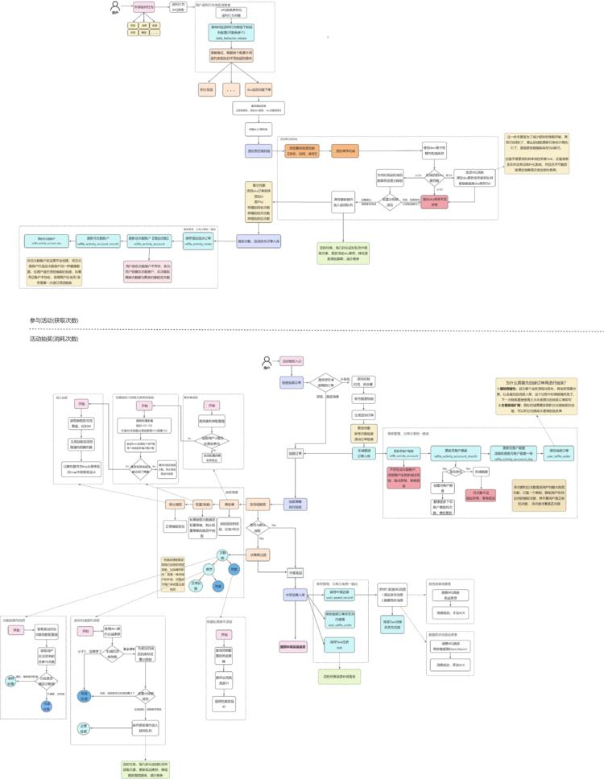
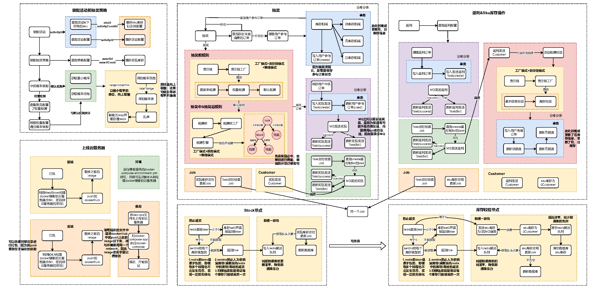
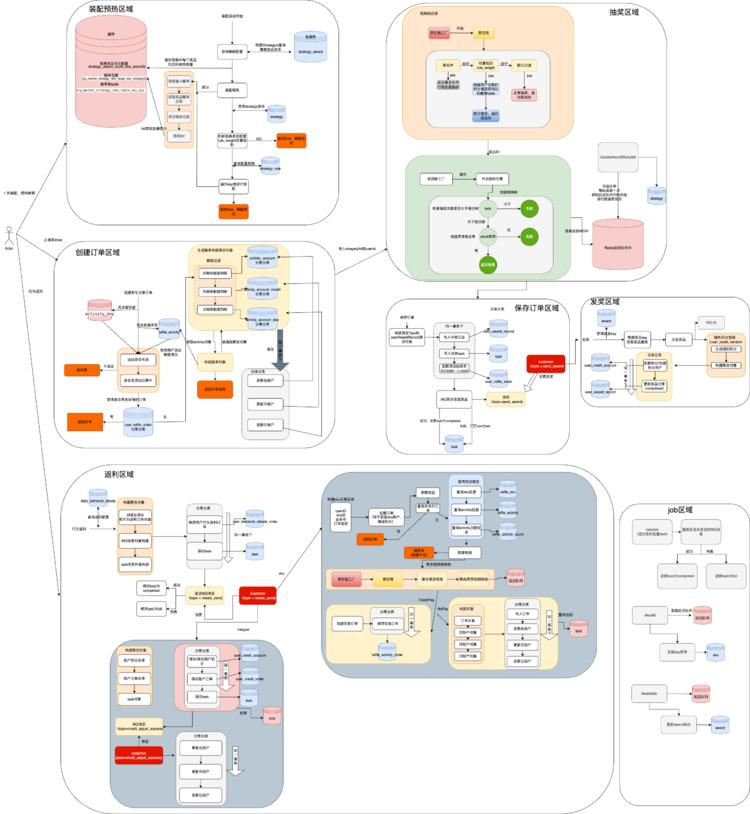
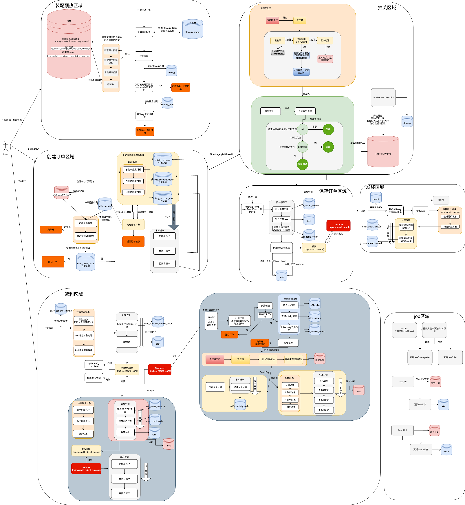
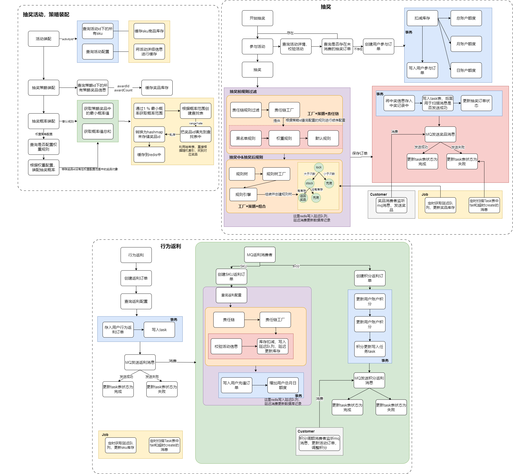
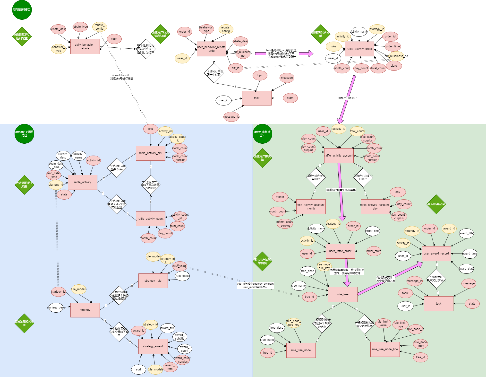

### 
### 参与活动&活动抽奖流程梳理

### 整体流程图

### 行为驱动的数据库表er图

### 问题及改善
### 责任链模式处理抽奖规则
DefaultChainFactory.openLogicChain(Long strategyId) 获取到的ILogicChain会存在并发问题，下面是我的思路:
1. DefaultChainFactory是个单例bean，spring在构建的时候会把所有的ILogicChain接口的bean（也是单例，一个名字比如"rule_blacklist"对应一个）填到logicChainGroup里。
2. 在调用openLogicChain(Long strategyId)的时候会按String[] ruleModels（假设是1,2,3）的顺序从logicChainGroup中取得ILogicChain接口的bean，把他们穿起来（像链表一样，bean 1指向bean2，bean2指向bean3，最后指向bean default），最后返回bean1
3. 我的问题是既然bean都持有了其他ILogicChain接口的bean（相当于有了指针），那这个bean就不再是无状态的了，线程1调用openLogicChain(10001),ruleModels(1,2,3)，返回的是链表1->2->3->default,这时候线程2调用openLogicChain(10002),ruleModels(2,4,6),那线程1持有的链表就变成了1->2->4->6->default
还有就是logicChainGroup.get(ruleModels[0])获取的是单例的吗，每次调用获取的似乎并不是同一个bean实例

**解决**

最初使用的Bean的默认作用域是单例模式，因此会出现上述问题。
后面添加了@Scope(ConfigurableBeanFactory.SCOPE_PROTOTYPE)这个注解， 每次请求该Bean时，Spring容器都会创建一个新的实例，算是spring内置的原型模式应用。
@Scope(ConfigurableBeanFactory.SCOPE_PROTOTYPE)是Spring框架中的一个注解，用于指定Bean的作用域为原型模式（prototype）。在Spring IoC容器中，Bean的默认作用域是单例模式（singleton），即在整个应用中只有一个实例。而原型模式则意味着每次请求该Bean时，Spring容器都会创建一个新的实例。