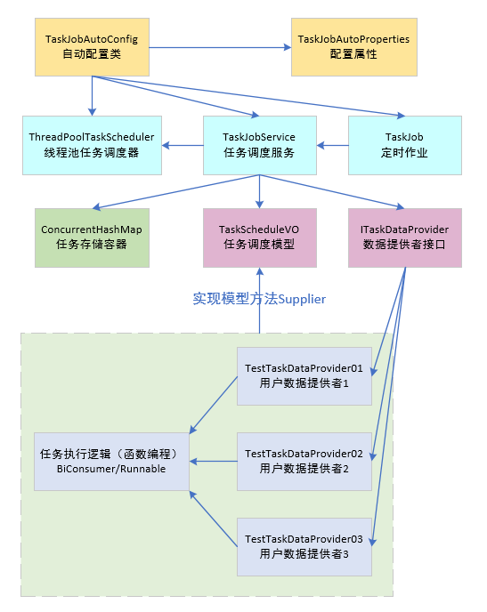
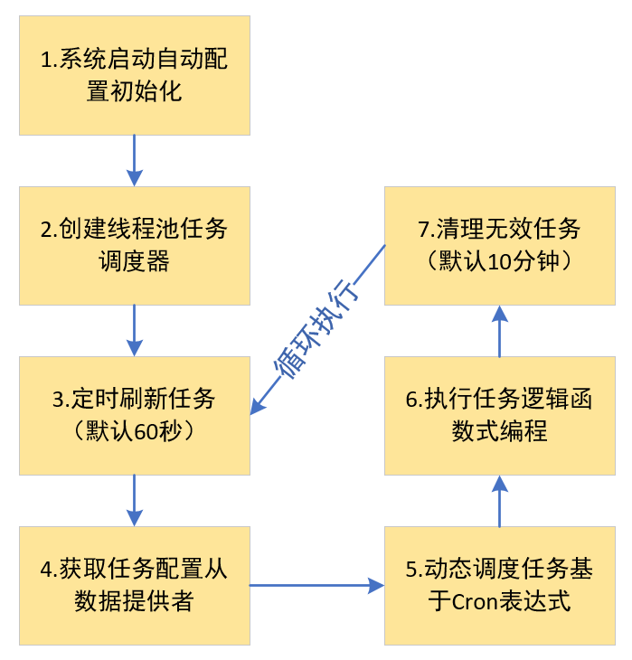
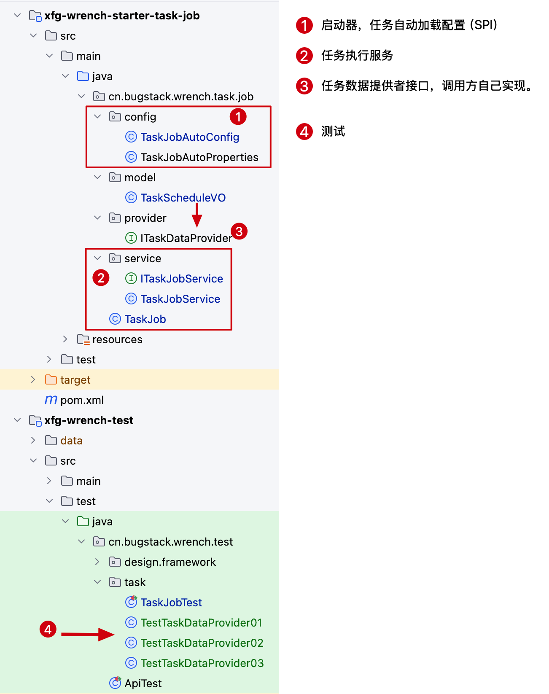

设计实现一个轻量的可动态化添加、移除、刷新、停止等功能的本地任务组件，与xxl-job相比，它更小更轻量，并不需要引入二外的注册中心，与Spring Scheduled硬编码的方式相比，更加的灵活好用。

本组件的最初场景是在ai-agent-station项目中，需要从数据库获取用户配置的定时执行任务，完成自动化ai agent的流程处理，如：定时发帖、定时巡检等。
基于这样的场景诉求，把原本硬编码在ai-agent-station中的这部分逻辑提取出来，实现为独立的技术组件，方便其他系统调用。

## 流程设计
本组件是在Spring Scheduled基础上扩展而来，通过动态的创建线程池任务调度器实例，之后为欸维护任务调度函数式作业，动态化的添加、删除、刷新任务，一次达到动态化注册和使用的目的。

鉴于应用诉求，拆分出了自动化配置类、线程池任务调度器、任务调度服务、定时任务刷新器，以及提供出任务数据接口，由适用方自行实现。每个实现的接口，都会以 list 集合的方式注入到任务调度服务中维护管理。

## 功能实现

**系统执行流程**

执行对象（TaskScheduleVO）:
- 任务ID（id）
- 任务描述（description）
- Cron表达式（cronExpression）
- 任务参数（taskParam）
- 任务执行器函数式接口（taskExecutor）：提供可执行的任务对象

任务执行服务（ITaskJobService，TaskJobService）
- 初始化配置
- 添加任务，如果旧任务存在，先移除旧任务
- 移除任务
- 调度单个 
- 使用函数式编程方式执行任务任务
- 刷新任务调度配置（动态更新）
- 清理无效的任务
- 停止所有任务
- 获得活跃用户数量

任务数据提供者接口（ITaskDataProvider）：用户需要实现此接口来提供任务调度数据

任务调度作业（TaskJob）:负责定时检测任务状态和清理无效任务，这样你配置的任务如果是调整了需要关闭，那么也可以完成任务加载或者清理。
- 定时刷新任务调度配置：TaskJob.refreshTasks()
- 定时清理无效任务：TaskJob.cleanInvalidTasks()

如果想看任务执行的数据，可以在执行的过程中，把数据写到 redis 记录里，之后做一个 admin 管理平台展示数据。
