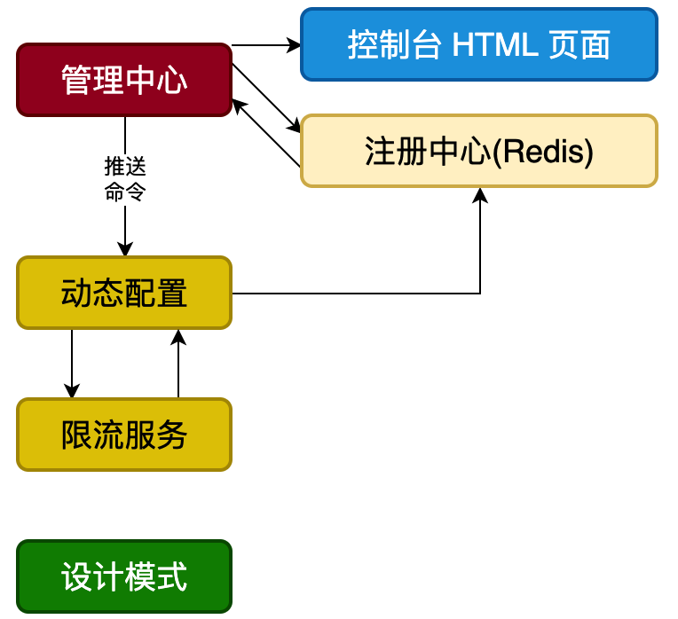
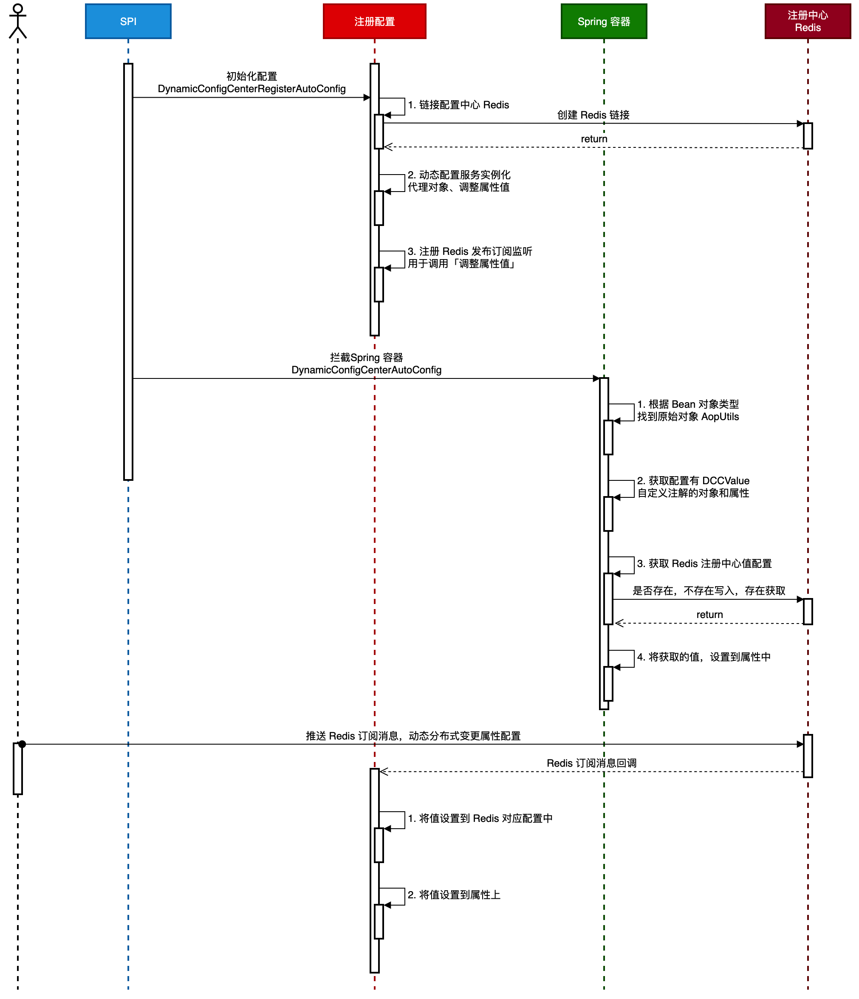
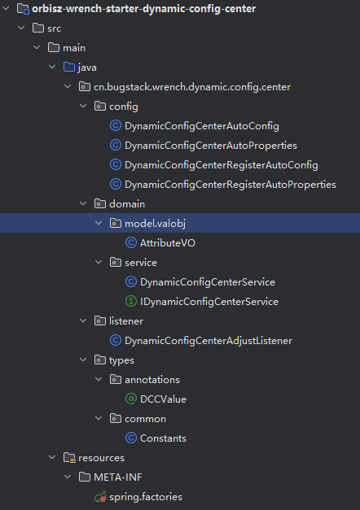

## DCC动态配置中心
核心就是构建一个动态配置中心，它允许应用在不重启的情况下，动态的修改配置项的值。它被封装成⼀个 Spring Boot Starter，
任 何 Spring Boot 项⽬都可以⽅便地引⼊并使⽤。可以通过分布式发布/订阅⽅式，动态的调整 配置指定注解的属性的值，
不需要每次都查询 Redis来获取，从⽽减少 IO 操作

### 流程设计

- 使⽤spring starter机制，以SPI的⽅式，实现组件⼊⼜类的注册。启动时会读取 META INF/spring.factories ⽂件⾥配置的类，
  完成类的初始化动作。
- 注册配置会链接 Redis当作注册中心，因为Redis具备存储和发布订阅的功能。，初始化动态配置中⼼的服务，以及监听订阅消息。
- 拦截 Spring 容器实例化的 Bean 对象，找到使⽤了⾃定义注解 @DCCValue 的属性，
  拦截动态读取 Redis 中配置属性值（如⽆则⾸次设置值），之后对属性进⾏反射调⽤，设置变更后的属性值。
- 操作推送 Redis 发布订阅消息，指定属性key和属性值，则可以被消息回调，变更属性值。

### 功能实现
#### 工程结构

config：项目的propeties以及自动装配Bean对象
domain：领域层, 关注扫描DCCValue已经将topic中的值从Redis中读取并注入到程序中某个字段的业务。
listener：订阅Redis发布消息，动态变更配置
META-INF/spring.factories：SPI入口

#### 关键类
- @DCCValue:⾃定义注解，⽤它标记需要动态管理的字段。
- DynamicConfigCenterAutoConfig: 注⼊⼊口。实现了 BeanPostProcessor，扫描并处理 DCCValue注解 。是连接 Spring 容器和我们⾃定义逻辑的桥梁。
- DynamicConfigCenterAutoProperties: DCC的properties配置文件, 里面定义了DCC有什么需要配置的内容
- DynamicConfigCenterRegisterAutoProperties: 里面定义了Redis需要配置的内容, 并且给出默认值
- DynamicConfigCenterRegisterAutoConfig: 后勤部长。负责创建和组装所有需要的 Bean， 
  如 RedissonClient、RTopic 等。
- DynamicConfigCenterAdjustListener: 情报哨兵。负责监听 Redis 的消息，是动态更新的触发点。
- DynamicConfigCenterService: 核⼼类，封装了所有业务逻辑，包括启动时注⼊和运⾏时更新。
    - 解析Bean对象中的DCCValue注解, 并尝试将这个值设置到Redis中并注入到某个field中(如果不是初始化的情况, 
      也就是Redis中已经存在这个值的时候, 就不用注入), 已经将所有用DCCValue注解标注的bean对象都用map存储起来。
    - listener调用的服务, 将更新后的Redis中的值注入到程序对应字段中。

#### 2. 程序串行的执行过程
1. 在启动SpringBoot以后, 所有的Bean对象都会在初始化以后, 执行被我们重写了的`postProcessAfterInitialization(Object bean, String beanName)`, 
   截获这个对象以后, 执行DynamicConfigCenterService中的`processDCCAnnotations(Object bean)`, 下面是详细的执行过程
    1. 首先需要解代理(具体的原因在\[项目细节\]里面有), 因为这里的bean对象可能是代理后的对象
    2. 从解代理以后的class中扫描有没有字段被@DCCValue修饰
    3. 将DCCValue中的key如果不存在于Redis中, 说明这个字段是第一次被扫描, 这个时候将DCCValue中的默认值存到Redis中. 如果存在则取出来最新的值
    4. 将步骤3中获取到要注入的值注入到对应的field中
    5. 将这对key(这里的key是经过了system_attributeName拼接后的), 和对应的原始bean对象存到线程安全Map里面
2. 在测试程序中我们通过在AutoConfig里面装配的dynamicConfigCenterRedisTopic发布消息
3. AdjustListener订阅了这个消息, 在监听到消息以后, 执行` dynamicConfigCenterService.adjustAttributeValue(attributeVO)`将值注入到对应的Bean对象中
    1. 获取key, 从`processDCCAnnotations`存入的dccBeanGroup中读取出来需要的注入的Bean对象
    2. 更新Redis中的值, 并将这个value注入到对应的field中

#### 两大核心流程
##### 流程一：启动时，配置会自动注入
当你启动应⽤时，@DCCValue 注解的字段如何被赋值的流程：
1. Spring加载: Spring Boot 通过 spring.factories ⽂件找到并加载
  DynamicConfigCenterAutoConfig。
2. 拦截Bean: DynamicConfigCenterAutoConfig 是⼀个 BeanPostProcessor。它会在每个
   Spring Bean 初始化之后，对这个 Bean 进⾏拦截。 
3. 扫描注解: 调⽤ DynamicConfigCenterService 的 proxyObject ⽅法，使⽤反射
   (getDeclaredFields) 扫描当前 Bean 中是否包含 @DCCValue 注解的字段。
4. 获取与设置值:
   - 解析注解 ("key:defaultValue")，获取配置名 key 和默认值 defaultValue。
   - 根据 key 去 Redis 查询。如果 Redis 中有值，就⽤ Redis 的值；如果没有，就⽤ defaultValue，并把默认值写⼊ Redis。
   - 最终通过反射 (field.set(bean, value)) 将值注⼊到字段中。

##### 流程二：运行时，配置动态更新
当线上修改某个配置值时
1. 发布消息: 外部系统（或其他服务）向 Redis 的⼀个特定 Topic (主题) 发布⼀条消息。这
   条消息包含了要修改的配置名和新的值 (例如 new AttributeVO("downgradeSwitch",
   "100"))。
2. 监听消息: DynamicConfigCenterAdjustListener ⼀直在监听这个 Topic，它接收到消息
   后，会⽴即响应。
3. 调⽤服务: 监听器会调⽤ DynamicConfigCenterService 的 adjustAttributeValue ⽅法更新配置
   - 该方法首先会更新Redis中存储的值
   - 然后，它会从⼀个内部缓存 (dccBeanGroup) 中找到持有该配置项的那个 Bean 实例。
   - 最后，再次通过反射直接修改那个在线的、正在运⾏的 Bean 实例的字段值，从⽽实现动态更新。

### 项目细节
#### 类已经被代理了, 如果回退到原来的类?
要回答这个问题就需要回头看到代理是怎么实现的, 我们才能在实现中捕捉到这件事情是不是可行的。
```java
public interface TargetSource extends TargetClassAware {

	@Override
	@Nullable
	Class<?> getTargetClass();

	boolean isStatic();

	@Nullable
	Object getTarget() throws Exception;

	void releaseTarget(Object target) throws Exception;

}
```
Spring在创建代理**JDK动态代理**的对象的过程中会将目标类的信息保存到AdviseSupport(继承自TargetSource), 
通过这个类我们就能获取到原始的类和实例。

而如果是使用CGLIB动态代理, 因为CGLIB代理是通过继承实现的, 只需要`getSuperClass()`就能获取到原先的类。

#### 获取代理类的原始class
通过`AopUtils.getTargetClass()`方法
```java
public static Class<?> getTargetClass(Object candidate) {
		Assert.notNull(candidate, "Candidate object must not be null");
		Class<?> result = null;
		if (candidate instanceof TargetClassAware) {
			result = ((TargetClassAware) candidate).getTargetClass();
		}
		if (result == null) {
			result = (isCglibProxy(candidate) ? candidate.getClass().getSuperclass() : candidate.getClass());
		}
		return result;
	}
```
所有使用JDK动态代理被代理的类都是继承了TargetSource的, TargetSource继承TargetClassAware, 
所以能通过检查是不是继承自TargetClassAwar来识别是不是代理类。

确定了类是代理类, 通过`TargetClassAware`中的`getTargetClass()`方法获取该代理类的原始类。
如果这个result为空, 说明是通过CGLIB动态代理的或者压根就没被代理, 如果是CGLIB代理的返回父类, 反之返回本身的类。

#### 获取代理对象的原始对象
通过 `AopProxyUtils.getSingletonTarget()`实现
```java
public static Object getSingletonTarget(Object candidate) {
    if (candidate instanceof Advised) {
        TargetSource targetSource = ((Advised) candidate).getTargetSource();
        if (targetSource instanceof SingletonTargetSource) {
            return ((SingletonTargetSource) targetSource).getTarget();
        }
    }
    return null;
}
```
Advised继承自TargetAware, SingletonTargetSource是一种特殊的TargetSource, 单例模式的目标对象继承SingletonTargetSource而不是TargetSource。
1. 先判断candidate是不是代理对象: `if (candidate instanceof Advised) `
2. 判断是不是单例类型: `if (targetSource instanceof SingletonTargetSource) `

**不同于获取原始类的class, 针对CGLIB和JDK动态代理有不同的处理方式, 对于获取原对象, 只有存储下来原对象, 并在需要的时候返回这一种处理方式**

#### 为什么需要回退代理
在注解开发中这是重要的一环，因为在动态代理过程中可能会丢失原对象的注解信息。
##### 在JDK代理中
- JDK动态代理基于接口实现, 生成的代理类继承自`java.lang.reflect.Proxy`, 代理对象的实际类型不再是原始类, 是动态生成的代理类。
- JDK代理众所周知只能代理接口中定义的方法, 如果注解是加在实现类上的, 而不是接口上的, 代理对象就无法访问这些注解

##### 在CGLIB中
- CGLib生成的是原始类的子类
- 虽然会继承父类的注解，但在某些框架处理中仍可能出现问题

**所以在注解驱动开发中, 识别类是不是代理类, 并将类回退到原始类是个必要的工作, 防止类因为代理而导致注解丢失**

##### 多层代理问题
如果一个类被多层代理, 使用`AopUtils.getTargetClass()`实际上只能获取到"**上一层**"的Class, 而不是最原始的Class, 这个时候就需要使用`AopProxyUtils.ultimateTargetClass()`。这也算是项目中的小bug。