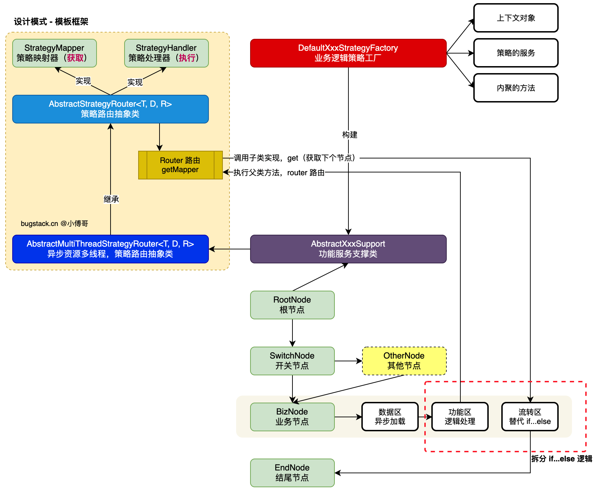
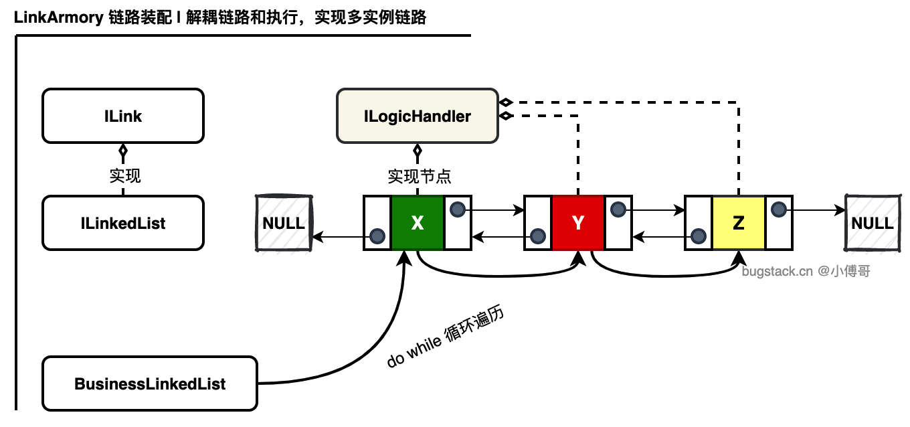
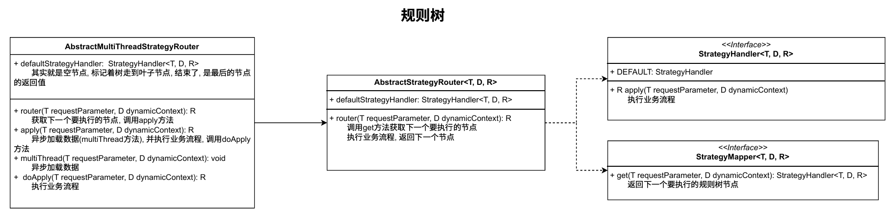
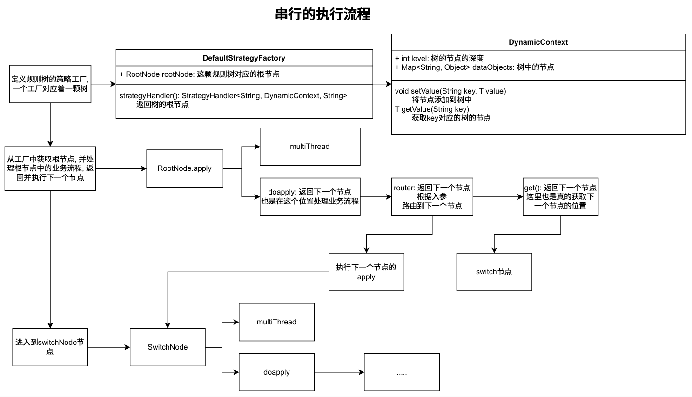
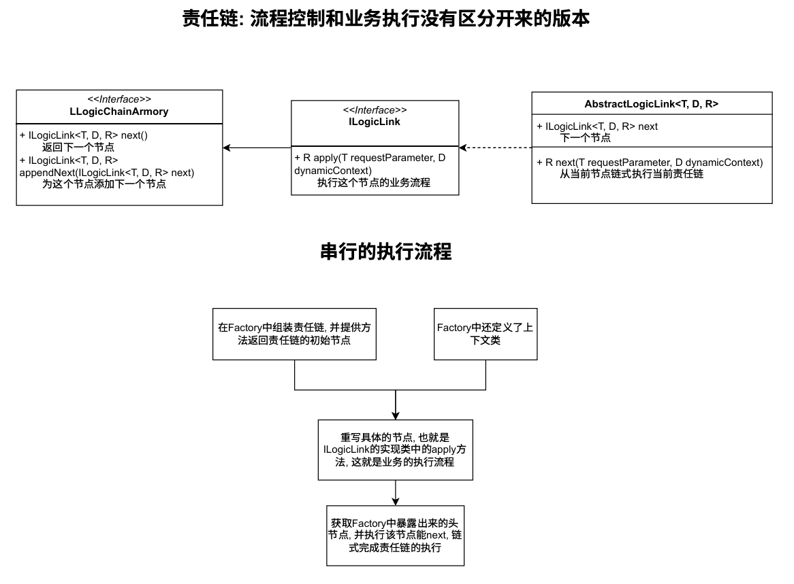
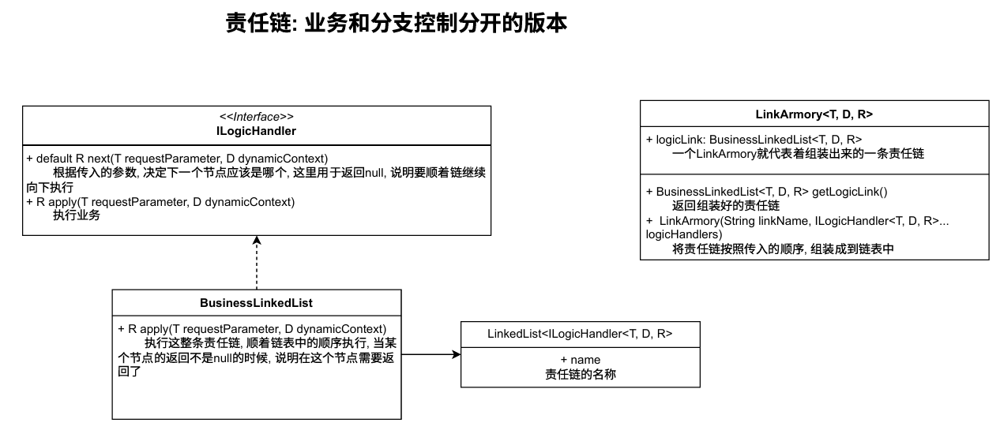
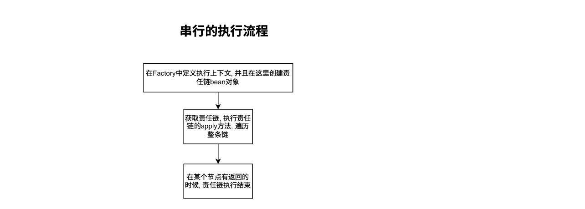

## 责任链和规则树通用模型框架
对代码中共用的设计模式的抽象，既减少了各个业务之间重用部分，也标准化了设计模式在业务中的使用形式。在规则树和责任链中，将流程控制部分和节点的业务执行部分解耦合，保证了模板的灵活度。
通过使用者自己创建工厂组装实体链/树。

规则树处理复杂场景的调度流转，可以是后一个节点重新返回第N个节点，也可以在节点间条件选择进入其他节点。而责任链则专门处理单一链路流程。

### 方案设计
#### 规则树

- 首先设计了两个接口方法：
  - StrategyMapper：用于处理下个流程要获取到的 StrategyHandler 实现类。
  - StrategyHandler：用于处理具体的功能逻辑实现。在功能逻辑实现的子类，也同样实现了 StrategyMapper 接口方法。也就是一个 StrategyHandler 实现类，即实现了自己的业务功能逻辑方法，也实现了下一个要流转到其他处理器的流转判断。
- 策略路由类的作用就是衔接处理流程完毕后，导向下一个节点的过程。负责调度，但不做具体的功能实现。比如A Handler 执行完了，要执行 B Handler 了，那么 A 执行逻辑后，调用抽象父类的 router 路由方法，路由方法获取到 StrategyMapper 接口的 get 实现（A Handler 下），来获取下一个要执行的 B Handler。
- 增加异步资源多线程，让一些复杂的流程节点，可以前置的多线程方式的加载异步数据。比如一个业务节点，要做很多的账户、营销、物流、风控等数据的获取来综合处理。通过多线程的方式，可以大大的提高执行效率。

规则树框架的使用, 类继承AbstractMultiThreadStrategyRouter<T, D, R>, 每个树节点通过重写get方法的返回来控制下一个要访问的节点, 重写doapply()方法来处理这个节点要处理的业务流程, 重写multiThread()来异步加载数据。

#### 责任链

- 实现一堆Handler处理器，装到一个List集合。封装成Bean对象给逻辑方法使用。
- 责任链分为设计单例链还是原型链。如果你的链和要执行到下一个节点的逻辑耦合，那么在创建 A B C 责任链后，如果要创建 B F D，就会影响到之前的 A B C 链路，因为他们共用一个对象。所以要做功能和逻辑拆分，之后在提供拼装器来组装链路。

### 串行执行流程
泛型 T - 入参、D - 上下文、R - 返参。
#### 规则树

- `StrategyMapper` ：策略映射器，负责根据请求参数和上下文环境映射到对应的策略处理器
- `StrategyHandler` ：策略处理器，定义了策略的执行方法，apply-执行具体的策略逻辑，接收请求参数和上下文，返回处理结果。
- `AbstractStrategyRouter` : 策略路由抽象类，实现了基本的策略路由功能,- 提供 router 方法，根据参数和上下文获取策略处理器并执行。当没有找到合适的策略处理器时，使用默认处理器。
- `AbstractMultiThreadStrategyRouter` ：异步资源加载策略路由器，扩展了基本路由功能，支持异步处理。重写 apply 方法，将处理过程分为异步数据加载和业务流程处理两部分；
定义抽象方法 multiThread ，用于异步加载数据；定义抽象方法 doApply ，用于处理业务流程。

1. 定义规则树工厂，确定根节点和上下文管理器。
2. 调用 RootNode.apply，处理根节点业务（支持单/多线程）。
3. 通过 router确定下一节点，利用 DynamicContext存储/获取节点数据。
4. 按路由结果进入子节点（如 SwitchNode），重复 apply→ doapply→ router流程。
5. 节点间严格按顺序跳转，直至流程结束（无并行分支干扰串行逻辑）。

#### 责任链
**单例链路**

责任链中的每个节点在应用中只有一个实例，通常通过Spring容器管理为单例Bean。

**多例链路**

多例链每次构建或使用责任链时，创建新的处理器实例，避免状态共享。多例链的设计要解耦链路和执行，把链路当做一个 LinkedList 列表处理，之后执行当做是单独的 for 循环。

- `DynamicContex`：链路动态上下文，用于在责任链节点间传递数据和控制流程。提供 proceed 标志，控制责任链是否继续执行；
维护一个数据映射表，允许在链路节点间共享数据；提供类型安全的 getValue 和 setValue 方法。
- `ILogicHandler`：定义逻辑处理器接口，处理具体的业务逻辑。
- `BusinessLinkedList`：业务链路，用于构建和执行业务逻辑处理链路。继承自 LinkedList ，使用 ILogicHandler 作为元素类型；
实现 ILogicHandler 接口，提供责任链的执行逻辑；在 apply 方法中遍历链表，依次执行每个处理器的逻辑；根据上下文的 proceed 标志决定是否继续执行下一个处理器。
- `LinkArmory`：链路装配器，用于创建和配置业务链路。在构造函数中接收链路名称和多个逻辑处理器；创建业务链路并添加所有处理器；
提供获取配置好的业务链路的方法。

1. 创建实现 ILogicHandler 的具体处理器类
2. 实现 apply 方法，在方法中处理业务逻辑
3. 使用 LinkArmory 装配责任链，添加多个处理器
4. 调用 LinkArmory.getLogicLink().apply() 启动责任链处理
5. 在责任链执行过程中，通过 DynamicContext 在处理器间传递数据
6. 处理器可以通过调用 next() 继续执行链或调用 stop() 终止链的执行