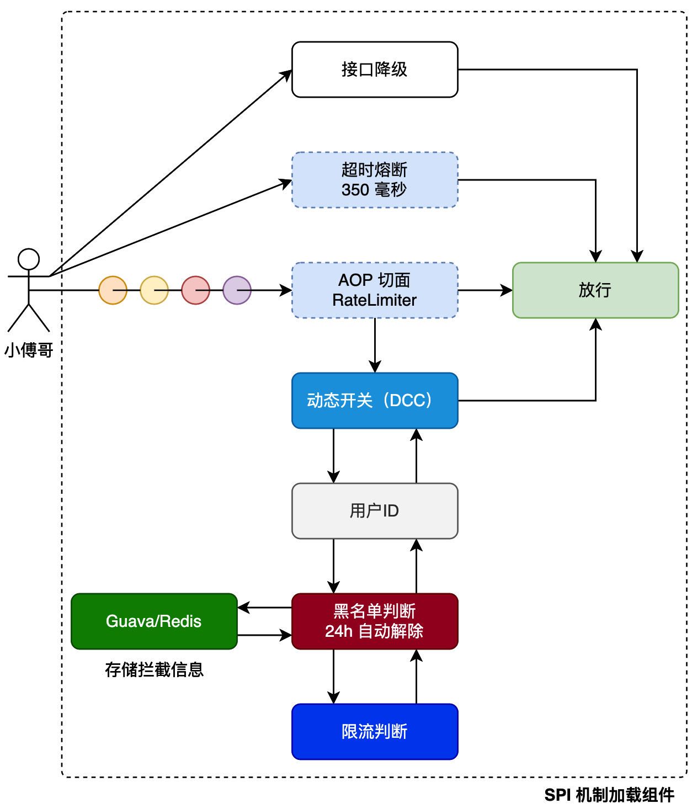

## 动态限流
基于Guava RateLimiter 限流组件，使用 aop 切面技术，实现一款统一限流服务组件。对于频繁访问的用户动态添加黑名单拦截，再通过动态调用方法返回拦截后的结果信息。

限流的策略是, 如果用户的QPS超过了注解中的QPS值, 就会执行限流回调函数, 并将用户的被限流次数++, 如果用户的被限流次数超过了注解中的blacklistCount, 用户就相当于被添加到黑名单, 会在24h内只执行限流回调函数, 通过cache将用户绑定到Ratelimiter上, 通过令牌桶来判断用户流量是不是超过了规定值, 令牌桶1min过期
### 流程设计

- 增加SPI机制，动态的处理组件的加载，以把动态限流封装成统一的组件给其他业务服务使用。
- 在使用了AOP切面插入的地方，如 @DCC 直接获取类操作属性要考虑代理类的存在。
- RateLimiter 限流，当一个用户频繁访问超过N次后，则会将这个用户加入黑名单列表，不允许在访问当前服务。直至过了超时时间从黑名单列表移走后才允许访问。

### 程序的串行执行过程

1. @RateLimiterAccessInterceptor注解到需要拦截的方法上

```java
@Target(ElementType.METHOD)
@Retention(RetentionPolicy.RUNTIME)
@Documented
public @interface RateLimiterAccessInterceptor {
    String key() default "all";
    // 限制频次: 每秒请求次数
    double permitsPerSecond();
    // 黑名单拦截: 多少次限制以后加入到黑名单, 0代表不做限制
    double blacklistCount() default 0;
    // 拦截后执行的方法
    String fallbackMethod();
}
```

**限流执行流程**
- 通过 spring.factories 文件中的自动配置项，Spring Boot启动时加载 RateLimiterAutoConfig ，并创建 RateLimiterAOP 切面实例。
- RateLimiterAOP 中的 @DCCValue("rateLimiterSwitch:open") 注解会从动态配置中心获取限流开关状态。
- RateLimiterAOP对象拦截所有被@RateLimiterAccessInterceptor注解的方法
    1. 通过第一节的DCC来动态配置限流组件的状态(打开还是关闭)，通过反射从方法参数中提取用户标识
    2. 执行黑名单过滤, 在黑名单中, 执行注解中的fallbackMethod
    3. 如果该用户不在黑名单中, 则通过令牌桶限流
    4. 如果用户获取令牌失败, 也就是超过了限定的QPS(注解中的permitsPerSecond), 则进行限流
        1. 将用户的被限流次数+1(如果用户被限流次数超过了注解中的blacklistCount, 就会执行黑名单过滤了)
        2. 执行注解中的fallbackMethod

### 技术细节

- fallbackMethod必须定义在被注解的方法所在的类上, 不能跨类, 因为是通过反射获取到这个方法的
- 获取Cache的key通过反射从方法的入参中获取, 不能通过`filedValue = BeanUtils.getProperty(arg, attr);`获取, 因为使用了lombok对于uid这样的字段, 生成的get方法是getuid, 而使用IDEA生成的标准的get方法是getUid, 使用lombok的时候会无法获取到属性的值, 所以需要通过反射获取

