在图形结构中，节点之间的关系可以是任意的，图中任意两个数据元素之间都可能相关。

### 图的基本概念

图（Graph）是由顶点的有穷非空集合 $V(G)$ 和顶点之间边的集合 $ E(G) $ 组成，通常表示为：$ G = (V, E) $，
其中，$ G $ 表示一个图，$ V $ 是图 $ G $ 中顶点的集合，$ E $ 是图 $ G $ 中边的集合。若 $ V = \{v_1, v_2, \dots, v_n\} $，
则用 $ |V| $ 表示图 $ G $ 中顶点的个数，也称图 $ G $ 的阶，$ E = \{(u, v) | u \in V, v \in V\} $，用 $ |E| $ 表示图 $ G $ 中边的条数。

> 图一定不能是空图，即图的顶点集 $ V $ 一定非空，单边集 $ E $ 可以为空，此时图中只有顶点，没有边

### 图的基本概念

#### 1. 有向图

若 $ E $ 是有向边（也称弧）的有限集合时，则图 $ G $ 为有向图。弧是顶点的有序对，记为 $ \langle v, w \rangle $，其中 $ v $、$ w $ 是顶点，$ v $ 称为弧尾，
$ w $ 称为弧头，$ \langle v, w \rangle $ 称为从顶点 $ v $ 到顶点 $ w $ 的弧，也称 $ v $ 邻接到 $ w $，或 $ w $ 邻接自 $ v $。

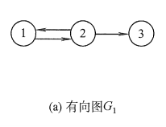

#### 2. 无向图

若 $ E $ 是无向边（简称边）的有限集合时，则图 $ G $ 为无向图。边是顶点的无序对，记为 $ (v, w) $ 或 $ (w, v) $，因为 $ (v, w) = (w, v) $，
其中 $ v $、$ w $ 是顶点。可以说顶点 $ w $ 和顶点 $ v $ 互为邻接点。边 $ (v, w) $ 依附于顶点 $ w $ 和 $ v $，或者说边 $ (v, w) $ 和顶点 $ v $、$ w $ 相关联。

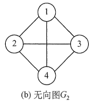

#### 3. 简单图

简单图是图论中最基础的图类型，满足两个核心条件：

- 无自环：不存在顶点到自身的边（即没有形如 $ u \leftrightarrow u $的边）；
- 无多重边：任意两个不同顶点之间最多有一条边（无向图中无重复的 $(u,v)$边；有向图中无重复的 $(u,v)$ 或 $(v,u)$ 方向的边）。

#### 4.多重图

多重图放宽了简单图的“无多重边”限制，允许两个顶点之间存在多条边（即边的多重性），但通常仍保留“无自环”或”允许自环“（因定义而异，常见定义不限制自环）。

#### 5. 简单完全图

对于无向图，$|E|$ 的取值范围是 $0$ 到 $n(n - 1)/2$，有 $n(n - 1)/2$ 条边的无向图称为完全图，在完全图中任意两个顶点之间都存在边。
对于有向图，$|E|$ 的取值范围是 $0$ 到 $n(n - 1)$，有 $n(n - 1)$ 条弧的有向图称为有向完全图，在有向完全图中任意两个顶点之间都存在方向相反的两条弧。
上图中 $G_2$ 为无向完全图，而 $G_3$ 为有向完全图。

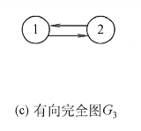

#### 6. 子图

设有两个图 $ G = (V, E) $ 和 $ G' = (V', E') $，若 $ V' $ 是 $ V $ 的子集，且 $ E' $ 是 $ E $ 的子集，则称 $ G' $ 是 $ G $ 的子图。
若有满足 $ V(G') = V(G) $ 的子图 $ G' $，则称其为 $ G $ 的生成子图。上图中 $ G_3 $ 为 $ G_1 $ 的子图。

> 注意：并非 $ V $ 和 $ E $ 的任何子集都能构成 $ G $ 的子图，因为这样的子集可能不是图，即 $ E $ 的子集中的某些边关联的顶点可能不在这个 $ V $ 的子集中。

#### 7、连通、连通图和连通分量

在无向图中，若从顶点 $ v $ 到顶点 $ w $ 有路径存在，则称 $ v $ 和 $ w $ 是连通的。若图 $ G $ 中任意两个顶点都是连通的，则称图 $ G $ 为**连通图**，
否则称为**非连通图**。无向图中的极大连通子图称为**连通分量**。若一个图有 $ n $ 个顶点，并且边数小于 $ n - 1 $，则此图必是非连通图。
如下图(a)所示，图 $ G_4 $ 有3个连通分量，如图 (b) 所示。

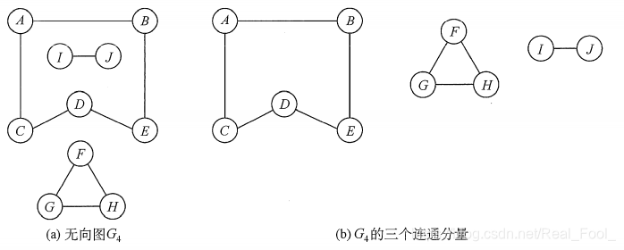

> 极大连通子图是无向图的连通分量，极大即要求该连通子图包含其所有的边;极小连通子图是既要保持图连通又要使得边数最少的子图。

#### 8、强连通图、强连通分量

在有向图中，若从顶点 $ v $ 到顶点 $ w $ 和从顶点 $ w $ 到顶点 $ v $ 之间都有路径，则称这两个顶点是强连通的。
若图中任何一对顶点都是强连通的，则称此图为**强连通图**。有向图中的极大强连通子图称为有向图的**强连通分量**，图 $ G_1 $ 的强连通分量如下图所示。

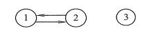

> 注意：强连通图、强连通分量只是针对有向图而言的。一般在无向图中讨论连通性，在有向图中考虑强连通性。

#### 9、生成树、生成森林

连通图的生成树是包含图中全部顶点的一个极小连通子图。若图中顶点数为 $ n $，则它的生成树含有 $ n - 1 $ 条边。
对生成树而言，若砍去它的一条边，则会变成非连通图，若加上一条边则会形成一个回路。在非连通图中，连通分量的生成树构成了非连通图的**生成森林**，即生成森林是非连通图的生成树集合。图 $ G_2 $ 的一个生成树如下图所示。

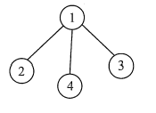

> 注意：包含无向图中全部顶点的极小连通子图，只有生成树满足条件，因为砍去生成树的任一条边，图将不再连通。

#### 10、顶点的度、入度和出度

图中每个顶点的度定义为以该顶点为一个端点的边的数目。
对于无向图，顶点 $ v $ 的度是指依附于该顶点的边的条数，记为 $ TD(v) $。
在具有 $ n $ 个顶点、$ e $ 条边的无向图中，$\sum_{i=1}^{n} TD(v_i) = 2e$，即无向图的全部顶点的度的和等于边数的2倍，因为每条边和两个顶点相关联。
对于有向图，顶点 $ v $ 的度分为入度和出度，入度是以顶点 $ v $ 为终点的有向边的数目，记为 $ ID(v) $；而出度是以顶点 $ v $ 为起点的有向边的数目，记为 $ OD(v) $。
顶点 $ v $ 的度等于其入度和出度之和，即 $ TD(v) = ID(v) + OD(v) $。
在具有 $ n $ 个顶点、$ e $ 条边的有向图中，$\sum_{i=1}^{n} ID(v_i) = \sum_{i=1}^{n} OD(v_i) = e$，即有向图的全部顶点的入度之和与出度之和相等，并且等于边数。
这是因为每条有向边都有一个起点和终点。

#### 11、边的权和网

在一个图中，每条边都可以标上具有某种含义的数值，该数值称为该边的**权值**。这种边上带有权值的图称为**带权图**，也称**网**。

#### 12、稠密图、稀疏图

边数很少的图称为**稀疏图**，反之称为**稠密图**。稀疏和稠密本身是模糊的概念，稀疏图和稠密图常常是相对而言的。一般当图 $ G $ 满足 $ |E| < |V| \log|V| $ 时，可以将 $ G $ 视为稀疏图。

#### 13、路径、路径长度和回路

顶点 $ v_p $ 到顶点 $ v_q $ 之间的一条路径是指顶点序列 $ v_p, v_{i_1}, v_{i_2}, \dots, v_{i_m}, v_q $，当然关联的边也可以理解为路径的构成要素。
路径上边的数目称为**路径长度**。第一个顶点和最后一个顶点相同的路径称为**回路**或**环**。若一个图有 $ n $ 个顶点，并且有大于 $ n - 1 $ 条边，则此图一定有环。

#### 14、简单路径、简单回路

在路径序列中，顶点不重复出现的路径称为**简单路径**。除第一个顶点和最后一个顶点外，其余顶点不重复出现的回路称为**简单回路**。

#### 15、距离

从顶点 $ u $ 出发到顶点 $ v $ 的最短路径若存在，则此路径的长度称为从 $ u $ 到 $ v $ 的**距离**。
若从 $ u $ 到 $ v $ 根本不存在路径，则记该距离为无穷（$ \infty $）。

#### 16、有向树

一个顶点的入度为 $ 0 $、其余顶点的入度均为 $ 1 $ 的有向图，称为**有向树**。

### 图的存储结构

由于图的任意两个顶点之间都可能存在联系，因此无法以数据元素在内存中的物理位置来表示元素之间的关系，即图不可能用简单的顺序存储结构来表示。
而多重链表的方式，要么会造成很多存储单元的浪费，要么又带来操作的不便。因此，对于图来说，如何对它实现物理存储是个难题。

#### 1. 邻接矩阵

图的邻接矩阵存储方式是用两个数组来表示图。一个一维数组存储图中顶点信息，一个二维数组（称为邻接矩阵）存储图中的边或弧的信息。

设图 $ G $ 有 $ n $ 个顶点，则邻接矩阵 $ A $ 是一个 $ n \times n $ 的方阵，定义为：
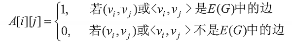

下图是一个无向图和它的邻接矩阵：
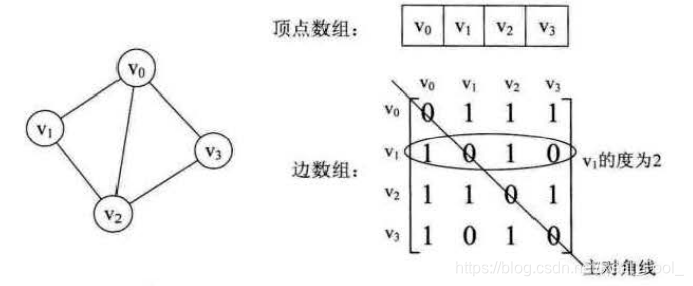

可以看出：

1. 无向图的邻接矩阵一定是一个**对称矩阵**（即从矩阵的左上角到右下角的主对角线为轴，右上角的元与左下角相对应的元全都是相等的）。因此，在实际存储邻接矩阵时只需存储上（或下）三角矩阵的元素。
2. 对于无向图，邻接矩阵的第 $ i $ 行（或第 $ i $ 列）非零元素（或非 $ \infty $ 元素）的个数正好是第 $ i $ 个顶点的度 $ TD(v_i) $。比如顶点 $ v_1 $ 的度就是 $ 1 + 0 + 1 + 0 = 2 $。
3. 求顶点 $ v_i $ 的所有邻接点就是将矩阵中第 $ i $ 行元素扫描一遍，$ A[i][j] $ 为 1 就是邻接点。

下图是有向图和它的邻接矩阵：
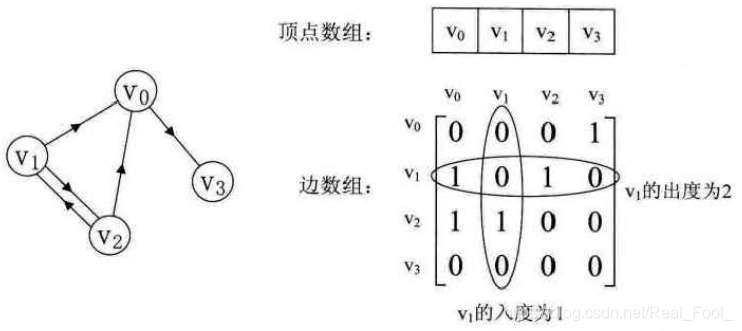

可以看出：

1. 主对角线上数值依然为 0，但因为是有向图，所以此矩阵并不对称。
2. 有向图讲究入度与出度，顶点 $ v_1 $ 的入度为 1，正好是第 $ v_1 $ 列各数之和。顶点 $ v_1 $ 的出度为 2，即第 $ v_1 $ 行的各数之和。
3. 与无向图同样的办法，判断顶点 $ v_i $ 到 $ v_j $ 是否存在弧，只需要查找矩阵中 $ A[i][j] $ 是否为 1 即可。

对于带权图而言,若顶点 $v_i$ 和 $v_j$之间有边相连，则邻接矩阵中对应项存放着该边对应的权值
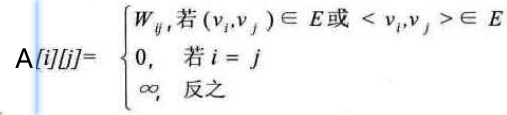

下图是有向网图和它的邻接矩阵：
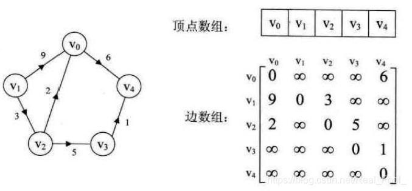

##### 代码实现

```java
/**
 * 邻接矩阵表示的图结构（对应C语言的MGraph）
 */
public class MGraph {
    // 顶点数最大值（对应C的MaxVertexNum宏）
    public static final int MAX_VERTEX_NUM = 100;
    
    // 顶点表：存储顶点数据（原C的VertexType Vex[]，此处用char数组对应原char类型顶点）
    private char[] vertexArray;
    // 邻接矩阵：存储边的权值（原C的EdgeType Edge[][]，此处用int二维数组对应原int权值）
    private int[][] adjacencyMatrix;
    // 当前图的顶点数（对应原vexnum）
    private int vertexCount;
    // 当前图的弧（边）数（对应原arcnum）
    private int arcCount;

    /**
     * 默认构造方法：初始化空图
     */
    public MGraph() {
        this.vertexArray = new char[MAX_VERTEX_NUM];
        this.adjacencyMatrix = new int[MAX_VERTEX_NUM][MAX_VERTEX_NUM];
        this.vertexCount = 0;
        this.arcCount = 0;
        
        // 可选：初始化邻接矩阵为"无连接"状态（Java默认int为0，已满足）
    }

    // ---------------------- 可选扩展方法（非原结构必需，但常用） ----------------------
    /**
     * 添加顶点
     * @param vertex 顶点数据（char类型，对应原VertexType）
     * @return 是否添加成功（顶点数未超过最大值）
     */
    public boolean addVertex(char vertex) {
        if (vertexCount >= MAX_VERTEX_NUM) return false;
        vertexArray[vertexCount++] = vertex;
        return true;
    }

    /**
     * 添加边（无向图）
     * @param v1 顶点1的索引（从0开始）
     * @param v2 顶点2的索引（从0开始）
     * @param weight 边的权值（对应原EdgeType）
     */
    public void addEdge(int v1, int v2, int weight) {
        if (v1 < 0 || v1 >= vertexCount || v2 < 0 || v2 >= vertexCount) return;
        // 无向图：对称赋值
        adjacencyMatrix[v1][v2] = weight;
        adjacencyMatrix[v2][v1] = weight;
        arcCount++; // 无向图每条边算1条弧
    }

    /**
     * 添加边（有向图）
     * @param from 源顶点索引
     * @param to 目标顶点索引
     * @param weight 边的权值
     */
    public void addDirectedEdge(int from, int to, int weight) {
        if (from < 0 || from >= vertexCount || to < 0 || to >= vertexCount) return;
        adjacencyMatrix[from][to] = weight;
        arcCount++; // 有向图每条边算1条弧
    }
}
```

> **注意**
> 
> ① 在简单应用中，可直接用二维数组作为图的邻接矩阵（顶点信息等均可省略）。
> 
> ② 当邻接矩阵中的元素仅表示相应的边是否存在时，`EdgeType` 可定义为值为和 1 的枚举类型。
> 
> ③ 无向图的邻接矩阵是对称矩阵，对规模特大的邻接矩阵可采用压缩存储。
> 
> ④ 邻接矩阵表示法的空间复杂度为 $ O(n^2) $，其中 $ n $ 为图的顶点数 $ |V| $。
> 
> ⑤ 用邻接矩阵法存储图，很容易确定图中任意两个顶点之间是否有边相连。但是，要确定图中有多少条边，则必须按行、按列对每个元素进行检测，所花费的时间代价很大。
> 
> ⑥ 稠密图适合使用邻接矩阵的存储表示。

#### 2. 邻接图

当一个图为稀疏图时，可以使用邻接矩阵会浪费大量存储空间，而邻接表结合了顺序存储和链式存储，大大减少了不必要的空间浪费。

所谓邻接表，是指对图 $ G $ 中的每个顶点 $ v_i $ 建立一个单链表，第 $ i $ 个单链表中的结点表示依附于顶点 $ v_i $ 的边（对于有向图则是以顶点 $ v_i $ 为尾的弧），
这个单链表就称为顶点 $ v_i $ 的边表（对于有向图则称为出边表）。边表的头指针和顶点的数据信息采用顺序存储（称为顶点表），所以在邻接表中存在两种结点：顶点表结点和边表结点，如下图所示：
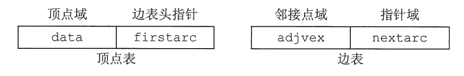

顶点表结点由顶点域(data)和指向第一条邻接边的指针(firstarc) 构成，边表(邻接表)结点由邻接点域(adjvex)和指向下一条邻接边的指针域(nextarc) 构成。

无向图的邻接表的实例如下图所示
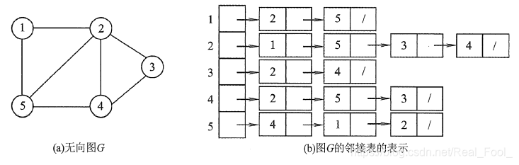

有向图的邻接表的实例如下图所示
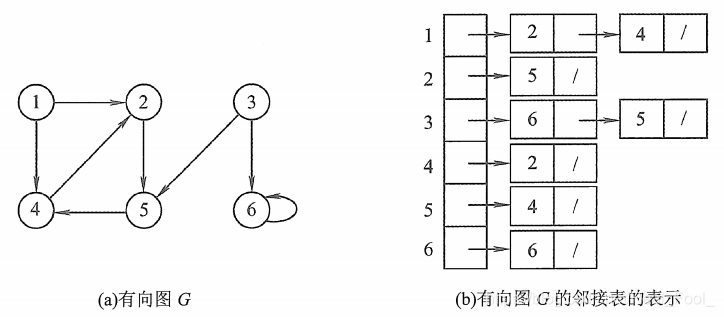

##### 代码实现

```java
// 边表结点
class EdgeNode {
    private int adjvex;       // 该弧所指向的顶点的下标或者位置
    private int weight;       // 权值，对于非网图可以不需要
    private EdgeNode next;    // 指向下一个邻接点

    // 构造方法
    public EdgeNode(int adjvex, int weight) {
        this.adjvex = adjvex;
        this.weight = weight;
        this.next = null;
    }
}

// 顶点表结点
class VertexNode {
    private char data;        // 顶点域，存储顶点信息
    private EdgeNode firstedge;  // 边表头指针

    // 构造方法
    public VertexNode(char data) {
        this.data = data;
        this.firstedge = null;
    }
}

// 邻接表表示的图
public class AdjacencyListGraph {
    private static final int MAXVEX = 100;  // 图中顶点数目的最大值
    private VertexNode[] adjList;           // 顶点表数组
    private int numVertexes;                // 图中当前顶点数
    private int numEdges;                   // 图中当前边数

    // 构造方法
    public AdjacencyListGraph() {
        adjList = new VertexNode[MAXVEX];
        numVertexes = 0;
        numEdges = 0;
    }
}
```

> 图的邻接表存储方法具有以下特点
> 
> 1. 若 $ G $ 为无向图，则所需的存储空间为 $ O(|V| + 2|E|) $；若 $ G $ 为有向图，则所需的存储空间为 $ O(|V| + |E|) $。前者的倍数 2 是由于无向图中，每条边在邻接表中出现了两次。
> 2. 对于稀疏图，采用邻接表表示将极大地节省存储空间。
> 3. 在邻接表中，给定一顶点，能很容易地找出它的所有邻边，因为只需要读取它的邻接表。在邻接矩阵中，相同的操作则需要扫描一行，花费的时间为 $ O(n) $。但是，若要确定给定的两个顶点间是否存在边，则在邻接矩阵中可以立刻查到，而在邻接表中则需要在相应结点对应的边表中查找另一结点，效率较低。
> 4. 在有向图的邻接表表示中，求一个给定顶点的出度只需计算其邻接表中的结点个数；但求其顶点的入度则需要遍历全部的邻接表。因此，也有人采用逆邻接表的存储方式来加速求解给定顶点的入度。当然，这实际上与邻接表存储方式是类似的。
> 5. 图的邻接表表示并不唯一，因为在每个顶点对应的单链表中，各边结点的链接次序可以是任意的，它取决于建立邻接表的算法及边的输入次序。

#### 3. 十字链表

十字链表是有向图的一种链式存储结构。
在有向图中，邻接表关心了出度问题，但想了解入度就必须要遍历整个图，反之，逆邻接表解决了入度却不了解出度的情况。因此就是把它们整合在一起。就是**十字链表(Orthogonal List)**。

我们重新定义顶点表结点结构如下：

| data    | firstin   | firstout  |
|---------|-----------|-----------|

其中`firstin`表示入边表头指针，指向该顶点的入边表中第一个结点，`firstout`表示出边表头指针，指向该顶点的出边表中的第一个结点。

重新定义的边表结点结构如下：

| tailvex  | headvex  | headlink  | taillink  |
|----------|----------|-----------|-----------|

其中`tailvex`是指弧起点在顶点表的下标，`headvex`是指弧终点在顶点表中的下标，`headlink`是指入边表指针域，指向终点相同的下一条边，`taillink`是指边表指针域，指向起点相同的下一条边。如果是网，还可以再增加一个`weight`域来存储权值。

如下图所示，顶点依然是存入一个一维数组$\{V_0, V_1, V_2, V_3\}$，实线箭头指针的图示完全与的邻接表的结构相同。
就以顶点$V_0$来说，`firstout`指向的是出边表中的第一个结点$V_3$。所以$V_0$边表结点的`headvex = 3`，而`tailvex`就是当前顶点$V_0$的下标0，
由于$V_0$只有一个出边顶点，所以`headlink`和`taillink`都是空。
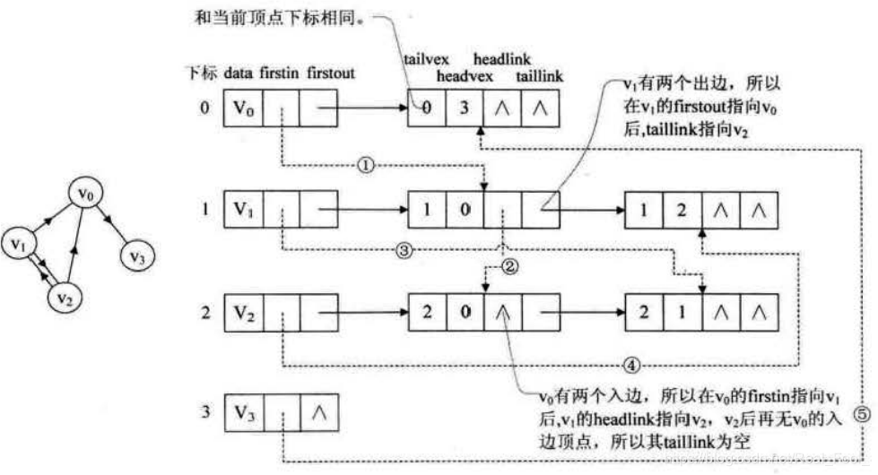
我们重点需要来解释虚线箭头的含义，它其实就是此图的逆邻接表的表示。对于 $ V_0 $ 来说，它有两个顶点 $ V_1 $ 和 $ V_2 $ 的入边。
因此 $ V_0 $ 的 `firstin` 指向顶点 $ V_1 $ 的边表结点中 `headvex` 为 0 的结点，如上图右图中的①。
接着由入边结点的 `headlink` 指向下一个入边顶点 $ V_2 $，如图中的②。对于顶点 $ V_1 $，它有一个入边顶点 $ V_2 $，
所以它的 `firstin` 指向顶点 $ V_2 $ 的边表结点中 `headvex` 为 1 的结点，如图中的③。顶点 $ V_2 $ 和 $ V_3 $ 也是同样有一个入边顶点，如图中④和⑤。

十字链表的好处就是因为把邻接表和逆邻接表整合在了一起，这样既容易找到以 $ V_i $ 为尾的弧，也容易找到以 $ V_i $ 为头的弧，因而容易求得顶点的出度和入度。
而且它除了结构复杂一点外，其实创建图算法的时间复杂度是和邻接表相同的。

##### 代码实现

```java
/**
 * 弧结点（Arc Node）
 * 存储有向边的信息
 */
class ArcNode {
    int tailVex;    // 弧尾顶点下标（起点）
    int headVex;    // 弧头顶点下标（终点）
    ArcNode hLink;  // 指向同一弧头的下一条弧（入边链）
    ArcNode tLink;  // 指向同一弧尾的下一条弧（出边链）
    int weight;     // 弧权值（可选）

    public ArcNode(int tailVex, int headVex, int weight) {
        this.tailVex = tailVex;
        this.headVex = headVex;
        this.weight = weight;
        this.hLink = null;
        this.tLink = null;
    }
}

/**
 * 顶点结点（Vertex Node）
 * 存储顶点信息及其关联的弧
 */
class VertexNode {
    char data;          // 顶点数据
    ArcNode firstIn;    // 指向第一条入弧
    ArcNode firstOut;   // 指向第一条出弧

    public VertexNode(char data) {
        this.data = data;
        this.firstIn = null;
        this.firstOut = null;
    }
}

/**
 * 十字链表图结构
 */
public class OrthogonalListGraph {
    private VertexNode[] vertexList;  // 顶点表
    private int vertexCount;          // 顶点数
    private int arcCount;            // 弧数
    private static final int MAX_VERTEX = 100; // 最大顶点数

    public OrthogonalListGraph() {
        vertexList = new VertexNode[MAX_VERTEX];
        vertexCount = 0;
        arcCount = 0;
    }
}
```

#### 4. 邻接多重表

邻接多重表是无向图的另一种链式存储结构。
在邻接表中，容易求得顶点和边的各种信息，但在邻接表中求两个顶点之间是否存在边而对边执行删除等操作时，需要分别在两个顶点的边表中遍历，效率较低。
比如下图中，若要删除左图的 $ (V_0, V_2) $ 这条边，需要对邻接表结构中右边表的阴影两个结点进行删除操作，显然这是比较烦琐的。
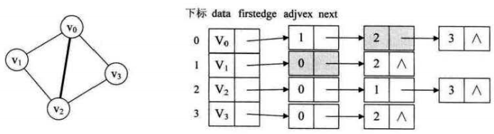
重新定义的边表结点结构如下表所示：

| ivex  | ilink  | jvex  | jlink  |
|-------|--------|-------|--------|
其中 `ivex` 和 `jvex` 是与某条边依附的两个顶点在顶点表中下标。`ilink` 指向依附顶点 `ivex` 的下一条边，`jlink` 指向依附顶点 `jvex` 的下一条边。这就是邻接多重表结构。

每个顶点也用一个结点表示，它由如下所示的两个域组成：

| data        | firstedge  |
|-------------|------------|
其中，`data` 域存储该顶点的相关信息，`firstedge` 域指示第一条依附于该顶点的边。

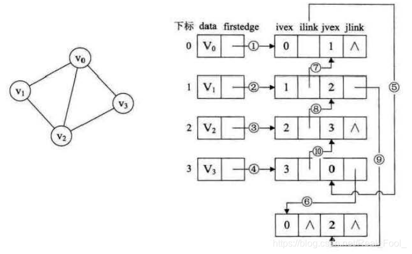
如图，首先连线的①②③④就是将顶点的 `firstedge` 指向一条边，顶点下标要与 `ivex` 的值相同。
接着，由于顶点 $ V_0 $ 的 $ (V_0, V_1) $ 边的邻边有 $ (V_0, V_3) $ 和 $ (V_0, V_2) $。因此⑤⑥的连线就是满足指向下一条依附于顶点 $ V_0 $ 的边的目标，
注意 `ilink` 指向的结点的 `jvex` 一定要和它本身的 `ivex` 的值相同。同样的道理，连线⑦就是指 $ (V_1, V_0) $ 这条边，它是相当于顶点 $ V_1 $ 指向 $ (V_1, V_2) $ 边后的下一条。
$ V_2 $ 有三条边依附，所以在③之后就有了⑧⑨。连线④就是顶点 $ V_3 $ 在连线④之后的下一条边。左图一共有5条边，所以右图有10条连线，完全符合预期。

> 邻接多重表与邻接表的差别，仅仅是在于同一条边在邻接表中用两个结点表示，而在邻接多重表中只有一个结点。这样对边的操作就方便多了，若要删除左图的 $ (V_0, V_2) $ 这条边，只需要将右图的⑥⑨的链接指向改为 `NULL` 即可。

#### 5. 边集数组

边集数组是由两个一维数组构成。一个是存储顶点的信息;另一个是存储边的信息，这个边数组每个数据元素由一条边的起点下标(begin)、 终点下标(end)和权(weight)组成，如下图所示。
显然边集数组关注的是边的集合，在边集数组中要查找一个顶点的度需要扫描整个边数组，效率并不高。因此它更适合对边依次进行处理的操作，而不适合对顶点相关的操作。
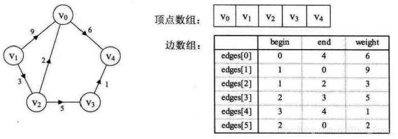

##### 代码实现

```java
// 边的实体类，存储一条边的起点、终点和权值
class Edge {
    // 边的起点下标
    int begin;
    // 边的终点下标
    int end;
    // 边的权值
    int weight;

    public Edge(int begin, int end, int weight) {
        this.begin = begin;
        this.end = end;
        this.weight = weight;
    }
}

// 边集数组表示的图结构
public class EdgeSetArrayGraph {
    // 存储顶点信息的数组
    private char[] vertexArray;
    // 存储边信息的数组
    private Edge[] edgeArray;
    // 图中顶点的数量
    private int vertexNum;
    // 图中边的数量
    private int edgeNum;

    public EdgeSetArrayGraph(char[] vertexArray, Edge[] edgeArray) {
        this.vertexArray = vertexArray;
        this.edgeArray = edgeArray;
        this.vertexNum = vertexArray.length;
        this.edgeNum = edgeArray.length;
    }
}
```

### 图的遍历

从图中某一顶点出发访遍图中其余顶点，且使每一个顶点仅被访问一次， 这一过程就叫做图的遍历(Traversing Graph)。通常有两种遍历次序方案:它们是深度优先遍历(Depth First Search)和广度优先遍历(Breadth First Search)。

#### 1. DFS算法

遵循的搜索策略：尽可能“深”地搜索一个图。首先访问图中某一起始顶点 $ v $，然后由 $ v $ 出发，访问与 $ v $ 邻接且未被访问的任一顶点 $ w_1 $，
再访问与 $ w_1 $ 邻接且未被访问的任一顶点……重复上述过程。当不能再继续向下访问时，依次退回到最近被访问的顶点，若它还有邻接顶点未被访问过，则从该点开始继续上述搜索过程，
直至图中所有顶点均被访问过为止。

##### 代码实现

```java
public class GraphTraversal {
    private boolean[] visited; // 访问标记数组：visited[v]为true表示顶点v已访问
    // 深度优先遍历（从顶点v出发）
    public void dfs(MGraph G, int v) {
        visit(G, v);         // 访问当前顶点
        visited[v] = true;   // 标记为已访问
        // 遍历当前顶点的所有邻接点
        int w = G.firstNeighbor(v);
        while (w != -1) {
            if (!visited[w]) { // 若邻接点w未访问过，递归访问w
                dfs(G, w);
            }
            w = G.nextNeighbor(v, w); // 取w的下一个邻接点
        }
    }

    // 遍历整个图（对所有未访问的顶点调用dfs）
    public void dfstraverse(MGraph G) {
        // 初始化访问标记数组
        visited = new boolean[G.getVexnum()];
        for (int i = 0; i < G.getVexnum(); i++) {
            visited[i] = false;
        }
        // 对每个顶点，若未访问则启动DFS
        for (int v = 0; v < G.getVexnum(); v++) {
            if (!visited[v]) {
                dfs(G, v);
            }
        }
    }
}
```

DFS属于递归算法，空间复杂度 $O(V)$。

对于 $ n $ 个顶点 $ e $ 条边的图来说，邻接矩阵由于是二维数组，要查找每个顶点的邻接点需要访问矩阵中的所有元素，因此都需要 $ O(V^2) $ 的时间。
而邻接表做存储结构时，找邻接点所需的时间取决于顶点和边的数量，所以是 $ O(V + E) $。显然对于多点少边的稀疏图来说，邻接表结构使得算法在时间效率上大大提高。

深度优先搜索会产生一棵深度优先生成树。 当然，这是有条件的，即对连通图调用DFS才能产生深度优先生成树，否则产生的将是深度优先生成森林。

#### 2. BFS算法

广度优先遍历就类似于树的层序遍历。是一种分层的查找过程，每向前走一步可能访问一批顶点，不像深度优先搜索那样有往回退的情况，因此它不是一个递归的算法。
为了实现逐层的访问，算法必须借助一个辅助队列，以记忆正在访问的顶点的下一层顶点。

##### 代码实现

```java
public class MGraphBFS {
    private int vexnum;          // 顶点数
    private int arcnum;          // 边数
    private int[][] arcs;        // 邻接矩阵
    private String[] vexs;       // 顶点值数组
    private boolean[] visited;   // 访问标记数组

    // 构造方法
    public MGraphBFS(int vexnum, int arcnum, String[] vexs, int[][] arcs) {
        this.vexnum = vexnum;
        this.arcnum = arcnum;
        this.vexs = vexs;
        this.arcs = arcs;
        this.visited = new boolean[vexnum];
    }

    /**
     * 广度优先遍历入口方法
     */
    public void BFSTraverse() {
        // 初始化访问标记数组
        for (int i = 0; i < vexnum; i++) {
            visited[i] = false;
        }
        
        // 使用队列辅助BFS遍历
        Queue<Integer> queue = new LinkedList<>();
        
        // 遍历所有顶点
        for (int i = 0; i < vexnum; i++) {
            if (!visited[i]) {
                // 访问当前顶点并标记
                visit(i);
                visited[i] = true;
                queue.offer(i);  // 入队
                
                // BFS核心：处理队列中的顶点
                while (!queue.isEmpty()) {
                    int v = queue.poll();  // 出队
                    
                    // 遍历v的所有邻接点
                    for (int w = firstNeighbor(v); w >= 0; w = nextNeighbor(v, w)) {
                        if (!visited[w]) {
                            visit(w);
                            visited[w] = true;
                            queue.offer(w);  // 邻接点入队
                        }
                    }
                }
            }
        }
    }

    /**
     * 获取顶点v的第一个邻接点
     * @param v 顶点下标
     * @return 邻接点下标（无则返回-1）
     */
    private int firstNeighbor(int v) {
        for (int w = 0; w < vexnum; w++) {
            if (arcs[v][w] != 0) {  // 存在边
                return w;
            }
        }
        return -1;
    }

    /**
     * 获取顶点v在邻接点w之后的下一个邻接点
     * @param v 顶点下标
     * @param w 当前邻接点下标
     * @return 下一个邻接点下标（无则返回-1）
     */
    private int nextNeighbor(int v, int w) {
        for (int nextW = w + 1; nextW < vexnum; nextW++) {
            if (arcs[v][nextW] != 0) {  // 存在边
                return nextW;
            }
        }
        return -1;
    }
}
```

无论是邻接表还是邻接矩阵的存储方式，BFS 算法都需要借助一个辅助队列 $ Q $，$ n $ 个顶点均需入队一次，在最坏的情况下，空间复杂度为 $ O(V) $。

采用邻接表存储方式时，每个顶点均需搜索一次（或入队一次），在搜索任一顶点的邻接点时，每条边至少访问一次，算法总的时间复杂度为 $ O(V + E) $。采用邻接矩阵存储方式时，查找每个顶点的邻接点所需的时间为 $ O(V) $，故算法总的时间复杂度为 $ O(V^2) $。

> 注意：图的邻接矩阵表示是唯一的，但对于邻接表来说，若边的输入次序不同，生成的邻接表也不同。因此，对于同样一个图，基于邻接矩阵的遍历所得到的 DFS 序列和 BFS 序列是唯一的，基于邻接表的遍历所得到的 DFS 序列和 BFS 序列是不唯一的。

### 图的遍历与图的连通性

图的遍历算法可以用来判断图的连通性。
对于无向图来说，若无向图是连通的，则从任一结点出发，仅需一次遍历就能够访问图中的所有顶点；若无向图是非连通的，则从某一个顶点出发，一次遍历只能访问到该顶点所在连通分量的所有顶点，
而对于图中其他连通分量的顶点，则无法通过这次遍历访问。对于有向图来说，若从初始点到图中的每个顶点都有路径，则能够访问到图中的所有顶点，否则不能访问到所有顶点。

故在 `BFSTraverse()` 或 `DFSTraverse()` 中添加了第二个 `for` 循环，再选取初始点，继续进行遍历，以防止一次无法遍历图的所有顶点。
对于无向图，上述两个函数调用 `BFS(G,i)` 或 `DFS(G,i)` 的次数等于该图的连通分量数；而对于有向图则不是这样，因为一个连通的有向图分为强连通的和非强连通的，
它的连通子图也分为强连通分量和非强连通分量，非强连通分量一次调用 `BFS(G,i)` 或 `DFS(G,i)` 无法访问到该连通分量的所有顶点。
如下图所示为有向图的非强连通分量。
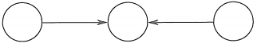

#### 最小生成树

一个连通图的生成树是一个极小的连通子图，它含有图中全部的顶点，但只有足以构成一棵树的 $ n - 1 $ 条边，若砍去它的一条边，则会使生成树变成非连通图；
若给它增加一条边，则会形成图中的一条回路。对于一个带权连通无向图 $ G = (V, E) $，生成树不同，其中边的权值之和最小的那棵生成树（构造连通网的最小代价生成树），
称为 $ G $ 的**最小生成树（Minimum-Spanning-Tree, MST）**。

构造最小生成树有多种算法，但大多数算法都利用了最小生成树的下列性质：假设 $ G = (V, E) $ 是一个带权连通无向图，$ U $ 是顶点集 $ V $ 的一个非空子集。
若 $ (u, v) $ 是一条具有最小权值的边，其中 $ u \in U, v \in V - U $，则必存在一棵包含边 $ (u, v) $ 的最小生成树。
基于该性质的最小生成树算法主要有 Prim 算法和 Kruskal 算法，它们都基于贪心算法的策略。

##### 普里姆（Prim）算法

构造最小生成树的过程如下图所示。从一个顶点出发，在保证不形成回路的前提下，每找到并添加一条最短的边，就把当前形成的连通分量当做一个整体或者一个点看待，然后重复“找最短的边并添加”的操作。
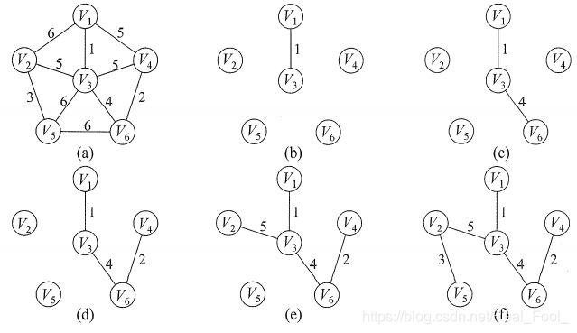

假设 $ G = \{V, E\} $ 是连通图，其最小生成树 $ T = (U, E_T) $，$ E_T $ 是最小生成树中边的集合。

初始化：向空树 $ T = (U, E_T) $ 中添加图 $ G = \{V, E\} $ 的任一顶点 $ u_0 $，使 $ U = \{u_0\} $，$ E_T = NULL $。

循环（重复下列操作直至 $ U = V $）：从图 $ G $ 中选择满足 $ \{(u, v) | u \in U, v \in V - U\} $ 且具有最小权值的边 $ (u, v) $，加入树 $ T $，置 $ U = U \cup \{v\} $，$ E_T = E_T \cup \{(u, v)\} $。

```java
public class PrimAlgorithm {
    // 表示无穷大（用于初始化不连通的边）
    private static final int INF = Integer.MAX_VALUE;
    /**
     * 普里姆算法构建最小生成树
     * @param graph 邻接矩阵表示的带权无向图
     * @param vertexCount 顶点数量
     */
    public void prim(int[][] graph, int vertexCount) {
        // 存储最小生成树的顶点
        int[] parent = new int[vertexCount];
        // 存储顶点到最小生成树的最小权值
        int[] key = new int[vertexCount];
        // 标记顶点是否已加入最小生成树
        boolean[] mstSet = new boolean[vertexCount];

        // 初始化所有key值为无穷大
        Arrays.fill(key, INF);
        // 选择第一个顶点作为起始点，key值设为0
        key[0] = 0;
        // 第一个顶点的父节点设为-1（没有父节点）
        parent[0] = -1;

        // 构建最小生成树，需要vertexCount-1条边
        for (int count = 0; count < vertexCount - 1; count++) {
            // 选择距离最小生成树最近的顶点
            int u = minKey(key, mstSet, vertexCount);
            // 将选择的顶点标记为已加入最小生成树
            mstSet[u] = true;

            // 更新与u相邻的顶点的key值和父节点
            for (int v = 0; v < vertexCount; v++) {
                // 条件：v未加入MST，u和v之间有边，且边的权值小于当前key[v]
                if (graph[u][v] != 0 && !mstSet[v] && graph[u][v] < key[v]) {
                    parent[v] = u;
                    key[v] = graph[u][v];
                }
            }
        }
    }

    /**
     * 找到key值最小且未加入MST的顶点
     */
    private int minKey(int[] key, boolean[] mstSet, int vertexCount) {
        int min = INF;
        int minIndex = -1;

        for (int v = 0; v < vertexCount; v++) {
            if (!mstSet[v] && key[v] < min) {
                min = key[v];
                minIndex = v;
            }
        }
        return minIndex;
    }
}
```

时间复杂度： $ O(n^2) $

##### 克鲁斯卡尔（Kruskal）算法

Kruskal 算法是一种按权值的递增次序选择合适的边来构造最小生成树的方法。
初始时为只有 $ n $ 个顶点而无边的非连通图 $ T = V $，每个顶点自成一个连通分量，然后按照边的权值由小到大的顺序，不断选取当前未被选取过且权值最小的边，
若该边依附的顶点落在 $ T $ 中不同的连通分量上，则将此边加入 $ T $，否则舍弃此边而选择下一条权值最小的边。以此类推，直至 $ T $ 中所有顶点都在一个连通分量上。
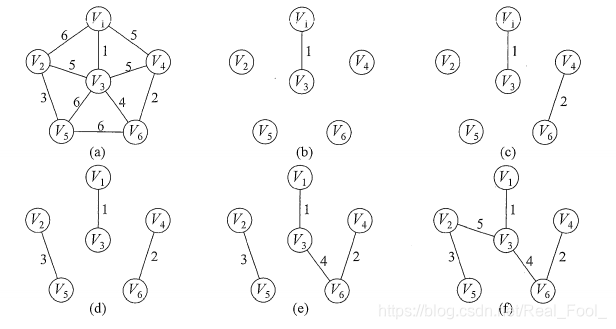

我们可以直接就以边为目标去构建，因为权值是在边上，直接去找最小权值的边来构建生成树也是很自然的想法，只不过构建时要考虑是否会形成环路而已。此时我们就用到了图的存储结构中的边集数组结构。

```java
public class KruskalMST {
    /**
     * Kruskal算法实现
     * @param edges 所有边的集合
     * @param vertexCount 顶点总数
     * @return 最小生成树的边集合
     */
    public static List<Edge> kruskal(List<Edge> edges, int vertexCount) {
        // 1. 按边权升序排序
        Collections.sort(edges);
        
        // 2. 初始化并查集
        UnionFind uf = new UnionFind(vertexCount);
        List<Edge> mst = new ArrayList<>(); // 存储最小生成树的边
        
        // 3. 遍历所有边（从小到大）
        for (Edge edge : edges) {
            int rootSrc = uf.find(edge.src);
            int rootDest = uf.find(edge.dest);
            
            // 4. 若边的两端不在同一集合（不构成环）
            if (rootSrc != rootDest) {
                mst.add(edge);          // 加入生成树
                uf.union(rootSrc, rootDest); // 合并集合
                
                // 5. 提前终止：已选边数 = 顶点数-1
                if (mst.size() == vertexCount - 1) break;
            }
        }
        return mst;
    }
}
```

此算法的 `Find` 函数由边数 $ e $ 决定，时间复杂度为 $ O(\log e) $，而外面有一个 `for` 循环 $ e $ 次。所以克鲁斯卡尔算法的时间复杂度为 $ O(e \log e) $。
对比两个算法，克鲁斯卡尔算法主要是针对边来展开，边数少时效率会非常高，所以对于稀疏图有很大的优势；而普里姆算法对于稠密图，即边数非常多的情况会更好一些。

#### 最短路径

在网图和非网图中，最短路径的含义是不同的。由于非网图它没有边上的权值，所谓的最短路径，其实就是指两顶点之间经过的边数最少的路径；
而对于网图来说，最短路径，是指两顶点之间经过的边上权值之和最少的路径，并且我们称路径上的第一个顶点是源点，最后一个顶点是终点。

##### 迪杰斯特拉( Dijkstra )算法

用于构建单源点的最短路径，即图中某个点到任何其他点的距离都是最短的。例如，构建地图应用时查找自己的坐标离某个地标的最短距离。可以用于有向图，但是不能存在负权值。

通俗点说，这个迪杰斯特拉（Dijkstra）算法，它并不是一下子求出了 $ v_0 $ 到 $ v_8 $ 的最短路径，而是一步步求出它们之间顶点的最短路径，
过程中都是基于已经求出的最短路径的基础上，求得更远顶点的最短路径，最终得到你要的结果。

Dijkstra算法设置一个集合 $ S $ 记录已求得的最短路径的顶点。

在构造的过程中还设置了个辅助数组：

`dist[]`：记录从源点 $ v_0 $ 到其他各顶点当前的最短路径长度，它的初态为：若从 $ v_0 $ 到 $ v_i $ 有弧，则 `dist[i]` 为弧上的权值；否则置 `dist[i]` 为 $ \infty $。

```java
public class Dijkstra {
    /**
     * 迪杰斯特拉算法求单源最短路径
     * @param graph 图实例
     * @param src 源点下标
     */
    public static void dijkstra(Graph graph, int src) {
        int V = graph.V;
        int[] dist = new int[V];       // 存储源点到各顶点的最短距离
        int[] prev = new int[V];       // 存储最短路径的前驱顶点（用于回溯路径）
        Arrays.fill(dist, Integer.MAX_VALUE);  // 初始化为无穷大
        Arrays.fill(prev, -1);         // 前驱初始化为-1（无前驱）

        dist[src] = 0;  // 源点到自身距离为0

        // 优先队列：按边的权值（距离）升序排列（最小堆）
        PriorityQueue<Edge> pq = new PriorityQueue<>(Comparator.comparingInt(e -> e.weight));
        pq.add(new Edge(src, 0));  // 将源点加入队列

        while (!pq.isEmpty()) {
            Edge uEdge = pq.poll();  // 取出当前距离最小的顶点
            int u = uEdge.dest;

            // 若队列中取出的距离大于当前记录的最短距离，跳过（避免重复处理）
            if (dist[u] < uEdge.weight) continue;

            // 遍历u的所有邻接顶点v
            for (Edge vEdge : graph.adj.get(u)) {
                int v = vEdge.dest;
                int newDist = dist[u] + vEdge.weight;  // 从u到v的新距离

                // 若新距离更短，更新dist[v]和前驱，并加入队列
                if (newDist < dist[v]) {
                    dist[v] = newDist;
                    prev[v] = u;
                    pq.add(new Edge(v, newDist));
                }
            }
        }

        // 输出结果：每个顶点的最短距离和路径
        printResult(dist, prev, src);
    }
}
```

时间复杂度为 $ O(V^2) $。

##### 弗洛伊德( Floyd )算法

定义一个 $ n $ 阶方阵序列 $ A^{(-1)}, A^{(0)}, \dots, A^{(n - 1)} $，其中，
$A^{(-1)}[i][j] = arcs[i][j]$

$A^{(k)}[i][j] = Min\left\{ A^{(k - 1)}[i][j], A^{(k - 1)}[i][k] + A^{(k - 1)}[k][j] \right\}, k = 0, 1, \dots, n - 1$
式中，$ A^{(0)}[i][j] $ 是从顶点 $ v_i $ 到 $ v_j $、中间顶点的序号不大于 $ k $ 的最短路径的长度。Floyd 算法是一个迭代的过程，每迭代一次，在从 $ v_i $ 到 $ v_j $ 的最短路径上就多考虑了一个顶点；经过 $ n $ 次迭代后，所得到的 $ A^{(n - 1)}[i][j] $ 就是 $ v_i $ 到 $ v_j $ 的最短路径长度，即方阵 $ A^{(n - 1)} $ 中就保存了任意一对顶点之间的最短路径长度。

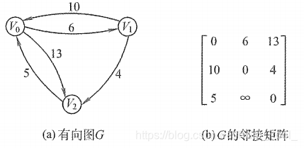
上图所示为带权有向图 $ G $ 及其邻接矩阵。算法执行过程的说明如下。

- 初始化：方阵 $ A^{(-1)}[i][j] = arcs[i][j] $。
- 第一轮：将 $ v_0 $ 作为中间顶点，对于所有顶点对 $ \{i, j\} $，如果有 $ A^{-1}[i][j] > A^{-1}[i][0] + A^{-1}[0][j] $，则将 $ A^{-1}[i][j] $ 更新为 $ A^{-1}[i][0] + A^{-1}[0][j] $。有 $ A^{-1}[2][1] > A^{-1}[2][0] + A^{-1}[0][1] = 11 $，更新 $ A^{-1}[2][1] = 11 $，更新后的方阵标记为 $ A^0 $。
- 第二轮：将 $ v_1 $ 作为中间顶点，继续监测全部顶点对 $ \{i, j\} $。有 $ A^0[0][2] > A^0[0][1] + A^0[1][2] = 10 $，更新后的方阵标记为 $ A^1 $。
- 第三轮：将 $ v_2 $ 作为中间顶点，继续监测全部顶点对 $ \{i, j\} $。有 $ A^1[1][0] > A^1[1][2] + A^1[2][0] = 9 $，更新后的方阵标记为 $ A^2 $。此时 $ A^2 $ 中保存的就是任意顶点对的最短路径长度。

```java
public class FloydWarshall {
    private static final int INF = Integer.MAX_VALUE; // 无穷大（表示无直接路径）

    /**
     * Floyd算法实现
     * @param graph 邻接矩阵（graph[i][j]表示顶点i到j的直接距离）
     */
    public static void floyd(int[][] graph) {
        int n = graph.length;
        // 初始化距离矩阵和路径矩阵
        int[][] dist = new int[n][n];
        int[][] next = new int[n][n]; // 记录路径中i的下一个节点

        // 1. 初始化矩阵
        for (int i = 0; i < n; i++) {
            for (int j = 0; j < n; j++) {
                dist[i][j] = graph[i][j];
                next[i][j] = (graph[i][j] != INF && i != j) ? j : -1;
            }
        }

        // 2. 动态规划：以k为中间点更新所有路径
        for (int k = 0; k < n; k++) {
            for (int i = 0; i < n; i++) {
                if (dist[i][k] == INF) continue; // 跳过无效路径
                for (int j = 0; j < n; j++) {
                    // 避免整数溢出
                    if (dist[k][j] != INF && dist[i][k] != INF) {
                        int newDist = dist[i][k] + dist[k][j];
                        if (newDist < dist[i][j]) {
                            dist[i][j] = newDist;
                            next[i][j] = next[i][k]; // 更新路径
                        }
                    }
                }
            }
        }

        // 3. 检测负权回路
        for (int i = 0; i < n; i++) {
            if (dist[i][i] < 0) {
                throw new RuntimeException("存在负权回路！");
            }
        }
    }
}
```

时间复杂度为 $ O(V^3) $。

#### 拓扑排序

在一个表示工程的有向图中，用顶点表示活动，用弧表示活动之间的优先关系，这样的有向图为顶点表示活动的网，我们称为AOV网(Activity On Vertex Network)。

若用DAG图（有向无环图）表示一个工程，其顶点表示活动，用有向边 $ <V_i, V_j> $ 表示活动 $ V_i $ 必须先于活动 $ V_j $ 进行的这样一种关系。
在AOV网中，活动 $ V_i $ 是活动 $ V_j $ 的直接前驱，活动 $ V_j $ 是活动 $ V_i $ 的直接后继，这种前驱和后继关系具有传递性，
且任何活动 $ V_i $ 不能以它自己作为自己的前驱或后继。

设 $ G = (V, E) $ 是一个具有 $ n $ 个顶点的有向图，$ V $ 中的顶点序列 $ V_1, V_2, \dots, V_n $，满足若从顶点 $ V_i $ 到 $ V_j $ 有一条路径，
则在顶点序列中顶点 $ V_i $ 必在顶点 $ V_j $ 之前。则我们称这样的顶点序列为一个拓扑序列。

所谓拓扑排序，其实就是对一个有向图构造拓扑序列的过程。每个AOV网都有一个或多个拓扑排序序列。

对一个AOV网进行拓扑排序的算法有很多，下面介绍比较常用的一种方法的步骤：

- ①从AOV网中选择一个没有前驱的顶点并输出。
- ②从网中删除该顶点和所有以它为起点的有向边。
- ③重复①和②直到当前的AOV网为空或当前网中不存在无前驱的顶点为止。如果输出顶点数少了，哪怕是少了一个，也说明这个网存在环(回路)，不是AOV网。

```java
public class TopologicalSort {
    /**
     * 拓扑排序算法（返回是否成功，存在回路则失败）
     * @param G 图实例
     * @return 排序成功返回true，存在回路返回false
     */
    public static boolean topologicalSort(Graph G) {
        int[] indegree = G.computeIndegree(); // 1. 计算所有顶点的入度
        Deque<Integer> stack = new ArrayDeque<>(); // 2. 初始化栈（存储入度为0的顶点）
        int count = 0; // 3. 计数：已输出的顶点数

        // 步骤1：将所有入度为0的顶点压入栈
        for (int i = 0; i < G.vexnum; i++) {
            if (indegree[i] == 0) {
                stack.push(i);
            }
        }

        // 步骤2：循环处理栈中的顶点（入度为0的顶点）
        while (!stack.isEmpty()) {
            int u = stack.pop(); // 弹出入度为0的顶点
            System.out.print(u + " "); // 输出该顶点
            count++;

            // 遍历顶点u的所有邻接顶点v，更新其入度
            for (EdgeNode e : G.vertices[u].adjList) {
                int v = e.adjvex;
                indegree[v]--; // v的入度减1（因为u已处理）
                if (indegree[v] == 0) { // 若v的入度变为0，压入栈
                    stack.push(v);
                }
            }
        }

        // 步骤3：检查是否存在回路（若输出的顶点数少于总顶点数，说明有回路）
        if (count < G.vexnum) {
            System.out.println("图中存在回路，拓扑排序失败！");
            return false;
        } else {
            System.out.println("拓扑排序成功！");
            return true;
        }
    }
}
```

#### 关键路径

拓扑排序主要是为解决一个工程能否顺序进行的问题，但有时我们还需要解决工程完成需要的最短时间问题。

在带权有向图中，以顶点表示事件，以有向边表示活动，以边上的权值表示完成该活动的开销（如完成活动所需的时间），称之为用边表示活动的网络，简称AOE网。
AOE网和AOV网都是有向无环图，不同之处在于它们的边和顶点所代表的含义是不同的，AOE网中的边有权值；而AOV网中的边无权值，仅表示顶点之间的前后关系。

AOE网具有以下两个性质：

- ①只有在某顶点所代表的事件发生后，从该顶点出发的各有向边所代表的活动才能开始；
- ②只有在进入某顶点的各有向边所代表的活动都已结束时，该顶点所代表的事件才能发生。

求关键路径的算法步骤如下：

1. 从源点出发，令 $ ve(\text{源点}) = 0 $，按拓扑排序求其余顶点的最早发生时间 $ ve() $。
2. 从汇点出发，令 $ vl(\text{汇点}) = ve(\text{汇点}) $，按逆拓扑排序求其余顶点的最迟发生时间 $ vl() $。
3. 根据各顶点的 $ ve() $ 值求所有弧的最早开始时间 $ e() $。
4. 根据各顶点的 $ vl() $ 值求所有弧的最迟开始时间 $ l() $。
5. 求AOE网中所有活动的差额 $ d() $，找出所有有 $ d() = 0 $ 的活动构成关键路径。

参考资料：[数据结构：图(Graph)【详解】](https://blog.csdn.net/Real_Fool_/article/details/114141377)

