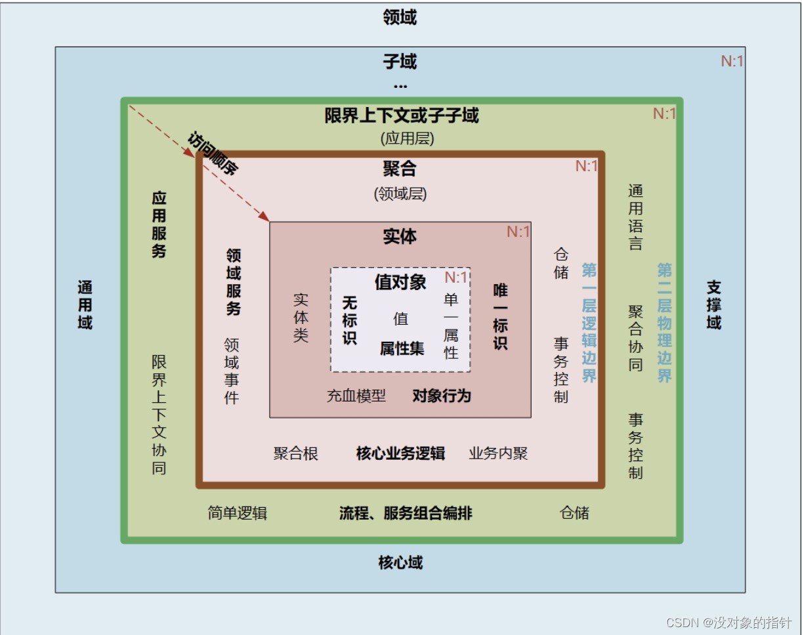
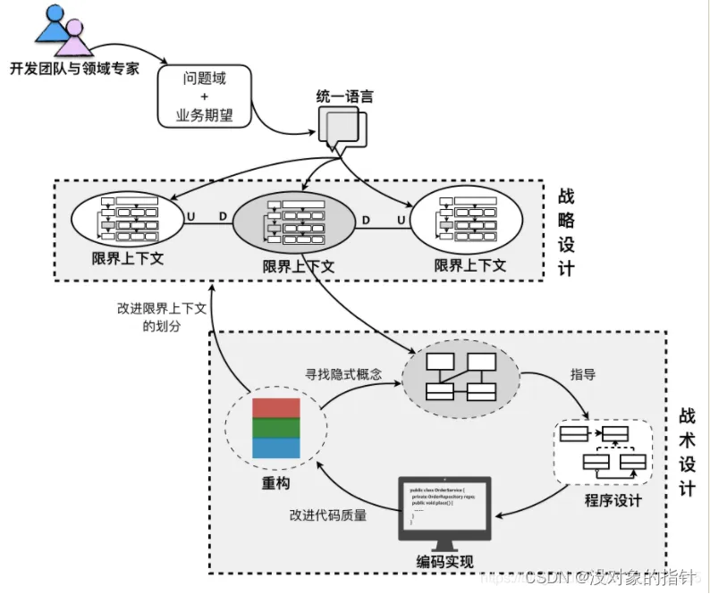
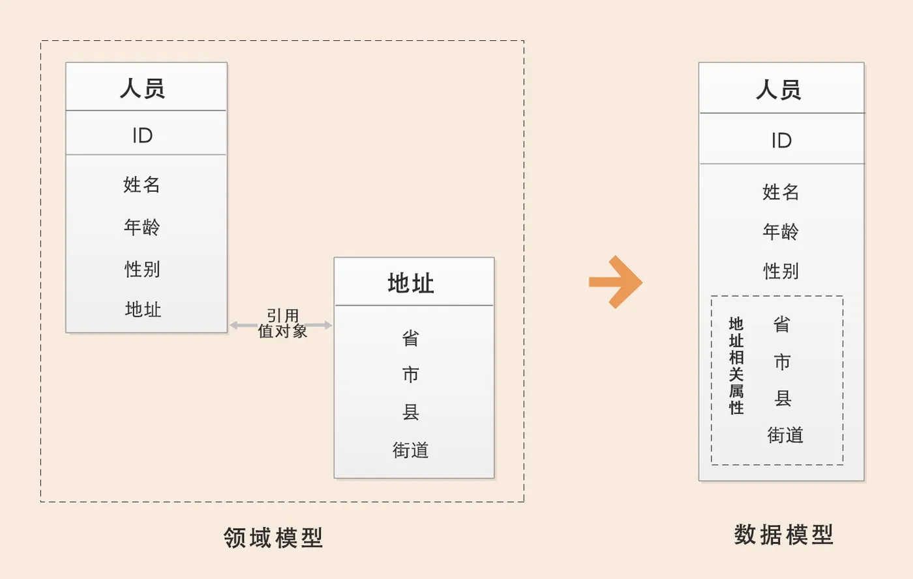
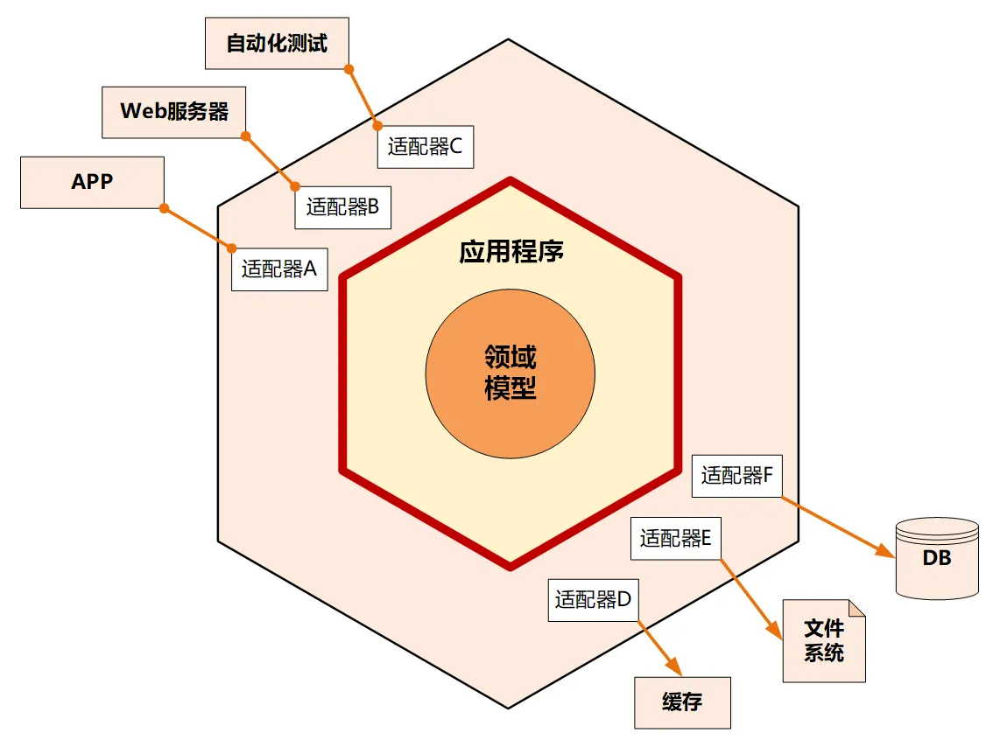
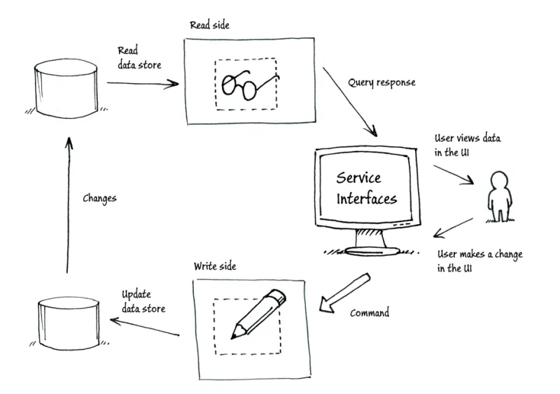
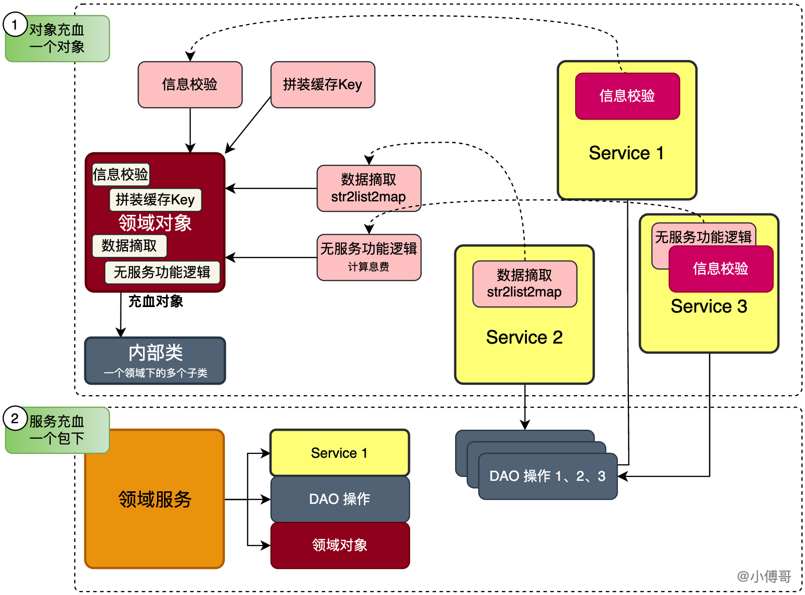
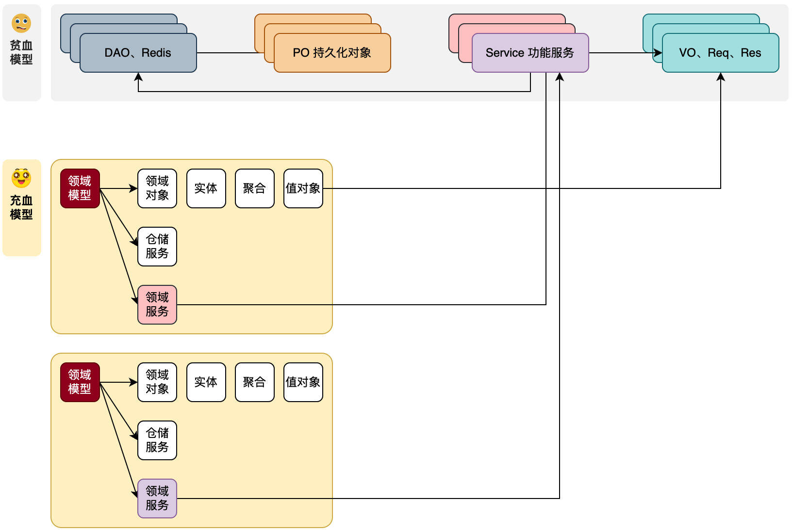

## DDD的概念

DDD是一种软件设计方法，是指导我们做软件工程设计的一种手段，它提供了用切割工程模型的各类技巧，如；领域、界限上下文、实体、值对象、聚合、工厂、仓储等。
通过DDD的指导思想，我们可以在前期投入更多的时间，更加合理的规划出可持续迭代的工程设计。

在DDD中有一套共识的工程两阶段设计手段:

**战略设计**: 战略设计也叫战略建模，从业务视角出发，对业务需求进行拆解分析，划分子域，梳理限界上下文，通过领域语言从战略层面进行领域划分以及构建领域模型。并且在在构建领域模型的过程中梳理出业务对应的聚合、实体、以及值对象。

**战术设计**：战术设计也称为战术建模，从技术视角出发，以领域模型基础，通过限界上下文作为服务划分的边界进行微服务拆分，在每个微服务中进行领域分层，实现领域服务，从而实现领域模型对于代码映射目的，最终实现DDD的落地实。包括：实体、值对象、聚合、聚合根、资源库、工厂、领域服务、领域事件、应用服务等代码逻辑的设计和实现。

DDD革命性在于：领域模型准确反映了业务语言，
DDD 的核心知识体系，具体包括：领域、子域、核心域、通用域、支撑域、限界上下文、实体、值对象、聚合和聚合根等概念。
1. 通用语言-定义上下文的含义
2. 领域和子域 - 确定逻辑边界。领域设计= 边界 + 设计。 
3. 限界上下文（Bounded Context） = 用户 + 领域模型 + 功能。 限界就是领域的边界，而上下文则是语义环境。
4. 上下文映射图（Context Mapping）就是不同上下文是如何进行交流的关系。RPC 方式;消息队列或者发布 - 订阅机制;RESTful 方式
5. 实体一般对应业务对象，它具有业务属性和业务行为,拥有唯一标识符.实体在聚合内唯一，但是状态可变，它依附于聚合根，它的生命周期由聚合根管理，实体一般都会持久化，跟数据持久化对象存在多种对应关系（一对一，一对多，多对一，1对0），实体可以引用聚合中的聚合根，实体，值对象；实体 = 唯一标识 + 状态属性 + 行为动作（功能）

6. 而值对象主要是属性集合，对实体的状态和特征进行描述。将多个相关属性组合为一个概念整体。它是没有标识符的对象。简单来说： 值对象本质就是一个集合。
7. 领域模型内的实体和值对象就好比个体，而能让实体和值对象协同工作的组织就是聚合，它用来确保这些领域对象在实现共同的业务逻辑时，能保证数据的一致性。每一个聚合对应一个仓储，实现数据的持久化。聚合有一个聚合根和上下文边界，这个边界根据业务单一职责和高内聚原则，定义了聚合内部应该包含哪些实体和值对象，而聚合之间的边界是松耦合的。
8. 如果把聚合比作组织，聚合根则是组织的负责人，聚合根也叫做根实体，它不仅仅是实体，还是实体的管理者。聚合根是实体，有实体的特点，具有全局唯一标识，有独立的生命周期。一个聚合只有一个聚合根，聚合根在聚合内对实体和值对象采用直接对象引用的方式进行组织和协调，聚合根与聚合根之间通过 ID 关联的方式实现聚合之间的协同。
9. 领域事件是解耦微服务的关键，也是领域模型中非常重要的一部分，用来表示领域中发生的事件。一个领域事将导致进一步的业务操作，在实现业务解耦的同时, 还有助于形成完整的业务闭环。如果发生某种事件后，会触发进一步的操作，那么这个事件很可能就是领域事件。领域事件处理包括：事件构建和发布、事件数据持久化、事件总线、消息中间件、事件接收和处理等。
10. 领域服务(Domain Service)和应用服务(Application Service)。
     - 战略层语境：领域服务通常指相对聚焦的底层支撑域/通用域服务；应用服务通常指面向业务场景负责功能组装的服务
     - 战术层语境：领域服务指领域建模工具集中所指的“领域服务”；应用服务指面向场景的技术实现组装
11. 框架设计：总体设计思路：分层、CQRS、EDA
     - 分层:即每层只能与位于其下方的层发生耦合，可以分为严格分层架构（某层只能与位于其直接下方的层发生耦合）和松散分层架构（允许某层与它的任意下方层发生耦合。）。CQRS、EDA
             用例图是用户与系统交互的最简表示形式。
     - 六边形架构:又叫端口-适配器架构，边形架构将系统分为内部（内部六边形）和外部，内部代表了应用的业务逻辑，外部代表应用的驱动逻辑、基础设施或其他应用。内部通过端口和外部系统通信，端口代表了一定协议，以API呈现。一个端口可能对应多个外部系统，不同的外部系统需要使用不同的适配器，适配器负责对协议进行转换。这样就使得应用程序能够以一致的方式被用户、程序、自动化测试、批处理脚本所驱动，并且，可以在与实际运行的设备和数据库相隔离的情况下开发和测试。
    
     - CQRS架构－命令查询职责分离。表示在架构层面，将一个系统分为写入（命令）和查询两部分。一个命令表示一种意图，表示命令系统做什么修改，命令的执行结果通常不需要返回；一个查询表示向系统查询数据并返回。
       CQRS架构中，另外一个重要的概念就是事件，事件表示命令操作领域中的聚合根，然后聚合根的状态发生变化后产生的事件。
    
12. 领域驱动落地框架：COLA框架、leave-sample、dddbook、Xtoon、DDD Lite、ruoyi_cloud、Axon Framework

infrastructure：基础设施层提供所需的基本数据。降低了数据（dao-数据库、gateway-网关、redis-缓存等等）与服务的耦合性。通过adapter（适配器）去定义方法，再去通过接口实现相关方法。

model 模型对象；
- aggreate：聚合对象，实体对象、值对象的协同组织，就是聚合对象。是一组相关的实体对象的根，用于保证实体对象之间的一致性和完整性；是一组具有内聚性的相关对象的集合，这些对象一起工作以执行某些业务规则或操作。聚合定义了一组对象的边界，这些对象可以被视为一个单一的单元进行处理。
- entity：实体对象表示具有唯一标识的业务实体，例如订单、商品、用户等；大多数情况下，实体对象(Entity)与数据库持久化对象(PO)是1v1的关系，但也有为了封装一些属性信息，会出现1vn的关系。不仅包含数据（状态属性），还包含相关行为（功能）。
- valobj：值对象表示没有唯一标识的业务实体，例如商品的名称、描述、价格等，通过对象属性值来识别的对象 。在领域服务方法的生命周期过程内是不可变对象。

repository 仓储服务；从数据库等数据源中获取数据，传递的对象可以是聚合对象、实体对象，返回的结果可以是；实体对象、值对象。因为仓储服务是由基础层(infrastructure) 引用领域层(domain)，是一种依赖倒置的结构，但它可以天然的隔离PO数据库持久化对象被引用。

聚合更应该注重的是和本对象相关的单一简单封装场景，而把一些重核心业务方到 service 里实现。

领域设计意思是在一定业务边界范围内进行的设计思想或活动

### 充血模型
将对象的属性信息与行为逻辑聚合到一个类中，常用的手段如在对象内提供属于当前对象的信息校验、拼装缓存key、不含服务接口调用的逻辑处理等。

这样我们在使用一个对象时，就可以顺便拿到这个对象提供的一系列方法信息。所有使用对象的逻辑方法都不需要自己再次处理同类逻辑。
注意不要只把充血模型限于一个类或一个类的方法设计，还可以是整个包结构，一个包下包括了实现service服务的各类零部件，也是充血模型。

### 领域模型
特定业务领域内，业务规则、策略以及业务流程的抽象和封装。
在设计手段上，通过风暴模型拆分领域模块，形成界限上下文。最大的区别在于把原有的众多 Service + 数据模型的方式，拆分为独立的有边界的领域模块。
每个领域内创建自身所属的；领域对象（实体、聚合、值对象）、仓储服务(DAO 操作)、工厂、端口适配器Port（调用外部接口的手段）等。
