设计模式是系统服务设计中针对场景的一种解决方案，可以解决功能逻辑开发中的共性问题。

- 创建者模式：工厂方法、抽象工厂、生成器、原型、单例。
- 结构型模式：适配器、代理、桥接、组合、装饰、外观、享原。
- 行为模式：责任链、命令、迭代器、中介者、备忘录、观察者、状态、策略、模板、访问者。
### 替代if...else的三种设计模式
责任链、规则树。
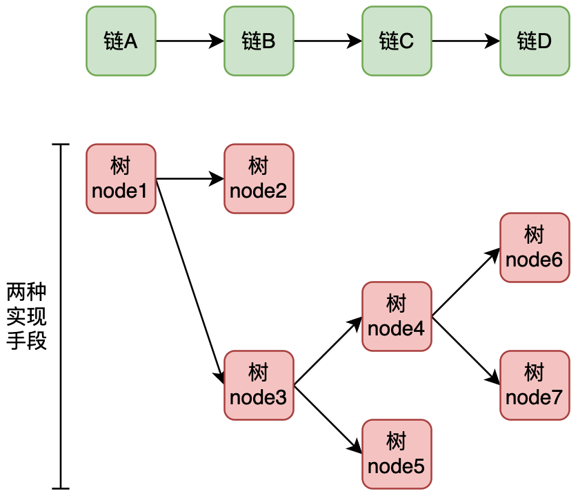
责任链是一条单向执行链，没有过程中的分支流转，适合简单的单一规则校验。
#### 责任链
考虑抽奖规则过滤，分为黑名单用户、权重抽奖和默认抽奖。如果一个用户是黑名单范围用户，则直接返回兜底奖品。而权重用户是一个用户已完成了N次抽奖后，在权重范围内可以获得一个固定的奖品。最后是兜底抽奖，这两个条件都不是，则进行默认兜底流程。
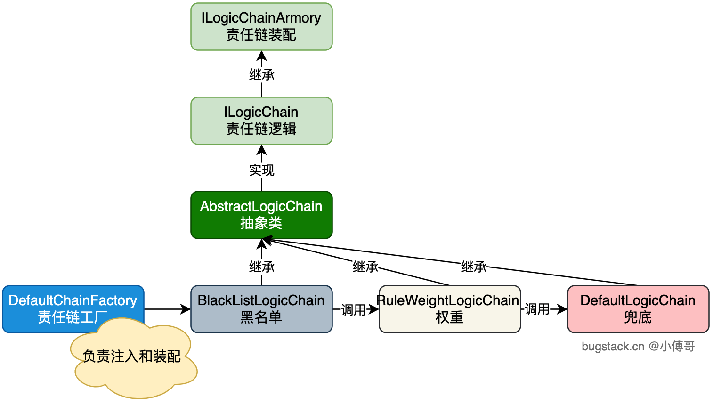
- 首先，定义出责任链装配接口和责任链逻辑接口，之后由抽象类实现接口，做链的封装实现。
- 之后，实现3个责任链实现类。黑名单、权重、兜底。处理各自的逻辑。
- 最后，由工厂装配责任链。后续可以按需扩展需要的责任链。这样业务流程就可以动态的拼装了。

#### 规则树-动态配置
在实现业务流程编码时看到有些流程是带有判断和分支走向的，那么就不太适合用单一的责任链处理。
比如一个流程中需要对抽奖的奖品进行交叉判断，抽中后判断是否满足中奖条件，满足后走库存处理，不满足走兜底处理。另外库存不足则也要走兜底处理。那么这样就是一个分叉的流程了。可以使用规则树进行实现。
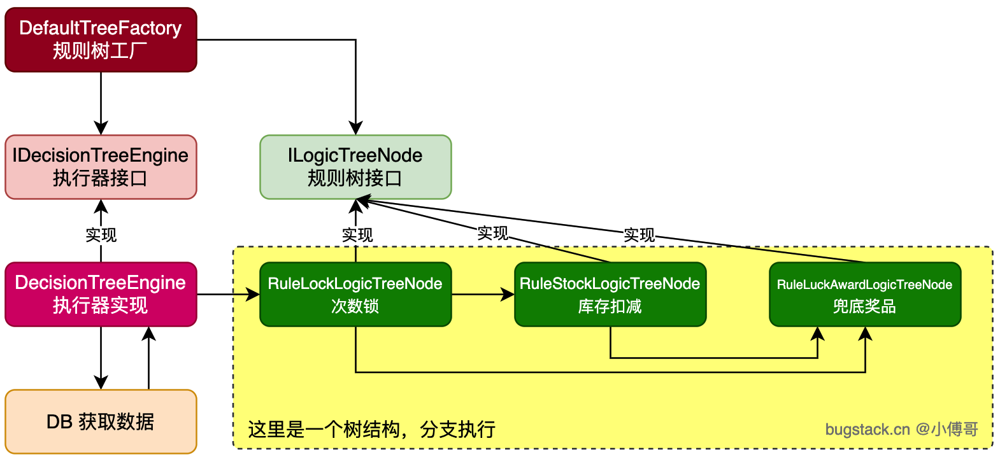
- 首先，定义出规则树接口，并实现出对应的业务逻辑节点。包括；次数锁、库存扣减、兜底奖品。 次数锁判断:当抽奖时，必须抽奖N次才可以获得某个奖品。
- 之后，设计执行器，负责完成规则节点的执行分支，如从A到B，如果B的条件满足XXX，则走到另外一个节点。而执行器中的节点来自于数据库的配置，这样就可以动态的调整各个节点的走向了。
- 最后，交给规则树工厂，完成执行器的服务提供。

#### 规则树-代码控制
在我们的业务场景中，有时候既不是走责任链，也不是走配置到库上的规则树，而是介于两者直接。由代码控制的节点走向，根据每个节点实现逻辑，动态处理下一个节点的实现。
如，一个流程中进入总人口，之后判断是否开量、账户数据、之后从账户数据开始又有3个级别判断。这3级别是根据账户数据的结果判断的。
最后，这里还要有一个上下文数据记录，所有的节点完成后填充数据。
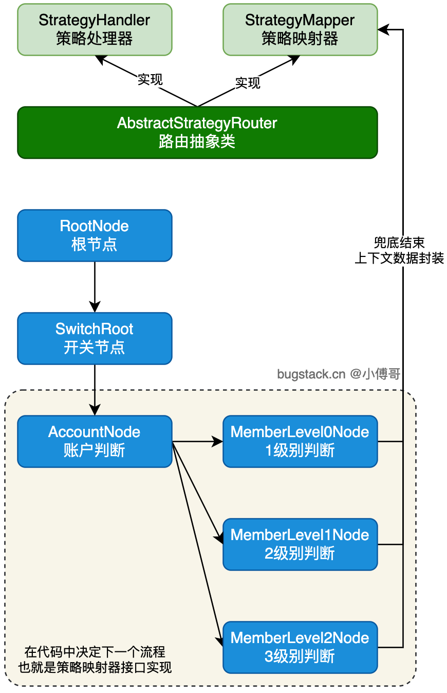
- 首先，定义2个接口，一个是策略的执行接口 StrategyHandler，这个接口除了手里逻辑执行外，还要做一个兜底的上线文参数填充方法，也就是接口的默认方法。一个是策略映射接口 StrategyMapper。映射接口的作用是为了让每个节点实现类，可以动态的控制当前节点走到下一个节点的逻辑处理。
- 之后，按照业务诉求实现各个节点，每个节点都是继承抽象类（定义通用方法，和受理执行下一个节点的操作）。这些节点自己决定下一个节点走到哪里。

### 六大设计原则
#### 单一职责原则
又称单一功能原则，是面向对象五个基本原则之一。定义：一个类只有一个发生变化的原因。
#### 开闭原则
软件中的对象（类、模块、函数）应该对于扩展是开放的，但是对于修改是封闭的
#### 里氏替换原则
继承必须保证超类所拥有的性质在子类中依然成立。兼容性，扩展性，维护性
#### 迪米特原则
意义在于降低模块间的耦合。由于每个对象尽量减少对其他对象的了解，因此很容易使得系统的功能模块功能独立，相互之间不存在依赖关系。高内聚、低耦合
#### 接口隔离原则
尽量将臃肿的接口拆分成更小的和更具体的接口，让接口中只包含客户感兴趣的方法
#### 依赖倒置原则
程序要依赖于抽象接口，不要依赖于具体实现。简单来说就是要求对抽象进行编程，不要对实现进行编程，这样就降低了客户与实现模块之间的耦合。

## 创建者模式
### 工厂方法模式
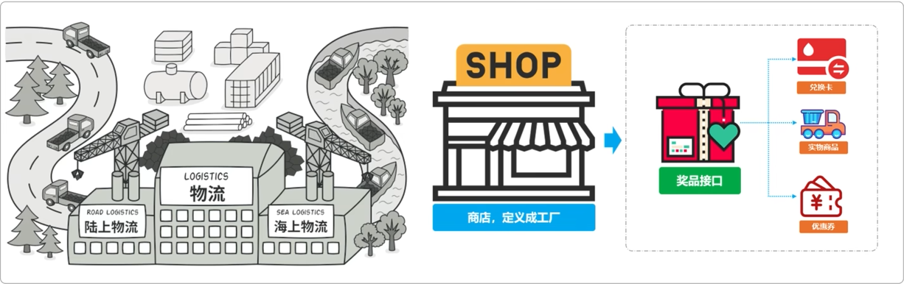
在父类中提供一个方法，允许子类决定实例化对象的类型。主要意图是定义一个创建对象的接口，让子类自己决定实例化哪一个工厂类，该模式使得创建过程延迟到子类中进行

**案例**

模拟积分兑换中的发放多种类型商品，假如现在我们有如下三种类型的商品接口：
- 优惠券	CouponResult sendCoupon(String uId, String couponNumber, String uuid)
- 实物商品	Boolean deliverGoods(DeliverReq req)
- 第三方爱奇艺兑换卡	void grantToken(String bindMobileNumber, String cardId)

从以上接口来看有如下信息：

三个接口返回类型不同，有对象类型、布尔类型、还有一个空类型。
入参不同，发放优惠券需要仿重、兑换卡需要卡ID、实物商品需要发货位置(对象中含有)。
另外可能会随着后续的业务的发展，会新增其他种商品类型。因为你所有的开发需求都是随着业务对市场的拓展而带来的。

工程结构：
```
itstack-demo-design-1-02
└── src
├── main
│   └── java
│       └── org.itstack.demo.design
│           ├── store    
│           │   ├── impl
│           │   │   ├── CardCommodityService.java
│           │   │   ├── CouponCommodityService.java
│           │   │   └── GoodsCommodityService.java  
│           │   └── ICommodity.java
│           └── StoreFactory.java
└── test
└── java
└── org.itstack.demo.design.test
└── ApiTest.java
```
### 抽象工厂模式
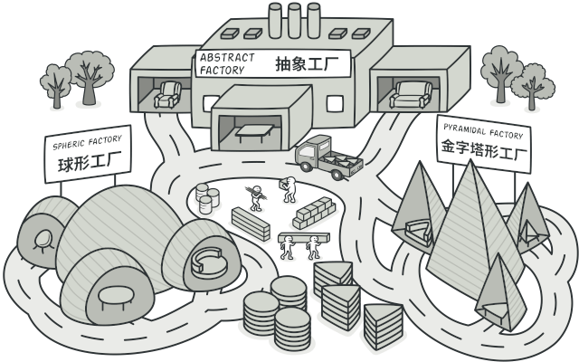
围绕一个超级工厂创建其他的工厂，提供了一种创建对象的最佳方式。

**案例**

替换Redis双集群升级，代理类抽象场景。
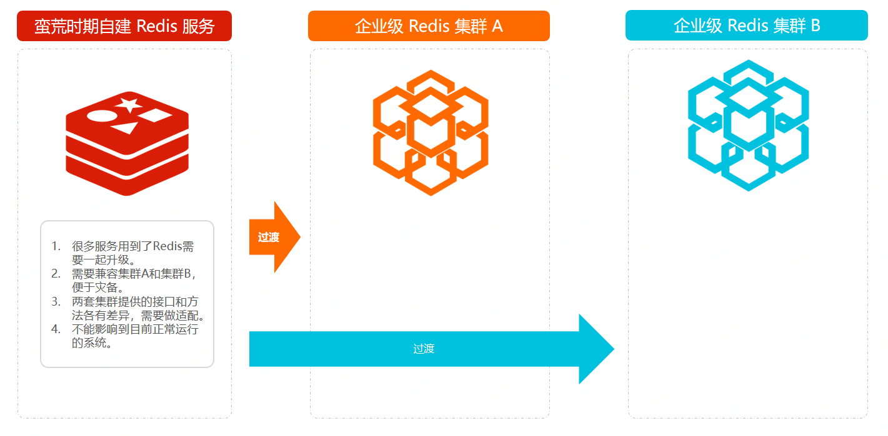

工程结构：
```
itstack-demo-design-2-02
└── src
├── main
│   └── java
│       └── org.itstack.demo.design
│           ├── factory    
│           │   ├── impl
│           │   │   ├── EGMCacheAdapter.java
│           │   │   └── IIRCacheAdapter.java
│           │   ├── ICacheAdapter.java
│           │   ├── JDKInvocationHandler.java
│           │   └── JDKProxy.java
│           ├── impl
│           │   └── CacheServiceImpl.java    
│           └── CacheService.java
└── test
└── java
└── org.itstack.demo.design.test
└── ApiTest.java
```
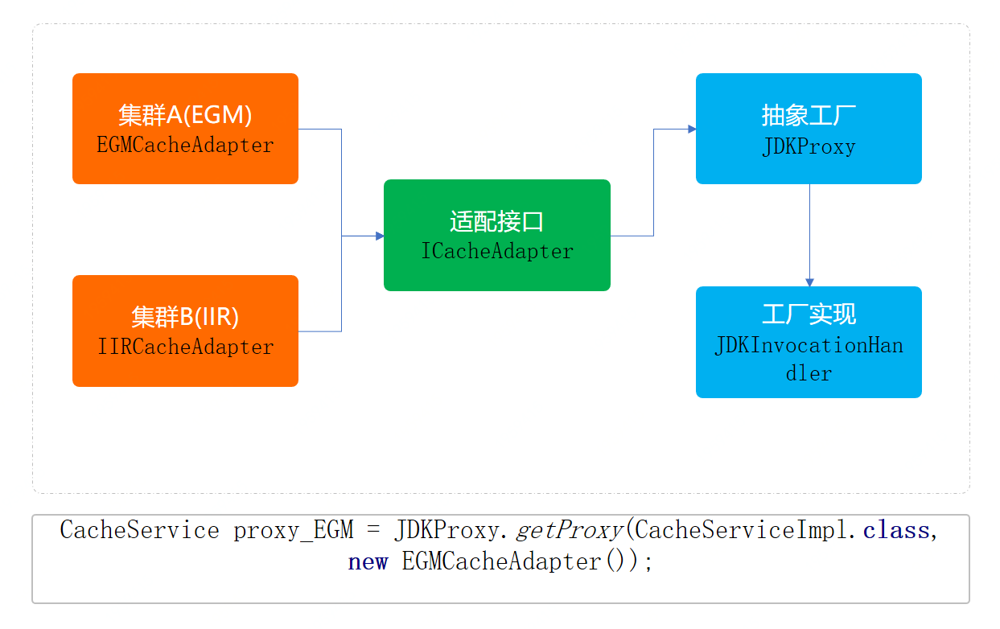
`ICacheAdapter`，定义了适配接口，分别包装两个集群中差异化的接口名称。`EGMCacheAdapter`、`IIRCacheAdapter`
`JDKProxy`、`JDKInvocationHandler`，是代理类的定义和实现，这部分也就是抽象工厂的另外一种实现方式。通过这样的方式可以很好的把原有操作Redis的方法进行代理操作，通过控制不同的入参对象，控制缓存的使用。

### 建造者模式
将一个复杂对象的构造与它的表示分离，使得同样的构建过程可以创建不同的表示，就是将一个复杂的对象分解成多个简单的对象，然后一步步构建而成。
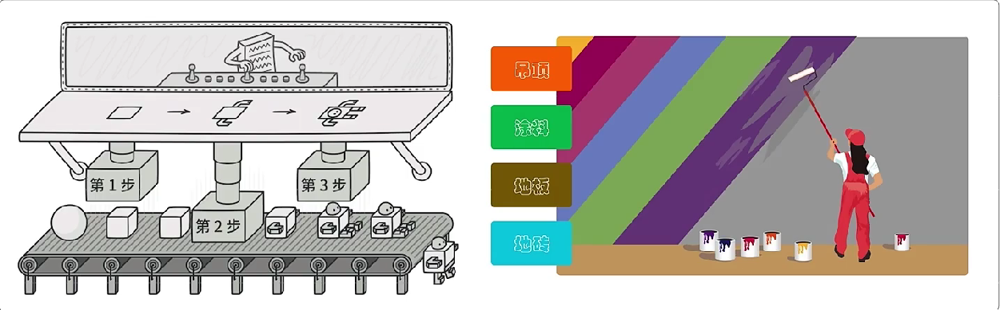
建造者模式主要解决的问题是在软件系统中，有时候面临着"一个复杂对象"的创建工作，其通常由各个部分的子对象用一定的过程构成；由于需求的变化，这个复杂对象的各个部分经常面临着重大的变化，但是将它们组合在一起的过程却相对稳定。
**案例**

模拟装修公司对于设计出一些套餐装修服务的场景
```
itstack-demo-design-3-00
└── src
    └── main
        └── java
            └── org.itstack.demo.design
                ├── ceilling
                │   ├── LevelOneCeiling.java
                │   └── LevelTwoCeiling.java
                ├── coat
                │   ├── DuluxCoat.java
                │   └── LiBangCoat.java
                │   └── LevelTwoCeiling.java
                ├── floor
                │   ├── DerFloor.java
                │   └── ShengXiangFloor.java
                ├── tile
                │   ├── DongPengTile.java
                │   └── MarcoPoloTile.java
                └── Matter.java
```
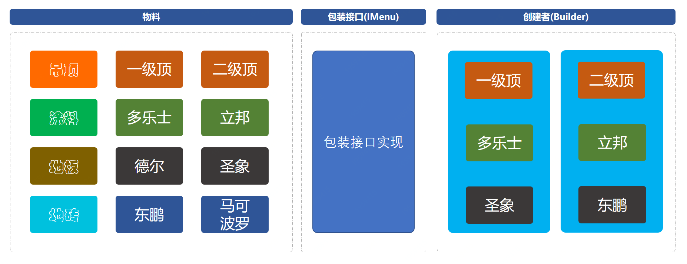
工程中有三个核心类和一个测试类，核心类是建造者模式的具体实现。与ifelse实现方式相比，多出来了两个二外的类。具体功能如下；
- Builder，建造者类具体的各种组装由此类实现。
- DecorationPackageMenu，是IMenu接口的实现类，主要是承载建造过程中的填充器。相当于这是一套承载物料和创建者中间衔接的内容。

当：一些基本物料不会变，而其组合经常变化的时候，就可以选择这样的设计模式来构建代码。

### 原型模式
是用于创建重复的对象，而这部分对象内容本身比较复杂，生成过程可能从库或者RPC接口中获取数据的耗时较长，因此采用克隆的方式节省时间，同时又能保证性能。
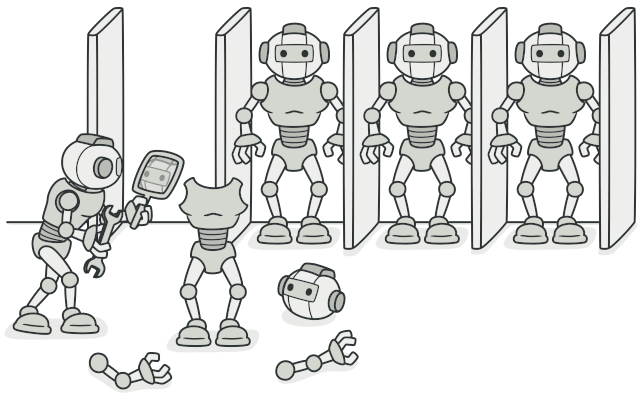
原型模式主要解决的问题就是创建大量重复的类。

便于通过克隆方式创建复杂对象、也可以避免重复做初始化操作、不需要与类中所属的其他类耦合等。但也有一些缺点如果对象中包括了循环引用的克隆，以及类中深度使用对象的克隆，都会使此模式变得异常麻烦。

### 单例模式
单例模式主要解决一个全局使用的类频繁的创建和消费，从而提升提升整体的代码的性能。

懒汉、饿汉、线程是否安全、静态类、内部类、加锁、串行化等等

## 结构型模式
### 适配器模式
把原本不能不兼容的接口，通过适配器做到统一。一个适配允许通常因为接口不兼容而不能一起工作的类工作在一起，做法是将类自己的接口包裹在一个已存在的类中。

对MQ这样的多种消息体中不同属性同类的值，进行适配再加上代理类，就可以使用简单的配置方式接入对方提供的MQ消息，而不需要大量重复的开发。非常利于拓展。

### 桥接模式
将一个打雷或一系列紧密相关的类拆分成抽象和实现两个独立的层次结构，把多种可匹配的额使用进行组合。

从桥接模式的实现形式来看满足了单一职责和开闭原则，让每一部分内容都很清晰易于维护和拓展，但如果我们是实现的高内聚的代码，那么就会很复杂。所以在选择重构代码的时候，需要考虑好整体的设计，否则选不到合理的设计模式，将会让代码变得难以开发。
### 组合模式
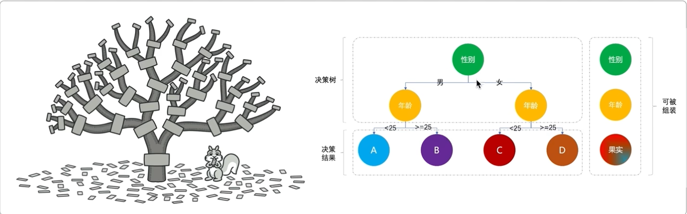
也称为整体-部分模式，宗旨是通过将单个对象（叶子节点）和组合对象（树枝节点）用相同的接口进行表示，使得客户对单个对象和组合对象的使用具有一致性。

**案例**

营销差异化人群发券，决策树引擎搭建场景

工程结构：
```
itstack-demo-design-8-02
└── src
├── main
│   └── java
│      └── org.itstack.demo.design.domain
│          ├── model
│          │   ├── aggregates
│          │   │   └── TreeRich.java
│          │   └── vo
│          │       ├── EngineResult.java
│          │       ├── TreeNode.java
│          │       ├── TreeNodeLink.java    
│          │       └── TreeRoot.java
│          └── service
│              ├── engine
│              │   ├── impl
│              │   │   └── TreeEngineHandle.java
│              │   ├── EngineBase.java
│              │   ├── EngineConfig.java
│              │   └── IEngine.java
│              └── logic
│                  ├── impl
│                  │   ├── UserAgeFilter.java
│                  │   └── UserGenderFilter.java
│                  └── LogicFilter.java
└── test
└── java
└── org.itstack.demo.design.test
└── ApiTest.java
```
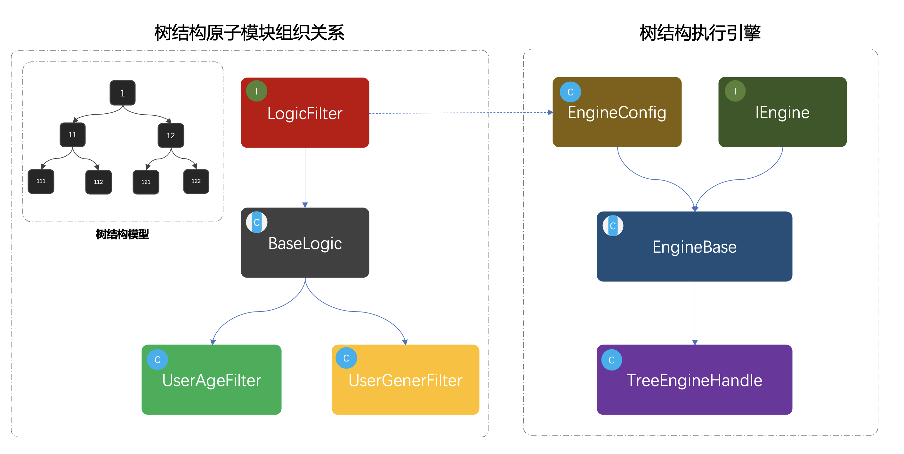
首先可以看下黑色框框的模拟指导树结构；1、11、12、111、112、121、122，这是一组树结构的ID，并由节点串联组合出一棵关系树。

接下来是类图部分，左侧是从LogicFilter开始定义适配的决策过滤器，BaseLogic是对接口的实现，提供最基本的通用方法。UserAgeFilter、UserGenerFilter，是两个具体的实现类用于判断年龄和性别。

最后则是对这颗可以被组织出来的决策树，进行执行的引擎。同样定义了引擎接口和基础的配置，在配置里面设定了需要的模式决策节点。
### 装饰器模式
在不改变现有对象结构的情况下，动态的增加新的功能。 

解决直接继承下因功能的不断横向扩展导致子类膨胀的问题，用装饰器会更加灵活，也不需要考虑子类的维护。使用装饰器模式满足单一职责原则，可以在自己的装饰类中完成功能逻辑的扩展，而不影响主类，同时可以按需在运行时添加和删除这部分的逻辑。

装饰器实现的重点是对抽象类继承接口方式的使用，同时设定被继承的接口可以通过构造函数传递其实现类，由此增加扩展性并重写方法里可以实现此部分父类实现的功能

### 实战外观模式
主要解决的是降低调用方的使用接口的复杂逻辑组合，并向调用方提供一个可以访问系统的接口。这样调用方与实际的接口提供方之间存在一个中间层，用于包装逻辑提供API接口。有些时候外观模式也被用在中间件层，对服务中的通用性复杂逻辑进行中间件层包装，让使用方可以只关心业务开发。
### 享元模式
主要用于减少创建对象的数量，以减少内存占用和提高性能，即共享通用对象。
### 实战代理模式
代理模式有点像老大和小弟，也有点像分销商。主要解决的问题是为某些资源的访问、对象的类的易用操作上提供方便使用的代理服务。而这种设计思想的模式经常会出现在我们的系统中，或者你用到过的组件中，它们都提供给你一种非常简单易用的方式控制原本你需要编写很多代码的进行使用的服务类。

代理模式除了开发中间件外还可以是对服务的包装，物联网组件等等，让复杂的各项服务变为轻量级调用、缓存使用。

## 行为型模式
### 责任链模式
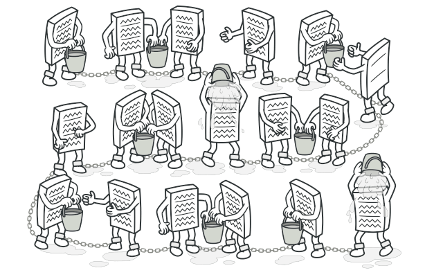
为了避免请求发送者与多个请求处理者耦合在一起，于是将所有的请求处理者连成一条链，通过前一个对象记住其下一个对象的引用；当有引用发生时，可以将请求沿着这条链传递，直到有对象处理它。

**案例**

618大促上线多级审批：开始->三级->二级->一级->结束

工程架构：
```
itstack-demo-design-13-02
└── src
    └── main
        └── java
            └── org.itstack.demo.design
                ├── impl
                │    ├── Level1AuthLink.java
                │    ├── Level2AuthLink.java
                │    └── Level3AuthLink.java
                ├── AuthInfo.java
                └── AuthLink.java
```
责任链模式结构
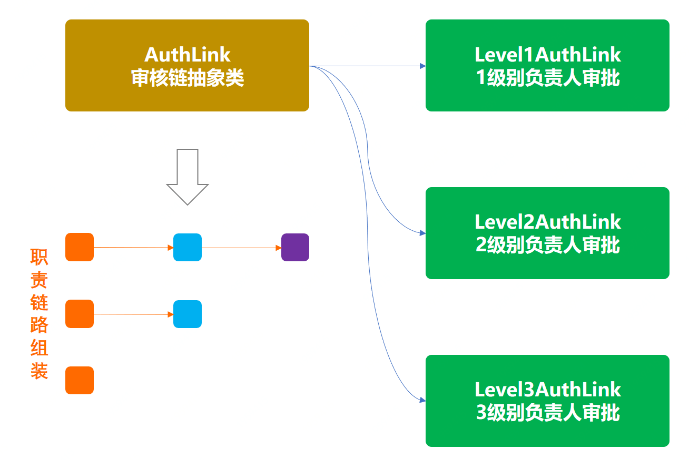

### 策略模式
定义了一系列的算法或处理逻辑，并将每个算法或处理逻辑封装起来，使其可以相互替换，且算法或处理逻辑的变化不会影响到使用它们的客户。通过对算法或处理逻辑的封装，把使用它们的责任和算法或处理逻辑的实现分割开，并委派给不同的对象对算法进行管理。
一般具有相同同类功能组的行为逻辑算法场景，比如：不同类型的交易方式(信用卡、支付宝、微信)、生成唯一ID策略(UUID、DB自增、DB+Redis、雪花算法、Leaf算法)等都可以使用策略模式进行行为包装。

**案例**

各种类型优惠券(满减、直减、折扣、n元购)

工程结构
```
itstack-demo-design-20-02
└── src
└── main
└── java
└── org.itstack.demo.design
├── event
│    └── MJCouponDiscount.java
│    └── NYGCouponDiscount.java
│    └── ZJCouponDiscount.java
│    └── ZKCouponDiscount.java
├── Context.java
└── ICouponDiscount.java
```
策略模式架构
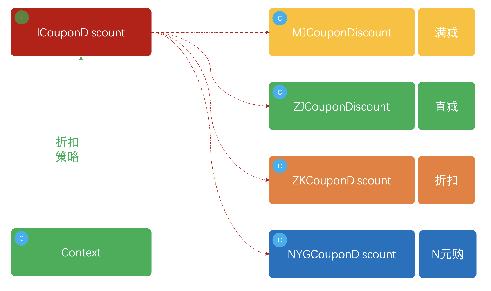

### 模板模式
定义一个操作中的算法骨架，而将算法的一些步骤延迟到子类中，使得子类可以不改变该算法结构的情况下重定义该算法的某些特定步骤。
就像西游记的99八十一难，基本每一关都是；师傅被掳走、打妖怪、妖怪被收走，具体什么妖怪你自己定义，怎么打你想办法，最后收走还是弄死看你本事，我只定义执行顺序和基本策略，具体的每一难由观音来安排。
核心点在于由抽象类定义抽象方法执行策略，也就是说父类规定好了一系列的执行标准，这些标准串联成一整套业务流程。
**案例**

模拟爬虫各类电商商品，生成营销推广海报场景。步骤：模拟登录、爬取信息、生成海报。

工程结构
```
itstack-demo-design-21-00
└── src
    ├── main
    │   └── java
    │       └── org.itstack.demo.design
    │           ├── group
    │           │	  ├── DangDangNetMall.java
    │           │	  ├── JDNetMall.java
    │           │	  └── TaoBaoNetMall.java
    │           ├──  HttpClient.java
    │           └──  NetMall.java
    └── test
        └── java
            └── org.itstack.demo.design.test
                └── ApiTest.java
```
模板模式模型结构
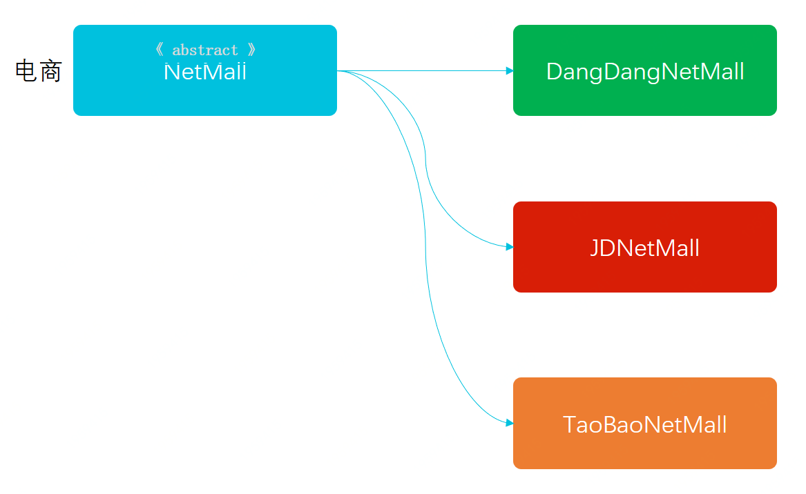
一个定义了抽象方法执行顺序的核心抽象类，以及三个模拟具体的实现(京东、淘宝、当当)的电商服务。
### Mock接口对接抽奖页面
实现在进入抽奖页面的时候从 Mock 的接口中获取奖品列表数据，同时在发起抽奖的时候获取中奖信息。
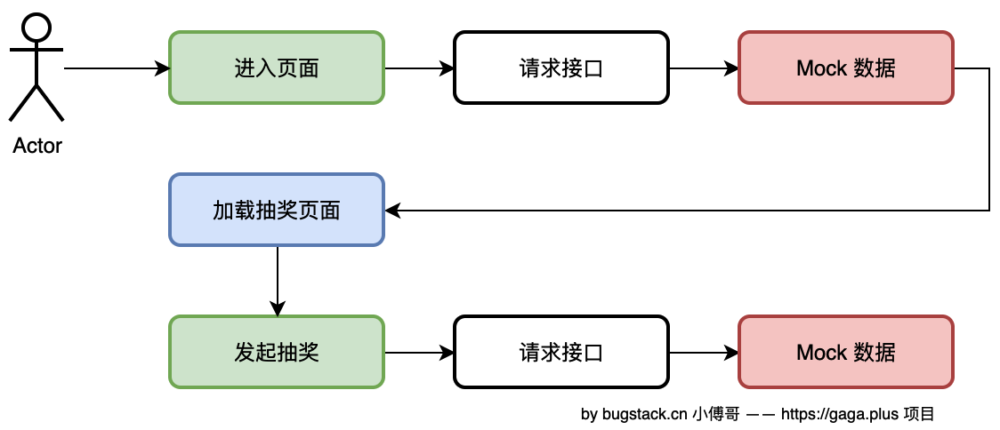

### 抽奖API接口实现
在系统架构设计中，有一个 trigger 模块，专门用于提供触发操作。这里我把 HTTP 调用、RPC（Dubbo）调用、定时任务、MQ监听等动作，都称为触发操作。触发表示通过一种调用方式，调用到领域的服务上。
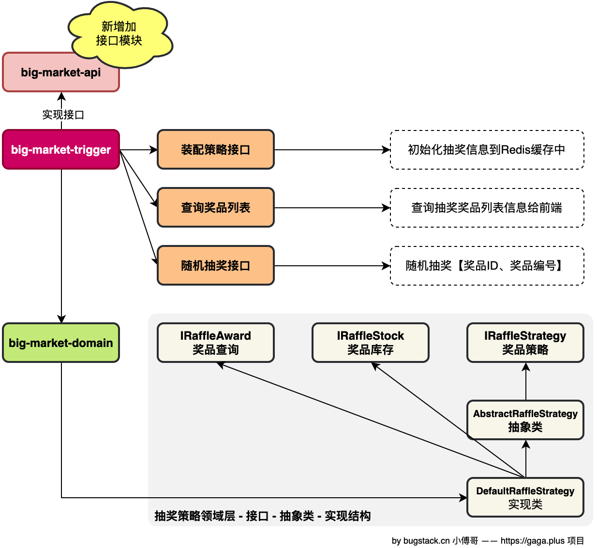
模块调用流程
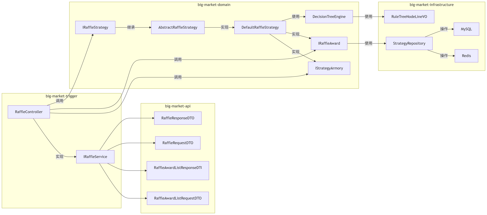


### 参考文献
[小傅哥 bugstack 虫洞栈](https://bugstack.cn/)

https://refactoringguru.cn/design-patterns/factory-method

