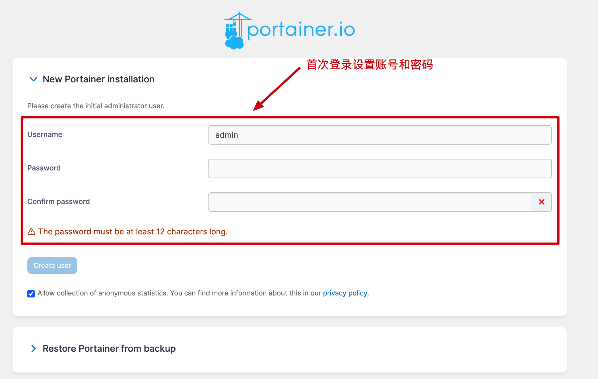
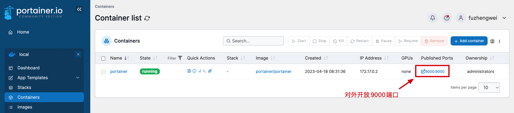
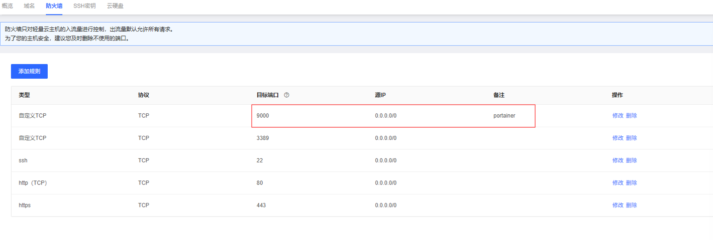
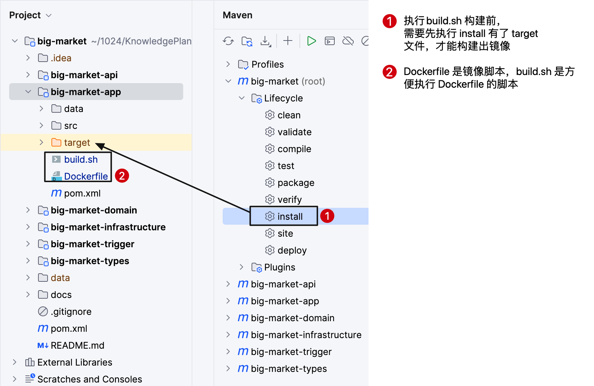
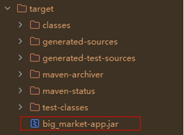
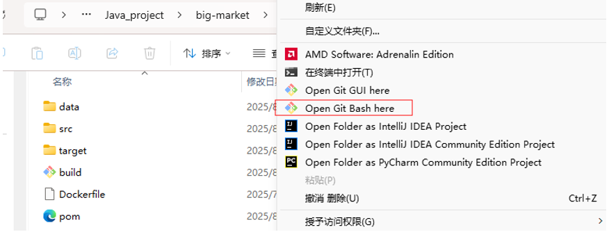
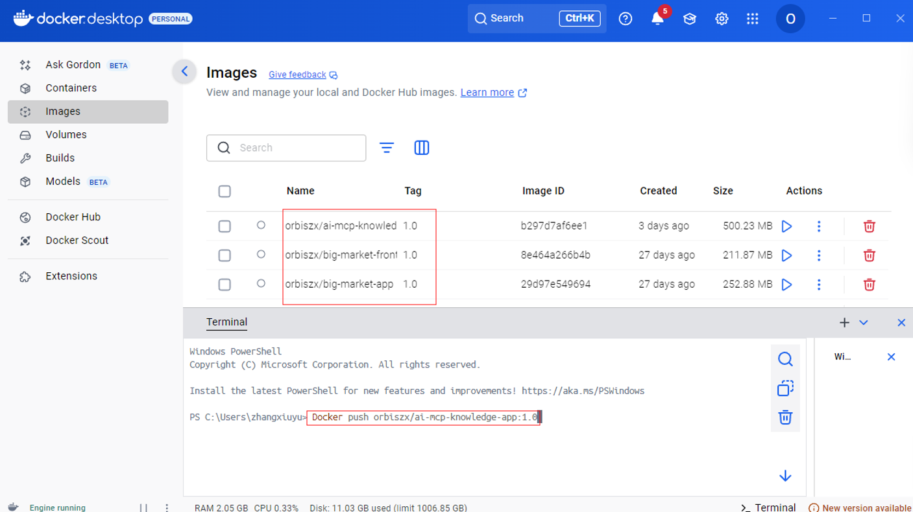
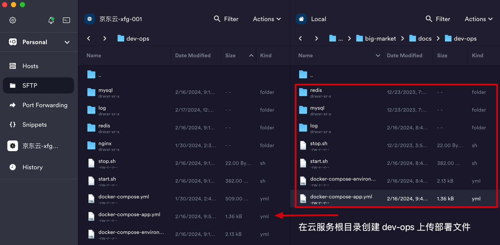
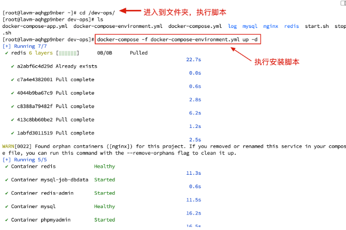
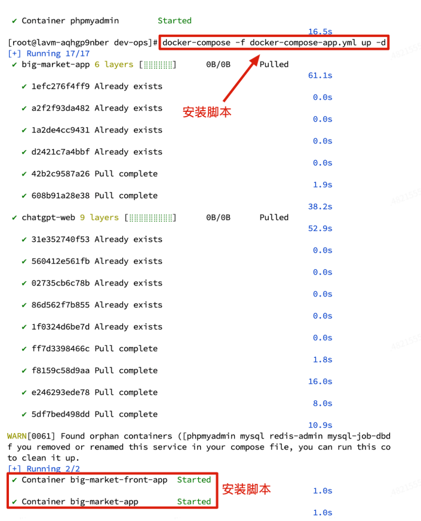

首先需要购买云服务器，对于并发数不高的轻量项目，2c2g的云服务器就足够了，推荐京东云或者腾讯云，有新人优惠，一年也就不到40，比较划算。

京东云：https://www.jdcloud.com/

腾讯云：https://cloud.tencent.com/

本文通过配置 docker 镜像打包，构建应用的镜像文件来进行部署。因为需要在云服务器上拉去Docker镜像文件，因此首先要在云服务器安装Docker环境
## Docker、Portainer环境配置
Docker 是一个开源的应用容器引擎，让开发者可以打包他们的应用以及依赖包到一个可移植的镜像中，然后发布到任何流行的 Mac、Linux或Windows操作系统的机器上，也可以实现虚拟化。容器是完全使用沙箱机制，相互之间不会有任何接口。总之它加快构建、共享和运行现代应用程序的速度。
### 1.yum 更新到最新版本 
```
sudo yum update
```
```
Last metadata expiration check: 1:15:10 ago on Sat 27 Nov 2021 04:22:53 PM CST.
Dependencies resolved.
Nothing to do.
Complete!
```
注意：可能会更新失败，那就操作以下指令
```
## 建议备份当前的 yum 源配置，以防万一需要恢复
sudo cp /etc/yum.repos.d/CentOS-Base.repo /etc/yum.repos.d/CentOS-Base.repo.bak

## 从阿里云下载 CentOS 7 的 yum 源配置文件并替换现有的配置
sudo curl -o /etc/yum.repos.d/CentOS-Base.repo https://mirrors.aliyun.com/repo/Centos-7.repo

## 清理旧的缓存并生成新的缓存
sudo yum clean all
sudo yum makecache

## 再次更新
sudo yum update
```
### 2.安装Docker所需的依赖包
```
[root@lavm-l22n2ze371 ~]# sudo yum install -y yum-utils device-mapper-persistent-data lvm2
Loaded plugins: fastestmirror
Repository base is listed more than once in the configuration
Repository updates is listed more than once in the configuration
Repository extras is listed more than once in the configuration
Repository centosplus is listed more than once in the configuration
Loading mirror speeds from cached hostfile
Package yum-utils-1.1.31-54.el7_8.noarch already installed and latest version
Resolving Dependencies
```
看到显示 Complete 就代表完成了
### 3.设置Docker的yum的源
建议使用国内源
```
sudo yum-config-manager --add-repo https://mirrors.aliyun.com/docker-ce/linux/centos/docker-ce.repo
```
### 4.查看仓库所有Docker版本
```
yum list docker-ce --showduplicates | sort -r
```
这里可以看到你能安装的最新版本
### 5.安装Docker
```
sudo yum install -y docker-ce-25.0.5 docker-ce-cli-25.0.5 containerd.io
```
### 6.安装Docker-Compose
```
# 指定路径【推荐】
sudo curl -L https://gitee.com/fustack/docker-compose/releases/download/v2.24.1/docker-compose-linux-x86_64 -o /usr/local/bin/docker-compose
# 设置权限
sudo chmod +x /usr/local/bin/docker-compose
```
### 7.启动Docker并添加开机自启动
```
# 启动 Docker
sudo systemctl start docker
# 设置开机启动 Docker
systemctl enable docker
# 重启 Docker 命令
sudo systemctl restart docker
```
### 8.Docker 常用命令
```
[root@CodeGuide ~]# docker --help				#Docker帮助
[root@CodeGuide ~]# docker --version			#查看Docker版本
[root@CodeGuide ~]# docker search <image>		#搜索镜像文件，如：docker search mysql
[root@CodeGuide ~]# docker pull <image>		#拉取镜像文件， 如：docker pull mysql
[root@CodeGuide ~]# docker images				#查看已经拉取下来的所以镜像文件
[root@CodeGuide ~]# docker rmi <image>		#删除指定镜像文件
[root@CodeGuide ~]# docker run --name <name> -p 80:8080 -d <image>		#发布指定镜像文件
[root@CodeGuide ~]# docker ps					#查看正在运行的所有镜像
[root@CodeGuide ~]# docker ps -a				#查看所有发布的镜像
[root@CodeGuide ~]# docker rm <image>			#删除执行已发布的镜像
```
### 9.设置国内源
1panel 提供了镜像源 https://status.1panel.top/status/docker (opens new window)- 直接进去就可以找到最新的镜像源
阿里云提供了镜像源：https://cr.console.aliyun.com/cn-hangzhou/instances/mirrors (opens new window)- 登录后你会获得一个专属的地址。
使用以下命令来设置 Docker 国内源：- 或者你可以通过 vim /etc/docker/daemon.json 进入修改添加 registry-mirrors 内容后重启 Docker
```
sudo mkdir -p /etc/docker
sudo tee /etc/docker/daemon.json <<-'EOF'
{
  "registry-mirrors": ["https://***替换为你的地址***.mirror.aliyuncs.com"]
}
EOF
sudo systemctl daemon-reload
sudo systemctl restart docker
```
### 10.拉取最新的 Portainer
```
docker pull portainer/portainer
```
### 11.安装和启动
**注意**：如果是阿里云服务器，还需要先执行 docker volume crete portainer_data
```
docker run -d --restart=always --name portainer -p 9000:9000 -v /var/run/docker.sock:/var/run/docker.sock portainer/portainer
```
### 12.访问 Portainer
- 地址：http://云服务器地址:9000/
- 操作：登录后设置你的用户名和密码，并设置本地Docker即可，设置完成后，如下

记得云服务器开放9000端口



## 云服务器部署
需要注册 https://hub.docker.com/ 账号，并创建镜像名称和上传你的镜像。Docker hub 的作用相当于媒介，上传到 Docker hub 后，在云服务器端在从 Docker hub 拉取下来镜像部署。这个过程就类似于你在部署一些 Redis、MySQL 环境一样。
### 构建镜像
添加Dockerfile、build.sh文件
先执行install打包

**Dockerfile**
```
# 基础镜像
FROM openjdk:8-jre-slim

# 作者
MAINTAINER orbisz

# 配置
ENV PARAMS=""

# 时区
ENV TZ=PRC
RUN ln -snf /usr/share/zoneinfo/$TZ /etc/localtime && echo $TZ > /etc/timezone

# 添加应用
ADD target/big_market-app.jar /big_market-app.jar

ENTRYPOINT ["sh","-c","java -jar $JAVA_OPTS /big_market-app.jar $PARAMS"]
```
这里ADD target/big_market-app.jar /big_market-app.jar中的big_market-app.jar一定要和install打包的文件名相同

**build.sh**
```
# 普通镜像构建，随系统版本构建 amd/arm
docker build --no-cache -t orbiszx/big-market-app:3.2 -f ./Dockerfile .

# 兼容 amd、arm 构建镜像
# docker buildx build --load --platform liunx/amd64,linux/arm64 -t orbisz/xfg-frame-archetype-app:1.0 -f ./Dockerfile . --push
```
注意，这里的orbiszx/big-market-app必须和Docker hub仓库的名字一致才能推送镜像成功。
- 你可以修改为自己的镜像名字，如 liergou/big-market-front-app:1.0
- 前端执行build.sh 构建时，修改 .env.local 里面的 API_HOST_URL=http://ip:port 修改为你自己的云服务器公网IP。

Mac电脑可以直接在IDEA执行build.sh,windows电脑则需要到build.sh所在的文件夹右键打开Git Bash

执行
```
bash build.sh
```
### 推送镜像
然后在本地的Docker上就可以看到构建的镜像，接着将镜像推送到Docker Hub上

**注意**：由于Docker Hub不在国内，因此需要打开VPN才能推送上去，或者可以考虑使用阿里云国内镜像仓库，步骤都是相同的。

### 部署环境


进入到 dev-ops 文件夹
执行脚本；docker-compose -f docker-compose-environment.yml up -d 安装项目的运行环境

### 部署项目

- 进入到 dev-ops 文件夹
- 执行脚本；docker-compose -f docker-compose-app.yml up -d 部署项目

然后访问页面即可: http://117.72.164.204:3000/?userId=zxy&activityId=100301