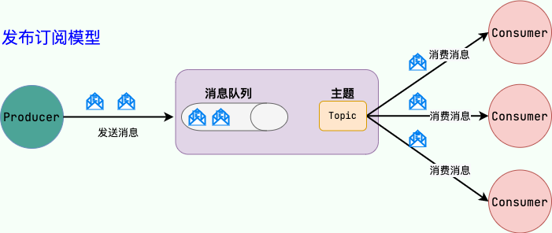
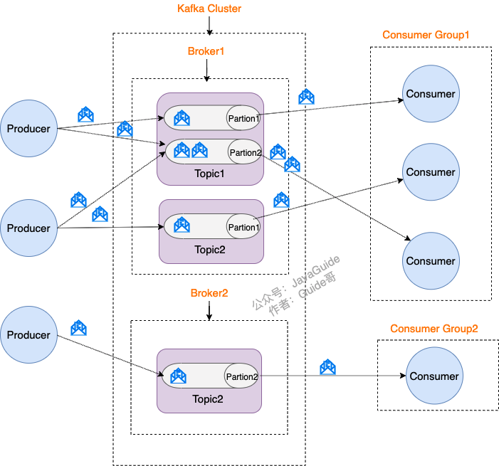
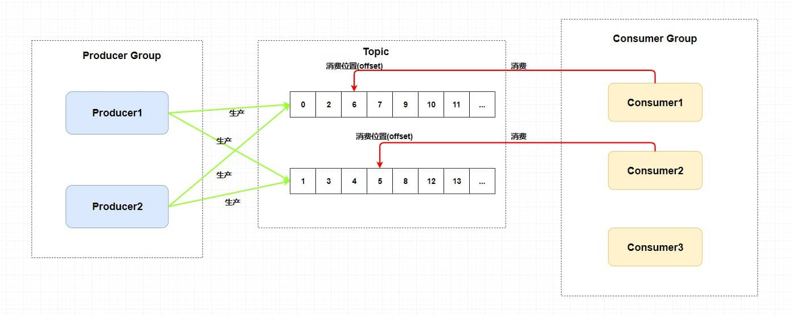
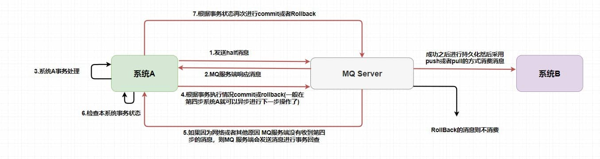

## 消息队列基础知识总结
### 什么是消息队列
消息队列可以看作是一个存放消息的容器，由于队列Queue是先进先出的数据结构，因此我们消费消息时也是按照顺序来消费。

参与消息传递的双方是生产者-消费者，生产者负责1生产消息，消费者负责消费消息。

操作系统中的进程通信的一种很重要的方式就是消息队列。我们这里提到的消息队列更多的指的是各个服务以及系统内部各个组件/模块的通信，属于一种中间件。

中间件就是一类为应用软件服务的软件，应用软件是为用户服务的，所以用户不会接触或者使用到中间件。

### 消息队列的作用
- 异步处理
- 削锋/限流
- 降低系统耦合性

还可以实现分布式事务、顺序保证和数据流处理。结合项目中的使用来回答。

### 消息队列会带来哪些问题
- 系统可用性降低：引入MQ就需要去考虑消息丢失或者MQ挂掉的情况
- 系统的可用性提高:需要保证消息没有被重复消费、处理消息丢失的情况、保证消息1传递的顺序性
- 一致性问题：保证消息队列实现异步的数据一致性。

### JMS和AMQP
#### JMS
JMS是Java的消息服务，JMS的客户端之间可以通过JMS服务进行异步的消息传输。JMS API是一个消息服务的标准/规范，允许应用程序组件基于JavaEE平台创建、发送、接收和读取消息。它使得分布式通信耦合度更低，消息服务更加可靠以及异步性。
JMS定义了五种不同的消息正文格式以及调用的消息类型
- StreamMessage：Java原始的数据流
- MapMessage：一套名称-值对
- TextMessage：一个字符串对象
- ObjectMessage：一个序列化的Java对象
- BytesMessage：一个字节的数据流

JMS具有两种消息模型
- 点到点（P2P）模型：使用队列（Queue）作为消息通信载体；满足生产者与消费者模式，一条消息只能被一个消费者使用，未被消费的消息在队列中保留直到被消费或超时。
- 发布/订阅（Pub/Sub）模型：发布订阅模型（Pub/Sub） 使用主题（Topic）作为消息通信载体，类似于广播模式；发布者发布一条消息，该消息通过主题传递给所有的订阅者。

#### AMQP
AMQP是一个提供统一消息服务的应用层标准高级消息队列协议(二进制应用层协议)，是应用层协议的一个开放标准，为面向消息的中间件设计，兼容JMS。基于此协议的客户端和消息中间件可传递消息，并不受客户端/中间件同产品，不同的开发语言的限制。RabbitMQ就是基于AMQP协议实现的。

AMQP提供了物种消息模型：1.`direct exchange`；2.`fanout exchange`；3.`topic change`；4.`headers exchange`；5.`system exchange`。本质来讲，后四种和JMS的 `pub/sub` 模型没有太大差别，仅是由于`Exchange`提供的路由算法，AMQP可以提供多样化的路由方式来传递消息到消息队列。
AMQP支持byte[]类型的消息。

### RPC和消息队列的区别
RPC和消息队列都是分布式微服务系统中重要的组件之一，下面我们来简单对比一下两者：
- 从用途来看：RPC主要用来解决两个服务的远程通信问题，不需要了解底层网络的通信机制。通过RPC可以帮助我们调用远程计算机上某个服务的方法，这个过程就像调用本地方法一样简单。消息队列主要用来降低系统耦合性、实现任务异步、有效地进行流量削峰。
- 从通信方式来看：RPC是双向直接网络通讯，消息队列是单向引入中间载体的网络通讯。
- 从架构上来看：消息队列需要把消息存储起来，RPC则没有这个要求，因为前面也说了RPC是双向直接网络通讯。
- 从请求处理的时效性来看：通过RPC发出的调用一般会立即被处理，存放在消息队列中的消息并不一定会立即被处理。 

RPC和消息队列本质上是网络通讯的两种不同的实现机制，两者的用途不同。

### 常见的消息队列，如何选择
Kafka、RokectMQ、RabbitMQ、Pulsar。

- RabbitMQ在吞吐量方面虽然稍逊于Kafka、RocketMQ和Pulsar，但是由于它基于Erlang开发，所以并发能力很强，性能极其好，延时很低，达到微秒级。但是也因为RabbitMQ基于Erlang开发，所以国内很少有公司有实力做Erlang源码级别的研究和定制。如果业务场景对并发量要求不是太高（十万级、百万级），那这几种消息队列中，RabbitMQ或许是你的首选。
- RocketMQ和Pulsar支持强一致性，对消息一致性要求比较高的场景可以使用。
- RocketMQ阿里出品，Java系开源项目，源代码我们可以直接阅读，然后可以定制自己公司的MQ，并且RocketMQ有阿里巴巴的实际业务场景的实战考验。
- Kafka的特点其实很明显，就是仅仅提供较少的核心功能，但是提供超高的吞吐量，ms级的延迟，极高的可用性以及可靠性，而且分布式可以任意扩展。同时Kafka最好是支撑较少的topic数量即可，保证其超高吞吐量。Kafka唯一的一点劣势是有可能消息重复消费，那么对数据准确性会造成极其轻微的影响，在大数据领域中以及日志采集中，这点轻微影响可以忽略这个特性天然适合大数据实时计算以及日志收集。如果是大数据领域的实时计算、日志采集等场景，用Kafka是业内标准的，绝对没问题，社区活跃度很高，绝对不会黄，何况几乎是全世界这个领域的事实性规范。

## Kafka基础知识总结
Kafka是一个分布式流式处理平台，流平台具有三个关键功能：
- 消息队列：发布和订阅消息流，
- 容错的持久方式存储记录消息流;kafka会把消息持久化到磁盘，可以有效避免消息丢失的风险
- 流式处理平台：在消息发布的时候就行处理，kafka提供了一个完整的流式处理类库

Kafka主要有两大应用场景：消息队列和数据处理。

kafka的优势：
- 极致的性能：基于Scala和java开发，设计中大量使用了批量处理和异步的思想，最高可以每秒处理千万级别的消息。
- 生态系统兼容性无可匹敌;kafka与周边生态系统的兼容性是最好的。
### Kafka 中的消息模型是什么？
**发布-订阅模型**


1. **Producer(生产者)**：产生消息的一方
2. **Consumer(消费者)**：消费消息的一方
3. **Broker(代理)**：可以看作是一个独立的kafka示例，多个kafka Broker组成了一个kafka Cluster
4. **Topic(主题)**：Producer将消息发送到特定的主题，Consumer通过订阅特定的猪头来消费消息。
5. **Partition(分区)**：Partition属于Topic的一部分，Kafka 中的Partition（分区） 实际上可以对应成为消息队列中的队列。


### Kafka 的多副本机制了解吗？带来了什么好处？
Kafka为分区（Partition）引入了多副本（Replica）机制。分区（Partition）中的多个副本之间会有一个叫做leader的家伙，其他副本称为follower。
我们发送的消息会被发送到leader副本，然后follower副本才能从leader副本中拉取消息进行同步。
生产者和消费者只与leader副本交互。你可以理解为其他副本只是leader副本的拷贝，它们的存在只是为了保证消息存储的安全性。
当leader副本发生故障时会从follower中选举出一个leader,但是follower和leader同步程度达不到要求的参加不了leader的竞选。

1. Kafka通过给特定Topic指定多个Partition, 而各个Partition可以分布在不同的Broker上, 这样便能提供比较好的并发能力（负载均衡）。
2. Partition可以指定对应的Replica数, 这也极大地提高了消息存储的安全性, 提高了容错能力，不过也相应的增加了所需要的存储空间。

### Zookeeper 在 Kafka 中的作⽤是什么？使⽤ Kafka 能否不引⼊ Zookeeper?
ZooKeeper 主要为 Kafka 提供元数据的管理的功能。 
1. Broker注册：在Zookeeper上会有一个专门用来进行Broker服务器列表记录的节点。每个Broker在启动时，都会到Zookeeper上进行注册，即到/brokers/ids下创建属于自己的节点。每个Broker就会将自己的 IP 地址和端口等信息记录到该节点中去
2. Topic 注册：在Kafka中，同一个Topic的消息会被分成多个分区并将其分布在多个Broker上，这些分区信息及与Broker的对应关系也都是由Zookeeper在维护。
3. 负载均衡：Kafka通过给特定Topic指定多个Partition, 而各个Partition可以分布在不同的Broker上, 这样便能提供比较好的并发能力。 对于同一个Topic的不同Partition，Kafka会尽力将这些Partition分布到不同的Broker服务器上。当生产者产生消息后也会尽量投递到不同Broker的Partition里面。当Consumer消费的时候，Zookeeper可以根据当前的Partition数量以及Consumer数量来实现动态负载均衡

在Kafka 2.8之前，Kafka最被大家诟病的就是其重度依赖于Zookeeper。在Kafka 2.8 之后，引入了基于Raft协议的KRaft模式，不再依赖Zookeeper，大大简化了Kafka的架构，让你可以以一种轻量级的方式来使用Kafka
### Kafka 重试机制？Kafka 刷盘机制？
在默认配置下，当消费异常会进行重试。重试多次后会跳过当前消息，继续进行后续消息的消费，不会一直卡在当前消息。保证了业务的正常运行。
源码`FailedRecordTracker`类有个`recovered`函数，返回`Boolean`值判断是否要进行重试。
Kafka消费者在默认配置下会进行最多10次的重试，每次重试的时间间隔为0，即立即进行重试。如果在10次重试后仍然无法成功消费消息，则不再进行重试，消息将被视为消费失败。

默认错误处理器的重试次数以及时间间隔是由`FixedBackOff`控制的，`FixedBackOff`是`DefaultErrorHandler`初始化时默认的。所以自定义重试次数以及时间间隔，只需要在`DefaultErrorHandler`初始化的时候传入自定义的`FixedBackOff`即可。重新实现一个`KafkaListenerContainerFactory`，调用`setCommonErrorHandler`设置新的自定义的错误处理器就可以实现。

自定义重试失败后逻辑，需要手动实现，以下是一个简单的例子，重写`DefaultErrorHandler`的`handleRemaining`函数，加上自定义的告警等操作。
```Java
@Slf4j
public class DelErrorHandler extends DefaultErrorHandler {

    public DelErrorHandler(FixedBackOff backOff) {
        super(null,backOff);
    }

    @Override
    public void handleRemaining(Exception thrownException, List<ConsumerRecord<?, ?>> records, Consumer<?, ?> consumer, MessageListenerContainer container) {
        super.handleRemaining(thrownException, records, consumer, container);
        log.info("重试多次失败");
        // 自定义操作
    }
}
```

当达到最大重试次数后，如果仍然无法成功处理消息，消息会被发送到对应的死信队列中。对于死信队列的处理，既可以用`@DltHandler`处理，也可以使用`@KafkaListener`重新消费。

Kafka的刷盘机制是延迟刷盘，默认依赖操作系统的Page Cache，通过可配置的消息数或时间阈值触发，核心是平衡性能和持久化保障。kafka会调用`fsync()`将数据强制刷新（flush）到磁盘，kafka的刷盘机制有两个关键配置参数：
- `flush.message`：每写入N条消息后触发一次flush
- `flush.ms`：每N秒触发一次flush

这两个参数可以同时生效，满足任意一个就会触发 flush。

### Kafka 如何保证⾼可⽤？
高可用是指系统无间断地执行其功能的能力，代表系统的可用性程度 。Kafka 从 0.8 ，可保障一个或多个Broker宕机后，其他Broker能继续提供服务。
Kafka从以下几个机制来保证高可用：备份机制；ISR机制；ACK机制；故障恢复机制。

#### 备份机制
Kafka允许同一个Partition存在多个消息副本，每个Partition的副本通常由 1 个 Leader 及 0 个以上的 Follower 组成，生产者将消息直接发往对应 Partition 的 Leader，Follower 会周期地向 Leader 发送同步请求。
同一 Partition 的 Replica 不应存储在同一个 Broker 上，因为一旦该 Broker 宕机，对应 Partition 的所有 Replica 都无法工作，这就达不到高可用的效果，
所以 Kafka 会尽量将所有的 Partition 以及各 Partition 的副本均匀地分配到整个集群的各个 Broker 上。
#### ISR机制
ISR 中的副本都是与 Leader 同步的副本，相反，不在 ISR 中的追随者副本就被认为是与 Leader 不同步的。
这里的保持同步不是指与 Leader 数据保持完全一致，只需在`replica.lag.time.max.ms`时间内与 Leader 保持有效连接，
Follower 周期性地向 Leader 发送`FetchRequest`请求，发送时间间隔配置在`replica.fetch.wait.max.ms`中，默认值为 500。

各 Partition 的 Leader 负责维护 ISR 列表并将 ISR 的变更同步至 ZooKeeper，被移出 ISR 的 Follower 会继续向 Leader 发`FetchRequest`请求，试图再次跟上 Leader 重新进入 ISR。
ISR 中所有副本都跟上了 Leader，通常只有 ISR 里的成员才可能被选为 Leader。

**Unclean 领导者选举**：
当 Kafka 中`unclean.leader.election.enable`配置为 true(默认值为 false)且 ISR 中所有副本均宕机的情况下，才允许 ISR 外的副本被选为 Leader，此时会丢失部分已应答的数据，
开启 Unclean 领导者选举可能会造成数据丢失，但好处是，它使得分区 Leader 副本一直存在，不至于停止对外提供服务，因此提升了高可用性，反之，禁止 Unclean 领导者选举的好处在于维护了数据的一致性，避免了消息丢失，但牺牲了高可用性。
#### ACK 机制
生产者发送消息中包含 acks 字段，该字段代表 Leader 应答生产者前， Leader 收到的应答数。
- acks=0：
生产者无需等待服务端的任何确认，消息被添加到生产者套接字缓冲区后就视为已发送，不能保证服务端已收到消息
- acks=1：
只要 Partition Leader 接收到消息而且写入本地磁盘了，就认为成功了，不管它其他的 Follower 有没有同步过去这条消息了

- acks=all：
Leader 将等待 ISR 中的所有副本确认后再做出应答，因此只要 ISR 中任何一个副本还存活着，这条应答过的消息就不会丢失

acks=all 是可用性最高的选择，但等待 Follower 应答引入了额外的响应时间。Leader 需要等待 ISR 中所有副本做出应答，此时响应时间取决于 ISR 中最慢的那台机器，
如果说 Partition Leader 刚接收到了消息，但是结果 Follower 没有收到消息，此时 Leader 宕机了，那么客户端会感知到这个消息没发送成功，他会重试再次发送消息过去。
Broker 的配置项`min.insync.replicas`(默认值为 1)代表了正常写入生产者数据所需要的最少 ISR 个数。
当 ISR 中的副本数量小于`min.insync.replicas`时，Leader 停止写入生产者生产的消息，并向生产者抛出`NotEnoughReplicas`异常，阻塞等待更多的 Follower 赶上并重新进入 ISR，
被 Leader 应答的消息都至少有`min.insync.replicas`个副本，因此能够容忍`min.insync.replicas-1`个副本同时宕机

发送的 acks=1 和 0 消息会出现丢失情况，为不丢失消息可配置生产者 `acks=all & min.insync.replicas >= 2`
#### 故障恢复机制
Kafka 从 0.8 版本开始引入了一套 Leader 选举及失败恢复机制 。
首先需要在集群所有 Broker 中选出一个 Controller，负责各 Partition 的 Leader 选举以及 Replica 的重新分配，
当出现 Leader 故障后，Controller 会将 Leader/Follower 的变动通知到需为此作出响应的 Broker。 
Kafka 使用 ZooKeeper 存储 Broker、Topic 等状态数据，Kafka 集群中的 Controller 和 Broker 会在 ZooKeeper 指定节点上注册 Watcher(事件监听器)，以便在特定事件触发时，由 ZooKeeper 将事件通知到对应 Broker。

**Broker**：
当 Broker 发生故障后，由 Controller 负责选举受影响 Partition 的新 Leader 并通知到相关 Broker。

**Controller**：

Kafka 让所有 Broker 都在 ZooKeeper 的 Controller 节点上注册一个 Watcher。
Controller 发生故障时对应的 Controller 临时节点会自动删除，此时注册在其上的 Watcher 会被触发，所有活着的 Broker 都会去竞选成为新的 Controller(即创建新的 Controller 节点，由 ZooKeeper 保证只会有一个创建成功)。
竞选成功者即为新的 Controller。

### Kafka 如何保证⾼性能读写？
从高度抽象的角度来看，性能问题逃不出下面三个方面：网络；磁盘；复杂度。对于 Kafka 这种网络分布式队列来说，网络和磁盘更是优化的重中之重。针对于上面提出的抽象问题，解决方案高度抽象出来也很简单： 并发；压缩；批量；缓存；算法。

#### 顺序写
如果在写磁盘的时候省去寻道、旋转可以极大地提高磁盘读写的性能。
Kafka 采用顺序写文件的方式来提高磁盘写入性能。顺序写文件，基本减少了磁盘寻道和旋转的次数。
#### 零拷贝
零拷贝就是尽量去减少上面数据的拷贝次数，从而减少拷贝的 CPU 开销，减少用户态内核态的上下文切换次数，从而优化数据传输的性能。
Kafka 使用到了`mmap`和`sendfile`的方式来实现零拷贝。分别对应 Java 的`MappedByteBuffer`和`FileChannel.transferTo`。
#### PageCache
producer 生产消息到 Broker 时，Broker 会使用`pwrite()`系统调用【对应到 Java NIO 的`FileChannel.write()` API】按偏移量写入数据，此时数据都会先写入`page cache`。consumer 消费消息时，Broker 使用`sendfile()`系统调用【对应`FileChannel.transferTo()` API】，零拷贝地将数据从`page cache`传输到 broker 的 Socket buffer，再通过网络传输。

page cache中的数据会随着内核中 flusher 线程的调度以及对`sync()/fsync()`的调用写回到磁盘，就算进程崩溃，也不用担心数据丢失。另外，如果 consumer 要消费的消息不在page cache里，才会去磁盘读取，并且会顺便预读出一些相邻的块放入`page cache`，以方便下一次读取。
#### 网络模型
Kafka 自己实现了网络模型做 RPC。底层基于 Java NIO，采用和 Netty 一样的 Reactor 线程模型。模型主要分为三个角色
- Reactor：把 IO 事件分配给对应的 handler 处理
- Acceptor：处理客户端连接事件
- Handler：处理非阻塞的任务
#### 批量传输与压缩消息
在 Kafka 中，Kafka 会对消息进行分组，发送消息之前，会先将消息组合在一起形成消息快，然后 Producer 会将消息快一起发送到  Broker 。
由于，网络带宽是有限的，我们在网络中传输数据之前往往需要先对其进行压缩。
Broker 接收到压缩后的消息块之后（建议  Broker  的压缩算法和 Producer  一样），会依次将压缩后的消息块写入文件中（注意：这个时候消息块还是压缩的状态），Consumer 同时会依次获取消息块，当消息块到达 Consumer  后，Consumer 才会对消息块进行解压缩（有压缩必然有解压缩）。

Kafka 支持多种压缩算法：LZ4 、Snappy 、GZIP 。Kafka 2.1.0 正式支持 ZStandard 压缩算法。
#### 分区并发
Kafka 的 Topic 可以分成多个 Partition，每个 Paritition 类似于一个队列，保证数据有序。同一个 Group 下的不同 Consumer 并发消费 Paritition，分区实际上是调优 Kafka 并行度的最小单元，因此，可以说，每增加一个 Paritition 就增加了一个消费并发。

Kafka 具有优秀的分区分配算法——StickyAssignor，可以保证分区的分配尽量地均衡，且每一次重分配的结果尽量与上一次分配结果保持一致。这样，整个集群的分区尽量地均衡，各个 Broker 和 Consumer 的处理不至于出现太大的倾斜。

#### 总结
kafka的性能优化可以从以下几个方面
1. 零拷贝网络和磁盘
2. 优秀的网络模型，基于 Java NIO
3. 高效的文件数据结构设计
4. Parition 并行和可扩展
5. 数据批量传输
6. 数据压缩
7. 顺序读写磁盘
8. 无锁轻量级 offset

## RocketMQ基础知识总结
RocketMQ 是一个`队列模型`的消息中间件，具有高性能、高可靠、高实时、分布式 的特点。它是一个采用 Java 语言开发的分布式的消息系统
### RocketMQ 中的消息模型是什么？
RocketMQ 中的消息模型就是按照`主题模型`所实现的。



- Producer Group 生产者组：代表某一类的生产者，比如我们有多个秒杀系统作为生产者，这多个合在一起就是一个 Producer Group 生产者组，它们一般生产相同的消息。
- Consumer Group 消费者组：代表某一类的消费者，比如我们有多个短信系统作为消费者，这多个合在一起就是一个 Consumer Group 消费者组，它们一般消费相同的消息。
- Topic 主题：代表一类消息，比如订单消息，物流消息等等。

### RocketMQ 如何实现分布式事务？
在 RocketMQ 中使用的是 事务消息加上事务反查机制 来解决分布式事务问题的。如下图所示:


### RocketMQ 延时消息⽤过吗？
RocketMQ 并不直接支持“精确时间点投递”，而是采用 延迟等级（Delay Level） 的方式：

每条延时消息会被投递到一个延迟队列中，按照预定义的延迟级别（如 1s、5s、10s、1m...）定期轮询转发回原队列供消费者消费。
### RocketMQ 重试机制？
| 重试位置            | 触发条件      | 机制                 | 可配置性                         |
| --------------- | --------- | ------------------ | ---------------------------- |
| **Producer 重试** | 消息发送失败    | 自动重试（同步/异步发送）      | `retryTimesWhenSendFailed` 等 |
| **Consumer 重试** | 消费失败（抛异常） | 重投到延迟队列（DLQ）或延迟再投递 | 内置支持（消息重试 topic）             |

### RocketMQ 刷盘机制？
同步刷盘和异步刷盘；

在同步刷盘中需要等待一个刷盘成功的 ACK ，同步刷盘对 MQ 消息可靠性来说是一种不错的保障，但是 性能上会有较大影响 ，一般地适用于金融等特定业务场景。
而异步刷盘往往是开启一个线程去异步地执行刷盘操作。消息刷盘采用后台异步线程提交的方式进行， 降低了读写延迟 ，提高了 MQ 的性能和吞吐量，一般适用于如发验证码等对于消息保证要求不太高的业务场景。一般地，异步刷盘只有在 Broker 意外宕机的时候会丢失部分数据，你可以设置 Broker 的参数 FlushDiskType 来调整你的刷盘策略(ASYNC_FLUSH 或者 SYNC_FLUSH)。

### RocketMQ 如何保证⾼可⽤？
Broker 主从架构 + NameServer + 客户端容错机制。
### RocketMQ 如何保证⾼性能读写？
零拷贝技术(mmap)、sendfile()


参考：Kafka 官方文档：https://kafka.apache.org/documentation/