### 系统设计基本步骤

- 问清楚系统具体要求：包含哪些功能？问清楚非功能性需求或者说约束条件
- 进行系统抽象设计：画出抽象架构图
- 考虑系统可优化的点：负载均衡、数据库索引优化、分库分表、是否存在安全隐患、需不需要分布式系统
- 优化系统抽象设计

### 性能相关指标
**响应时间RT(Response-time)** 是用户发出请求到用户收到系统处理结果所需要的时间。直接反应了系统处理用户请求速度的快慢。 

**并发数**可以简单理解为系统能够同时供多少人访问使用也就是说系统同时能够处理的请求数量。并发数反应了系统的负载能力。

**QPS(Query Per Second)** 服务器每秒可以执行的查询次数。 

**TPS(Transaction Per Second)** 服务器每秒处理的事务数(这里一个事务可以理解为客户发出请求到收到服务器的过程)

QPS基本类似于TPS，但是对于一个页面的一次访问，形成一个TPS，但一次页面请求，可能产生多次对服务器的请求，服务器对这些请求，就可计入QPS中，如访问一个页面会请求服务器2次，一次访问，产生一个T，产生2个Q

**吞吐量** 指的是系统单位时间内系统处理的请求数量。
请求对系统资源消耗越多，系统吞吐能力越低，反之则越高。
- QPS(TPS) = 并发数/RT
- 并发数 = QPS*RT

### 系统活跃度
**PV(Page View)** 访问量，即页面浏览量或点击量，衡量网站用户访问的网页数量；在一定统计周期内用户每打开或刷新一个页面就记录一次，多次打开或刷新同一页面则浏览量累计。UV从页面打开的数量/刷新的次数的角度来统计的。

**UV(Unique Visitor)** 独立访客，统计1天内访问某网站的用户数。1天内相同访客多次访问网站，只计算1个独立访客。

**DAU(Daily Active User)** 日活跃用户数。

**MAU(monthly active users)** 月活跃用户数

### 性能测试工具
**后端** Jmeter、LoadRunner、Galting、Apache Bench

**前端** Fiddler、HttpWatch

### 优化策略
SQL优化、JVM、DB、Tomcat参数调优>硬件性能优化（内存升级、CPU核心数增加、机械硬盘->固态硬盘等）>业务逻辑优化/缓存>读写分离、集群等>分库分表

## 如何设计一个秒杀系统
秒杀系统业务逻辑一般就是下订单减库存，难点在于如何保证业务顺利进行，即高并发和高性能、高可用、保证一致性。
重点关注:
- 如何处理热点数据
- 商品库存有限，如何解决超卖的问题
- 如果用了消息队列，如何保证不丢失消息
- 如何保证系统的高可用
- 如何对项目进行压测
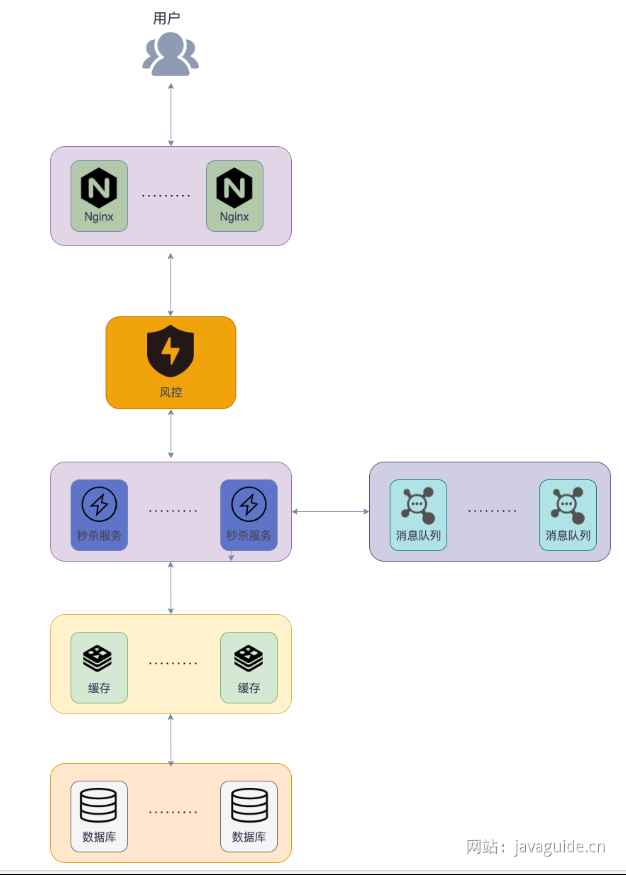
### 高性能
#### 热点数据处理
热点数据指某一段时间内被大量访问的数据。热点数据可能仅占系统所有数据的0.1%，但访问量可能是其他所有数据之和还多。可以分为静态热点数据(可以提前预测到的热点数据比如要秒杀的商品)、动态热点数据(不能够提前预测到的热点数据，需要通过一些手段动态检测系统运行情况产生)。

处理的关键在于如何找到热点数据(热key)，然后将其存在jvm内存中。对于并发量一般的直接将热key放进缓存，对于并发量太高的，放进缓存就有可能将redis集群干掉。

##### 如何检测热点数据
京东零售的hotkey可以毫秒级探测热点数据，毫秒级推送至服务器集群内存。

如何快速定位redis热key
- 客户端收集上报：改动SDK，记录每个请求，定时把收集的数据上报，然后由一个统一的服务进行聚合计算。方案直观简单，但没法适应多语言架构，一方面多语言 SDK 对齐是个问题，另外一方面后期 SDK 的维护升级会面临比较大的困难，成本很高。
- 代理层收集上报：通过代理改动Proxy代码进行收集。该方案对使用方完全透明，能够解决客户端 SDK 的语言异构和版本升级问题，不过开发成本会比客户端高些。
- Redis数据定时扫描：Redis 在 4.0 版本之后添加了 hotkeys 查找特性，可以直接利用 redis-cli --hotkeys 获取当前 keyspace 的热点 key，实现上是通过 scan + object freq 完成的。该方案无需二次开发，能够直接利用现成的工具，但由于需要扫描整个 keyspace，实时性上比较差，另外扫描耗时与 key 的数量正相关，如果 key 的数量比较多，耗时可能会非常长。
- Redis节点抓包解析：在可能存在热 key 的节点上(流量倾斜判断)，通过 tcpdump 抓取一段时间内的流量并上报，然后由一个外部的程序进行解析、聚合和计算。该方案无需侵入现有的 SDK 或者 Proxy 中间件，开发维护成本可控，但也存在缺点的，具体是热 key 节点的网络流量和系统负载已经比较高了，抓包可能会情况进一步恶化。

##### 如何处理热点数据
热点数据一定要放在缓存中，最好可以写入到jvm内存一份，并设置过期时间（放在jvm内存中的数据访问速度最快，不存在网络开销），以实现多级缓存。注意写入到jvm的热点数据不宜过多，避免内存占用过大，并且要设置淘汰策略。

#### 静态资源处理
秒杀页面会涉及很多静态资源例如图片、CCC、JS等，如果这些静态资源全部通过服务器获取，会造成大量带宽消耗，给服务器带来很大压力。
我们可以通过内容分发网络（CDN）处理，将静态资源分发到多个不同的地方以实现就近访问，加快访问速度，减轻服务器和带宽的负担。

### 高可用
#### 集群化
通过搭建集群来避免单点风险，保证组件的高可用，比如Nginx集群、Kafka集群、Redis集群等。

以Redis集群为例，直接通过Redis异步复制实现一主多从提高可用性和吞吐量。通过Sentinel（哨兵）来解决主机器宕机的问题。

Sentinel对Redis运行节点进行监控。当master节点出现故障时，Sentinel会帮助我们实现故障转移，确保Redis系统的可用性。哨兵通常配置成单数。

#### 限流
限流是从用户访问压力的角度考虑如何应对系统故障，接口限流是为了对服务器的接口请求的频率进行限制，防止服务挂掉。可以通过Redis来做（基于Lua脚本），也可以使用流量控制组件。

Hystrix是Netflix开源的熔断降级组件。

Sentinel是阿里一共的面向分布式服务架构的流量控制组件，主要以流量为切入点，提供流量控制、熔断降级、系统自适应保护等功能。
Sentinel更新维护频率更高，功能更强大，并且生态也更丰富（Sentinel提供与Spring Cloud、Dubbo和gRPC等常用框架和库的开箱即用集成等）。

除了直接对接口进行限流之外，还可以对用户、IP进行限流，限制同一用户以及IP单位时间内可以请求接口的次数
- 问题/验证码：可以避免用户请求过于集中，可以有效解决用户使用脚本作弊。注意除了对答案的正确性进行校验，还可以通过对提交时间进行校验来识别脚本。
- 提前预约：提前预约可以过滤一批人，并且还可以对预约的人进行筛选，找出潜在的黄牛。

#### 流量削峰
对于突发的大流量，可以通过消息队列进行削峰。即把消息先存到消息队列中后端再慢慢根据自己的能力去消费消息。
不过如果已经进行了限流，就没必要上消息队列了。

#### 降级
从系统功能优先级去考虑如何应对系统故障。应对系统自身的故障。服务降级指当服务器压力剧增的情况下，根据当前业务情况及流量对一些服务和页面有策略的降级，以此释放服务器资源以保证核心任务的正常运行，即弃车保帅，优先保证核心业务。

#### 熔断
应对当前系统以来的外部系统或者第三方系统的故障。可以防止因秒杀交易影响到其他正常服务的提供。

例如：秒杀功能位于服务A上，服务A上同时还有一些其他的功能比如商品管理。如果服务A上的商品管理接口响应非常慢，其他服务直接不再请求服务A上的商品管理这个接口，从而有效避免其他服务被拖慢甚至拖死。

#### 一致性
##### 减库存方案
下单即减库存、扣款再减库存。

一般情况下都是下单即减库存，进一步优化还可以对超过一定时间不付款的订单特殊处理，释放库存。

因为我们一般会提前将信息放入缓存中，可以通过Lua脚本进行原子操作
```Lua
-- 第一步：先检查 库存是否充足，库存不足，返回 0
local stockNum=tonumber(redis.call("get",key);
if stockNum<1 then
    return 0;
    -- 第二步：如果库存充足，减少库存（假设只能购买一件）,返回 1
else
    redis.call('DECRBY',key,1);
    return 1;
end
```
不过，如果 Lua 脚本运行时出错并中途结束，出错之后的命令是不会被执行的。并且，出错之前执行的命令是无法被撤销的，无法实现类似关系型数据库执行失败可以回滚的那种原子性效果。
因此，严格来说的话，通过 Lua 脚本来批量执行 Redis 命令实际也是不完全满足原子性的。如果想要让 Lua 脚本中的命令全部执行，必须保证语句语法和命令都是对的。

在 Redis 中扣减库存成功后，需要将库存同步到 MySQL 。MySQL 的库存并不需要去实时进行更新，只需要库存达到最终一致性即可，即先对 Redis 的库存进行更新，然后再异步同步到 MySQL 的库存。这里的异步实现方式建议使用 MQ，由 MQ 保证消息被消费，实现最终一致性，毕竟秒杀场景本身就要引入 MQ 进行流量削峰。

乐观锁并不适合防止超卖，因为在大量用户抢购少量库存的情况下，乐观锁的冲突率很高，导致大量请求更新失败，需要频繁重试，影响效率，导致数据库压力很大。

#### 余额扣减方案
在并发量高情况下推荐使用悲观锁，如果并发量不高可以考虑使用乐观锁。

悲观锁可以基于 Redis 或者 ZooKeeper 实现，但一般不会这么做，因为还要考虑他们的异常情况。余额扣减场景，对于正确性要求极高！我们可以直接利用数据库自带的排他锁（X 锁），这种方案用的最多，大部分银行都是这样做的。
在 MySQL 里使用排他锁：%
```SQL
SELECT ... FOR UPDATE
```
乐观锁建议使用版本号机制实现，同时要注意 ABA 问题。

#### 接口幂等
秒杀场景下，建议搭配状态机实现幂等，如果使用分布式锁，key可以根据请求内容生成。

Redisson的RLock实现幂等伪代码
```
// 唯一标识%
String uniqueId = "order123";
// 1. 根据唯一标识生成分布式锁对象
RLock lock = redisson.getLock("lock:" + uniqueId);
try {
    // 2. 尝试获取锁(Watch Dog 自动续期机制)
    if (lock.tryLock()) {
        // 3. 如果成功获取到锁，说明请求还没有被处理，执行业务逻辑
        ...
    } else {
        // 请求已经被处理，直接返回
        ...
        }
    } finally {
        // 4. 释放锁
        lock.unlock();
    }
```

## 如何设计微博Feed流/信息流系统
Feed流就是能够实时/智能推送信息的数据流，向朋友圈动态、知乎推荐、订阅的Up主动态等

常见的Feed流形式
- 纯智能推荐：看到的内容完全基于你看过的内容推荐，典型的例如头条首页推荐、知乎首页推荐等。智能推荐需要依赖推荐系统，推荐系统可以分为三类：协同过滤（仅使用用户与商品的交互信息生成推荐）系统、基于内容（利用用户偏好和／或商品偏好）的系统和 混合推荐模型（使用交互信息、用户和商品的元数据）的系统。
随着深度学习的发展，基于深度学习的推荐系统更引发了大家关注，可以对用户偏好和物品属性的动态性进行建模，基于当前的趋势，预测未来的行为。
- 纯Timeline：看到的内容完全按照时间来排序，例如朋友圈、QQ空间、微博关注着动态。适用于好友社交领域，用户关注更多的是人发出的内容，而不仅仅是内容。
- 智能推荐+Timeline：实现相对简单，又能一定程度避免“信息茧房”。

### 这几Feed流系统的注意事项
- 实时性：你关注的人发了微博，信息需要在短时间内出现在你的信息流中
- 高并发：信息流是微博的主体模块，是用户进入微博之后最先看到的模块，因此并发请求量最高，可以达到每秒几十万请求。
- 性能：信息流拉取性能直接影响用户的使用体验。微博信息流系统中需要聚合的数据非常多。聚合这么多的数据就需要查询多次缓存、数据库、计数器，而在每秒几十万次的请求下，如何保证在 100ms 之内完成这些查询操作，展示微博的信息流呢？这是微博信息流系统最复杂之处，也是技术上最大的挑战。

以微博关注着动态为例设计Feed流架构

### Feed流的三种推送模式
#### 推模式
当一个用户发送一个动态之后，主动将动态推送给其他相关的用户（粉丝）。推模式下，我们需要将动态插入到每位粉丝对应的feed表中，这个存储成本很高，尤其是对粉丝数比较多的用户来说。并且写入数据库的操作太多。

#### 拉模式
用户自己主动去拉取动态，然后将动态根据相关指标进行实时聚合。虽然存储成本低，但查询和聚合的操作成本比较高，尤其是对单个用户关注了特别多的人.
并且实时性也比推模式更差。

#### 推拉结合模式
核心针对微博大V和不活跃用户特殊处理。首先区分出系统哪些用户属于微博大V，其次需要根据登陆行为判断哪些用户属于不活跃用户。当大V发送微博时，仅将这条微博写入到活跃用户，不活跃的自己去拉取。
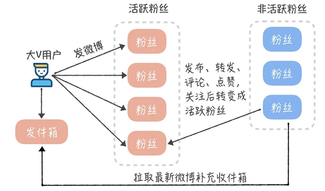

### 存储
因为数据量很大，因此存储库必须满足可以水平扩展。一版方案就是MySQL+Redis。MySQL永久保存数据，Redis作为缓存提高热点数据的访问数据。
Redis集群可以解决Redis大数据量缓存的问题，也方便进行横向拓展。

为了提高系统的并发，可以考虑对数据进行书写分离和分库分表。

读写分离主要是为了将数据库的读和写操作分不到不同的数据库节点上。主服务器负责写，从服务器负责读。另外，一主一从或者一主多从都可以。读写分离可以大幅提高读性能，小幅提高写的性能。因此，读写分离更适合单机并发读请求比较多的场景。

分库分表是为了解决由于库、表数据量过大，而导致数据库性能持续下降的问题。常见的分库分表工具有：sharding-jdbc（当当）、TSharding（蘑菇街）、MyCAT（基于 Cobar）、Cobar（阿里巴巴）...。 推荐使用 sharding-jdbc。 因为，sharding-jdbc 是一款轻量级 Java 框架，以 jar 包形式提供服务，不要我们做额外的运维工作，并且兼容性也很好。

另外，如果觉得分库分表比较麻烦的话，可以考虑使用 TiDB 这类分布式数据库。TiDB 是国内 PingCAP 团队开发的一个分布式 SQL 数据库。其灵感来自于 Google 的 F1, TiDB 支持包括传统 RDBMS 和 NoSQL 的特性，具备水平扩容或者缩容、金融级高可用。

## 如何设计一个短链系统
短链原理：通过短链找到长链，然后重定向到长链地址即可。
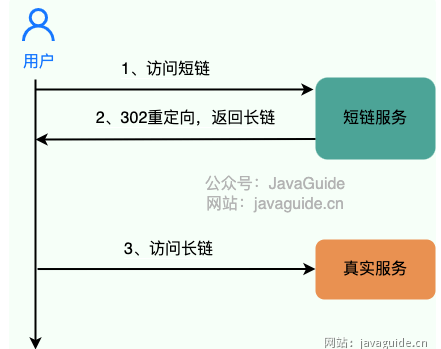
绝大部分短链系统都使用“302”作为状态码，因为“301”状态码代表永久重定向，只要浏览器拿到长链之后就会对其缓存，下次再请求短链就直接从缓存中拿对应的长链地址，这样就没办法对短链进行相关分析了。而“302”状态码代表资源被临时重定向了，不会存在上述问题。

### 唯一短链生成
原始链接必定是唯一的，所以我们也要确保生成的短链唯一。我们如何通过唯一的字符串来表示长链。
常见的方法就是：通过哈希算法对长链去哈希。一般建议使用用非加密型哈希算法比如 MurmurHash 。因为，相比于 MD5，SHA 等加密型哈希算法，非加密型哈希算法往往效率更高！

既然使用了哈希算法，不可避免会出现哈希冲突，
#### 如何判断是否发生了哈希冲突
看我们生成的短链是否唯一。如果我们使用的是 MySQL，PostgreSQL 这类关系型数据库的话，我们可以给存放短链的字段 sort_url 添加唯一索引。不过，为了提高性能以及应对高并发，还是建议利用布隆过滤器解决这个问题。
#### 如何解决哈希冲突
解决办法其实也很简单。如果发生哈希冲突，我们就在长链后拼接一个随机字符串。如果拼接了随机字符串还是发生哈希冲突那就再拼接一个随机字符串。并且，我们要将拼接之后得到的字符串和拼接的字符串都存储起来，通过这两者可以获取长链（原始链接）。这种解决方法会导致数据库额外要多一个字段存储随机字符串。除了这种方法之外，我们还可以利用唯一标识符来解决哈希冲突，比如在哈希生成的短链后再拼接一个分布式 ID。

一个长链可以在不同条件（生成短链的用户不同）下对应上不同的短链。这样可以更好的进行相关分析

#### 如何做长链合法性校验
在生成短链接之前，我们首先需要对用户提供的原始长链接进行验证，以确保链接指向的是合法且可信任的目标资源。
为了进行合法性校验，我们通常会考虑以下两个方面： 
- 主域名合法性： 我们会解析原始长链接，提取其中的域名信息。然后，我们会将这个域名与预先定义的合法域名列表进行比对，以确认链接是否指向了我们期望的域名。这样做可以有效地防止恶意链接或指向不安全网站的情况。
- 查询参数域名合法性： 链接中的查询参数域名也可能影响到用户安全。我们也需要验证这些域名是否合法，以免引发潜在的安全风险。

### 短链存储
如果我们使用 MySQL，PostgreSQL 这类关系型数据库存储的话，表结构大概是下面这样（利用唯一标识符来解决哈希冲突的情况）：
```
CREATE TABLE `url_map` ( 
    `id` int(11) unsigned NOT NULL AUTO_INCREMENT, 
    `long_url` varchar(160) DEFAULT NULL COMMENT '长链', 
    `sort_url` varchar(10) DEFAULT NULL COMMENT '短链', 
    PRIMARY KEY (`id`) 
) ENGINE=InnoDB DEFAULT CHARSET=utf8;
```
当我们存放一个长链的时候，我们首先判断一下这个长链是否已经被转换过短链。 如果需要对长链就行区分的话（比如不同的用户使用同一个长链生成的短链不同），我们在判断的时候加上对应的条件即可（比如这个长链对应的用户）。 这里不能直接根据长链哈希之后得到的短链来判断长链是否已经被转换过短链，因为不同的长链生成的短链可能是一样的（哈希冲突，不过，概率很低）。

### 性能优化
#### 数据库优化
对于上面提到的短链表结构，实际上只需要两列即可。将长链的唯一表示ID作为主键索引，对应生成的短链建立唯一索引或者普通索引。
#### 缓存
缓存是性能优化的万金油，性价比很高。建议将最近比较活跃的短链映射关系存放在缓存中，可以选择分布式数据库 Redis 或者本地缓存。为了避免缓存的数据量过大，我们可以为这些放在缓存中的短链映射关系设置一个过期时间，如果某个短链被访问到就续期过期时间。%0D%0A%0D%0A如果需要对长链进行区分的话，只需要缓存短链到长链的映射关系即可。如果不需要对长链就行区分的话，建议同时缓存长链映射到短链的映射关系。

## 如何设计一个站内消息
以B站为例，B站把消息大致分为了三类
- 系统推送的通知
- 回复、@、点赞等用户行为产生的提醒
- 用户之间的私信。
这样设计不仅分类明确，且处于同一个主体的事件提醒还会做一个聚合，极大提高用户体验。
### 系统通知
系统通知一般由后台管理员发出，指定某一类用户接受，因此可以大致分为两张表
 t_manager_system_notice（管理员系统通知表）：记录管理员发出的通知；
 t_user_system_notice（用户系统通知表）：存储用户接受的通知。
t_manager_system_notice（管理员系统通知表） 表结构如下：

  | 奖品ID            | 奖品名称      | 是否解锁                                                            | 
  |-----------------|-----------|-----------------------------------------------------------------|
  | system_notice_id | LONG      | 系统通知                                                            |
  | title           | VARCHAR   | 标题                                                              |
  | content         | TEXT      | 内容                                                              |
  | type            | VARCHAR   | 发给哪些用户：单用户 single；全体用户 all，vip 用户，具体类型各位小伙伴可以根据自己的需求选择          |
  | state           | BOOLEAN   | 是否已被拉取过，如果已经拉取过，就无需再次拉取                                         |
  | recipient_id    | LONG      | 接受通知的用户的 ID，如果 type 为单用户，那么 recipient 为该用户的 ID;否则 recipient 为 0 |
  | manager_id      | LONG      | 发布的通知的管理员ID                                                     |
  | publish_time    | TIMESTAMP | 发布时间                                                            |

t_user_system_notice（用户系统通知表）结构如下：

| 奖品ID             | 奖品名称      | 是否解锁      | 
|------------------|-----------|-----------|
| system_notice_id | LONG      | 系统通知ID    |
| user_notice_id   | LONG      | 主键ID      |
| pull_time        | TIMESTAMP | 拉取通知的时间   |
| recipient_id            | LONG      | 接受通知的用户ID |
| state            | BOOLEAN   | 是否已读      |

当管理员发布一条通知后，奖通知插入到 t_manager_system_notice 表中，然后系统定时的从 t_manager_system_notice 表中拉取通知，根据通知的type将通知插入到 t_user_system_notice 表中。
如果通知的 type 是 single 的，那就只需要插入一条记录到 t_user_system_notice 中。如果是全体用户，那么就需要将一个通知批量根据不同的用户 ID 插入到 t_user_system_notice 中，这个数据量就需要根据平台的用户量来计算。

- 因为一次拉取的数据量可能很大，所以两次拉取的时间间隔可以设置的长一些。
- 拉取 t_manager_system_notice 表中的通知时，需要判断 state，如果已经拉取过，就不需要重复拉取，否则会造成重复消费。
- 某条通知已经被拉取过的话，在其后注册的用户不能再接收到这条通知。但如果你想将已拉取过的通知推送给那些后注册的用户，只需要再写一个定时任务，这个定时任务可以将通知的 push_time 与用户的注册时间比较一下，重新推送即可。

当用户量特别大时，如果发送一个全体用户的通知需要挨个插入数据到一张表，是不靠谱的.
- 每位单独用户有一张或几张专门用来存放站内消息的表，根据 hash(user_id) 作为表名后缀。
- 对于系统通知类型，只存放一条数据到 t_user_system_notice 表，用户自己拉取数据然后再判断消息是否已经读取过即可。

并且，当一条通知需要发布给全体用户时，我们还应该考虑到用户的活跃度。因为如果有些用户长期不活跃，我们还将通知推送给他（她），这显然会造成空间的浪费。 所以在选取用户 ID 时，我们可以将用户上次登录的时间与推送时间做一个比较，如果用户一年未登陆或几个月未登录，我们就不选取其 ID，进而避免无谓的推送。

### 事件提醒
事件提醒均是通过用户的行为产生的。除了事件之外，还需要了解用户是在那个地方产生的事件，以便当收到提醒时，点击消息就可去到事件现场。
因此可以设计出事件提醒表 t_event_remind，

| 字段名         | 类型    | 描述                                       |
| :------------: | :-----: | :----------------------------------------: |
| event_remind_id| LONG    | 消息 ID                                    |
| action         | VARCHAR | 动作类型，如点赞、@()、回复等               |
| source_id      | LONG    | 事件源 ID，如评论 ID、文章 ID 等            |
| source_type    | VARCHAR | 事件源类型："Comment"、"Post"等             |
| source_content | VARCHAR | 事件源的内容，比如回复的内容，回复的评论等等 |
| url            | VARCHAR | 事件所发生的地点链接 url                     |
| state          | BOOLEAN | 是否已读                                    |
| sender_id      | LONG    | 操作者的 ID，即谁关注了你，at 了你           |
| recipient_id   | LONG    | 接受通知的用户的 ID                         |
| remind_time    | TIMESTAMP | 提醒的时间                               |

#### 消息聚合
消息聚合只适用于事件提醒，有两个特征：action和source type。
#### 如何聚合
某一类的聚合消息之间是按照source type和source id 来分组的，因此可以得出以下伪SQL
```
SELECT * FROM t_event_remind WHERE recipient_id = 用户ID 
AND action = 点赞 AND state = FALSE GROUP BY source_id , source_type;
```
当然，SQL 层面的结果集处理还是很麻烦的，所以我的想法先把用户所有的点赞消息先查出来，然后在程序里面进行分组，这样会简单不少。

还有一种设计提醒表的做法，即按业务分类，不同的提醒存入不同的表。这种设计比上面的方法更松耦合，不必所有类型的提醒都挤在一张表里，但是这也会带来表数量的膨胀。

### 私信
站内私信一般都是点到点的，且要求是实时的，服务端可以采用Netty等高性能网络通信框架完成请求。
B站的私信可以分为两部分
- 左边的与不同用户的聊天室
- 与当前正在对话的用户的对话框

聊天室表 t_private_chat，因为是一对一，索引聊天室表会包含对话的两个用户的信息

| 字段名         | 类型    | 描述             |
| -------------- | ------- | ---------------- |
| private_chat_id| LONG    | 聊天室 ID        |
| user1_id       | LONG    | 用户 1 的 ID     |
| user2_id       | LONG    | 用户 2 的 ID     |
| last_message   | VARCHAR | 最后一条消息的内容|

这里 user1_id 和 user2_id 代表两个用户的 ID，并无特定的先后顺序。

私信表 t_private_message，私信自然和所属的聊天室有联系，且考虑到私信可以在记录中删除（删除了只是不显示记录，但是对方会有记录，撤回才是真正的删除），就还需要记录私信的状态：

| 字段名             | 类型    | 描述                                   |
| ------------------ | ------- | -------------------------------------- |
| private_message_id | LONG    | 私信 ID                                |
| content            | TEXT    | 私信内容                               |
| state              | BOOLEAN | 是否已读                               |
| sender_remove      | BOOLEAN | 发送消息的人是否把这条消息从聊天记录中删除了 |
| recipient_remove   | BOOLEAN | 接受人是否把这条消息从聊天记录删除了     |
| sender_id          | LONG    | 发送者 ID                              |
| recipient_id       | LONG    | 接受者 ID                              |
| send_time          | TIMESTAMP | 发送时间                             |

### 消息设置
消息设置一般都是针对提醒类型的消息，肯定是由自己设置的。

| 字段名          | 类型    | 描述                 |
| :-------------: | :-----: | :------------------: |
| user_id         | LONG    | 用户 ID              |
| like_message    | BOOLEAN | 是否接收点赞消息     |
| reply_message   | BOOLEAN | 是否接收回复消息     |
| at_message      | BOOLEAN | 是否接收 at 消息     |
| stranger_message| BOOLEAN | 是否接收陌生人的私信 |

## 如何实现一个RPC框架
RPC框架即服务提供端 Server 向注册中心注册服务，服务消费者 Client 通过注册中心拿到服务相关信息，然后再通过网络请求服务提供端 Server。不仅要提供服务发现功能，还要提供负载均衡、容错等功能。
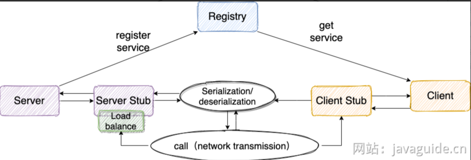

### 注册中心
比较推荐石头Zookeeper作为注册中心，其提供了高可用、高性能、稳定的分布式数据一致性解决方案，常被用于实现诸如数据发布/订阅、负载均衡、命名服务、分布式协调/通知、集群管理、Master 选举、分布式锁和分布式队列等功能。并且，ZooKeeper 将数据保存在内存中，性能是非常棒的。 在“读”多于“写”的应用程序中尤其地高性能，因为“写”会导致所有的服务器间同步状态。

注册中心负责服务地址的注册与查找，相当于目录服务。服务端启动时将服务名称和对应的地址注册到注册中心，服务消费端根据服务名称找到对应地址，服务消费端就可以通过网络请求服务端了
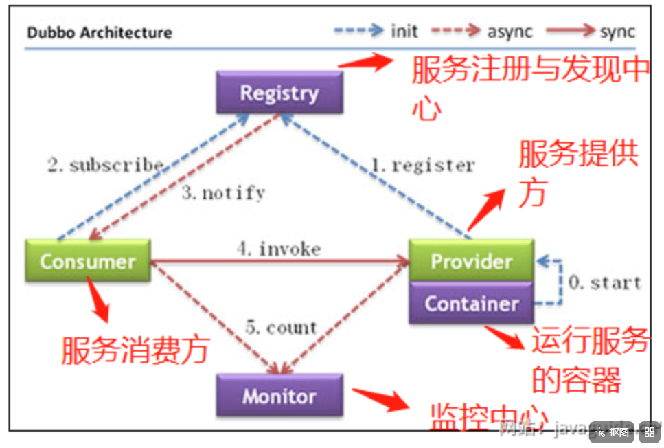
调用关系说明：

1.服务容器负责启动，加载，运行服务提供者

2.服务提供者在启动时，向注册中心注册自己提供的服务

3.服务消费者在启动时，向注册中心订阅自己所需的服务

4.注册中心返回服务提供者地址列表给消费者，如果有变更，注册中心将基于长连接推送变更数据给消费者。

5.服务消费者，从提供者地址列表中，基于软负载均衡算法，选一台提供者进行调用，如果调用失败，再选另一台调用。

6.服务消费者和提供者，在内存中累计调用次数和调用时间，定时每分钟发送一次统计数据到监控中心。

### 网络传输
既然要调用远程，就要发送王略请求来传递目标类和方法的信息以及方法的参数等数据给服务提供端。

具体实现可以使用Socket（阻塞IO、性能低并且功能单一）。

也可以使用基于NIO的Netty

### 序列化和反序列化
网络传输的数据必须是二进制的，因此为了能够让Java对象在网络中传输，需要将其序列化为二进制数据，接收端还需要对二进制数据进行反序列化得到Java对象。
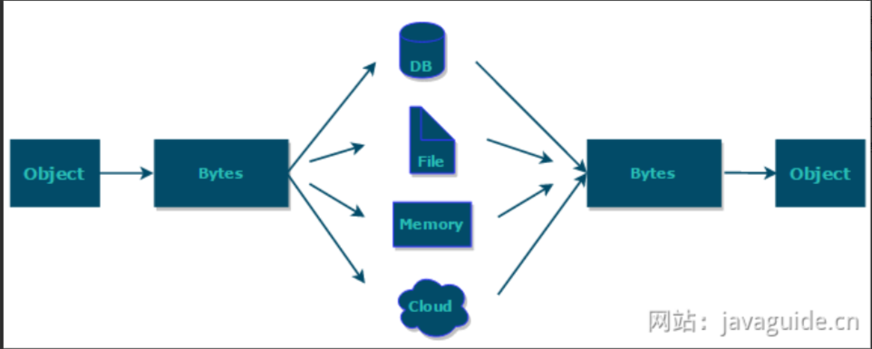
常见的序列化方式有hessian、kyro、protostuff

### 动态代理
RPC 的主要目的就是让我们调用远程方法像调用本地方法一样简单，我们不需要关心远程方法调用的细节比如网络传输。

因此通过动态代理来屏蔽方法调用的底层细节。实现方式有JDK 动态代理、CGLIB 动态代理等

### 负载均衡
我们的系统中的某个服务的访问量特别大，我们将这个服务部署在了多台服务器上，当客户端发起请求的时候，多台服务器都可以处理这个请求。那么，如何正确选择处理该请求的服务器就很关键。负载均衡就是为了避免单个服务器响应同一请求，容易造成服务器宕机、崩溃等问题，我们从负载均衡的这四个字就能明显感受到它的意义。实现方式Nginx

### 传输协议
需要设计一个私有的 RPC 协议，作为客户端（服务消费方）和服务端（服务提供方）交流的基础。

通过设计协议，我们定义需要传输哪些类型的数据， 并且还会规定每一种类型的数据应该占多少字节。这样我们在接收到二进制数据之后，就可以正确的解析出我们需要的数据。

标准的RPC协议通常包括：
- 魔数：通常是4字节，为了筛选来到服务器的数据包
- 序列化器编号：标识序列化的方式
- 消息体长度;运行时计算出来。

## 如何设计一个动态线程池
动态线程池是一种能够在应用程序运行过程中，无需重启服务即可实时调整其核心配置参数（如核心线程数、最大线程数等）的线程池机制。通常情况下，动态线程池不仅支持参数的动态变更，还内置了监控和告警功能，例如在发生线程池任务堆积时通知相应的开发人员。

动态线程池相比传统线程池的优点：
- 实时调整参数：根据业务负载的变化实时调整线程池参数，提高资源利用率和系统吞吐量
- 内置监控和告警功能：支持实时检测线程池的运行状态以及阻塞队列容量、线程池活跃度、拒绝策略执行等指标的告警
- 线程池运行堆栈：支持实时和历史线程栈获取，大大增强问题定位和性能调优的能力

### 如何动态修改线程池参数
美团技术团队的思路主要是对线程池的核心参数实现自定义配置
- `corePoolSize`：核心线程数定义了最少可以同时运行的线程数量
- `maximumPoolSize`：当队列中存放的任务达到队列容量时，当前可以同时运行的线程数变为最大线程数
- `workQueue`：任务队列，如果当前运行的线程数达到核心线程数，新任务就存放在队列中

通过`ThreadPoolExecutor`提供的下面这些方法实现动态线程配置
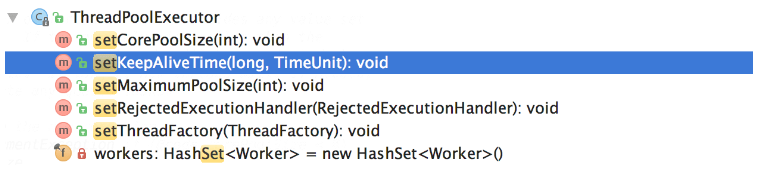
由于并没有动态指定队列长度的方法。美团自定义了一个叫做 ResizableCapacityLinkedBlockIngQueue 的队列（主要就是把LinkedBlockingQueue的 capacity 字段的 final 关键字修饰给去掉了，让它变为可变的）。

可以借助配置中心，如Nacos、Apollo、Zookeeper。配置线程池参数，也可以不借助中间件，通过监听线程池文件是否被修改即可，可以利用Apache Commons IO 的 FileAlterationListenerAdaptor （基于观察者模式）实现文件修改监听。

### 如何获得线程池的指标数据
要获取线程池的指标数据，可以使用以下方法
- getCorePoolSize()：获取核心线程数。
- getMaximumPoolSize()：获取最大线程数。
- getPoolSize()：获取线程池中的工作线程数（包括核心线程和非核心线程）。
- getQueue()：获取线程池中的阻塞队列，可以从队列中获取任务的数量来了解队列积压情况。
- getActiveCount()：获取活跃线程数，也就是正在执行任务的线程。
- getLargestPoolSize()：获取线程池曾经到过的最大工作线程数。
- getTaskCount()：获取历史已完成以及正在执行的总的任务数量。

除了这些线程池指标相关的方法之外，还可以使用ThreadPoolExecutor的钩子方法进行扩展：
- beforeExecute(Thread t, Runnable r)：在执行每个任务之前调用，可以在此处记录任务开始执行时间。
- afterExecute(Runnable r, Throwable t)：在每个任务执行后调用，不论任务是否成功完成，可以用来记录任务执行结束时间。
- terminated()：当线程池进入 TERMINATED 状态时调用，可以在此时进行资源清理、统计汇总等操作。

### 如何监控线程池
通过上面获得指标数据，可以自己写一个线程池监控功能。通过定义自定义一个 Endpoint 类，手动暴露线程池相关指标信息，这样可以更加灵活和可控。
```
@ReadOperation
public Map<String, Object> threadPoolsMetric() {
    Map<String, Object> metricMap = new HashMap<>();
    Map<String, Map<String, Object>> threadPools = new HashMap<>();

    threadPoolManager.getThreadPoolExecutorMap().forEach((name, executor) -> {
        MonitorThreadPool tpe = (MonitorThreadPool) executor;
        Map<String, Object> poolInfo = new HashMap<>();
        poolInfo.put("coreSize", tpe.getCorePoolSize());
        poolInfo.put("maxSize", tpe.getMaximumPoolSize());
        poolInfo.put("activeCount", tpe.getActiveCount());
        poolInfo.put("taskCount", tpe.getTaskCount());

        threadPools.put(name, poolInfo);
    });

    metricMap.put("threadPools", threadPools);
    return metricMap;
}
```
然后可以在 /actuator/threadpool 端点获取线程池的相关信息。

利用 Prometheus + Grafana实现可视化监控和告警。Prometheus 是一个开源的监控和告警系统，它可以从应用的 Endpoint 拉取指标数据，通过 Grafana 可以可视化展示这些指标数据。Grafana 还提供了告警功能，支持发送邮件、短信等通知。

### 如何实现第三方授权登陆
第三方授权登录就是通过已有的第三方平台账号登陆对应的网站或应用，不需要从头开始注册账号。
一般都通过OAuth来实现，这是一个行业标准授权协议，主要解决第三方应用获取有限的权限以访问受保护的资源。即实际解决的是授权问题而不是认证问题。

OAuth的最终目的是为第三方应用颁发一个有时效性的令牌 Token，使得第三方应用能够通过该令牌获取用户在其他服务提供者（比如微信、QQ ）上相关的资源（比如用户的信息）。
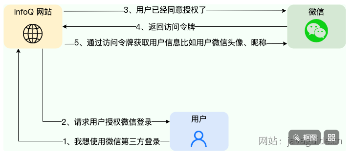

OAuth不仅可以做第三方登录，还就可以做开放接口的调用。

下图为Slack OAuth 2.0 第三方授权登录示意图
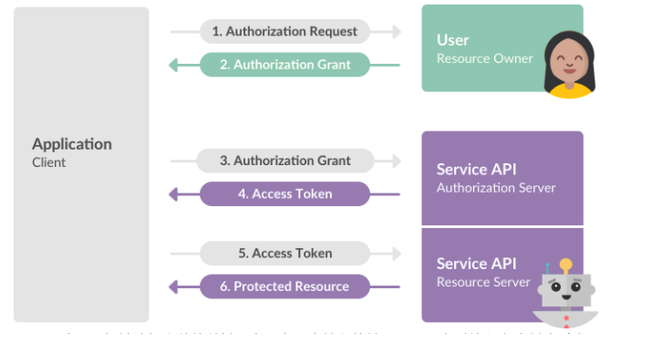
Client：客户端，需要被授权访问 Resource Owner 的资源的客户端/第三方应用；Resource Owner：资源拥有者，具有权利授予对其资源进行访问的用户；Authorization Server：认证服务器；Resource Server：资源服务器
基本流程如下
- 客户端向资源拥有者（用户）发送授权申请
- 资源拥有者同意给予客户端授权
- 客户端使用获得的授权向认证服务器申请Access Token（访问令牌）
- 认证服务器对客户端认证后，确认无误，同于发放Access Token
- 客户端使用Access Token向资源服务器申请获取资源
- 资源服务器确认Access Token 无误，同意向客户端开放资源。

### OAuth2.0 授权模式
OAuth2.0的核心是认证服务器向第三方颁发令牌，根据不同的应用场景，定义了四种获取令牌的方式
- 授权码模式：最常用，最安全的模式。客户端先申请一个Authorization Code（授权码），然后用该码获取Access Token。
- 隐藏/简化模式：直接将Access Token传递给客户端
- 密码模式：在用户信任客户端情况下使用的模式。客户端直接从用户获得用户名和密码，并作为客户端凭证发送到认证服务器来换取访问令牌，要考虑密码泄露的情况。
- 客户端凭证模式：客户端直接使用客户端凭证向认证服务器请求令牌，不基于用户。

### 授权码模式的授权验证流程
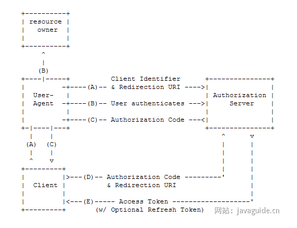

**1.客户端请求授权**

用户访问客户端（第三方应用），客户端引导（重定向）用户的代理（浏览器）去到认证服务器的授权页面，这是客户端会在URI附上客户端ID（用于唯一标识），Rediection URI（重定向URI）和相应类型、Scope（授权作用范围）等信息。

**2.认证服务器要求用户授权**

认证服务器验证客户端身份和访问权限，并要求用户提供认证信息进行身份验证，确定用户是否授权请求。

**3.用户同意授权，认证服务器返回授权码**

用户同意授权后，认证服务器将 Authorization Code（授权码）传递给客户端，客户端收到 Authorization Code 后可以使用它来请求 Access Token。

**4.客户端使用授权码申请访问令牌**

客户端使用 Authorization Code 向认证服务器申请 Access Token，这个时候客户端会在 URI 上附上 Client ID、Client Secret Key （客户端秘钥）Authorization Code 和 Rediection URI 等信息。

**5.认证服务器颁发Access Token**

认证服务器认证客户端，检验 Authorization Code 以及 Rediection URI，检验成功后发放 Access Token 以及 Refresh Token（刷新令牌，可选）。

**6.客户端使用访问令牌向资源服务器请求被保护的资源**

#### 什么情况乱下Access Token 应该失效
除了过期之外，还有1.用户修改账户密码；2.用户冻结或注销账号；3.用户取消对改第三方应用授权。

#### Authorization Code有效期一般多久
Authorization Code 有效期应该设置得尽可能短，以提高安全性。一般来说，推荐将 Authorization Code 的有效期设置为 5~20 分钟。并且，Authorization Code 通常只能使用一次，不可重复使用

#### 除了Access Token之外，为什么还有一个Refresh Token
这是因为 Access Token 只是向资源服务器申请获取资源的凭证，其有效期一般较短，通常在 2~3 个小时。当 Access Token 超时后，可以使用 Refresh Token 进行刷新，比如为 Refresh Token 的有效期较长一点比如 6 小时。

Refresh Token 刷新结果有两种：
- 若 Access Token 已超时，那么进行 Refresh Token 会获取一个新的 Access Token，新的超时时间；
- 若 Access Token 未超时，那么进行 Refresh Token 不会改变 Access Token，但超时时间会刷新，相当于续期 Access Token。

第三方微信授权登录流程
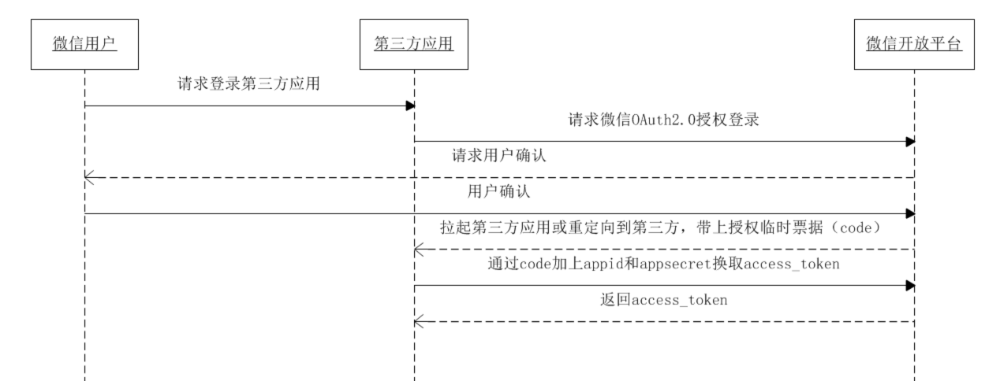

## 验证码登陆场景
验证码是一种常见的安全机制，通常用于验证用户输入、确认用户身份或操作请求的合法性。通过验证码，可以有效防止而已攻击、批量操作以及非授权操作。

**验证码登录流程**
- 用户点击“发送验证码”按钮，前端向后端发送请求，包含手机号信息。 
- 后端生成一个随机验证码（通常为 6 位数字）和唯一标识（UUID），并将验证码和 UUID 存储到 Redis 中，以手机号为唯一 Key，覆盖之前的验证码数据。 
- 短信服务商将验证码发送到用户的手机号，同时后端通过 Redis 限制发送频率（如每分钟最多发送一次，每天最多发送 5 次）。 
- 后端将 UUID 返回给前端，前端将 UUID 存储在本地（如 localStorage 或 sessionStorage，sessionStorage存储安全性更高）。 
- 用户收到短信后，输入验证码，前端将手机号、验证码和 UUID 一起提交给后端。 
- 后端使用手机号从 Redis 获取验证码记录，并校验提交的 UUID 和验证码是否匹配： 
  - 如果匹配，则验证成功，并立即删除 Redis 中的验证码记录，执行登录流程（如生成 Token）。 
  - 如果不匹配，记录错误次数，超过最大错误次数后锁定手机号的验证功能一段时间。 
- 验证成功后，返回登录成功的 Token 或其他相关信息。

**UUID的作用**：防止验证码泄露被滥用，使用UUID作为额外的校验参数，可以增加破解难度。

**注意**：
1. 更细化的 key设计是这样的：verification:{类型}:{场景}:{目标}。{类型}：如 sms（短信）、email（邮箱），{场景}：如 login（登录）、register（注册）。{目标}：手机号或邮箱。示例：短信登录验证码：verification:sms:login:13812345678，邮箱注册验证码：verification:email:register:user@example.com。 
2. 除了手机号限制外，还建议对单个 IP 的请求频率进行限制，防止攻击者使用不同的手机号进行短信轰炸。 
3. 我们在后端对验证码发送频率做了限制，不会出现因为网络波动等原因导致用户同时收到多个验证码。

**前端注意事项**：
1. 按钮置灰：防止用户重复点击，减少无效请求。
2. 验证码前置：填写验证码之后才可以发送短信。
3. 手机号合法性校验：提前校验手机号格式，避免无效请求浪费后端资源。
4. HTTPS 加密传输：通过 HTTPS 加密传输，避免验证码和 UUID 泄露。

## 多个用户抢一个商品，如何保证只有一个用户可以抢到
在多线程环境中，如果多个线程同时访问共享资源（例如商品库存、外卖订单），会发生数据竞争，可能会导致出现脏数据或者系统问题，威胁到程序的正常运行。
如果不对共享资源进行互斥，就会出现下面的情况
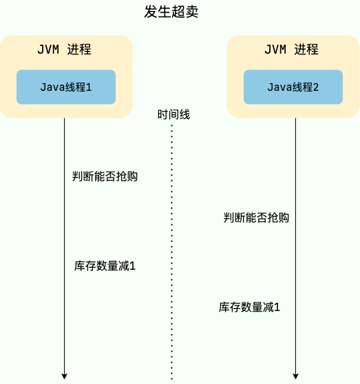
为了保证共享资源被安全地访问，我们需要使用互斥操作对共享资源进行保护，即同一时刻只允许一个线程访问共享资源，其他线程需要等待当前线程释放后才能访问。这样可以避免数据竞争和脏数据问题，保证程序的正确性和稳定性。

通过悲观锁实现互斥

| 实现方案     | 举例                                                         | 优点                                                 | 缺点                                                         |
| ------------ | ------------------------------------------------------------ | ---------------------------------------------------- | ------------------------------------------------------------ |
| JVM 本地锁   | `synchronized`、`ReentrantLock`                              | 实现简单                                             | 性能较差，会阻塞所有的抢单请求                               |
| MySQL 的行锁 | 可以通过使用 `SELECT ... FOR UPDATE` 和 `SELECT ... LOCK IN SHARE MODE` 语句来显式地使用行锁 | 可以保证事务的隔离性，能够避免并发情况下的数据冲突问题。 | 性能较差，存在死锁问题，可能会影响数据库的正常使用           |
| 分布式锁     | 通常基于 Redis 或者 ZooKeeper 实现分布式锁                   | 分布式场景使用，比较灵活，性能较高                   | 需要保证第三方中间件的可靠性                                 |

不建议使用JVM本地锁，因为锁粒度太大，可以通过基于订单对应的唯一key来加锁，
```
String key = "订单对应的唯一 key"；
// intern() 方法会返回字符串对象在常量池中对应的唯一实例
synchronized (key.intern()) {
...
}
```

利用分布式锁，通过商品订单对应的唯一key来加锁和释放锁，具体流程如下
- 当用户抢单时需要先获取该订单对应的锁
- 如果获取锁失败，说明其他用户已经抢单，直接提示失败。

还可以通过唯一索引保证一个商品只和一个用户建立联系。

## 订单超时自动取消
即延时任务的解决方案。单机延时任务方案有 Timer、ScheduledExecutorService、DelayQueue、Spring Task 和时间轮，其中最常用也是比较推荐使用的是时间轮。

### MQ延时任务
RabbitMQ 延迟队列的两种实现方式：
- RabbitMQ 3.6.x 之前一般采用 DLX（Dead Letter Exchange，死信队列）+TLL（Time To Live，过期时间）。具体的原理是：将消息发送到一个设置了 TTL 的队列中，当消息过期后，会被转发到另一个设置了 DLX 的队列中，消费者监听这个 DLX 队列来获取延迟消息。
- RabbitMQ 3.6.x 开始，RabbitMQ 官方提供了延迟队列的插件 rabbitmq_delayed_message_exchange 。这种方式用的更多一些，比较简单方便，解决了 DLX+TLL 存在的一些问题（后面会提到）。通过这个插件，我们可以声明 x-delayed-message 类型的 Exchange（一种新的交换器类型），消息发送时指定消息头 x-delay 以毫秒为单位将消息进行延迟投递。这个插件支持的最大延迟时间是(2^32)-1 毫秒，大约 49 天。

DLX+TLL存在的问题
- 存在消息阻塞问题：如果设置队列同意过期时间放到死信队列，那么就不会有阻塞问题，但因为所有队列都在同一时间过期，再被投递到死信队列，就不能实现不同的延迟时间。如果设置TLL不同，因为过期时间检测是从消息队列同步开始，队列又遵循先进先出。如果一个过期时间长的消息在头部，就会阻塞其他过期时间较短的消息。
- 要为不同的延迟时间创建多个队列：虽然队列统一过期时间可以解决头阻塞问题，但不能实现不同的延迟时间，如果想要实现不同延迟时间，就需要为每个过期时间创建一个对应的消息队列，如果延迟时间是动态配置的，那么也要动态创建和删除队列。会大大增加系统复杂度、资源消耗和维护难度
- 不适合延迟时间较长的人物：会占用原队列和死信队列的空间。如果消息过期时间太长，就会在队列中存储很久，占用内存和磁盘空间。

RabbitMQ延迟队列插件的方式。消息不会立即进入队列，而是会把它们保存在Mnesia数据库中，然后通过定时器去查询需要被传递的消息，再把他们投递到x-deplayed-message队列中。不仅不存在消息阻塞问题，还可以实现灵活的延迟时间。避免过期时间太长的消息在队列中堆积。

RocketMQ 4.x 版本及其之前的版本支持基于预定义的延时等级的延时消息处理。消息发送者可以指定一个延时等级（如 1s、5s、10s 等），然后消息会在相应的延时级别到达后被发送到消费者队列。这些延时等级是固定的，不能灵活配置。

RocketMQ 5.0 基于时间轮算法引入了定时消息，解决了延时级别只有 18 个、延时时间不准确等问题。

下图是展示了一个基于 RocketMQ 的延时消息处理流程，结合了任务列表来管理和跟踪业务流程
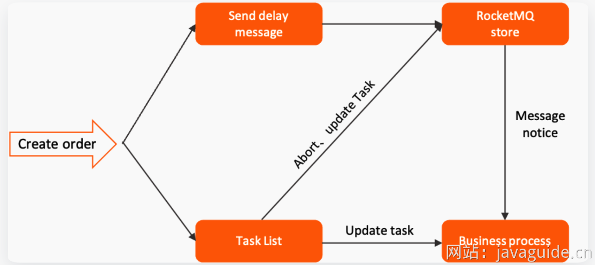
1. 任务创建：任务创建后，会被添加到任务列表（Task List）中。任务列表通常是一个数据库表或其他持久化存储，用于记录和管理所有的任务，方便后续追踪任务的执行状态。
2. 发送延时消息：在任务创建的同时，系统会向 RocketMQ 发送一条延时消息（Send delay message）。这条消息会在指定的时间后被触发，通常用于处理任务的超时逻辑或其他定时操作。
3. RocketMQ 存储：延时消息会存储在 RocketMQ 的队列中，等待指定的延时结束后再被投递给消费者。
4. 业务处理：在延时消息到达指定时间后，RocketMQ 会将消息投递给相应的消费者。消费者接收到消息后，会根据消息的内容触发相应的业务处理（Business process）逻辑。业务处理的结果可能会更新任务列表中的任务状态，或者直接进行其他的业务操作，比如取消订单、发送通知等。
5. 任务列表更新：在任务处理过程中，任务列表会被更新。比如任务的状态可能会从“未处理”更新为“已处理”或“已超时”等等。任务列表的更新可以帮助系统追踪任务的执行状态，确保所有任务都得到了恰当的处理。

在使用 MQ 实现延时任务的时候，需要避免大量延时消息集中在同一时刻触发，这会给 MQ 带来巨大的压力，影响消息处理的及时性和延时精度。

不论是 RocketMQ 4.x 版本及其之前的版本还是 RabbitMQ 3.6.x 版本之前，在处理大时间跨度的任务时都存在一些问题，例如
- 队列积压：如果直接将大时间跨度的任务放入 MQ 进行延时处理，消息可能会在队列中停留很长时间，可能导致消息积压。
- 时间跨度有限：RocketMQ 4.x 及之前的版本只有 18 个延时等级，最常支持两小时延时任务。RabbitMQ 的 TTL 是一个 32 位的带符号整数，单位是毫秒。这意味着 TTL 的最大值为 2147483647 毫秒，约等于 24.8 天。
- 消息丢失风险增加：在大时间跨度内，消息在 MQ 中停留的时间越长，越容易受到系统重启、网络波动、队列节点宕机等异常情况的影响，增加消息丢失的风险。

可以通过定时任务定期扫描即将到期的任务并推送到MQ进行短时间延时处理。将人物的声明周期分成了两个阶段
1. 定时任务管理阶段：任务处于“待处理”状态，定时任务定期扫描并识别即将到期的任务
2. MQ处理阶段：任务被精确推送到MQ进行短时间延时处理。

通过MYSQL、Redis等持久化存储保存任务。

### 数据库定时扫描
对于系统架构相对简单的场景可以采用该方式
- 记录过期时间戳： 在创建订单时（状态为“待支付”），直接在订单记录中增加一个字段，用于存储该订单的预计过期时间戳（例如，当前时间 + 24 小时）。
- 定时扫描数据库： 使用一个定时的数据库脚本或后台任务（可以通过 ScheduledExecutorService 或 Spring Task 实现，也可以用分布式任务调度框架如 XXL-JOB、Elastic-Job、PowerJob  定期触发），周期性地（比如每分钟或每 5 分钟）扫描订单表。
- 更新过期订单： 扫描任务查询出满足  过期时间戳 <= 当前时间  且  订单状态 = '待支付' 的订单，然后直接执行 UPDATE 语句将这些订单的状态更新为“已取消”。

在分布式环境下，为了避免多个应用实例重复扫描和处理，使用 ScheduledExecutorService 或 Spring Task 时需要搭配分布式锁。或者，也可以直接使用分布式任务调度框架（如 XXL-JOB, Elastic-Job, PowerJob）。

## 如何基于Redis实现延时任务
两种方案：
1. Redis过期事件监听
2. Redisson内置的延时队列

### Redis过期事件监听实现延时任务功能的原理
Redis 2.0引入了发布订阅功能。在pub/sub中，引入了叫做channel（频道），列斯与消息队列中的topic（主题）。

pub/sub 涉及发布者（publisher）和订阅者（subscriber，也叫消费者）两个角色：
- 发布者通过 PUBLISH 投递消息给指定 channel。
- 订阅者通过SUBSCRIBE订阅它关心的 channel。并且，订阅者可以订阅一个或者多个 channel。
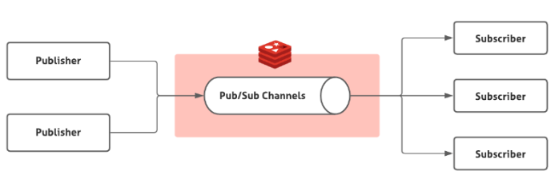

在 pub/sub 模式下，生产者需要指定消息发送到哪个 channel 中，而消费者则订阅对应的 channel 以获取消息。

Redis 中有很多默认的 channel，这些 channel 是由 Redis 本身向它们发送消息的，而不是我们自己编写的代码。其中，`__keyevent@0__:expired` 就是一个默认的 channel，负责监听 key 的过期事件。也就是说，当一个 key 过期之后，Redis 会发布一个 key 过期的事件到`__keyevent@<db>__:expired`这个 channel 中。
我们只需要监听这个 channel，就可以拿到过期的 key 的消息，进而实现了延时任务功能。
这个功能被 Redis 官方称为 keyspace notifications ，作用是实时监控实时监控 Redis 键和值的变化。

### Redis过期事件监听实现延时任务功能有什么缺陷
**1.时效性差**

过期事件消息实在Redis服务器删除key时发布的，而不是一个key湖泊其之后就会直接发布。因为Redis采用定期删除+惰性删除的策略。因此就会存在过期的key还未被删除，进而没有发布过期事件的情况。

**2.丢消息**

Redis 的 pub/sub 模式中的消息并不支持持久化，这与消息队列不同。在 Redis 的 pub/sub 模式中，发布者将消息发送给指定的频道，订阅者监听相应的频道以接收消息。当没有订阅者时，消息会被直接丢弃，在 Redis 中不会存储该消息。

**3.多服务实例下存在重复消息的问题**

Redis 的 pub/sub 模式目前只有广播模式，这意味着当生产者向特定频道发布一条消息时，所有订阅相关频道的消费者都能够收到该消息。
这个时候，我们需要注意多个服务实例重复处理消息的问题，这会增加代码开发量和维护难度。

### 如何使用Redisson实现延迟队列
1. 引入Redisson依赖
2. 创建Redisson配置类
3. 封装了一个延迟队列类`RedissonDelatQueue`。`RedissonDelayQueue` 中的两个核心方法：`startConsumer()`：启动一个消费者线程，从阻塞队列`blockingQueue`中获取任务并处理。`addTask(String task, long delay)`：将一个任务添加到延迟队列中，并指定延迟时间。
4. 测试，使用curl命令发送POST请求

### Redisson内置的延时队列的优点
Redisson 是一个开源的 Java 语言 Redis 客户端，提供了很多开箱即用的功能，比如多种分布式锁的实现、延时队列。可以借助 Redisson 内置的延时队列 RDelayedQueue 来实现延时任务功能。

Redisson 的延迟队列 RDelayedQueue 是基于 Redis 的 SortedSet  来实现的。SortedSet  是一个有序集合，其中的每个元素都可以设置一个分数，代表该元素的权重。Redisson 利用这一特性，将需要延迟执行的任务插入到 SortedSet  中，并给它们设置相应的过期时间作为分数。

Redisson 在客户端（即应用程序进程）中启动一个定时任务，到时间后使用 zrangebyscore 命令扫描 SortedSet  中过期的元素（即分数小于或等于当前时间的元素），然后将这些过期元素从 SortedSet  中移除，并将它们加入到就绪消息列表（ List 结构）中。

当任务被移到实际的就绪消息列表中时，Redisson 通常还会通过发布/订阅机制（Redis 的 Pub/Sub 模型）来通知消费者有新任务到达。

就绪消息列表是一个阻塞队列，消费者可以使用阻塞操作（如 BLPOP key 0，0 表示无限等待，直到有消息进入队列）监听。由于 Redis 的 Pub/Sub 机制是事件驱动的，它避免了轮询开销，只有在有新消息时才会触发处理逻辑。

注意：Redisson 的定时任务调度器并不是以固定的时间间隔频繁调用 zrangebyscore 命令进行扫描，而是根据 SortedSet 中最近的到期时间来动态调整下一次检查的时间点。

相比于Redis过期事件监听实现延时减少了丢消息的可能：
- DelayedQueue 中的消息会被持久化，即使 Redis 宕机了，根据持久化机制，也只可能丢失一点消息，影响不大。当然了，你也可以使用扫描数据库的方法作为补偿机制。
- 消息不存在重复消费问题：每个客户端都是从同一个目标队列中获取任务的，不存在重复消费的问题。

### 使用Redis实现延时任务有什么需要注意的
任务时间跨度大、任务较多的场景建议特殊处理，任务数量较多会导致内存吃不消，时间跨度太大，任务就会一直保存在内存中占用内存，造成资源浪费。 

可以结合 MySQL 存储和定时扫描数据库的方式来优化，节省缓存资源，保证可靠性和降低成本： 
- 延迟时间较短的任务（例如几分钟到几个小时内执行的任务）依然可以存储在 Redis 中。延迟时间较长的任务（例如几天或几周后执行的任务）存储在 MySQL 中。 
- 通过定时任务（例如 XXL-JOB、Spring Task）定期（如每 15 分钟或 30 分钟）扫描 MySQL 中即将到期的任务（例如在未来 2 小时内到期的任务）并推送到 Redis 中。 

定时扫描 MySQL 时，可能会涉及大量数据的查询和处理，需要注意优化查询效率，例如添加索引、分库分表等等。

如果只使用一个 RDelayedQueue 的话，任务数量太大的情况下就会产生大 key。可以将任务按某种逻辑（例如时间段、任务类型）分片存储到多个 RDelayedQueue 中，这样就可以避免产生大 key了。

## 如何设计一个排行榜
### MYSQL的ORDER BY关键字
order by可以对查询的数据按照指定的字段进行排序。好处是比较简单，不需要引入额外组件，成本低。坏处是每次生成排行榜比较耗时，对数据库性能消耗非常大。不适合数据量大，业务复杂的场景。
可以通过加索引并限制排序数据量的方式优化。

### Redis的Sorted Set数据类型
Sorted Set类似于Set，但增加了一个权重参数score，使得集合中的元素能够按score进行有序排列，话可以通score的范围来获取元素列表。

#### 基本命令

| 命令格式 | 介绍 |
| ---- | ---- |
| ZADD key score1 member1 score2 member2 ... | 向指定有序集合添加一个或多个元素 |
| ZCARD KEY | 获取指定有序集合的元素数量 |
| ZSCORE key member | 获取指定有序集合中指定元素的 score 值 |
| ZINTERSTORE destination numkeys key1 key2 ... | 将给定所有有序集合的交集存储在 destination 中，对相同元素对应的 score 值进行 SUM 聚合操作，numkeys 为集合数量 |
| ZUNIONSTORE destination numkeys key1 key2 ... | 求并集，其它和 ZINTERSTORE 类似 |
| ZDIFF destination numkeys key1 key2 ... | 求差集，其它和 ZINTERSTORE 类似 |
| ZRANGE key start end | 获取指定有序集合 start 和 end 之间的元素（score 从低到高） |
| ZREVRANGE key start end | 获取指定有序集合 start 和 end 之间的元素（score 从高到低） |
| ZREVRANK key member | 获取指定有序集合中指定元素的排名（score 从大到小排序） |

#### 基本排序操作
**查看所有用户的排行榜**

通过ZRANGE(从小到大排序)/ZREVRANGE(从大到小)
```
ZREVRANGE cus_order_set 0 -1
```
**查看前三名的排行榜**

限定参与排序的元素范围
```
ZREVRANGE cus_order_set 0 2
```
**查询某个用户的分数**

ZSCORE可以获取指定有序集合中指定元素的score值。
```
ZSCORE cus_oreder_set "user3"
```
**如何对用户的排名数据更新**

ZINCRBY可以对指定有序集合中指定元素的 score 值加上一个具体的数值（可以是整数值或双精度浮点数），这个数值如果是负数的话，就相当于实现一个减操作。
```
ZINCRBY cus_order_set +2 "user1"
ZINCRBY cus_order_set -1 "user2"
```

#### 复杂排序操作
**如何实现多条件排序**

根据特定条件来拼接score即可，若要加上时间先后条件，直接在score值添加上时间戳。

**如何实现指定日期的用户排序**

选择维护多个sorted set来分别存储不同时间维度的排行榜数据，例如
- `ranking:day`：当天排行榜
- `ranking:week`：最近七天排行榜
- `ranking:month`：最近一个月排行榜

也可以把每一天的数据按照日期为名字。如果要查询最近n天的排行榜数据，直接ZUNIONSTORE来求n个sorted set的并集即可

**每日打卡的人进行排序**

通过ZINTERSTORE来求多个sorted set的交集。

ZUNIONSTORE 和 ZINTERSTORE命令还有一个常用的权重参数 weights （默认为 1）。在进行并集/交集的过程中，每个集合中的元素会将自己的 score *weights。

## 如何解决大文件上传问题
### 什么是分片上传，有什么好处
将文件切分成多个文件分片，然后上传小的文件分片。前端发送了所有的文件分片后，服务端再将文件分片进行合并。

分片上传的好处
- 断点续传 ：上传文件中途暂停或失败（比如遇到网络问题、手动暂停）之后，不需要重新上传，只需要上传那些未成功上传的文件分片即可。所以，分片上传是断点续传的基础。
- 多线程上传 ：我们可以通过多线程同时对一个文件的多个文件分片进行上传，这样的话就大大加快的文件上传的速度。
大致流程
1. 检查一下文件的格式、大小等等信息并根据文件信息生成文件的唯一标识（如 SHA-256）。 
2. 将需要上传的文件按照一定的分割规则，分割成相同大小的分片，例如将一个 100MB 的文件切割成相等大小的 5 份，每份 20MB； 3
3. 初始化一个分片上传任务，返回本次分片上传的唯一标识（后续可以通过该唯一标识定位该次分片上传任务，可实现手动暂停和开始上传）； 
4. 每个分片在发送前，客户端会计算其哈希值（如 SHA-256），并将这个哈希值与分片一起发送给服务器； 
5. 按照一定的策略（串行或并行）发送各个分片； 
6. 服务器接收到分片后，会重新计算分片的哈希值，并与客户端发送的哈希值进行比对； 
7. 如果哈希值匹配，则认为该分片有效，服务器会存储该分片并等待其他分片的到来；如果哈希值不匹配，则认为该分片无效，说明该文件此次上传之前可能被修改过； 
8. 所有分片发送完成后，服务端会进行分片的合成，以得到原始文件。 
9. 再计算合并后的原始文件的唯一标识，与客户端发送的唯一标识进行对比，一致则说明此次文件上传没问题。

唯一标识可以通过对文件大小、名称、最后修改时间等信息进行哈希算法得到，比如SHA-2。

### 前端怎么生成文件分片，后端如何合并
前端可以通过 Blob.slice() 方法来对文件进行切割（File 对象是继承 Blob 对象的，因此 File 对象也有 slice() 方法）。
```
createFileChunk(file, size = SIZE) {
    const fileChunkList = [];
    let cur = 0;
    while (cur < file.size) {
        fileChunkList.push({ file: file.slice(cur, cur + size) });
        cur += size;
    }
    return fileChunkList;
}
```
RandomAccessFile 类可以帮助我们合并文件分片
```
public boolean merge(String fileName) throws IOException {
    byte[] buffer = new byte[1024 * 10];
    int len = -1;
    try (RandomAccessFile oSavedFile = new RandomAccessFile(fileName, "rw")) {
        for (int i = 0; i < DOWNLOAD_THREAD_NUM; i++) {
            try (BufferedInputStream bis = new BufferedInputStream(
                    new FileInputStream(fileName + FILE_TEMP_SUFFIX + i))) {
                while ((len = bis.read(buffer)) != -1) { 
                    oSavedFile.write(buffer, 0, len);
                }
            }
        }
        LogUtils.info("文件合并完毕 {}", fileName);
    } catch (Exception e) {
        e.printStackTrace();
        return false;
    }
    return true;
}
```

### 什么是秒传
在上传某个文件时，先根据文件的唯一标识判断一下服务端是否已经上传过该文件，如果上传过，直接返回用户文件上传成功。

需要注意：不能根据文件名决定文件是否已经上传到服务端，因为可鞥会存在文件名相同，但内容不同。另外最好文件内容不变，唯一标识就不应该改变。
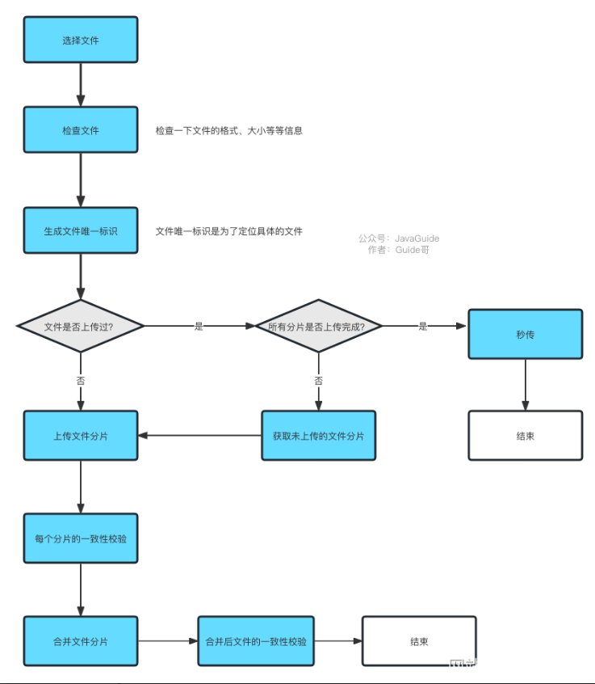

## 如何统计网站的UV
### 如何基于Redis统计UV
PV 的统计不涉及到数据的去重，而 UV 的计算需要根据 IP 地址或者当前登录的用户来作为去重标准。因此，PV 的统计相对于 UV 的统计来说更为简单一些。

最简单方法：为每一个网页维护一个哈希表，网页ID+日期作为Key，Value为看过这篇文章的所有用户ID或者IP
当我们需要为指定的网页增加 UV ，首先需要判断对应的用户 ID 或者 IP 是否已经存在于对应的 Set 中。
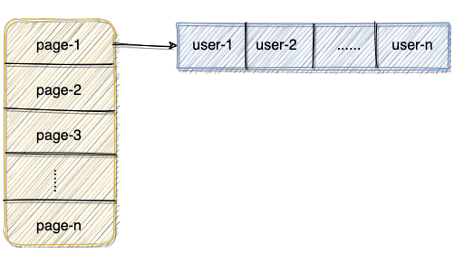
当需要计算对应页面的UV，直接计算出页面对应的Set集合的大小即可。

当网站的访问量特别大时，对内存的消耗比较大。

HyperLogLog是一种基数计数概率算法，并不是 Redis 特有的。Redis 只是实现了这个算法并提供了一些开箱即用的 API。Redis提供的HyperLogLog基于稀疏矩阵存储，占用空间非常小。不过其计算结果并不是精确值会存在一定误差。

主要会用到以下三个命令
- `PFADD key values`: 用于数据添加，可以一次性添加多个。添加过程中，重复的记录会自动去重。
- `PFCOUNT key` `: 对 key 进行统计。
- `PFMERGE destkey sourcekey1 sourcekey2`: 合并多个统计结果，在合并的过程中，会自动去重多个集合中重复的元素。

具体实现：
1. 将访问指定页面的每个用户ID添加到HyperLogLog
2. 统计指定页面的UV

#### 如果需要获取指定天数的UV怎么办
在key上添加日期作为标识
```
PFADD PAGE_1:UV:2021-12-19 USER1 USER2 ...... USERn
```

Doris 、ClickHouse 等用于联机分析(OLAP)的列式数据库管理系统(DBMS)现在也经常用在统计相关的场景。比如说百度的百度统计（网站流量分析）就是基于 Doris 做的，再比如说 Yandex（俄罗斯的一家做搜索引擎的公司）的在线流量分析产品就是用自家的 ClickHouse 做的。

## 如何实现IP归属地功能
### 如何拿到用户的真实IP
Java项目通常会基于 HttpServletRequest或者ServerHttpRequest来获取访问者真实 IP。

HttpServletRequest属于 javax.servlet.http 包， ServerHttpRequest 属于 org.springframework.http.server包 。也就是说，前者是 Java Servlet 规范中定义的接口，而后者则是 Spring 框架中提供的接口，仅在 Spring 项目中有效。

Spring 5.0 后新增了 WebFlux 模块。Spring WebFlux 使用 Reactor 库来实现响应式编程模型，底层基于 Netty 实现同步非阻塞的 I/O。Spring WebFlux 模块也定义了一个 ServerHttpRequest 接口专门用于响应式编程，位于 org.springframework.http.server.reactive 包下。
```
public class NetworkUtil {

    private static final Logger log = LoggerFactory.getLogger(NetworkUtil.class);

    public static String getIpAddress(ServerHttpRequest request) {
        // 获取请求头信息 HttpHeaders
        HttpHeaders headers = request.getHeaders();
        // 从请求头中尝试获取 X-Forwarded-For 字段，这个字段表示客户端经过的代理服务器的IP地址列表，如果有多个代理，以逗号分隔。
        String ipAddress = headers.getFirst("X-Forwarded-For");
        // 不断尝试获取 IP 地址
        if (ipAddress == null || ipAddress.length() == 0 || "unknown".equalsIgnoreCase(ipAddress)) {
            ipAddress = headers.getFirst("Proxy-Client-IP");
        }
        if (ipAddress == null || ipAddress.length() == 0 || "unknown".equalsIgnoreCase(ipAddress)) {
            ipAddress = headers.getFirst("WL-Proxy-Client-IP");
        }
        if (ipAddress == null || ipAddress.length() == 0 || "unknown".equalsIgnoreCase(ipAddress)) {
            ipAddress = request.getRemoteAddress().getAddress().getHostAddress();
            // 如果这个地址是本地回环地址（127.0.0.1或者0:0:0:0:0:0:0:1），则根据网卡获取本机配置的IP地址。
            if (ipAddress.equals("127.0.0.1") || ipAddress.equals("0:0:0:0:0:0:0:1")) {
                try {
                    InetAddress inet = InetAddress.getLocalHost();
                    ipAddress = inet.getHostAddress();
                } catch (UnknownHostException e) {
                    log.error("根据网卡获取本机配置的IP异常", e);
                }
            }
        }

        // 对于通过多个代理的情况，第一个IP为客户端真实IP，多个IP按照','分割
        if (ipAddress != null && ipAddress.indexOf(",") > 0) {
            ipAddress = ipAddress.split(",")[0];
        }

        return ipAddress;
    }
}
```
不过上述代码还存在局限性
- 依赖于请求头部信息中的特定字段，如果代理服务器没有添加这些字段或者修改了这些字段的值，那么就无法正确获取客户端的 IP 地址。
- 没有考虑 IPv6 的格式，如果客户端使用 IPv6 地址访问服务器，会出现解析错误。

### 拿到IP后如何找到用户地址
1. 离线的 IP 地址库：比如 Ip2region、GeoLite2 、纯真免费 IP 库（纯真也提供了付费的 API 服务）。一般都是免费使用的，速度通常也比较快。不过，往往会存在偏差。并且，离线 IP 地址库需要定时进行更新，以同步最新的 IP 数据，比较麻烦。
2. 第三方 IP 定位服务：比如淘宝 IP 地址库、查询网 IP 查询接口（需要付费）、各种地图提供的 IP 定位 API（比如腾讯地图 IP 定位、百度地图 IP 定位、高德地图 IP 定位）

## 40亿个QQ号，限制1G内存，如何去重
对于 Java 来说，可以使用 int 类型表示 QQ 号，如果直接存储，大约需要15G.

因此对于大数据去重的场景，可以考虑使用位图。可以在不占用太多内存情况下，解决海量数据的存在性问题

Bitmap 是一种用于存储二进制数据的数据结构。简单来说，Bitmap 就是使用二进制位来表示某个元素是否存在的数组。每一位只有两种状态，可以方便地用 0 和 1 来表示存在与不存在。

常见应用场景：去重；数据统计，记录某些特定事件发生的情况；布隆过滤器，判断Bitmap 是一种用于存储二进制数据的数据结构。简单来说，Bitmap 就是使用二进制位来表示某个元素是否存在的数组。每一位只有两种状态，可以方便地用 0 和 1 来表示存在与不存在。

实际项目中可以基于Redis使用Bitmap，Bitmap常用命令

| 命令                               | 介绍                                                         |
| ---------------------------------- | ------------------------------------------------------------ |
| SETBIT key offset value            | 设置指定 offset 位置的值                                       |
| GETBIT key offset                  | 获取指定 offset 位置的值                                       |
| BITCOUNT key start end             | 获取 start 和 end 之间值为 1 的元素个数                          |
| BITOP operation destkey key1 key2 ... | 对一个或多个 Bitmap 进行运算，可用运算符有 AND, OR, XOR 以及 NOT |

想要进一步节省空间，并且容许较小的误差的话，还可以使用 布隆过滤器（Bloom Filter） 进一步优化。布隆过滤器就是基于 Bitmap 实现的，只是多加了哈希函数映射这一步。
常见应用场景
1. 判断给定数据是否存在：比如判断一个数字是否存在于包含大量数字的数字集中（数字集很大，上亿）、 防止缓存穿透（判断请求的数据是否有效避免直接绕过缓存请求数据库）等等、邮箱的垃圾邮件过滤（判断一个邮件地址是否在垃圾邮件列表中）、黑名单功能（判断一个 IP 地址或手机号码是否在黑名单中）等等。
2. 去重：如果需要对一个大的数据集进行去重操作，可以使用 Bloom Filter 来记录每个元素是否出现过。比如爬给定网址的时候对已经爬取过的 URL 去重、对巨量的 QQ 号/订单号去重。

**当元素加入布隆过滤器时**
1. 使用布隆过滤器中的哈希函数对元素值进行计算，得到哈希值（有几个哈希函数得到几个哈希值）。
2. 根据得到的哈希值，在位数组中把对应下标的值置为 1。

**当判断一个元素是否存在于布隆过滤器时**
1. 对给定元素再次进行相同的哈希计算；
2. 得到值之后判断位数组中的每个元素是否都为 1，如果值都为 1，那么说明这个值在布隆过滤器中，如果存在一个值不为 1，说明该元素不在布隆过滤器中。

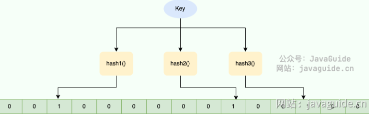

常用命令
- BF.ADD：将元素添加到布隆过滤器中，如果该过滤器尚不存在，则创建该过滤器。格式：BF.ADD {key} {item}。
- BF.MADD : 将一个或多个元素添加到“布隆过滤器”中，并创建一个尚不存在的过滤器。该命令的操作方式BF.ADD与之相同，只不过它允许多个输入并返回多个值。格式：BF.MADD {key} {item} [item ...] 。
- BF.EXISTS : 确定元素是否在布隆过滤器中存在。格式：BF.EXISTS {key} {item}。
- BF.MEXISTS：确定一个或者多个元素是否在布隆过滤器中存在格式：BF.MEXISTS {key} {item} [item ...]。

## 大数据TopK问题


