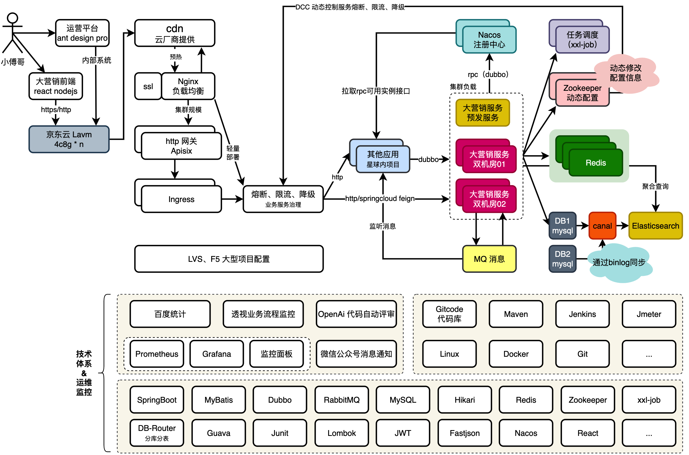
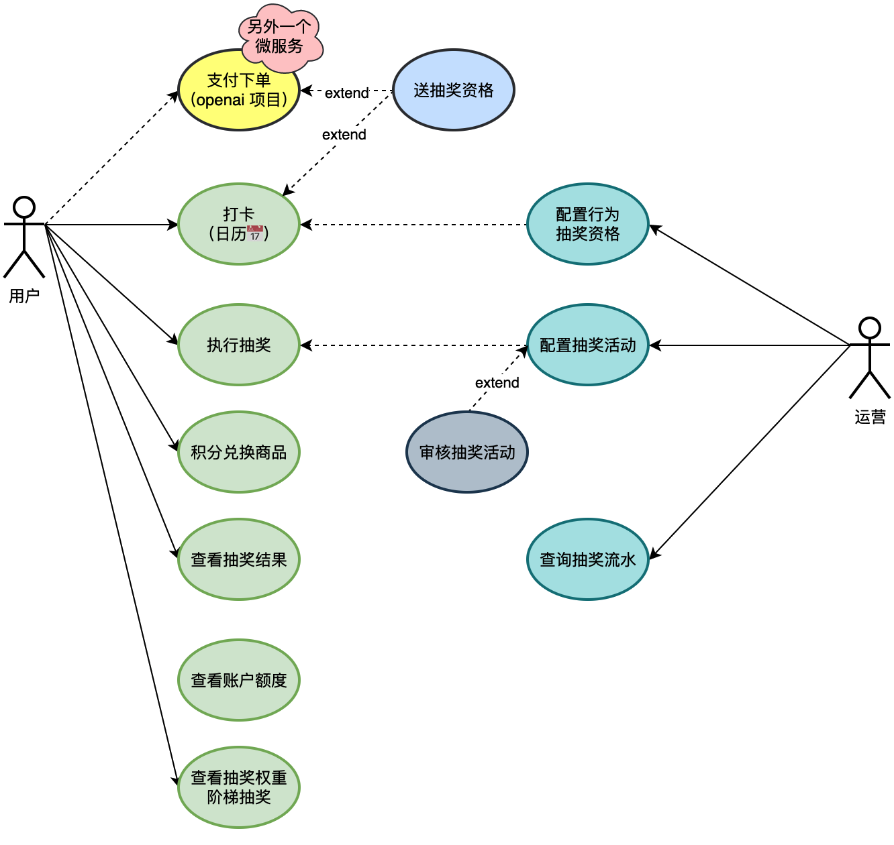
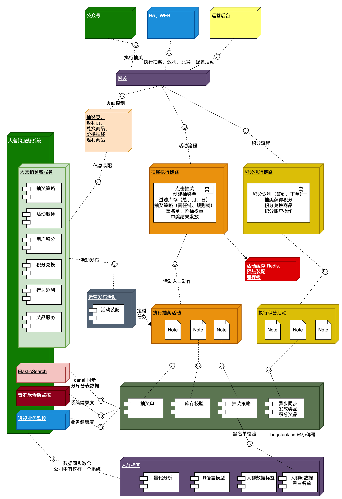
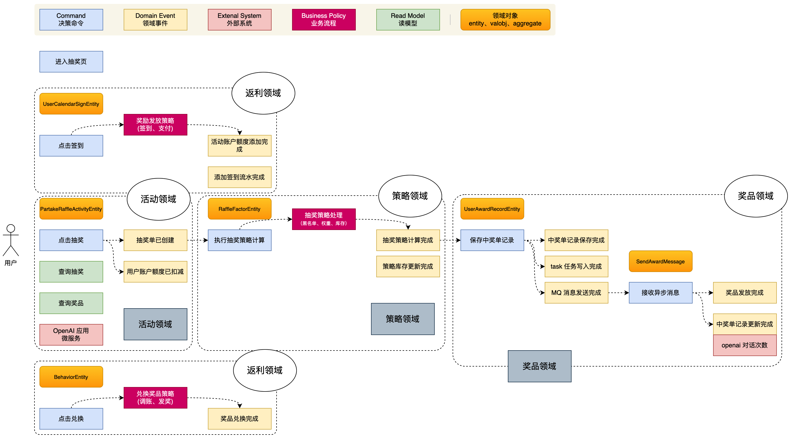
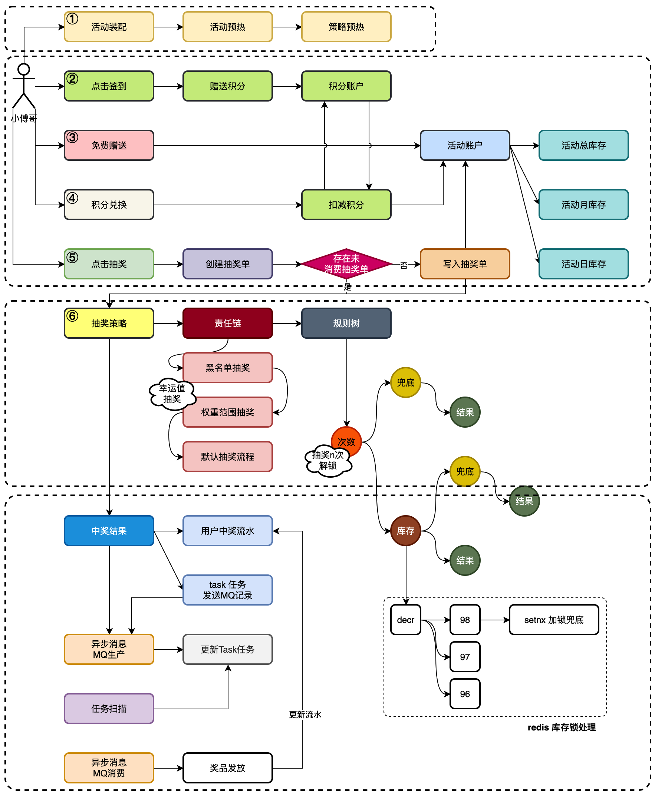
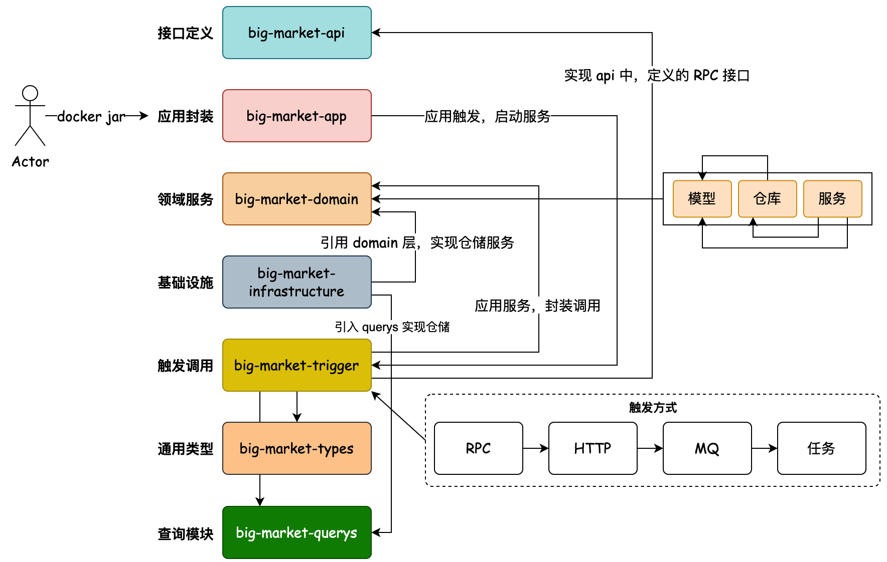

## 系统架构图
软件架构是有关软件整体结构与组件的抽象描述，用于指导大型软件系统各个方面的设计。软件架构包括软件组件、组件之间的关系，组件特性以及组件间关系的特性。
软件架构可以和建筑物的架构相比拟。软件架构是构建计算机软件，开发系统以及计划进行的基础，可以列出开发团队需要完成的任务。

## 用户用例图
用户与系统交互的最简表示形式，展现了用户和与他相关的用例之间的关系

## 业务拓扑图
指各个组件和业务流程的可视化表示，有助于理解和分析系统如何运作、各组件之间的关系、数据流动的路径以及可能的瓶颈和失败节点。

## 四色建模图
- 蓝色: 决策命令，是用户发起的行为动作，如；开始签到、开始抽奖、查看额度等。
- 黄色: 领域事件，过去时态描述。如；签到完成、抽奖完成、奖品发放完成。它所阐述的都是这个领域要完成的终态。
- 粉色: 外部系统，如你的系统需要调用外部的接口完成流程。
- 红色: 业务流程，用于串联决策命令到领域事件，所实现的业务流程。一些简单的场景则直接有决策命令到领域事件就可以了。
- 绿色: 只读模型，做一些读取数据的动作，没有写库的操作。
- 棕色: 领域对象，每个决策命令的发起，都是含有一个对应的领域对象。

## 业务流程图
用于描述和展示系统内业务功能及其之间关系的图形化工具

## 工程分层图

六边形架构，会把本身提供到外部的放到trigger，让接口调用、消息监听、任务调度，都可以统一一个入口处理。而对于需要调用外部同类的能力统一放到 infrastructure 基础设施层，包括；数据库、缓存、配置、调用其他方的接口。