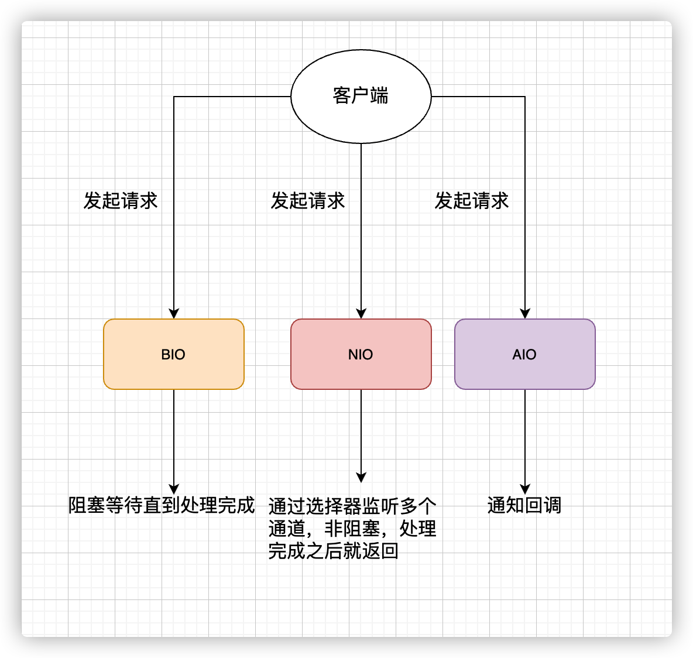
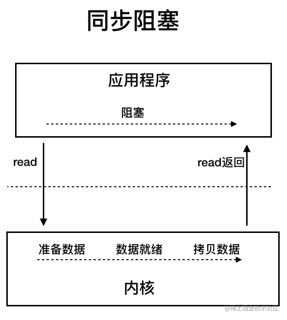
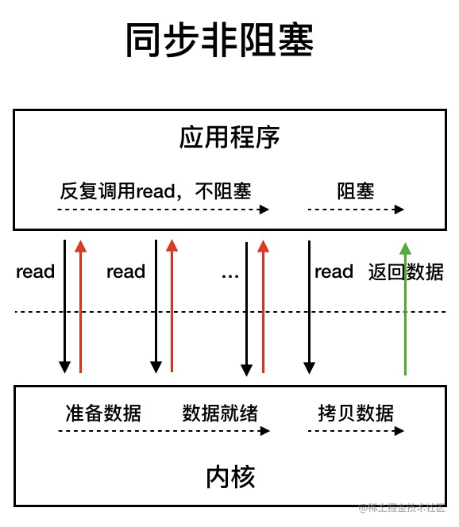
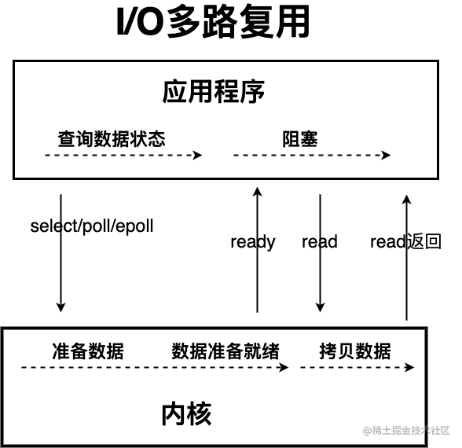
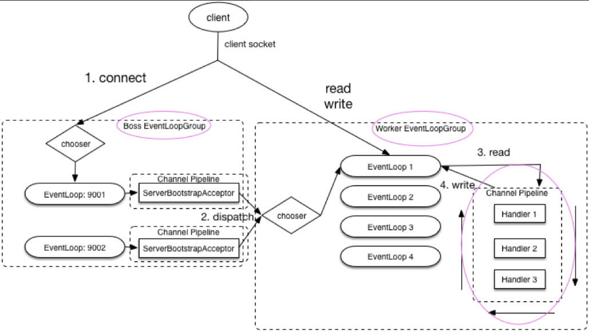
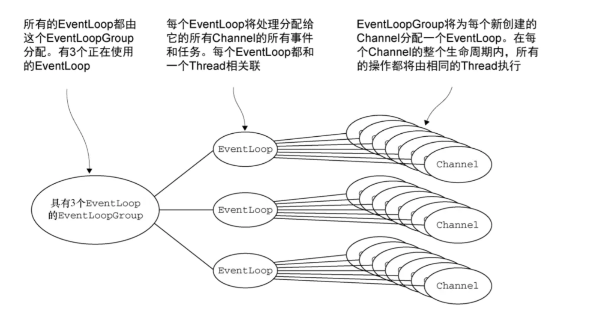

Netty基于NIO，使用Netty可以极大地简化TCP和UDP套接字服务器等网络编程，提供高性能、可扩展的网络应用解决方案，并且性能以及安全性等方面都比较优秀。
我们平常接触到的Dubbo、RocketMQ、Elasticsearch、gRPC、Spark等热门开源项目都用到了Netty。
大部分微服务框架底层涉及到网络通信的部分都是基于Netty来做的，比如Spring Cloud生态系统中的网关Spring Cloud Gateway。


## NIO、BIO和AIO的区别


### BIO
BIO属于**同步阻塞**模型，数据的读取写入必须阻塞在一个线程内等待其完成。

在客户端连接数量不高的情况下，是没问题的。但当面对十万甚至百万级连接时，需要一种更高效得I/O处理模型来应对更高的并发量。

### NIO
**同步非阻塞模型**

同步非阻塞模型中，应用程序会已知发起`read`调用，等待数据准备就绪，再从内核空间拷贝到用户空间（这段时间线程仍然是阻塞的）。
同步非阻塞IO模型通过轮询操作，避免了一直阻塞。但同样存在问题：应用程序不断进行I/O系统调用轮询数据是否已经准备好的过程是非常消耗CPU资源的。

**I/O多路复用模型**

线程首先发起`select`调用，询问内核数据是否准备就绪，等内核准备好数据了，用户线程再发起`read`调用（该过程仍然是阻塞的）。
I/O多路复用模型通过减少无效的系统调用，减少对CPU资源的消耗。I/O多路复用有一个重要的选择器概念，被称为多路复用器。
通过它，只需要一个线程就可以管理多个客户端连接

### AIO
异步IO是基于事件和回调机制实现的，即应用操作之后会直接返回，不会阻塞在那。等后台处理完毕，操作系统会通知相应的线程进行后续的操作。

## Netty是什么，为什么要用Netty，不直接用NIO呢？
- Netty是一个基于NIO的客户端服务器框架，使用它可以快速简单的开发网络应用程序
- 它极大的简化并优化了TCP和UDP套接字服务器等网络编程，并且性能和安全性等很多方面甚至都要更好。
- 支持多种协议，如FTP、SMTP、HTTP以及各种二进制和基于文本的传统协议。
总的来说：Netty成功找到了一种在不妥协性能和可维护性的情况下实现易于开发、性能、稳定性和灵活性的方法。

NIO的编程模型复杂并且存在一些BUG对编程的功底要求较高，而且NIO在面对断连重连、包丢失、粘包等问题时处理过程非常复杂，Netty的出现正是为了解决这些问题。

Netty的优点：
- 统一的API，支持阻塞和非阻塞
- 简单而强大的线程模型
- 自带编码器解决TCP粘包/拆包问题
- 自带各种协议栈
- 真正的无连接数据包套接字支持
- 比直接用Java核心API有更高的吞吐量、更低的延迟、更低的资源消耗和更少的内存复制
- 安全性不错，有完整的SSL/TLS以及StartTLS支持。
- 社区活跃
- 成熟稳定，经历了大型项目的使用和考验，很多开源项目都使用到了Netty。

## Netty的应用场景
理论上，NIO可以做的事情，Netty都可以做并且可以做的更好。Netty主要用来做网络通信
- 作为RPC框架的网络通信工具：在分布式系统中，需要RPC框架来完成不同服务节点之间的相互调用。Netty可以实现不同服务节点的通信。
- 实现一个自己的HTTP服务器：通过Netty可以实现一个简单的HTTP服务器
- 实现一个即时通讯系统
- 实现消息推送

## Netty的核心组件及作用

### ByteBuf(字节容器)
网络通信是通过字节流进行传输的。`ByteBuf`就是Netty提供的一个字节容器，内部是一个字节数组，Netty传输数据时，也是通过该组件进行。
我们可以将`ByteBuf`看作Netty对Java NIO提供了`ByteBuffer`字节容器的封装和抽象。

### Bootstrap和ServerBootstrap(启动引导类)
`Bootstrap`是客户端的启动引导类/辅助类，`ServerBootstrap`是服务端的启动引导类/辅助类
- `Bootstrap`通常使用`connect()`方法连接到远程的主机和端口，作为一个Netty TCP协议通信中的客户端。还可以通过`bind()`方法绑定本地的一个端口，作为UDP协议通信的一段。
- `ServerBootstrap`通常使用`bind()`绑定在本地端口，等待客户端的连接。
- `Bootstrap`只需要配置一个线程组-`EventLoopGroup`，而`ServerBootstrap`需要配置两个线程组-`EventLoopGroup`，一个用于接收连接，一个用于具体的IO处理。

### Channel(网络操作抽象类)
`Channel`接口是Netty对网络操作抽象类，通过`Channel`我们可以进行I/O操作。比较常用的`Channel`接口实现类有`NioServerSocketChannel`(服务端)和`NioSocketChannel`(客户端)。

### EventLoop(事件循环)
主要作用就是责监听网络事件并调用事件处理器进行相关I/O操作（读写）的处理。

`Channel`为Netty网络操作（读写等操作）抽象类，`EventLoop`负责处理注册到其上的`Channel`的I/O操作，两者配合进行I/O操作.

`EventLoopGroup`包含多个`EventLoop`（每一个EventLoop通常内部包含一个线程），它管理所有的`EventLoop`的生命周期。`EventLoop`处理的I/O事件都将在它专有的`Thread`上被处理，即`Thread`和`EventLoop`属于1:1的关系，从而保证线程安全。



### ChannelHandler(消息处理器)和ChannelPipeline(ChannelHandler对象链表)
`ChannelHandler`是消息的具体处理器，主要负责处理客户端/服务端接收和发送的数据。
当`Channel`被创建时，它会被自动分配到它专属的`ChannelPipeline`。一个`Channel`包含一个`ChannelPipeline`。`ChannelPipeline`为`ChannelHandler`的链，一个`pipeline`上可以有多个`ChannelHandler`。

### ChannelFuture(操作执行结果)
Netty中所有的I/O操作都是异步的，因此不能立刻得到操作是否执行成功。可以通过`ChannelFuture`接口的`addListener()`方法注册一个`ChannelFutureListener`，当操作执行成功或者失败，监听就会自动触发返回结果。
`channel()`方法获取连接相关联的`Channel`。`sync()`方法让异步操作变成同步的。

## NioEventLoopGroup默认的构造函数会起多少线程?
**CPU核心数*2**

## Reactor线程模型
Reactor是一种经典的线程模型，基于事件驱动，采用多路复用将事件分发给相应的`Handler`处理，适合处理海量的I/O事件。
### 单线程Reactor
所有的IO操作都由同一个NIO线程处理。

系统资源消耗小，不支持大量请求的应用场景并且处理请求的时间比较慢。
### 多线程Reactor
一个线程负责接受请求，一组NIO线程负责处理IO操作。

在并发连接数比较多的场景下会存在性能问题。
### 主从多线程Reactor
一组NIO线程负责接收请求，一组NIO线程负责处理IO操作。

## Netty线程模型
大部分网络框架都基于Reactor模式设计开发。Netty主要靠`NioEventLoopGroup`线程池来实现线程模型。
在实现服务端时，一般会初始化两个数组
- `bossGroup`：接收连接
- `workerGroup`：负责具体的处理，交由对应的Handler处理
### 单线程模型
一个线程单独处理客户端连接以及I/O读写，涉及到`accept`、`read`、`decode`、`process`、`encode`、`send`等事件。不适用高并发、高负载和性能要求较高的场景。

### 多线程模型
一个Acceptor线程只负责监听客户端的连接，一个NIO线程池负责处理I/O读写。
在并发连接大的时候会出现性能瓶颈。

### 主从线程模型
从一个主线程NIO线程池中选择一个线程作为Acceptor线程，绑定监听端口，接收客户端连接，其他线程负责后续的接入认证工作，建立完连接后，Sub NIO线程池负责具体处理I/O读写。

## Netty服务端和客户端的启动流程
### 服务端
```java
// 1.bossGroup 用于接收连接，workerGroup 用于具体的处理
EventLoopGroup bossGroup = new NioEventLoopGroup(1);
EventLoopGroup workerGroup = new NioEventLoopGroup();
try {
//2.创建服务端启动引导/辅助类：ServerBootstrap
ServerBootstrap b = new ServerBootstrap();
//3.给引导类配置两大线程组,确定了线程模型
b.group(bossGroup, workerGroup)
// (非必备)打印日志
.handler(new LoggingHandler(LogLevel.INFO))
// 4.指定 IO 模型
.channel(NioServerSocketChannel.class)
.childHandler(new ChannelInitializer<SocketChannel>() {
@Override
public void initChannel(SocketChannel ch) {
ChannelPipeline p = ch.pipeline();
//5.可以自定义客户端消息的业务处理逻辑
p.addLast(new HelloServerHandler());
}
});
// 6.绑定端口,调用 sync 方法阻塞知道绑定完成
ChannelFuture f = b.bind(port).sync();
// 7.阻塞等待直到服务器Channel关闭(closeFuture()方法获取Channel 的CloseFuture对象,然后调用sync()方法)
f.channel().closeFuture().sync();
} finally {
//8.优雅关闭相关线程组资源
bossGroup.shutdownGracefully();
workerGroup.shutdownGracefully();
}
```
1. 创建两个`NioEventLoopGroup`对象实例：
    - `bossGroup`：处理客户端的TCP连接请求
    - `workerGroup`：负责每一条连接的具体读写数据的处理逻辑，真正负责I/O读写操作，交由对应的Handler处理。
2. 创建一个服务端启动引导/辅助类，引导进行服务端的启动工作。
3. 通过`group()`方法给引导类`ServerBootstrap`配置两大线程组，确定了线程模型。
4. 通过`channel()`方法给引导类`ServetBootstrap`指定了IO模型为NIO
   - `NioServerSocketChannel`：指定服务端的IO模型为NIO，与BIO编程模型中的ServerSocket对应
   - `NioSocketChannel`：指定客户端的IO模型为NIO，与BIO编程模型中的Socket对应。
5. 通过`childHandler()`方法给引导类创建一个`ChannelInitializer`，然后指定服务端消息的业务处理逻辑`HelloServerHandler`对象。
6. 调用`ServerBootstrap`类的`bind()`方法绑定端口。

### 客户端
```Java
    //1.创建一个 NioEventLoopGroup 对象实例
    EventLoopGroup group = new NioEventLoopGroup();
    try {
        //2.创建客户端启动引导/辅助类：Bootstrap
        Bootstrap b = new Bootstrap();
        //3.指定线程组
        b.group(group)
                //4.指定 IO 模型
                .channel(NioSocketChannel.class)
                .handler(new ChannelInitializer<SocketChannel>() {
                    @Override
                    public void initChannel(SocketChannel ch) throws Exception {
                        ChannelPipeline p = ch.pipeline();
                        // 5.这里可以自定义消息的业务处理逻辑
                        p.addLast(new HelloClientHandler(message));
                    }
                });
        // 6.尝试建立连接
        ChannelFuture f = b.connect(host, port).sync();
        // 7.等待连接关闭（阻塞，直到Channel关闭）
        f.channel().closeFuture().sync();
    } finally {
        group.shutdownGracefully();
    }
```
6. 调用`Bootstrap`类的`connect()`方法进行连接，需要指定两个参数：`inetHost`：ip地址，`inetPort`：端口号

## 什么是TCP粘包/拆包？有什么解决方法
**粘包**：多个独立的应用层消息被合并成一个 TCP 数据包传输，接收端无法直接区分原始消息边界。
**拆包**：一个应用层消息被分割成多个 TCP 数据包传输，接收端需要将多个包重组为完整消息。

解决方法：

1.**使用Netty自带的解码器**
- `LineBasedFrameDecoder`：依次遍历`ByteBuf`中的可读字节，判断是否有换行符，然后进行截取。
- `DelimiterBasedFrameDecoder`：可以自定义分隔符解码器。
- `FixedLengthFrameDecoder`：固定长度解码器，按照指定的长度进行拆包，长度不够，则空格补全。
- `LengthFieldBasedFrameDecoder`：长度域解码器，根据发送的数据中消息长度相关参数（长度域偏移量）来进行拆包。
2.**自定义序列化偏移量**

Java自带有实现`Serializable`接口来实现序列化，不过由于性能、安全性等原因一般不用。

`Protostuff`、`Hessian2`、`json`序列方式比较多，还有专门针对Java的`Kryo`、`FST`等，跨语言的`Protostuff`，`ProtoBuf`等。

## Netty长连接、心跳机制
### TCP长连接、短连接
短连接：服务端与客户端建立连接后，读写完成后就关闭连接，如果要再次发送消息，就要重新连接。
长连接：客户端向服务端建立连接后，不会主动关闭，后续的读写操作还是会继续使用这个连接。

### 为什么需要心跳机制？Netty的心跳机制
在TCP保持长连接的过程中，可能会出现断网等异常情况，当异常发生时，客户端和服务端之间如果没有交互，无法发现对方已经掉线，因此为了解决这个问题，就需要引入心跳机制。

心跳机制的工作原理：在客户端和服务端之间在一定时间内没有数据交互时，客户端或服务端就会发送一个特殊的服务包给对方，当接收方收到这个数据报文时，也会发送一个特殊的数据报文，回应发送方，这就是一个PING-PONG交互。

TCP自带的长连接选项本身就有心跳机制：`SO_KEEPLIVE`，但不够灵活。因此一般都是在应用层协议上实现自定义心跳机制。通过Netty实现心跳机制的核心类是：`IdleStateHandler`。

参考文章：
[Java IO 模型详解](https://javaguide.cn/java/io/io-model.html#nio-non-blocking-new-i-o)