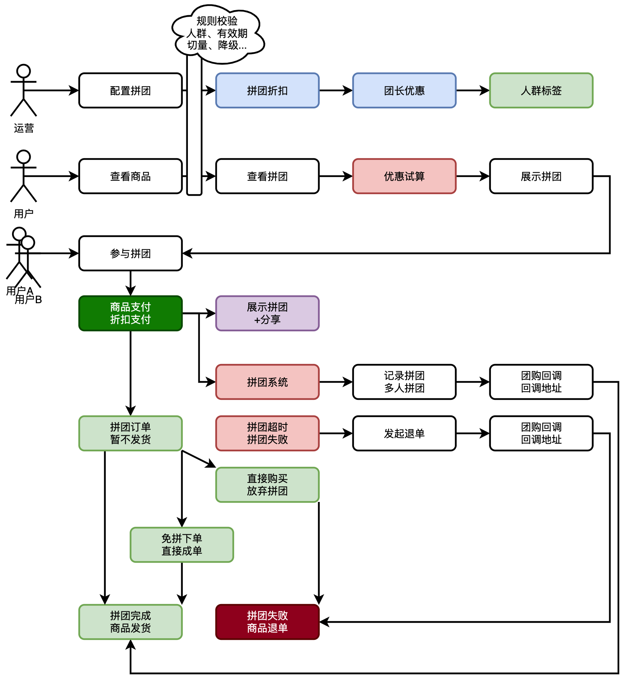
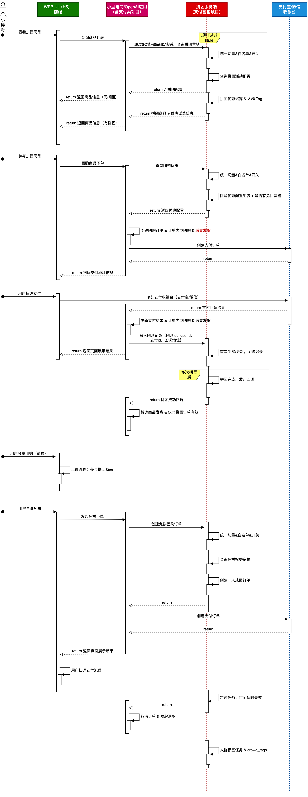

# 拼团交易平台系统
拼团交易平台系统，是我在日常使用拼多多、腾讯、京东等服务平台，交易支付时候，了解到这样的一种营销手段。它可以通过用户自传播方式增强交易量，也是拼多多最开始起家形成巨大规模的一个业务逻辑。因此非常感兴趣这样的系统，所以根据大厂分享的资料、与对应的架构师UP进行交流学习了，设计了这样一套系统。
该系统采用了 DDD 领域驱动设计进行建模，拆分领域模块边界，形成；活动领域、人群领域、交易领域，来构建拼团营销交易流程，达到试算、锁单、结算等步骤流程。这个过程中提炼了通用设计模式，规则树、责任链，可以非常有效的统一的治理流程编排实现。

## 系统设计

### 功能流程

- 首先，由运营配置商品拼团活动，增加折扣方式。因为有人群标签的过滤，所以可以控制哪些人可参与拼团。
- 之后，用户可见拼团商品并参与拼团。用户可自主分享拼团或者等待拼团。因为拼团有非常大的折扣刺激用户自主分享，以此可以节省营销推广费用。
- 最后，拼团完成，触达商品发货。这里有两种，一种运营手段是拼团成团稀有性，必须打成拼团才可以。另外一种是虚拟拼团，无论是否打成，到时都完成拼团。
### 研发设计流程图

### 项目描述

该项目参考拼多多交易购物拼团场景，调研中大厂相关营销业务场景和技术架构方案，设计实现了本套拼团营销服务系统，支持各类营销优惠（直减、折扣、N元购）。该系统以面向对象开发，运用 DDD 拆分领域边界，使用设计模式设计服务功能。提高系统的扩展性和可维护性。

